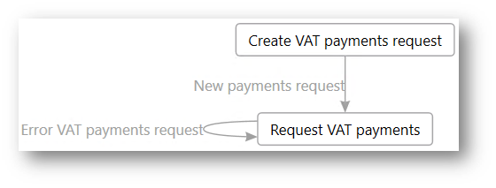
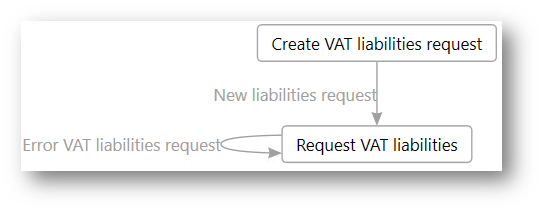

---
# required metadata

title: Retrieve information about VAT payments and liabilities from HMRC
description: This topic explains how to retrieve information about value-added tax (VAT) payments and liabilities from the Making Tax Digital for VAT (MTD VAT) application programming interface (API) of Her Majesty's Revenue and Customs (HMRC).
author: liza-golub
ms.date: 08/17/2021
ms.topic: article
ms.prod: 
ms.technology: 

# optional metadata

# ms.search.form: 
# ROBOTS: 
audience: Application User
# ms.devlang: 
ms.reviewer: kfend
# ms.tgt_pltfrm: 
# ms.custom: 
ms.search.region: United Kingdom
# ms.search.industry: 
ms.author: elgolu
ms.search.validFrom: 08/06/2021
ms.dyn365.ops.version: AX 10.0.22

---

# Retrieve information about VAT payments and liabilities from HMRC

[!include [banner](../includes/banner.md)]

Her Majesty's Revenue and Customs (HMRC) lets you retrieve information about value-added tax (VAT) payments and VAT liabilities. Therefore, the **UK MTD VAT returns** processing includes actions that let you use the **Dynamics 365 for Finance and Operations** web application to retrieve this information from HMRC.

## Retrieve information about VAT payments

Follow these steps to retrieve information about VAT payments.

1. Go to **Tax** \> **Inquiries and reports** \> **Electronic messages** \> **Electronic messages**, and select the **UK MTD VAT returns** processing.
2. On the **Messages** FastTab, select **New**.
3. In the **Run processing** dialog box, select the **Create VAT payments request** action, and then select **OK**. An electronic message that has a status of **New payments request** is created.
4. Specify the "from" date and "to" date for the electronic message, to define the period that you want to retrieve VAT payment information from HMRC for.
5. On the **Messages** FastTab, select **Send report**.
6. In the **Run processing** dialog box, the **Request VAT payments** action is predefined. Select **OK**. A request is sent to HMRC, and a response that contains information about VAT payments is attached to the electronic message as a file in JavaScript Object Notation (JSON) format.
7. To view the file, select the electronic message, and then select **Attachments** (the paper clip symbol) in the upper-right corner of the page.
8. On the **Attachments** page for the selected message, select the last attachment, and then, on the Action Pane, select **Open**.

The following illustration shows a simplified representation of the processing for VAT payment information retrieval that is implemented in Electronic messages in the scope of the **UK MTD VAT returns** processing.

## Retrieve information about VAT liabilities

Follow these steps to retrieve information about VAT liabilities.

1. Go to **Tax** \> **Inquiries and reports** \> **Electronic messages** \> **Electronic messages**, and select the **UK MTD VAT returns** processing.
2. On the **Messages** FastTab, select **New**.
3. In the **Run processing** dialog box, select the **Create VAT liabilities request** action, and then select **OK**. An electronic message that has a status of **New liabilities request** is created.
4. Specify the "from" date and "to" date for the electronic message, to define the period that you want to retrieve VAT liability information from HMRC for.
5. On the **Messages** FastTab, select **Send report**.
6. In the **Run processing** dialog box, the **Request VAT liabilities** action is predefined. Select **OK**. A request is sent to HMRC, and a response that contains information about VAT liabilities is attached to the electronic message as a file in JSON format.
7. To view the file, select the electronic message, and then select **Attachments** (the paper clip symbol) in the upper-right corner of the page.
8. On the **Attachments** page for the selected message, select the last attachment, and then, on the Action Pane, select **Open**.

The following illustration shows a simplified representation of the processing for VAT liability information retrieval that is implemented in Electronic messages in the scope of the **UK MTD VAT returns** processing.

[!INCLUDE[footer-include](../../includes/footer-banner.md)]
