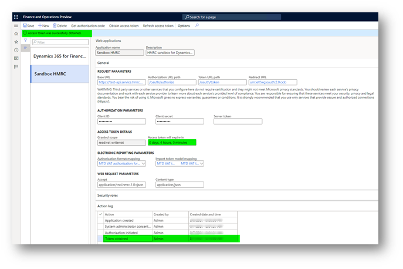
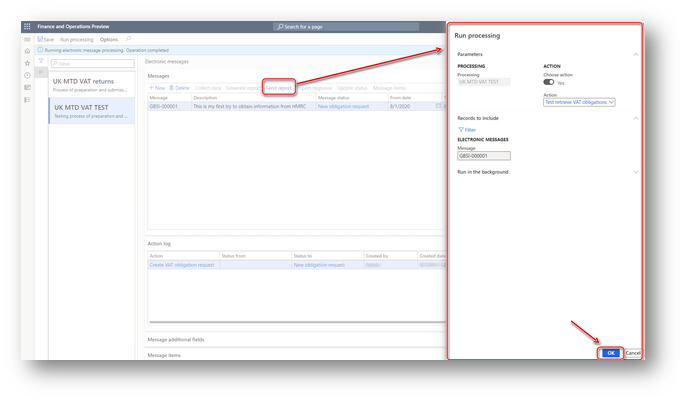
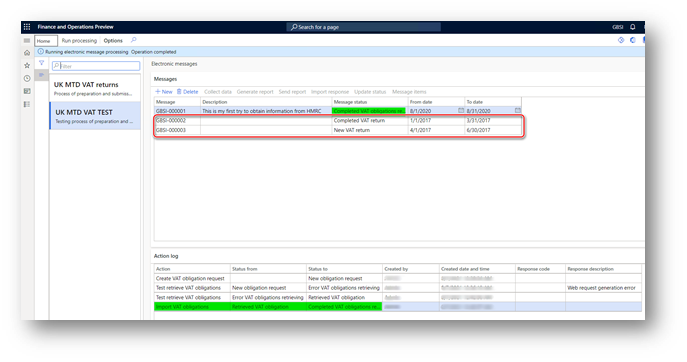

---
# required metadata

title: Test interoperation with MTD VAT sandbox
description: This topic explains how to test interoperation of Dynamics 365 Finance against HMRC's MTD VAT API
author: liza-golub
ms.date: 08/06/2021
ms.topic: article
ms.prod: 
ms.technology: 

# optional metadata

# ms.search.form: 
# ROBOTS: 
audience: Application User
# ms.devlang: 
ms.reviewer: kfend
# ms.tgt_pltfrm: 
# ms.custom: 
ms.search.region: United Kingdom
# ms.search.industry: 
ms.author: elgolu
ms.search.validFrom: 08/06/2021

---

# Test interoperation with MTD VAT sandbox

[!include [banner](../includes/banner.md)]

This topic explains how to test interoperation of Dynamics 365 Finance against HMRC's MTD VAT API.

For testing purposes, HMRC lets you register as a developer on [HMRC Developer Hub](https://developer.service.hmrc.gov.uk/developer/registration) 
and access the sandbox environment. When you're registered as a developer, you can use the **UK MTD VAT TEST** Electronic Messaging (EM) processing in Finance 
to try to interoperate with the HMRC's sandbox environment. 

## Create a sandbox application in HMRC Developer Hub

When you're registered as a developer in HMRC Developer Hub you can create a sandbox application. 
This sandbox application will be used to test interoperation of Dynamics 365 Finance against HMRC's MTD VAT API.

1. Use [Add an application to the sandbox](https://developer.service.hmrc.gov.uk/developer/applications/add/sandbox) section of your developer's account in HMRC Developer Hub to create new sandbox application.
2. Mark **VAT (MTD)** API to subscribe your sandbox application.
3. When application is added to the sandbox, click on **View application credentials** button, copy **Client ID** and past it in **Client ID** field in Finance (**Tax** \> **Setup** \> **Electronic messages** \> **Web applications**, select **Sandbox HMRC** web application).
4. In HMRC portal follow next step and click **Generate a client secret**. Copy generated **Client secret** and past it **Client secret** field in Finance (**Tax** \> **Setup** \> **Electronic messages** \> **Web applications**, select **Sandbox HMRC** web application).
5. Click **View your application details** link in HMRC portal and select **Redirect URIs**.
6. Click **Add a redirect URI** button and specify **urn:ietf:wg:oauth:2.0:oob**.

## Obtain test user credentials

To test interoperation of Dynamics 365 Finance against HMRC's MTD VAT API you must first get test user credentials:

- **User ID** – The name that is used to access HMRC while an authorization code is being requested.
- **Password** – The password that is used to access HMRC while an authorization code is being requested.
- **VRN** – The testing VAT registration number (VRN) that is used during testing of interoperation with the HMRC sandbox environment.

These three parameters must be used together.

To get test user credentials, complete the following steps. 

1. Complete the steps described in the [Create a test user](https://developer.service.hmrc.gov.uk/api-test-user) section of the HMRC portal.
2. The test user generated in the [Create a test user](https://developer.service.hmrc.gov.uk/api-test-user) section contains information about **UserID**, **Password**, and **VAT Registration Number** fields, and their respective values.
3. Store the **UserID**, **Password** and **VAT Registration Number** values related to the test user that you created. You will need these values during next steps of the process.
4. Go to **Tax** \> **Setup** \> **Electronic messages** \> **Electronic message processing** page and select **UK MTD VAT TEST** processing.
5. Expand **Message additional fields** fast tab, select **Tax registration number** additional field and specify for it the value of **VAT Registration Number** of the test user obtained from HMRC portal.

## Obtain an authorization code

Complete the following steps to get an authorization code.

1. Go to **Tax** \> **Setup** \> **Electronic messages** \> **Web applications**, select **Sandbox HMRC** web application.
2. On the Action Pane, select **Get authorization code**. 
3. Select **Yes** to confirm that you want to initialize the authorization process. 
4. On the **Electronic reporting parameters** page, set **read:vat write:vat** in the **Scope** field and click **OK** to continue.
5. In the **System administrator consent** dialog, select check box to confirm enabling interoperation with HMRC’s MTD API and using external web services. Your privacy is important to us. To learn more read our [Privacy Notice](emea-gbr-mtd-vat-integration.md#privacy-notice).
6. Click **Agree** to continue. You're redirected to the HMRC portal, click **Continue** button on the bottom of the page.
7. You're redirected to the HMRC portal for authorization. On the **Sign in** page, enter the **User ID** and **Password** values that you saved on [Obtain test user credentials](#user) step.
8. Click **Grant authority** button.
9. The next **Authorisation granted** page shows the authorization code that HMRC granted to you for testing in the sandbox application previously created. 
10. Copy the authorization code to the clipboard.

> [!IMPORTANT]
> The authorization code is valid for only 10 minutes. You must obtain the access token during this time. If you don't obtain the access token within 10 minutes, and the authorization code expires. You can get a new authorization code by using the same test user credentials.

## Obtain an access token

You should initialize retrieval of an access token within 10 minutes after an authorization code is granted by HMRC.

1. Go to **Tax** \> **Setup** \> **Electronic messages** \> **Web applications**, and select **Sandbox HMRC** web application. 
2. On the **Web applications** page, on the Action Pane, select **Obtain access token** to request an access token from HMRC. 
3. Paste the authorization code that you copied from the HMRC portal earlier to the **Authorization code**, and then select **OK**. The access token request is sent to HMRC, and the access token from the response that is received is automatically saved in Finance. You can't view the access token from the user interface (UI). However, the **Access token will expire in** field shows the validity period of the access token.

Every access token is valid for four hours after it's created by HMRC. You don't have to manually refresh an access token. During interoperation with HMRC, the process of refreshing the access token is done automatically by the system.

To manually refresh an access token, on the **Web applications** page, on the Action Pane, select **Refresh access token**. 
A refresh access token request is sent to HMRC, and a new access token from the response that is received is automatically saved in the system.

## Retrieve VAT obligations from HMRC

After you successfully obtain an access token your sandbox application is ready to interoperate with HMRC.

1. Go to **Tax** \> **Inquiries and reports** \> **Electronic messages** \> **Electronic messages** page, and select **UK MTD VAT TEST** processing. This page shows information about VAT obligations and returns, and is used for interoperation with the HMRC web service. 
2. On the **Messages** FastTab, select **New**.
3. Select the **Create VAT obligation request** action in the **Action** field of **Run processing** dialog, and then select **OK**. 
4. A new electronic message is created that has a status of **New obligation request**. 
5. Fill in dates in **From date** and **To date** fields. These fields are mandatory for electronic messages that retrieve VAT obligations. However, the response from HMRC's sandbox application does not depends on these fields' values and it always contains the same information about obligation periods.
6. Specify a description of your message in **Description** field. This field is optional for electronic messages that retrieve VAT obligations.
7. No additional fields are applicable to this type of electronic message.
4. Select **Send report** to initialize the retrieval of VAT obligation information from HMRC. 
5. In the **Run processing** dialog box, the **Test retrieve VAT obligations** action is automatically defined, and information is filled in by the system. Select **OK**.

6. Select a check box to consent providing the information in fraud prevention headers as part of VAT request to HMRC in the **Request identification information** dialog and click **Submit** button to proceed further. Your privacy is important to us. To learn more read our [Privacy Notice](emea-gbr-mtd-vat-integration.md#privacy-notice).
8. A request in JSON format is created and sent to the HMRC web application. The response that is received from HMRC will be attached to the electronic message. Based on the response, new electronic messages for the VAT return will be created.

HMRC uniquely identifies each VAT return period via a **periodKey** parameter. This parameter is stored in Finance. However, according to HMRC requirements, its value must be hidden in the UI. Users must not be able to see the **periodKey** value in the UI.

The **periodKey** additional field is used to store the **periodKey** value in  the **UK MTD VAT TEST** processing. This field is set up as a hidden field, so that users can't see its value. To comply with HMRC requirements, you should not change this setup for the **periodKey** additional field.

The following illustration shows the lifecycle of electronic message processing for the retrieval of VAT obligations.

The last step of the processing is an **Import VAT obligations** action of the **Electronic reporting import** type. The system defines the following behavior for this step:

- If a VAT obligation from the response doesn't exist in the database, and the status of this VAT obligation in HMRC is **Open**, a new electronic message is created that has a status of **New VAT return**.
- If a VAT obligation from the response doesn't exist in the database, and the status of this VAT obligation in HMRC is **Fulfilled**, a new electronic message is created that has a status of **Completed VAT return**.
- If a VAT obligation from the response does exist in the database, the system verifies the values of the **HMRC status**, **Due date**, and **Received date** additional fields, and syncs them with the information from the response.

All the actions that are performed for electronic messages are logged and can be viewed on the **Action log** FastTab.

