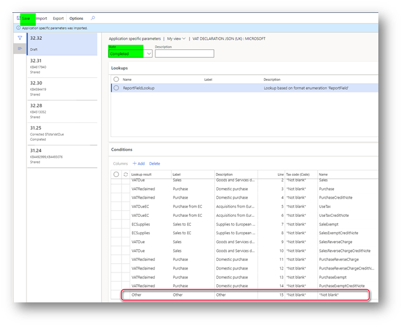
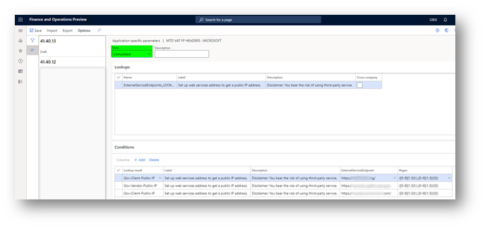
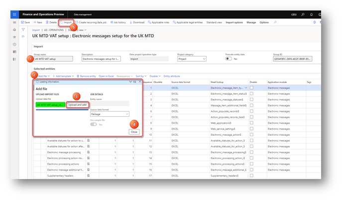

---
# required metadata

title: Prepare for integration with MTD for VAT (United Kingdom)
description: This topic explains the process of setting up Making Tax Digital (MTD) for value-added tax (VAT) in the United Kingdom.
author: liza-golub
ms.date: 07/30/2021
ms.topic: article
ms.prod: 
ms.technology: 

# optional metadata

# ms.search.form: 
# ROBOTS: 
audience: Application User
# ms.devlang: 
ms.reviewer: kfend
# ms.tgt_pltfrm: 
# ms.custom: 
ms.search.region: United Kingdom
# ms.search.industry: 
ms.author: elgolu
ms.search.validFrom: 2021-07-30
ms.dyn365.ops.version: AX 10.0.22

---

# Prepare your environment to interoperate with HMRC's MTD for VAT

After a company is [signed up for the MTD service for VAT in HMRC](https://www.gov.uk/vat-record-keeping/sign-up-for-making-tax-digital-for-vat), 
it should complete the following tasks. 
These tasks will prepare Finance to interoperate with the HMRC's web service to retrieve information about VAT obligations of your company and submit VAT returns.

- [Import and set up Electronic reporting (ER) configurations](#configurations).
- [Set up application-specific parameters for VAT Declaration format](#declaration).
- [Set up application-specific parameters for MTD VAT web request headers format](#headers).
- [Import a package of data entities that includes a predefined Electronic Messaging (EM) setup](#entities).
- [Paper format of VAT statement (VAT 100)](#format)
- [Set up VAT registration number of the company reporting VAT](#vrn).
- [Enable VAT return reporting for companies that report as a VAT group in the same system database](#vatgroup).
- [Define a sales tax settlement period](#settlement).
- [Number sequences Electronic messages functionality](#sequences).
- [Document management parameters](#docmanagement).
- [Set up security roles for electronic message processing](#processing).
- [Set up security roles to interoperate with HMRC's MTD VAT web-service](#application).
- [Sending fraud prevention data](#headers).

## Import and set up ER configurations

To prepare Finance to intoperate with MTD for VAT, you must import the following ER configurations.

| Number | ER configuration name                       | Type                                 | Description |
|--------|---------------------------------------------|--------------------------------------|-------------|
| **1**  | **Tax declaration model**                   | **Model**                            | **A generic model for different tax declarations.** |
| 2      | Tax declaration model mapping               | Model mapping                        | A generic model mapping for VAT declarations. |
| 3      | VAT Declaration JSON (UK)                   | Format (exporting)                   | A VAT return in JSON format for submission to HMRC. |
| 4      | VAT Declaration Excel (UK)                  | Format (exporting)                   | The **VAT 100** report (a declaration in Microsoft Excel format). |
| 5      | MTD VAT interoperation (UK)                 | Format (exporting)                   | A format that is used to create a URL path for HMRC endpoints and request a test user. |
| 6      | MTD VAT importing model mapping (UK)        | Model mapping (importing)            | The importing model mapping for VAT obligations. |
| 7      | MTD VAT obligations importing JSON (UK)     | Format (importing)                   | The format for importing VAT obligations that are retrieved from HMRC. |
| **8**  | **Electronic Messages framework model**     | **Model**                            | **The model for the Electronic messages framework.** |
| 9      | MTD VAT model mapping (UK)                  | Model mapping (exporting, importing) | A model mapping that supports interoperation for MTD for VAT for the UK. |
| 10     | MTD VAT return response importing JSON (UK) | Format (importing)                   | The importing ER format that is used for the response that is received from HMRC for the VAT declaration submission. This format is used to import the response into an electronic message. |
| 11     | MTD VAT web request headers format (UK)     | Format (exporting)                   | A format that is used to create request header parameters for the HTTPS request. |
| 12     | MTD VAT authorization format (UK)           | Format (exporting)                   | The request header parameters for the authorization code and access token. |
| 13     | MTD VAT import token format (UK)            | Format (importing)                   | The ER format that is used to import the access token that is received from HMRC into the database. |

Import the latest versions of these configurations. The version description usually includes the number of the Microsoft Knowledge Base (KB) article 
that explains the changes that were introduced in the configuration version. Configuration version may contain references to the objects that are not available in your Finance version, 
in this case importing process of such version of configuration will be locked. Import the latest version of the configuration that is available for your Finance version.

> [!NOTE]
> After all the ER configurations from the preceding table are imported, set the **Default for model mapping** option to **Yes** for the following configurations:
>
> - Tax declaration model mapping
> - MTD VAT model mapping (UK)
>
> 

For more information about how to download ER configurations from the Microsoft global repository, see [Download ER configurations from the Global repository](https://docs.microsoft.com/en-us/dynamics365/fin-ops-core/dev-itpro/analytics/er-download-configurations-global-repo).

## Set up application-specific parameters for VAT Declaration format

Nine boxes on the VAT declaration for the UK must contain values that are calculated based on the tax transactions 
that are relevant to the VAT settlement period used by the company in the reporting period.
Tax transactions may have different combinations of criteria such as the transaction direction, the tax code, the country or region code of the tax code, 
and the tax type (item or service) depending on nature of the original business operation that caused tax transaction posting. 
Application-specific parameters let users influence the collection of tax transactions that must be considered 
during the calculation of the reporting value in each box. 
For the VAT declaration of the UK, there is a **ReportFieldLookup** application-specific parameter. 
The following table describes the result values that are available for this parameter.

| Result value | Calculation that the result value is used in | Default setup of the classifier value |
|--------------|----------------------------------------------|---------------------------------------|
| VATDue       | <ul><li>Tax amount from the **vatDueSales** box.</li><li>Tax base amount from the **totalValueSalesExVAT** box.</li><li>Tax base amount from the **totalValueGoodsSuppliedExVAT** box. In addition, the reporting type of the item sales tax group isn't **Service**, and the **Country/region** type of the sales tax code is set to **EU**.</li></ul> | <ul><li>Sales</li><li>SalesCreditNote</li><li>SalesReverseCharge</li><li>SalesReverseChargeCreditNote</li></ul>|
| VATDueEC     |<ul><li>Tax amount from the **vatDueAcquisitions** box and Tax base amount from the **totalAcquisitionsExVAT** box. In addition, the reporting type of the item sales tax group isn't **Service**, and the **Country/region** type of the sales tax code is set to **EU**.</li><li>Tax amount from the **vatReclaimedCurrPeriod** box.</li><li>Tax base amount from the **totalValuePurchasesExVAT** box.</li></ul> | <ul><li>UseTax</li><li>UseTaxCreditNote</li></ul>|
| ECSupplies   | <ul><li>Tax base amount from the **totalValueSalesExVAT** box.</li><li>Tax base amount from the **totalValueGoodsSuppliedExVAT** box. In addition to calculating this box, the reporting type of the item sales tax group isn't **Service**. The **Country/region type** of the sales tax code is set to **EU**.</li></ul>| <ul><li>SaleExempt</li><li>SalesExemptCreditNote</li></ul>|
| VATReclaimed | <ul><li>Deductible sales tax amount from the **vatReclaimedCurrPeriod** box.</li><li>Tax base amount from of the **totalValuePurchasesExVAT** box.</li><li>Tax amount from the **vatDueAcquisitions** box. In addition, the reporting type of the item sales tax group isn't **Service**, and the **Country/region** type of the sales tax code is set to **EU**.</li></ul> | <ul><li>Purchase</li><li>PurchaseCreditNote</li><li>PurchaseReverseCharge</li><li>PurchaseReverseChargeCreditNote</li><li>PurchaseExempt</li><li>PurchaseExemptCreditNote</li></ul> |
| Other        | Use the **Not blank** value for this result, and set it up at the end of your list of result values. | Not blank |

For each value, users can define a set of sales tax codes together with a **Classifier** that is associated with the direction of the tax transaction 
and the credit note identifier. The following table provides a definition of this **Classifier**.

| Classifier value                | Condition |
|---------------------------------|-----------|
| PurchaseCreditNote              | <ul><li>Credit note</li><li>Tax direction = Sales tax receivable</li></ul> |
| Purchase                        | <ul><li>Not credit note</li><li>Tax direction = Sales tax receivable</li></ul> |
| SalesCreditNote                 | <ul><li>Credit note</li><li>Tax direction = Sales tax payable</li></ul> |
| Sales                           | <ul><li>Not credit note</li><li>Tax direction = Sales tax payable</li></ul> |
| PurchaseExemptCreditNote        | <ul><li>Credit note</li><li>Tax direction = Tax-free purchase</li></ul> |
| PurchaseExempt                  | <ul><li>Not credit note</li><li>Tax direction = Tax-free purchase</li></ul> |
| SalesExemptCreditNote           | <ul><li>Credit note</li><li>Tax direction = Tax-free sales</li></ul> |
| SaleExempt                      | <ul><li>Not credit note</li><li>Tax direction = Tax-free sales</li></ul> |
| UseTaxCreditNote                | <ul><li>Credit note</li><li>Tax direction = Use tax</li></ul> |
| UseTax                          | <ul><li>Not credit note</li><li>Tax direction = Use tax</li></ul> |
| PurchaseReverseChargeCreditNote | <ul><li>Credit note</li><li>Tax direction = Sales tax receivable</li><li>ReverseCharge_W = Yes</li></ul> |
| PurchaseReverseCharge           | <ul><li>Not credit note</li><li>Tax direction = Sales tax receivable</li><li>ReverseCharge_W = Yes</li></ul> |
| SalesReverseChargeCreditNote    | <ul><li>Credit note</li><li>Tax direction = Sales tax payable</li><li>ReverseCharge_W = Yes</li></ul> |
| SalesReverseCharge              | <ul><li>Not credit note</li><li>Tax direction = Sales tax payable</li><li>ReverseCharge_W = Yes</li></ul> |

For more information about how boxes of VAT declaration of the UK are using the result values defined for **ReportFieldLookup** application-specific parameter, see [VAT setup details for VAT declaration of the UK](emea-gbr-mtd-vat-integration-declaration.md) section.

Before you start to use the **VAT Declaration JSON (UK)** and **VAT Declaration Excel (UK)** formats, you must set up the **ReportFieldLookup** application-specific parameter. 
You can download an example of this setup from the [Shared asset library in LCS](https://lcs.dynamics.com/V2/SharedAssetLibrary). 
In the Shared asset library, select the **Data package** asset type, find the **UK MTD VAT ReportFieldLookup** file in the list of data package files, and download it.

To set up the **ReportFieldLookup** application-specific parameter in the system, open the **Electronic reporting** workspace, and then, in the configuration tree, 
select the **VAT Declaration JSON (UK)** format under **Tax declaration model**. On the Action Pane, on the **Configurations** tab, 
in the **Application specific parameters** group, select **Setup**, and then select the version of the format that you want to use. Usually, Finance runs the latest version 
of the configuration available available in your system.
To use the example of this setup that you preliminarily downloaded from Shared asset library in LCS, select **Import** on the Action Pane, 
and then select the file that you previously downloaded. 
To manually define conditions, select **ReportFieldLookup** on the **Lookups** FastTab, and then specify criteria on the **Conditions** FastTab. 
You can also use the example file as a starting point to set up conditions. 
In the case you specify manually conditions for **ReportFieldLookup**, we recommend that you set up the **Other** value as the last condition in the list. 
Although this value isn't used in the **VAT Declaration JSON (UK)** format, it must be set to **Not blank** for both columns of the criteria.

> [!IMPORTANT]
> When you've finished setting up conditions, change the value of the **State** field to **Completed**, save your changes, and close the page.

You can easily export the setup of application-specific parameters from one version of a report and import it into another version. 
You can also export the setup from one report and import it into another report, provided that both reports have the same structure of lookup fields. 

When your setup of **ReportFieldLookup** for **VAT Declaration JSON (UK)** is ready, export it, 
and then import it into the **VAT Declaration Excel (UK)** format.

1. Select **VAT Declaration JSON (UK)** format under **Tax declaration model**
2. On the Action Pane, on the **Configurations** tab, in the **Application specific parameters** group, select **Setup**, and then select the version of the format for which you have completed the setup of **ReportFieldLookup**.
3. Click **Export** button on the Action pane to save your configuration in XML format on your computer.
4. Close the **Application specific parameters** page and select **VAT Declaration Excel (UK)** format under the **VAT Declaration JSON (UK)** format in the configuration tree.
5. On the Action Pane, on the **Configurations** tab, in the **Application specific parameters** group, select **Setup**, and then select the version of the format that you want to use.
6. Click **Import** button on the Action pane and select the file that you saved on the step 3 of this task and click OK to confirm importing.
7. Change the value of the **State** field to **Completed**, save your changes, and close the page.

> [!IMPORTANT]
> Setup of **ReportFieldLookup** is company-specific. 
>
> (**!**) Make sure that the **Legal entity** in which you want to generate VAT declaration for the UK is selected before you start setting up **ReportFieldLookup**.
> 
>  (**!**) In case you want to generate VAT declaration for the UK from multiple Legal entities in Finance, you must setup **ReportFieldLookup** for each of them. 
> 
>  (**!**) Setup of **ReportFieldLookup** is mandatory for all Legal entities reporting VAT as **VAT group**.

## Set up application-specific parameters for MTD VAT web request headers format

It is [required by law](https://developer.service.hmrc.gov.uk/guides/fraud-prevention/) in the UK to submit header data for the VAT (MTD) APIs. When the MTD VAT APIs are used, MTD-compatible software must submit HTTP fraud prevention headers that includes: client public IP, server public IP. For more information about how MTD VAT feature in Finance supports the requirement to send fraud prevention headers in MTD VAT Finance, see [Sending fraud prevention data](#headers) section of this topic.

To enable Finance collecting client and server public IPs, you must setup **ExternalServiceEndpoints_LOOKUP** aaplication-specific parameter of **MTD VAT web request headers format (UK)** under **Electronic Messages framework model** in ER workspace.

1. Go to **Electronic reporting** workspace, and then, in the configuration tree, select the **MTD VAT web request headers format (UK)** under **Electronic Messages framework model**. 
2. On the Action Pane, on the **Configurations** tab, in the **Application specific parameters** group, select **Setup**, and then select the version of the format that you want to use. Usually, Finance runs the latest version of the configuration available available in your system.
3. Select **ExternalServiceEndpoints_LOOKUP** on the **Lookups** FastTab, and then **Add** criteria on the **Conditions** FastTab. 
4. Select **Gov-Client-Public-IP** in **Lookup result** field and specify in **ExternalServiceEndpoint** field http(s) address of external web-service that will be called when user will initiate a request to HMRC's MTD VAT API to collect client public IP. Your privacy is important to us. To learn more read our [Privacy Notice](emea-gbr-mtd-vat-integration.md#privacy-notice).
5. In **Regex** field specify a regular expressions specific to the external web-service specified in **ExternalServiceEndpoint** field which allows to extract IP address in IPv4 or IPv6 format from the response of the web-service.
6. Click **Add** button on the **Conditions** FastTab to add one more line and select **Gov-Vendor-Public-IP** in **Lookup result** field and specify in **ExternalServiceEndpoint** field http(s) address of external web-service that will be called when user will initiate a request to HMRC's MTD VAT API to collect server public IP. Your privacy is important to us. To learn more read our [Privacy Notice](emea-gbr-mtd-vat-integration.md#privacy-notice).
7. In **Regex** field specify a regular expressions specific to the external web-service specified in **ExternalServiceEndpoint** field which allows to extract IP address in IPv4 or IPv6 format from the response of the web-service.
8. Add as much different web-services for both **Gov-Client-Public-IP** and **Gov-Vendor-Public-IP** as more you need to be sure that IP addreses will be obtained during requests to HMRC's MTD VAT API. System will call them one-by-one until nessesary IP address will be collected.

> [!IMPORTANT]
> When you've finished setting up conditions, change the value of the **State** field to **Completed**, save your changes, and close the page.
> 
> **(!)** Setup of **ExternalServiceEndpoint** application-specific parameter for **MTD VAT web request headers format (UK)** under **Electronic Messages framework model** must be done for the Legal entity from which interoperation with HMRC's MTD VAT API will be executed.

## Import a package of data entities that includes a predefined Electronic Messaging (EM) setup

The process of setting up the EM functionality for MTD VAT has many steps. Because the names of some predefined entities are used in the ER configurations, it's important that you use a set of predefined values that are delivered in a package of data entities for the related tables.

> [!NOTE]
> Some records in the data entities in the package include a link to ER configurations. It's important that you import ER configurations into Finance before you start to import the data entities package.

In [LCS](https://lcs.dynamics.com/v2), go to the Shared asset library, and select the **Data package** asset type. Then find **UK MTD VAT setup** in the list of data package files, and download it to your computer.

After the **UK MTD VAT setup** file is downloaded, open Finance, select the company that you will interoperate with HMRC's MTD VAT API from, and then go to **Workspaces** \> **Data management**.

Before you import setup data from the package of data entities, follow these steps to make sure that the data entities in your application are refreshed and synced.

1. In the **Data management** workspace, go to **Framework parameters** \> **Entity settings**, and then select **Refresh entity list**. Wait for confirmation that the refresh has been completed. For more information about how to refresh the entity list, see [Entity list refresh](../../fin-ops-core/dev-itpro/data-entities/data-entities.md#entity-list-refresh).
2. Validate that the source data and target data are correctly mapped. For more information, see the section about validation in [Data import and export jobs](../../fin-ops-core/dev-itpro/data-entities/data-import-export-job.md#validate-that-the-source-data-and-target-data-are-mapped-correctly).
3. Before the data entities are used for the first time to import the data from the package, sync the mapping of source data and target data. In the list for the package, select a data entity, and then, on the Action Pane, select **Modify target mapping**. Then, above the grid for the package, select **Generate mapping** to create a mapping from scratch. 
4. Save the mapping.
5. Repeat steps 3 through 4 for each data entity in the package before you start the import.

You must now import data from the **UK MTD VAT setup** file into the selected company. 
1. In the **Data management** workspace, select **Import**, and set **Group name** on the **Import** fast tab.
2. Click **Add file** button on **Selected entities** fast tab.
3. Select the previously downloaded **UK MTD VAT setup** file by the **Upload and add** button.
4. Wait until you wiil see the the data entities from the file are listed in the grid of the **Selected entities** fast tab and click **Close** button.
5. Click **Import** button on the Action pane to start importing job.

For more information, see [Data management](../../fin-ops-core/dev-itpro/data-entities/data-entities-data-packages.md?toc=%2ffin-and-ops%2ftoc.json).

The **UK MTD VAT setup** package provides a setup for two sets of processing that can be used independently:

- **UK MTD VAT returns** – For interoperation with the **production** HMRC web service.
- **UK MTD VAT TEST** – For interoperation with the **sandbox** HMRC web service.

The **UK MTD VAT setup** package also provides a setup for two web applications that are used to interoperate with HMRC web services:

- **Dynamics 365 Finance** – For interoperation with the **production** HMRC web service.
- **Sandbox HMRC** – For interoperation with the **sandbox** HMRC web service.

When you import the setup of Electronic messages functionality for MTD for VAT from the **UK MTD VAT setup** package that Microsoft provides, credentials for the **Dynamics 365 Finance** web application are imported into your system and stored in encrypted format. These credentials are provided by Microsoft and will be used for production interoperation with HMRC.

For more information about the predefined setup that is included in the data entities in the package for MTD for VAT, see [Checklist for Electronic messages setup for MTD VAT](emea-gbr-mtd-vat-integration-em-setup-checklist.md) later in this topic. 

## Set up VAT registration number of the company reporting VAT

Starting from version 4 (KB4617940) **UK MTD VAT setup** package provides possibility to define VAT registration number of the company which must report VAT return by using MTD feature in Finance independently from the primary address and Registration ID defined for the legal entity. This possibility is enabled with **Tax registration number** additional field and allows for legal entites with multiple VAT registration to easily submit their VAT return specific to their VAT registration in the UK. For more information about supporting filing for multiple VAT registrations, see [Multiple VAT registration numbers](https://docs.microsoft.com/en-us/dynamics365/finance/localizations/emea-multiple-vat-registration-numbers).

To define VAT registration number (VRN) which must be used by MTD feature in Finance to interoperate with HMRC's MTD VAT API and submit VAT return for follow the next steps.

1. Go to **Tax** \> **Setup** \> **Electronic messages** \> **Electronic messages processing**. 
2. Select **UK MTD VAT returns** processing.
3. On the **Message additional fields** fast tab, in the **Tax registration number** field, define the VRN from the name of which the VAT return will be sent to HMRC.
4. Save your settings.

## Paper format of VAT statement (VAT 100)

You can generate a paper format of the **VAT 100** report by using the **Report sales tax for settlement period** dialog box (**Tax** \> **Declarations** \> **Sales tax** \> **Report sales tax for settlement period**). Alternatively, you can generate the statement for a selected sales tax payment transaction from the **Sales tax payments** page (**Tax** \> **Inquiries and reports** \> **Sales tax inquiries** \> **Sales tax payments**). In both cases, the **VAT 100** report is generated in Microsoft SQL Server Reporting Services (SSRS) format.

To generate the **VAT 100** report in Excel format instead of [SSRS format](https://docs.microsoft.com/en-us/dynamics365/finance/get-started/removed-deprecated-features-finance#vat-100-report-for-the-united-kingdom-in-ssrs-format), you must define an ER format on the **General ledger parameters** page. 

1. Go to **Tax** \> **Setup** \> **General ledger parameters**.
2. On the **Sales tax** tab, in the **Tax options** section, in the **VAT statement format mapping** field, select **VAT Declaration Excel (UK)**.

## Enable VAT return reporting for companies that report as a VAT group in the same system database

This section of MTD feature setup is mandatory only for companies that report as a VAT group in the same system database.

To prepare Finance to report a VAT return for a VAT group, make sure that your business processes and the system setup meet the following conditions:

- Tax information from all the subsidiaries is registered in the same system (Finance).
- The system correctly reflects all the tax transactions in accordance with the rules and principles of the UK.
- Settlement periods for all the legal entities that are involved to the VAT group are identically defined in full accordance with the period intervals that are defined in the HMRC online account.
- VAT settlement (the [Settle and post sales tax](../general-ledger/tasks/create-sales-tax-payment.md) job) is done in each subsidiary legal entity.
- A **VAT 100** report is correctly generated in paper format in each subsidiary legal entity.
- One legal entity is set up for interoperation with HMRC, according to the information in this topic, and users can request VAT obligations from this legal entity for the VAT group.

To enable Finance to report VAT return from multiple legal entities in the same system database, turn on the **Cross-company queries for the populate records actions** feature in Feature management. Go to **Workspaces** \> **Feature management**, find **Cross-company queries for the populate records actions** in the list, and then select **Enable now** in the lower right of the page.

## Define a sales tax settlement period

Electronic message processing that is defined for MTD for VAT in the **UK MTD VAT setup** package is company-agnostic. Therefore, it can be implemented in any legal entity in Finance.

Both the **UK MTD VAT returns** processing (for production) and the **UK MTD VAT TEST** processing (for testing purposes) let you collect sales tax payment transactions in the legal entity. You can then generate a VAT return in JSON or Excel format, for either production purposes or testing purposes. The collection of sales tax payment transactions is implemented by using the **Populate VAT return records** action of the **Populate record** type. To correctly collect sales tax payment transactions, you must define a sales tax settlement period for the **Populate VAT return records** action. 

1. Go to **Tax** \> **Setup** \> **Electronic messages** \> **Populate records actions**, and select **Populate VAT return records**. 
2. On the **Datasource setup** FastTab, select the **VAT payment** record, and then select **Edit query**. 
3. For the **Settlement period** field of the **Sales tax payments** table, define the sales tax settlement period related to which tax transactions from the selected legal entity must be reported to HMRC.

If you don't set the **Settlement period** field, all tax transactions from the selected legal entity will be considered for reporting for MTD VAT.

In case your company must report VAt return as a VAT group, make sure that all the nessesary conditions that are described in [Enable VAT return reporting for companies that report as a VAT group in the same system database](#vatgroup) are fulfilled and setup sales tax settlement period for all the legal entities included into the VAT group

1. Go to **Tax** \> **Setup** \> **Electronic messages** \> **Populate records actions**. On the **Populate records action** page, **Company** field is available in the **Datasources setup** grid. For existing records that were created during the general setup of the MTD for VAT feature, this field shows the identifier of the current legal entity. It's assumed that the settlement period for the current legal entity was set up during the general setup of the MTD for VAT feature.
2. In the **Datasources setup** grid, add a line for each additional legal entity that must be included in reporting for the VAT group. Set the following fields.

    | Field name             | Value |
    |------------------------|-------|
    | Name                   | Enter a text value that will help you understand where this record comes from. For example, enter **VAT payment of Subsidiary 1**. |
    | Message item type      | Select **VAT return**. This value is the only value that is available for all the records. |
    | Account type           | Select **All**. |
    | Master table name      | Specify **TaxReportVoucher** for all the records. |
    | Document number field  | Specify **Voucher** for all the records. |
    | Document date field    | Specify **TransDate** for all the records. |
    | Document account field | Specify **TaxPeriod** for all the records. |
    | Company                | Select the ID of the subsidiary legal entity. |
    | User query             | The check box is automatically selected when you define criteria by using **Edit query** button. |

3. For each new line, select **Edit query**, and specify a related settlement period for the legal entity that is specified in the **Company** field on the line.

## Number sequences Electronic messages functionality

To work with the Electronic messages functionality, you must define related number sequences. 

1. Go to **Tax** \> **Setup** \> **General ledger parameters**.
2. On the **Number sequences** tab, set up two number sequences:

- Message
- Message item

## Document management parameters

Before you start to submit a VAT return to HMRC, you must make sure that the **JSON** file type is defined in the list of file types on the **File types** tab of the **Document management parameters** page (**Organization administration** \> **Document management** \> **Document management parameters**). If the **JSON** file type isn't in the list, add it.

## Set up security roles for electronic message processing

Different groups of users might require access to different electronic message processing (**UK MTD VAT TEST** or **UK MTD VAT return**). You can limit access to each type of processing, based on security groups that are defined in the system.

Complete the following steps to limit access to the **UK MTD VAT TEST** processing.

1. Go to **Tax** \> **Setup** \> **Electronic messages** \> **Electronic message processing**. 
2. Select the **UK MTD VAT TEST** processing, and add the security groups that must work with this processing for testing purposes. If no security group is defined for the processing, only a system admin can see the processing on the **Electronic messages** page.

Complete the following steps to limit access to the **UK MTD VAT returns** processing.

1. Go to **Tax** \> **Setup** \> **Electronic messages** \> **Electronic message processing**. 
2. Select the **UK MTD VAT returns** processing, and add the security groups that must work with this processing for real-life interoperation with the production HMRC environment. If no security group is defined for the processing, only a system admin can see the processing on the **Electronic messages** page.

## Set up security roles to interoperate with HMRC's MTD VAT web-service

When an access token to each HMRC web application (production and sandbox) is retrieved from HMRC, it's stored in the system database in an encrypted format. The access token must be used whenever a request of any type will be sent to HMRC. For security reasons, access to the access token must be limited to security groups that must send requests to HMRC. If users who aren't in one of those security groups try to send a request to HMRC, a message notifies them that they aren't allowed to interoperate by using the selected web application.

Complete the following steps to set up security groups that must have access to HMRC's access token for MTD for VAT.

1. Go to **Tax** \> **Setup** \> **Electronic messages** \> **Web applications**. 
2. Select the web application that you want to define security groups for, and then add those security groups on the **Security roles** FastTab.

If security roles aren't defined for a web application, only a system admin can interoperate by using the selected web application.

## Sending fraud prevention data

It is [required by law](https://developer.service.hmrc.gov.uk/guides/fraud-prevention/) in the UK to submit header data for the VAT (MTD) APIs. When the MTD VAT APIs are used, MTD-compatible software must submit HTTP fraud prevention headers. This may include location information and other personal identifiers such as IP addresses. Your privacy is important to us. To learn more read our [Privacy Notice](emea-gbr-mtd-vat-integration.md#privacy-notice).

MTD feature in Finance supports fraud prevention headers required by HMRC (v.3.0) for **WEB_APP_VIA_SERVER** for requests executed in non-batch mode and **BATCH_PROCESS_DIRECT** for requests executed in batch mode. Table below represents general implementation details of the fraud pervention headers.

| **HTTP header**                  | **Description**                  | **Implementation details**                                    |
|----------------------------------|----------------------------------|---------------------------------------------------------------|
| Gov-Client-Connection-Method     | Constant value: DESKTOP_APP_VIA_SERVER or BATCH_PROCESS_DIRECT (in case a request is sent in batch mode). | Constant value |
| Gov-Client-Browser-Do-Not-Track  | A true or false value describing if the Do Not Track option is enabled on the browser. | Automatically identified by the system  |
| Gov-Client-Browser-JS-User-Agent | JavaScript-reported user agent string from the originating device. | Automatically identified by the system  |
| Gov-Client-Browser-Plugins       | A list of browser plugins on the originating device. | Automatically identified by the system  |
| Gov-Client-Device-ID             | An identifier unique to an originating device. The format of the header was updated to accommodate latest requirement of HMRC. | Automatically identified by the system  |
| Gov-Client-Local-IPs             | A list of all local IP addresses (IPv4 and IPv6) available to the originating device. | Automatically identified by the system |
| Gov-Client-Local-Ips-Timestamp   | A timestamp to show when Gov-Client-Local-IPs is collected. This header's value includes the timestamp when the client local IP was collected or in case it was defined manually, the timestamp when the request is sent to HMRC. | Automatically identified by the system |
| Gov-Client-MAC-Addresses         | The list of MAC addresses available on the originating device. | Automatically identified by the system   |
| Gov-Client-Multi-Factor          | A list of key-value data structures containing details of the multi-factor authentication (MFA) statuses related to the API call.  | Omitted for Dynamics 365 Finance. |
| Gov-Client-Public-IP             | The public IP address (IPv4 or IPv6) from which the originating device makes the request. | Automatically identified by calling external web services, that return value of public IP address [(\*)](#remark). Find more information in [Set up application-specific parameters for MTD VAT web request headers format](#headers) section of this topic. |
| Gov-Client-Public-Ip-Timestamp   | A timestamp to show when Gov-Client-Public-IP is collected. This header's value includes the timestamp when the client public IP was collected from an external web-service or in case it was defined manually, the timestamp when the request is sent to HMRC. | Automatically identified by the system  |
| Gov-Client-Public-Port           | The public TCP port that the originating device uses when initiating the request. | Omitted for Dynamics 365 Finance  |
| Gov-Client-Screens               | Information related to the originating device’s screens. The fields include (width of the screen, height of the screen, scaling factor of the screen, color depth of the screen). | Automatically identified by the system |
| Gov-Client-Timezone              | The local time-zone of the originating device. | Automatically identified by the system  |
| Gov-Client-User-Agent            | An attempt to identify the operating system family, version, device manufacturer and model of the originating device.  | Automatically identified by the system   |
| Gov-Client-User-IDs              | A key-value data structure containing the user identifiers.  | Automatically identified by the system |
| Gov-Client-Window-Size           | The number of pixels of the window on the originating device in which the user initiated (directly or indirectly) the API call to HMRC.  | Automatically identified by the system |
| Gov-Vendor-Forwarded             | A list that details hops over the internet between services that terminate TLS. | Automatically identified by the system as a value composed of values collected for Gov-Client-Public-IP and Gov-Vendor-Public-IP |
| Gov-Vendor-License-IDs           | A key-value data structure of hashed license keys relating to the vendor software initiating the API request on the originating device.  | Automatically identified by the system |
| Gov-Vendor-Product-Name          | The name of the product marketed to end users. | Automatically identified by the system |
| Gov-Vendor-Public-IP             | The public IP address of the server to which the originating device send their requests. | Automatically identified by calling external web services, that return value of public IP address [(\*)](#remark). Find more information in [Set up application-specific parameters for MTD VAT web request headers format](#headers) section of this topic. |
| Gov-Vendor-Version               | A key-value data structure of software versions involved in handling a request. | Automatically identified by the system   |

Each time when user initiates a request to HMRC's MTD VAT API, Finance starts collecting values for all of the fraud prevention headers. When collected, Finance shows to the user all the values that were collected in respect to all the fraud prevention headers.

To continue submission of your request, user must select the check box to consent to the transmission of the information that is listed on the page. The **Submit** button then becomes available, and user can select it to submit the request to HMRC. 

If user cancels the transmission at this point by selecting **Do not submit**, the status of the electronic message is changed to **Error**, and a description of the error is attached to the action log. Select **Send report** to continue the transmission of the same electronic message.

When a request to HMRC in a batch job is initiated, the fraud prevention headers are transmitted to HMRC, and information about the headers that were sent is attached to the batch job. To view this information, go to **System administration** \> **Inquiries** \> **Batch jobs**, and select your batch job. To review the log details, select **Batch job** \> **Log** on the Action Pane.

> [!NOTE]
> (\*) Finance provides alternative possibility to using external web-addresses for retrieving public IP addresses of client and server for the cases when system admin can manually identify and specify their values. Go to **Supplementary headers** fast tab of **Tax** > **Setup** > **Electronic messages** > **Web applications** page and define manually values for **Gov-Client-Public-IP** and **Gov-Vendor-Public-IP** headers. These values will be used by the system in case external web-services are not defined as described in [Set up application-specific parameters for MTD VAT web request headers format](#headers) or system did not manage to obtain IP address automatically. System admin may also define value for **Gov-Vendor-Forwarded** header which will be used in case system did manage to obtain IP address automatically. In case value for **Gov-Vendor-Forwarded** header was not specified its value will be composed from values of **Gov-Client-Public-IP** and **Gov-Vendor-Public-IP** headers.
> 
> 
