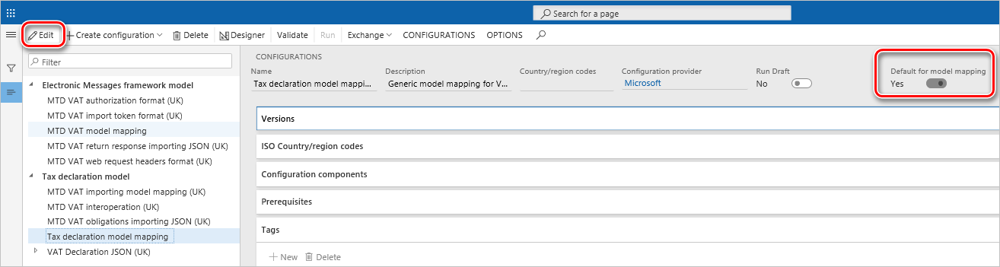

# Generate a VAT declaration in paper format (VAT 100 report)

[!include [banner](../includes/banner.md)]

In Microsoft Dynamics 365 Finance, you can generate a value-added tax (VAT) declaration in paper format (**VAT 100** report) for the United Kingdom (UK) without having to use the Electronic messaging (EM) functionality.

## Prerequisites

Before you start to generate the **VAT 100** report, make sure that the following prerequisites are in place in your system.

1. Import the following Electronic reporting (ER) configurations.

    | Number | ER configuration name | Type | Description |
    |--------|-----------------------|------|-------------|
    | 1      | Tax declaration model | Model | A generic model for different tax declarations. |
    | 2      | Tax declaration model mapping | Model mapping | A generic model mapping for VAT declarations. |
    | 3      | VAT Declaration JSON (UK)  | Format (exporting) | A VAT return in JavaScript Object Notation (JSON) format for submission to HMRC. |
    | 4      | VAT Declaration Excel (UK) | Format (exporting) | The **VAT 100** report (a declaration in Excel format). |

    Import the latest versions of these configurations. The version description usually includes the number of the Microsoft Knowledge Base (KB) article that explains the changes that were introduced in the configuration version. If the latest configuration version contains references to the objects that aren't available in your Finance version, the import process will be locked for that configuration version. In this case, import the latest version of the configuration that is available for your Finance version.

    > [!NOTE]
    > After all the ER configurations from the preceding table are imported, set the **Default for model mapping** option to **Yes** for the **Tax declaration model mapping** configuration.
    >
    > 

    For more information about how to download ER configurations from the Microsoft global repository, see [Download ER configurations from the Global repository](../../fin-ops-core/dev-itpro/analytics/er-download-configurations-global-repo.md).

2. The **ReportFieldLookup** application-specific parameters is set up for the **VAT Declaration Excel (UK)** format in ER. For more information, see [Set up application-specific parameters for the VAT Declaration format](emea-gbr-mtd-vat-integration-setup.md#declaration).
3. In the **Feature management** workspace, find and select the **VAT statement format reports** feature in the list, and then select **Enable now**.
4. To define the **VAT Declaration Excel (UK)** format, go to **Tax** \> **Setup** \> **General ledger parameters**. On the **Sales tax** tab, in the **Tax options** section, in the **VAT statement format mapping** field, enter the format information.

## Generate a VAT 100 report

Follow these steps to generate a paper format of the **VAT 100** report.

1. Go to **Tax** \> **Declarations** \> **Sales tax** \> **Report sales tax for settlement period**.
2. Select the settlement period, and then, in the **From date** field, enter the start date of the reporting period.
3. In the **Sales tax payment version** field, select a version of the VAT statement:

    - **Original** – Include data of the first sales tax payment record in the period.
    - **Corrections** – Include data of the additional sales tax payment records in the period for corrections.
    - **Latest corrections** – Include data of the corrections that aren't settled in the reporting period.
    - **Total list** – Include data of the first sales tax payment record and additional sales tax payment records for corrections in the reporting period.

4. Select **OK**.
5. On the **Run in the background** FastTab, specify the parameters of the batch job and run the report in batch mode. When an electronic report is generated in batch mode, you can find related batch information and the generated output file as an attachment by going to **Organization administration** \> **Electronic reporting** \> **Electronic reporting jobs**. For more information about how to configure a destination for each ER format configuration and its output component, see [Electronic reporting (ER) destinations](../../fin-ops-core/dev-itpro/analytics/electronic-reporting-destinations.md).
6. Select **OK** to generate the **VAT 100** report.

Alternatively, you can generate the VAT statement for specific sales tax payment records by going to **Tax** \> **Inquiries and reports** \> **Sales tax inquiries** \> **Sales tax payments** and selecting **Print report** on the Action Pane.
