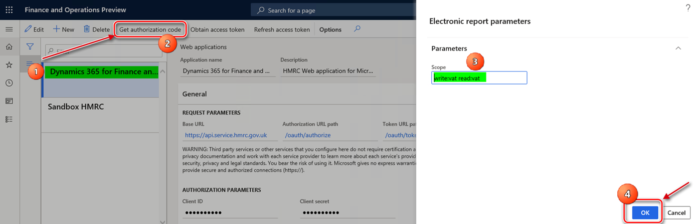
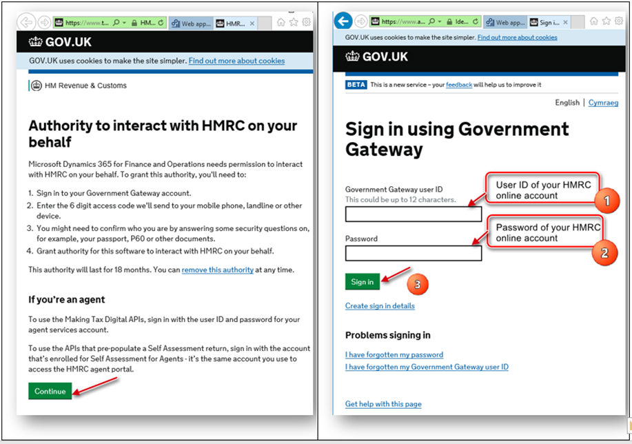

---
# required metadata

title: Prepare for integration with MTD for VAT (United Kingdom)
description: This topic explains the process of setting up Making Tax Digital (MTD) for value-added tax (VAT) in the United Kingdom.
author: lizagolub
manager: AnnBe
ms.date: 01/29/2020
ms.topic: article
ms.prod: 
ms.service: dynamics-ax-applications
ms.technology: 

# optional metadata

# ms.search.form: 
# ROBOTS: 
audience: Application User
# ms.devlang: 
ms.reviewer: kfend
ms.search.scope: Core, Operations
# ms.tgt_pltfrm: 
# ms.custom: 
ms.search.region: United Kingdom
# ms.search.industry: 
ms.author: v-elgolu
ms.search.validFrom: 2016-02-28
ms.dyn365.ops.version: AX 7.0.0

---

# Prepare for integration with MTD for VAT (United Kingdom)

[!include [banner](../includes/banner.md)]

This topic walks you through the process of setting up Making Tax Digital (MTD) for value-added tax (VAT) in the United Kingdom (UK).

## Making Tax Digital – VAT statement submission

On July 13, 2017, the Financial Secretary to the Treasury and Paymaster General in the UK announced that MTD for VAT would take effect on April 1, 2019.

MTD introduces an obligation for VAT-registered businesses to keep their records digitally (for VAT purposes only) and to provide VAT return information to Her Majesty's Revenue and Customs (HMRC) through software that is functionally compatible with MTD. As of April 1, 2019, MTD for VAT is mandatory for businesses that have turnover that exceeds the VAT registration threshold (currently £85,000). For VAT-registered businesses that have turnover that is below the VAT registration threshold, MTD for VAT will remain voluntary until 2020 at the earliest.

VAT returns must be submitted to HMRC by using software that is compatible with MTD. VAT returns can no longer be submitted by using the HMRC portal. Software that is compatible with MTD must support the following requirements:

- The required records are stored in digital form.
- The required records are preserved in digital form for up to six years.
- A VAT return can be created from the digital records that are held in functionally compatible software, and this information can be digitally provided to HMRC.
- The company can provide VAT data to HMRC on a voluntary basis.
- The MTD for VAT application programming interface (API) platform can be used to receive information from HMRC about a relevant entity's compliance with obligations under the regulations.

In the UK, VAT returns are filed quarterly or monthly. The deadline for submitting a VAT return online and paying HMRC is one calendar month plus seven days after the end of the VAT period.

As HMRC states on the official website, the current amendment process will stay in place for VAT:

- If the net value of the errors on the VAT return is less than £10,000, the company will amend those errors on the next VAT return.
- If the net value of the errors exceeds £10,000, the company must complete the VAT 652 form, which is available on the Gov.UK website.

For more information about MTD for VAT, see [Making Tax Digital for VAT: legislation overview](https://www.gov.uk/government/consultations/making-tax-digital-reforms-affecting-businesses/making-tax-digital-for-vat-legislation-overview).

As HMRC mentions in the Making Tax Digital for Business VAT Guide for Vendors, users must sign up for the MTD service for VAT, even if they have already signed up to use the MTD service for income tax. For more information about how to get ready for MTD, see [Making Tax Digital: how VAT businesses and other VAT entities can get ready](https://www.gov.uk/government/publications/making-tax-digital-how-vat-businesses-and-other-vat-entities-can-get-ready).

The solution that supports the [MTD for VAT requirements] (https://developer.service.hmrc.gov.uk/api-documentation/docs/api/service/vat-api/1.0) is based on the Electronic messages functionality. This functionality provides a flexible approach for setting up and supporting reporting processes. The setup package for MTD for VAT for the UK covers the following scope of interoperation to help companies in the UK meet their VAT obligations:

- **Retrieve VAT obligations (Mandatory)** – Users can initiate a request to HMRC to obtain their company's VAT obligations for a specific period. In response to each user's request, HMRC will post information about the company's VAT obligations as that information is defined in the company's profile on the HMRC side. VAT obligations contain information about the VAT period, the due date for submission, and the status of the obligation. Microsoft Dynamics 365 Finance will reflect this information.
- **Submit VAT return for period (Mandatory)** – The system collects information about VAT returns. The information that is collected is based on the sales tax payment transactions that have been posted in the system by using the sales tax settlement process, with respect to the VAT obligations that are registered in the system. After this information is collected, a VAT return report in JavaScript Object Notation (JSON) format is generated. The user will submit this report to HMRC. Dynamics 365 Finance will reflect the HMRC response to the submission.
- **Retrieve VAT liabilities (Optional)** – Users can initiate a request to HMRC to obtain their company's VAT liabilities for a specific period. In response to each user's request, HMRC will post information about the company's VAT liabilities as that information is defined in the company's profile on the HMRC side. This information will be stored in Finance as an attachment of the related electronic message. This attachment will be in JSON format.
- **Retrieve VAT payments (Optional)** – Users can initiate a request to HMRC to obtain their company's VAT payments for a specific period. In response to each user's request, HMRC will post information about the company's VAT payments as that information is defined in the company's profile on the HMRC side. This information will be stored in Finance as an attachment of the related electronic message. This attachment will be in JSON format.

The setup package for MTD for VAT for the UK doesn't cover the View VAT Return endpoint that might be required. However, the Electronic messages functionality lets you set up and support this endpoint.

After a company is signed up for the MTD service for VAT in HMRC, it should complete the following tasks. These tasks will prepare Finance to interoperate with the HMRC web service to retrieve VAT obligations and submit VAT returns.

- Import and set up Electronic reporting (ER) configurations.
- Set up application-specific parameters.
- Import a package of data entities that includes a predefined electronic message setup.
- Set up General ledger parameters.
- Define a sales tax settlement period.
- Set up security roles for electronic message processing.
- Set up security roles to access the access token of the web application.
- Initialize the web application for interoperation with HMRC.
- Obtain an authorization code for the sandbox environment. This authorization code is for testing purposes only.
- Obtain an authorization code for the production environment.
- Obtain an access token.

## Import and set up ER configurations

To prepare Finance to operate with MTD for VAT, you must import the following ER configurations.

| Number | ER configuration name                       | Type                                 | Description |
|--------|---------------------------------------------|--------------------------------------|-------------|
| 1      | Tax declaration model                       | Model                                | A generic model for different tax declarations. |
| 2      | Tax declaration model mapping               | Model mapping                        | A generic model mapping for VAT declarations. |
| 3      | VAT Declaration JSON (UK)                   | Format (exporting)                   | A VAT return in JSON format for submission to HMRC. |
| 4      | VAT Declaration Excel (UK)                  | Format (exporting)                   | The **VAT 100** report (a declaration in Microsoft Excel format). |
| 5      | MTD VAT interoperation (UK)                 | Format (exporting)                   | A format that is used to create a URL path for HMRC endpoints and request a test user. |
| 6      | MTD VAT importing model mapping (UK)        | Model mapping (importing)            | The importing model mapping for VAT obligations. |
| 7      | MTD VAT obligations importing JSON (UK)     | Format (importing)                   | The format for importing VAT obligations that are retrieved from HMRC. |
| 8      | Electronic Messages framework model         | Model                                | The model for the Electronic messages framework. |
| 9      | MTD VAT model mapping (UK)                  | Model mapping (exporting, importing) | A model mapping that supports interoperation for MTD for VAT for the UK. |
| 10     | MTD VAT return response importing JSON (UK) | Format (importing)                   | The importing ER format that is used for the response that is received from HMRC for the VAT declaration submission. This format is used to import the response into an electronic message. |
| 11     | MTD VAT web request headers format (UK)     | Format (exporting)                   | A format that is used to create request header parameters for the HTTPS request. |
| 12     | MTD VAT authorization format (UK)           | Format (exporting)                   | The request header parameters for the authorization code and access token. |
| 13     | MTD VAT import token format (UK)            | Format (importing)                   | The ER format that is used to import the access token that is received from HMRC into the database. |

Import the latest versions of these configurations. The version description usually includes the number of the Microsoft Knowledge Base (KB) article that explains the changes that were introduced in the configuration version.

> [!NOTE]
> After all the ER configurations from the preceding table are imported, set the **Default for model mapping** option to **Yes** for the following configurations:
>
> - Tax declaration model mapping
> - MTD VAT model mapping (UK)
>
> 

For more information about how to download ER configurations from Microsoft Dynamics Lifecycle Services (LCS), see [Download Electronic reporting configurations from Lifecycle Services](../../dev-itpro/analytics/download-electronic-reporting-configuration-lcs.md).

## Set up application-specific parameters

Nine boxes on the VAT declaration for the UK must contain values that are calculated based on the tax transactions that are selected. These transactions depend on a set of criteria such as the transaction direction, the tax code, the country or region code of the tax code, and the tax type (item or service). Application-specific parameters let users influence the collection of tax transactions that must be considered during the calculation of the reporting value in each box. For the VAT declaration, there is a **ReportFieldLookup** application-specific parameter. The following table describes the result values that are available for this parameter.

| Result value | Calculation that the result value is used in | Default setup of the classifier value |
|--------------|----------------------------------------------|---------------------------------------|
| VATDue       | <ul><li>Tax amount from the **vatDueSales** box.</li><li>Tax base amount from the **totalValueSalesExVAT** box.</li><li>Tax base amount from the **totalValueGoodsSuppliedExVAT** box. In addition, the reporting type of the item sales tax group isn't **Service**, and the **Country/region** type of the sales tax code is set to **EU**.</li></ul> | <ul><li>Sales</li><li>SalesCreditNote</li><li>SalesReverseCharge</li><li>SalesReverseChargeCreditNote</li></ul>|
| VATDueEC     |<ul><li>Tax amount from the **vatDueAcquisitions** box and Tax base amount from the **totalAcquisitionsExVAT** box. In addition, the reporting type of the item sales tax group isn't **Service**, and the **Country/region** type of the sales tax code is set to **EU**.</li><li>Tax amount from the **vatReclaimedCurrPeriod** box.</li><li>Tax base amount from the **totalValuePurchasesExVAT** box.</li></ul> | <ul><li>UseTax</li><li>UseTaxCreditNote</li></ul>|
| ECSupplies   | <ul><li>Tax base amount from the **totalValueSalesExVAT** box.</li><li>Tax base amount from the **totalValueGoodsSuppliedExVAT** box. In addition to calculating this box, the reporting type of the item sales tax group isn't **Service**. The **Country/region type** of the sales tax code is set to **EU**.</li></ul>| <ul><li>SaleExempt</li><li>SalesExemptCreditNote</li></ul>|
| VATReclaimed | <ul><li>Deductible sales tax amount from the **vatReclaimedCurrPeriod** box.</li><li>Tax base amount from of the **totalValuePurchasesExVAT** box.</li><li>Tax amount from the **vatDueAcquisitions** box. In addition, the reporting type of the item sales tax group isn't **Service**, and the **Country/region** type of the sales tax code is set to **EU**.</li></ul> | <ul><li>Purchase</li><li>PurchaseCreditNote</li><li>PurchaseReverseCharge</li><li>PurchaseReverseChargeCreditNote</li><li>PurchaseExempt</li><li>PurchaseExemptCreditNote</li></ul> |
| Other        | Use the **Not blank** value for this result, and set it up at the end of your list of result values. | Not blank |

For each value, users can define a set of sales tax codes together with a classifier that is associated with the direction of the tax transaction and the credit note identifier. The following table provides a definition of this classifier.

| Classifier value                | Condition |
|---------------------------------|-----------|
| PurchaseCreditNote              | <ul><li>Credit note</li><li>Tax direction = Sales tax receivable</li></ul> |
| Purchase                        | <ul><li>Not credit note</li><li>Tax direction = Sales tax receivable</li></ul> |
| SalesCreditNote                 | <ul><li>Credit note</li><li>Tax direction = Sales tax payable</li></ul> |
| Sales                           | <ul><li>Not credit note</li><li>Tax direction = Sales tax payable</li></ul> |
| PurchaseExemptCreditNote        | <ul><li>Credit note</li><li>Tax direction = Tax-free purchase</li></ul> |
| PurchaseExempt                  | <ul><li>Not credit note</li><li>Tax direction = Tax-free purchase</li></ul> |
| SalesExemptCreditNote           | <ul><li>Credit note</li><li>Tax direction = Tax-free sales</li></ul> |
| SaleExempt                      | <ul><li>Not credit note</li><li>Tax direction = Tax-free sales</li></ul> |
| UseTaxCreditNote                | <ul><li>Credit note</li><li>Tax direction = Use tax</li></ul> |
| UseTax                          | <ul><li>Not credit note</li><li>Tax direction = Use tax</li></ul> |
| PurchaseReverseChargeCreditNote | <ul><li>Credit note</li><li>Tax direction = Sales tax receivable</li><li>ReverseCharge_W = Yes</li></ul> |
| PurchaseReverseCharge           | <ul><li>Not credit note</li><li>Tax direction = Sales tax receivable</li><li>ReverseCharge_W = Yes</li></ul> |
| SalesReverseChargeCreditNote    | <ul><li>Credit note</li><li>Tax direction = Sales tax payable</li><li>ReverseCharge_W = Yes</li></ul> |
| SalesReverseCharge              | <ul><li>Not credit note</li><li>Tax direction = Sales tax payable</li><li>ReverseCharge_W = Yes</li></ul> |

Before you start to use the **VAT Declaration JSON (UK)** and **VAT Declaration Excel (UK)** formats, you must set up the **ReportFieldLookup** application-specific parameter. You can download an example of this setup from the Shared asset library in LCS. In the Shared asset library, select the **Data package** asset type, find the **UK MTD VAT ReportFieldLookup v1.xml** file in the list of data package files, and download it.

To set up the **ReportFieldLookup** application-specific parameter in the system, open the **Electronic reporting** workspace, and then, in the configuration tree, select the **VAT Declaration JSON (UK)** format. On the Action Pane, on the **Configurations** tab, in the **Application specific parameters** group, select **Setup**, and then select the version of the format that you want to use. To use the example of this setup, select **Import** on the Action Pane, and then select the file that you previously downloaded. To manually define conditions, select **ReportFieldLookup** on the **Lookups** FastTab, and then specify criteria on the **Conditions** FastTab. You can also use the example file as a starting point to set up conditions. When you've finished setting up conditions, change the value of the **State** field to **Completed**, save your changes, and close the page.

> [!IMPORTANT]
> We recommend that you set up the **Other** value as the last condition in the list. Although this value isn't used in the **VAT Declaration JSON (UK)** format, it must be set to **Not blank** for both columns of the criteria.

You can easily export the setup of application-specific parameters from one version of a report and import it into another version. You can also export the setup from one report and import it into another report, provided that both reports have the same structure of lookup fields. When your setup is ready, export it, and then import it into the **VAT Declaration Excel (UK)** format.

## Import a package of data entities that includes a predefined electronic message setup

The process of setting up the Electronic messages functionality for MTD for VAT has many steps. Because the names of some predefined entities are used in the ER configurations, it's important that you use a set of predefined values that are delivered in a package of data entities for the related tables.

In [LCS](https://lcs.dynamics.com/v2), go to the Shared asset library, and select the **Data package** asset type. Then find **UK MTD-VAT setup.zip** in the list of data package files, and download it to your computer.

After the UK MTD-VAT setup.zip file is downloaded, open Finance, select the company that you will interoperate with HMRC from, and then go to **Workspaces** \> **Data management**.

Before you import setup data from the package of data entities, follow these steps to make sure that the data entities in your application are refreshed and synced.

1. In the **Data management** workspace, go to **Framework parameters** \> **Entity settings**, and then select **Refresh entity list**. Wait for confirmation that the refresh has been completed. For more information about how to refresh the entity list, see [Entity list refresh](../../dev-itpro/data-entities/data-entities.md#entity-list-refresh).
2. Validate that the source data and target data are correctly mapped. For more information, see the section about validation in [Data import and export jobs](../../dev-itpro/data-entities/data-import-export-job.md#validate-that-the-source-data-and-target-data-are-mapped-correctly).
3. Before the data entities are used for the first time to import the data from the package, sync the mapping of source data and target data. In the list for the package, select a data entity, and then, on the Action Pane, select **Modify target mapping**. Then, above the grid for the package, select **Generate mapping** to create a mapping from scratch. 
4. Save the mapping.
5. Repeat steps 3 through 4 for each data entity in the package before you start the import.

For more information about data management, see [Data management](../../dev-itpro/data-entities/data-entities-data-packages.md). 

You must now import data from the UK MTD-VAT setup.zip file into the selected company. In the **Data management** workspace, select **Import**, and set the **Source data format** field to **Package**. Select **Upload and add**, select the **UK MTD-VAT setup.zip** file on your computer, and upload it.

For more information, see [Data management](../../dev-itpro/data-entities/data-entities-data-packages.md?toc=/fin-and-ops/toc.json).

> [!NOTE]
> Some records in the data entities in the package include a link to ER configurations. It's important that you import ER configurations into Finance before you start to import the data entities package.

The **UK MTD-VAT setup** package provides a setup for two sets of processing that can be used independently:

- **UK MTD VAT returns** – For interoperation with the **production** HMRC web service.
- **UK MTD VAT TEST** – For interoperation with the **sandbox** HMRC web service.

The **UK MTD-VAT setup** package also provides a setup for two web applications that are used to interoperate with HMRC web services:

- **Dynamics 365 Finance** – For interoperation with the **production** HMRC web service.
- **Sandbox HMRC** – For interoperation with the **sandbox** HMRC web service.

When you import the setup of Electronic messages functionality for MTD for VAT from the **UK MTD-VAT setup** package that Microsoft provides, credentials for the **Dynamics 365 Finance** web application are imported into your system and stored in encrypted format. These credentials are provided by Microsoft and will be used for production interoperation with HMRC.

For more information about the predefined setup that is included in the data entities in the package for MTD for VAT, see [Appendix 1: Electronic messages setup for MTD for VAT](#appendix-1-electronic-messages-setup-for-mtd-for-vat) later in this topic. 

## Set up General ledger parameters

On the **General ledger parameters** page, you must set up the following parameters:

- Number sequences
- VAT statement format mapping

### Number sequences

To work with the Electronic messages functionality, you must define related number sequences. 

1. Go to **Tax** \> **Setup** \> **General ledger parameters**.
2. On the **Number sequences** tab, set up two number sequences:

- Message
- Message item

### VAT statement format mapping

You can generate a paper format of the **VAT 100** report by using the **Report sales tax for settlement period** dialog box (**Tax** \> **Declarations** \> **Sales tax** \> **Report sales tax for settlement period**). Alternatively, you can generate the statement for a selected sales tax payment transaction from the **Sales tax payments** page (**Tax** \> **Inquiries and reports** \> **Sales tax inquiries** \> **Sales tax payments**). In both cases, the **VAT 100** report is generated in Microsoft SQL Server Reporting Services (SSRS) format.

To generate the **VAT 100** report in Excel format instead of SSRS format, you must define an ER format on the **General ledger parameters** page. 

1. Go to **Tax** \> **Setup** \> **General ledger parameters**.
2. On the **Sales tax** tab, in the **Tax options** section, in the **VAT statement format mapping** field, select **VAT Declaration Excel (UK)**.

If you leave the **VAT statement format mapping** field blank, the **VAT 100** report will be generated in SSRS format.

## Define a sales tax settlement period

Electronic message processing that is defined for MTD for VAT in the UK MTD-VAT setup.zip file is company-agnostic. Therefore, it can be implemented in any legal entity in Finance.

Both the **UK MTD VAT returns** processing (for production) and the **UK MTD VAT TEST** processing (for testing purposes) let you collect sales tax payment transactions in the legal entity. You can then generate a VAT return in JSON or Excel format, for either production purposes or testing purposes. The collection of sales tax payment transactions is implemented by using the **Populate VAT return records** action of the **Populate record** type. To correctly collect sales tax payment transactions, you must define a sales tax settlement period for the **Populate VAT return records** action. 

1. Go to **Tax** \> **Setup** \> **Electronic messages** \> **Populate records actions**, and select **Populate VAT return records**. 2. On the **Datasource setup** FastTab, select the **VAT payment** record, and then select **Edit query**. 
3. For the **Settlement period** field of the **Sales tax payments** table, define the sales tax settlement period when tax transactions from the selected legal entity must be reported to HMRC.

If you don't set the **Settlement period** field, all tax transactions from the selected legal entity will be considered for reporting for MTD for VAT.

## Set up security roles for electronic message processing

Different groups of users might require access to different electronic message processing (**UK MTD VAT TEST** or **UK MTD VAT return**). You can limit access to each type of processing, based on security groups that are defined in the system.

Complete the following steps to limit access to the **UK MTD VAT TEST** processing.

1. Go to **Tax** \> **Setup** \> **Electronic messages** \> **Electronic message processing**. 
2. Select the **UK MTD VAT TEST** processing, and add the security groups that must work with this processing for testing purposes. If no security group is defined for the processing, only a system admin can see the processing on the **Electronic messages** page.

Complete the following steps to limit access to the **UK MTD VAT returns** processing.

1. Go to **Tax** \> **Setup** \> **Electronic messages** \> **Electronic message processing**. 
2. Select the **UK MTD VAT returns** processing, and add the security groups that must work with this processing for real-life interoperation with the production HMRC environment. If no security group is defined for the processing, only a system admin can see the processing on the **Electronic messages** page.

## Set up security roles to access the access token of the web application

When an access token to each HMRC web application (production and sandbox) is retrieved from HMRC, it's stored in the system database in an encrypted format. The access token must be used whenever a request of any type will be sent to HMRC. For security reasons, access to the access token must be limited to security groups that must send requests to HMRC. If users who aren't in one of those security groups try to send a request to HMRC, a message notifies them that they aren't allowed to interoperate by using the selected web application.

Complete the following steps to set up security groups that must have access to HMRC's access token for MTD for VAT.

1. Go to **Tax** \> **Setup** \> **Electronic messages** \> **Web applications**. 
2. Select the web application that you want to define security groups for, and then add those security groups on the **Security roles** FastTab.

If security roles aren't defined for a web application, only a system admin can interoperate by using the selected web application.

## Initialize the web application for interoperation with HMRC

Three parameters uniquely identify each web application on the HMRC side:

- **Client ID** – The unique identifier of the web application.
- **Client secret** – The secret passphrase that is used to authorize the web application.
- **Server token** – The secret token that is used to authorize the web application when requests are made to any application-restricted endpoint.

These parameters are used when requests are sent to HMRC. They must be filled in before you start the authorization process for a web application.

For the production web application (**Dynamics 365 for Finance and Operations**), Microsoft delivers these parameters through the package of data entities, and they are stored in the system in an encrypted format. When you import the predefined setup of Electronic messages functionality for MTD for VAT, these parameters are also imported. No additional manual actions are required. After the parameters are imported, the production application is ready for authorization (that is, it's ready to obtain an authorization code and access token).

- Go to **Tax** \> **Setup** \> **Electronic messages** \> **Web applications**, and verify that **Client ID** and **Client secret** values are set for the **Dynamics 365 for Finance and Operations** web application.

Don't edit the record by changing or updating these values. Additionally, you don't have to create a web application of the production type on the HMRC side, because the **Dynamics 365 for Finance and Operations** web application is completely ready to interoperate in live with the production MTD service for VAT. The next steps should be to obtain and authorization code and an access token.

For the sandbox web application (**Sandbox HMRC**), you can manually obtain **Client ID** and **Client secret** values from the **Manage credentials** section of your sandbox application in the HMRC portal. 

1. Copy the parameters, and then, in Finance, open the **Web applications** page. 
2. Go to **Tax** \> **Setup** \> **Electronic messages** \> **Web applications** and select the **Sandbox HMRC** web application.
3. On the **General** FastTab, in the **Authorization parameters** section, paste the parameters into the appropriate fields.

## Obtain an authorization code for the production environment

When a company is ready to interoperate in live with MTD for VAT, it must create an HMRC online account (Government Gateway account), unless an account already exists. Next, the company must link the online account to the Finance application by selecting **Microsoft Dynamics 365 Finance** as the software. It will then obtain user credentials (a user ID and password) that are linked to its VAT registration number:

- **User ID** – The name that is used to access HMRC while an authorization code is being requested.
- **Password** – The password that is used to access HMRC while an authorization code is being requested.

Before you can work with MTD for VAT, the VAT registration number of your legal entity must be defined in the registration ID. For more information, see [Registration IDs](emea-registration-ids.md).

1. Create a registration type that you will use for VAT registration numbers. For more information, see [Registration type](emea-registration-ids.md#registration-type-creation).
2. Associate the registration type with a VAT ID. For more information, see [Registration category](emea-registration-ids.md#supported-registration-categories).
3. Go to **Organization administration** \> **Global Address Book** \> **Legal entities**, and then, on the Action Pane, select **Registration ID**.
4. Define the VAT registration number as a registration ID that is associated with the **VAT ID** registration category.

    

After the company has obtained user credentials, an application of the production type can be authorized. An application of production type is uniquely identified by a client ID and a client secret, and is provided by Microsoft (unless the company is creating its own solution for any version of Finance). To authorize the application of the production type, complete the following tasks on the Finance side:

1. Get an authorization code.
2. Get an access token.

### Obtain an authorization code and an access token
To get an authorization code from HMRC, complete the following steps.

1. Go to **Tax** \> **Setup** \> **Electronic messages** \> **Web applications**, select the web application that you want to authorize (**Dynamics 365 for Finance and Operations**), and then select **Get authorization code**. 
2. Select **OK** to confirm that you want to initialize the authorization process. 
3. On the **Electronic report parameters** page, set the **Scope** field. The following values are allowed by HMRC:

- read:vat
- write:vat
- read:vat write:vat

4. We recommend that you enter **read:vat write:vat** in this field, because the same application must be used for both GET and POST HTTPS requests to the web service. When you've finished, select **OK** to send the authorization request to HMRC. 

5. You're redirected to the HMRC portal for authorization. On the **Sign in** page, enter the **User ID** and **Password** values that your company obtained when it created an HMRC online account. 

6. The next page shows the authorization code. Copy it to the clipboard, and then get an access token. 

> [!IMPORTANT]
> The authorization code is valid for only 10 minutes. You must retrieve the access token during this time. If you don't retrieve the access token within 10 minutes, and the authorization code expires, you might have to get a new authorization code.

## Obtain an authorization code for the sandbox environment

For testing purposes, HMRC lets you register as a developer on [HMRC Developer Hub](https://developer.service.hmrc.gov.uk/developer/registration) and access the sandbox environment. When you're registered as a developer, you can use the **UK MTD VAT TEST** processing to try to interoperate with the HMRC sandbox environment. However, you must first get test user credentials:

- **User ID** – The name that is used to access HMRC while an authorization code is being requested.
- **Password** – The password that is used to access HMRC while an authorization code is being requested.
- **VRN** – The testing VAT registration number (VRN) that is used during testing of interoperation with the HMRC sandbox environment.

These three parameters must be used together.

To get test user credentials, complete the following steps. 

1. Go to **Tax** \> **Inquiries and reports** \> **Electronic messages** \> **Electronic messages**, select **UK MTD VAT TEST**, and then, on the **Messages** FastTab, select **New**. 
2. Select the **Create test user request** action, and then select **OK**. A new electronic message is created. You don't have to fill in any fields of this electronic message to create a test user request. 
3. On the **Messages** FastTab, select **Generate report**, and then select **OK** to confirm that you want to send a test user request to HMRC. A **Generate test user request** action is initialized together with the **Send test user request** action.
4. The response from HMRC will be attached to the electronic message as an attachment in JSON format. To open it, select the electronic message, and then select **Attachments** (the paper clip symbol) in the upper-right corner of the page. 
5. On the **Attachments** page for the selected electronic message, select the last **TestUserInfo.txt** file, and then, on the Action Pane, select **Open**. In the opened file, you will find **userID**, **password**, and **VRN** fields, and their respective values.
6. Update the **Tax exempt number** value of the legal entity that you're working in with the **VRN** value that you obtained from HMRC. Don't change this value while you're working with the sandbox web application, unless you get new test user credentials.

After you've updated the **Tax exempt number** value of the legal entity that you're working in, you can proceed with authorization in HMRC. You must complete the following two tasks before your system is authorized to interoperate with HMRC:

- Obtain an authorization code.
- Obtain an access token.

### Obtain an authorization code
Complete the following steps to get an authorization code.

1. To get an authorization code, go to **Tax** \> **Setup** \> **Electronic messages** \> **Web applications**, select the web application that you want to authorize (**Sandbox HMRC**).
2. On the Action Pane, select **Get authorization code**. 
3. Select **OK** to confirm that you want to initialize the authorization process. 
4. On the **Electronic reporting parameters** page, set the **Scope** field. The following values are allowed by HMRC:

    - read:vat
    - write:vat
    - read:vat write:vat

5. We recommend that you enter **read:vat write:vat** in this field, because the same application must be used for both GET and POST HTTPS requests to the web service. When you've finished, select **OK** to send the authorization request to HMRC. You're redirected to the HMRC portal for authorization. 
6. On the **Sign in** page, enter the **userID** and **password** values from the response that you received when you got test user credentials. The next page shows the authorization code that HMRC granted. 
7. Copy it to the clipboard, and then get an access token. 

> [!IMPORTANT]
> The authorization code is valid for only 10 minutes. You must obtain the access token during this time. If you don't obtain the access token within 10 minutes, and the authorization code expires. You can get a new authorization code by using the same test user credentials. Alternatively, you can get new test user credentials.

### Obtain an access token

You should initialize retrieval of an access token within 10 minutes after an authorization code is granted by HMRC.

1. Go to **Tax** \> **Setup** \> **Electronic messages** \> **Web applications**, and select the web application that you want to authorize. 
2. On the **Web applications** page, on the Action Pane, select **Obtain access token** to request an access token from HMRC. 
3. Paste the authorization code that you copied from the HMRC portal earlier, and then select **OK**. The access token request is sent to HMRC, and the access token from the response that is received is automatically saved in Finance. You can't view the access token from the user interface (UI). However, the **Access token will expire in** field shows the validity period of the access token.

Every access token is valid for four hours after it's created by HMRC. To get a new access token, you don't have to renew an authorization code. You just have to refresh the access token. To manually refresh an access token, on the **Web applications** page, on the Action Pane, select **Refresh access token**. A refresh access token request is sent to HMRC, and a new access token from the response that is received is automatically saved in the system.

However, you don't have to manually refresh an access token every four hours or before you start to interoperate with HMRC. During interoperation with HMRC, the process of refreshing the access token is automatically initialized and is hidden from users.

## Retrieve VAT obligations from HMRC

After the web application is initialized and authorized, the system is ready to interoperate with HMRC.

1. Go to **Tax** \> **Inquiries and reports** \> **Electronic messages** \> **Electronic messages**, and select either the **UK MTD VAT TEST** processing (for testing purposes) or the **UK MTD VAT returns** processing (for real-life interoperation with the production HMRC web application). The page shows information about VAT obligations and returns, and is used for interoperation with the HMRC web service. 
2. On the **Messages** FastTab, select **New**, select the **Create VAT obligation request** action, and then select **OK**. A new electronic message is created that has a status of **New obligation request**. 
3. Set the following fields.

| Field       | Description |
|-------------|-------------|
| From date   | This field is mandatory for electronic messages that retrieve VAT obligations. Specify the start date of the period for which you want to get information about VAT obligations from HMRC. |
| To date     | This field is mandatory for electronic messages that retrieve VAT obligations. Specify the end date of the period for which you want to get information about VAT obligations from HMRC. |
| Description | This field is optional for electronic messages that retrieve VAT obligations. Enter a description of the electronic message. |

The **Action log** FastTab saves information about the user, and the date and time when the electronic message was created.

No additional fields are applicable to this type of electronic message.

4. Select **Send report** to initialize the retrieval of VAT obligation information from HMRC. In the **Run processing** dialog box, the **Retrieve VAT obligations** action is automatically defined, and information is filled in by the system. 
5. Select **OK**. A request in JSON format is created and sent to the HMRC web application. The response that is received from HMRC will be attached to the electronic message. Based on the response, either new electronic messages for the VAT return will be created, or existing electronic messages will be updated.

HMRC uniquely identifies each VAT return period via a **periodKey** parameter. This parameter is stored in Finance. However, according to HMRC requirements, its value must be hidden in the UI. Users must not be able to see the **periodKey** value in the UI.

The **periodKey** additional field is used to store the **periodKey** value in both the **UK MTD VAT TEST** processing and the **UK MTD VAT returns** processing. This field is set up as a hidden field, so that users can't see its value. To comply with HMRC requirements, you should not change this setup for the **periodKey** additional field.

The following illustration shows the lifecycle of electronic message processing for the retrieval of VAT obligations.

The last step of the processing is an **Import VAT obligations** action of the **Electronic reporting import** type. The system defines the following behavior for this step:

- If a VAT obligation from the response doesn't exist in the database, and the status of this VAT obligation in HMRC is **Open**, a new electronic message is created that has a status of **New VAT return**.
- If a VAT obligation from the response doesn't exist in the database, and the status of this VAT obligation in HMRC is **Fulfilled**, a new electronic message is created that has a status of **Completed VAT return**.
- If a VAT obligation from the response does exist in the database, the system verifies the values of the **HMRC status**, **Due date**, and **Received date** additional fields, and syncs them with the information from the response.

All the actions that are performed for electronic messages are logged and can be viewed on the **Log** FastTab.

### Test the Gov-Test-Scenario property for the Retrieve VAT obligations endpoint in the HMRC sandbox web application

HMRC lets you simulate different scenarios of VAT obligation retrieval in the sandbox web application. For example, QUARTERLY\_NONE\_MET simulates a scenario where the client has quarterly obligations, but none of those obligations are fulfilled. You can find related information in the "Endpoints" paragraph of the "VAT" subscription [API documentation](https://developer.service.hmrc.gov.uk/api-documentation/docs/api/service/vat-api/1.0).

To try different scenarios in the sandbox application, complete the following steps.

1. Go to **Workspaces** \> **Electronic reporting** \> **Reporting configurations**, and then, under **Electronic Messages framework model**, select **MTD VAT web request headers format (UK)**. 
2. Derive a new child format configuration under **MTD VAT web request headers format (UK)**, and open it in the designer. 
3. Find the **Gov-Test-Scenario** property (**File** \> **JSON Object** \> **Gov-Test-Scenario**), expand it, and select **String** under it. As the **String** value, specify the scenario that you want to test. Here is an example.

4. The **Gov-Test-Scenario** property must be enabled in the format. On the **Mapping** tab, verify that the **Enabled** property value of the **Gov-Test-Scenario** node is either blank or set to **true**. To change the value of the **Enabled** property, select the **Edit** button (pencil symbol) near it.

5. Save and complete the format. 
6. To enable the system to use the new format (where the **Gov-Test-Scenario** property is enabled) instead of the parent format to generate the request to HMRC, go to **Tax** \> **Setup** \> **Electronic messages** \> **Web service settings**, and select the **HMRC sandbox GET** web service. 
7. In the **Request headers format mapping** field, select your new format instead of **MTD VAT web request headers format (UK)**.
8. Change the **Gov-Test-Scenario** property in the new format for every scenario that you want to test. When you've finished testing, clean up the **Gov-Test-Scenario** property in the format, and complete the format.

## Collect data for a VAT return

The process of preparing and submitting a VAT return for a period is based on sales tax payment transactions that were posted during the [Settle and post sales tax](../general-ledger/tasks/create-sales-tax-payment.md) job. For more information about sales tax settlement and reporting, see [Sales tax overview](../general-ledger/indirect-taxes-overview.md).

Before you start to prepare and submit a VAT return to HMRC, complete the regular **Settle and post sales tax** job for the period that you will report to HMRC. When this job is run, new sales tax payment transactions are created. To view these sales tax payments, go to **Tax** \> **Inquiries and reports** \> **Sales tax Inquiries** \> **Sales tax payments**. You can review the resulting values for each sales tax payment transaction on the **VAT 100** report in SSRS or Excel format. For information about how to define the format that is used, see the [Set up General ledger parameters](#vat-statement-format-mapping) section earlier in this topic. To generate a **VAT 100** report for selected sales tax payment transactions, select **Print report** on the Action Pane.

You can run the **Settle and post sales tax** job several times for the same period before you submit a VAT return to HMRC. All the sales tax payment transactions can be included on the same VAT return report for a period. The transactions that the system fills in for reporting depend on the sales tax settlement period that is defined in the **Populate VAT return records** action for the processing. For more information, see the [Define a sales tax settlement period](#define-a-sales-tax-settlement-period) section earlier in this topic.

> [!IMPORTANT]
> MTD for VAT lets you submit a VAT return only one time for each reporting period. As HMRC states on the official website, the current amendment process will stay in place for VAT:
>
> - If the net value of the errors on the VAT return is less than £10,000, the company will amend those errors on the next VAT return.
> - If the net value of the errors exceeds £10,000, the company must complete the VAT 652 form, which is available on the Gov.UK website.

When the **Settle and post sales tax** job is completed, you can start to prepare a report for electronic submission. The first step of data preparation is to collect sales tax payment transactions that are related to the period. 

1. Go to **Tax** \> **Inquiries and reports** \> **Electronic messages** \> **Electronic messages**, and select either the **UK MTD VAT TEST** processing (for testing purposes) or the **UK MTD VAT returns** processing (for real-life interoperation with the production HMRC web application). 
2. On the **Message** FastTab, select the electronic message that is related to the period that you want to submit a VAT return for. Don't update the **Start date** and **End date** fields of the record. These values are received from HMRC and will be used as criteria for collecting sales tax payment transactions. You can add a description of the electronic message. VAT data can be collected only for electronic messages that have a status of **New VAT return**.
3. To start to collect sales tax payment transactions, select **Collect data** on the **Message** FastTab. The **Populate VAT return records** action is predefined in the **Run processing** dialog box. 
4. Select **OK**. The system collects the sales tax payment transactions that were posted in the period that is defined by the **From date** and **To date** fields. It then enters those transactions as electronic message items of the message. You can review the transactions on the **Message items** FastTab.

If, for some reason, a sales tax payment transaction that the system entered must be excluded from the report, you can delete it. Alternatively, you can update its status to **Excluded** by selecting **Update status** on the **Message items** FastTab. Transactions that have a status of **Excluded** aren't considered for reporting. You can also change the status of a transaction from **Excluded** back to **Populated** by selecting **Update status** on the **Message items** FastTab.

You can repeatedly select **Collect data** on the **Message** FastTab until the electronic message is moved to the next status. After data is collected, select **Update status** on the **Messages** FastTab. The **Ready to generate VAT return** status is predefined in the **Update status** dialog box. 

5. Select **OK** to mark the electronic message as ready for report generation. The status of the electronic message items that are linked to the electronic message is updated to **To be reported**. 
6. If, for some reason, you must go back to step 4 and continue to collect data or change the status of electronic message items, select **Update status** on the **Messages** FastTab, select **New VAT return** in the **New status** field, and then select **OK**.

The **Action log** FastTab saves information about all the actions that are performed for the electronic message.

After an electronic message has a status of **Ready to generate VAT return**, you can initialize report generation. Two generation options are available:

- **Preview VAT return** – The file will be generated in Excel format and attached to the electronic message. No statuses will be changed.
- **Generate file for submission** – The file will be generated in JSON format and attached to the electronic message. The status of the electronic message will be updated to **Generated VAT return**, and the status of the linked electronic message items will be updated to **Reported**.

## Generate a VAT return in Excel format for preview

To generate a VAT return in **VAT 100** report format in Excel, complete the following steos. 

1. Go to **Tax** \> **Inquiries and reports** \> **Electronic messages** \> **Electronic messages**, and select either the **UK MTD VAT TEST** processing (for testing purposes) or the **UK MTD VAT returns** processing (for real-life interoperation with the production HMRC web application). 
2. On the **Messages** FastTab, select the electronic message record that is related to the period that you want to generate a file for, and then select **Generate report**. The **Generate report** button is available only for electronic messages that have the following statuses:

    - **Ready to generate VAT return** – The user changes the electronic message status to this value by using the **Update status** button.
    - **Error VAT return generation** – If an error occurs during report generation, the electronic message status is changed to this value.
    - **Error VAT return submission** – If an error occurs during report submission, the electronic message status is changed to this value. The response that includes a description of the error is attached to the action log.

3. In the **Run processing** dialog box, select the **Preview VAT return** action, and then select **OK**. The file is generated in Excel format and attached to the electronic message. No statuses are changed. 
4. To view the file, select the electronic message, and then select the **Attachments** button (paper clip symbol) in the upper-right corner of the page. 
5. On the **Attachments** page for the selected message, select the last attachment (**VAT statement.xlsx**), and then, on the Action Pane, select **Open**. The file is opened in Excel.

You can regenerate the **VAT 100** report several times before you generate the report in JSON format. At that point, the electronic message status will be changed to **Generated VAT return**.

## Generate a VAT return in JSON format

MTD for VAT accepts VAT returns in JSON format only. 

1. To generate a VAT return in JSON format, go to **Tax** \> **Inquiries and reports** \> **Electronic messages** \> **Electronic messages**, and select either the **UK MTD VAT TEST** processing (for testing purposes) or the **UK MTD VAT returns** processing (for real-life interoperation with the production HMRC web application). 
2. On the **Messages** FastTab, select the electronic message record that is related to the period that you want to generate a file for, and then select **Generate report**. The **Generate report** button is available only for electronic messages that have the following statuses:

    - **Ready to generate VAT return** – The user changes the electronic message status to this value by using the **Update status** button.
    - **Error VAT return generation** – If an error occurs during report generation, the electronic message status is changed to this value.
    - **Error VAT return submission** – If an error occurs during report submission, the electronic message status is changed to this value. The response that includes a description of the error is attached to the action log.

3. In the **Run processing** dialog box, select the **Generate file for submission** action, and then select **OK**. The file will be generated in JSON format and attached to the electronic message. The electronic message status will be updated to **Generated VAT return**, and the status of the electronic message items that are linked to the electronic message will be updated to **Reported**. 
4. To view the file, select the electronic message, and then select the **Attachments** button (paper clip symbol) in the upper-right corner of the page. 
5. On the **Attachments** page for the selected message, select the last attachment (**VAT\_return.json**), and then, on the Action Pane, select **Open**.

If, for some reason, you must regenerate a VAT return in JSON format before it's submitted to HMRC, use the **Update status** button on the **Messages** FastTab to update the status of the related electronic message to either **New VAT return** or **Ready to generate VAT return**, depending on whether you must go back to the data collection step or the file generation step.

## Submit VAT returns to HMRC

When a VAT return in JSON format is generated and ready to be submitted to HMRC, you can initialize its submission to the MTD for VAT web application. The last JSON file that was attached to the electronic message will be used for the submission. To help prevent discrepancies, we recommended that you delete any unnecessary JSON files that are attached to the electronic message that you will submit to HMRC. 

1. To find and clean up unnecessary attachments, select the electronic message, and then select the **Attachments** button (paper clip symbol) in the upper-right corner of the page. The **Attachments** page for the selected message is opened.

> [!IMPORTANT]
> Before you start to submit a VAT return to HMRC, you must make sure that the **JSON** file type is defined in the list of file types on the **File types** tab of the **Document management parameters** page (**Organization administration** \> **Document management** \> **Document management parameters**). If the **JSON** file type isn't in the list, add it.
>
> 

2. To start submission, go to **Tax** \> **Inquiries and reports** \> **Electronic messages** \> **Electronic messages**, and select either the **UK MTD VAT TEST** processing (for testing purposes) or the **UK MTD VAT returns** processing (for real-life interoperation with the production HMRC web application). 
3. On the **Messages** FastTab, select the electronic message record that is related to the period that you want to submit the VAT return for, and then select **Send report**. The **Send report** button is available only for electronic messages that have the following statuses:

    - **Generated VAT return** – The electronic message status is automatically updated to this value when a VAT return in JSON format is successfully generated and attached to the electronic message.
    - **Error VAT return submission** – If an error occurs during report submission, the electronic message status is changed to this value. The response that includes a description of the error is attached to the action log.

4. In the **Run processing** dialog box, the **Submit VAT return** action is predefined. Select **OK**. A dialog box appears that contains mandatory declaration text that is required by HMRC. 
5. To remain compliant with HMRC requirements, you should not modify or delete this declaration text in the setup of the **Submit VAT return** action. By selecting **OK** in this dialog box, you submit VAT information, and you confirm that the information is true and complete. A false declaration can result in prosecution.

A VAT return can be submitted to HMRC just one time for each period. Therefore, make sure that you want to submit the VAT return before you accept the declaration. If you aren't sure that the VAT return is ready to be submitted, select **Cancel**. When you select **OK**, the VAT return in JSON format that is related to the selected electronic message is submitted to HMRC. If the VAT return is successfully submitted to HMRC, the status of the electronic message is updated to **Sent VAT return**, and the response from HMRC is attached to the electronic message.

Next, the system automatically runs the **Import response for VAT return** action. This action reflects information from the response in the **Processing date** additional field of the electronic message. It updates the status of the electronic message to **Completed VAT return** and updates the status of the electronic message items to **Submitted**. 

If, for some reason, the **Import response for VAT return** action isn't automatically run, you can manually initialize it by selecting **Import response** on the **Messages** FastTab. The **Import response** button is available only for electronic messages that have a status of **Sent VAT return**. The electronic message status is automatically updated to this value when a VAT return in JSON format is successfully submitted to the electronic message.

The **Action log** FastTab saves information about all the actions that are performed for the electronic message.

## Create a VAT return report for companies that report as a VAT group in the same system database

To prepare Finance to report a VAT return for a VAT group, make sure that your business processes and the system setup meet the following conditions:

- Tax information from all the subsidiaries is registered in the same system (Finance).
- The system correctly reflects all the tax transactions in accordance with the rules and principles of the UK.
- Settlement periods for all the legal entities that are involved to the VAT group are identically defined in full accordance with the period intervals that are defined in the HMRC online account.
- VAT settlement (the [Settle and post sales tax](../general-ledger/tasks/create-sales-tax-payment.md) job) is done in each subsidiary legal entity.
- A **VAT 100** report is correctly generated for preview in each subsidiary legal entity.
- One legal entity is set up for interoperation with HMRC, according to the information in this topic, and users can request VAT obligations from this legal entity for the VAT group.

This section of the topic explains how to perform the following tasks:

1. Set up additional ER configurations to collect data from several legal entities for VAT return reporting for a VAT group.
2. Set up additional Electronic messages functionality, beyond the general setup for the MTD for VAT feature, to collect data from several legal entities for VAT return reporting for a VAT group.
3. Use the **Electronic messages** page to collect information for VAT return reporting for several legal entities.

### Import and set up ER configurations to collect data from several legal entities for VAT return reporting for a VAT group

To prepare ER configurations to generate the common VAT return for a VAT group, based on tax transactions that are posted in several legal entities, import and use the following versions or later of the ER configurations.

| ER configuration name and version | Description |
|-----------------------------------|-------------|
| Tax declaration model.version.**32** | Generic model for different tax declarations. |
| Tax declaration model mapping.version.**32.35** | Generic model mapping for VAT declarations. |
| MTD VAT returns exporting JSON (UK).version.**32.27** | VAT return in JSON format for submission to MTD HMRC. |
| MTD VAT returns exporting EXCEL (UK).version.**32.27.7** | **VAT 100** report (declaration in Excel format). |

In these versions and later, the tax declaration model, model mapping, and both formats for the UK VAT return support cross-company tax transaction data sources, and they can be used to aggregate data from several legal entities. These configurations can still be used to report the VAT return for just one legal entity.

> [!IMPORTANT]
> These versions of the ER configurations are supported in Microsoft Dynamics 365 Finance version 10.0.7 and later. For Microsoft Dynamics 365 for Finance and Operations, Enterprise edition 7.3, you must install KB 4513052 and the latest version of the ER update.

To use the formats to report the VAT return for a group of several legal entities, you must set up application-specific parameters **for each legal entity that is included into the group**.

1. In the **Electronic reporting** workspace, select **Tax declaration model**, and then, in the configuration tree, select the **MTD VAT returns exporting JSON (UK)** format. 
2. In the upper-right corner, select the legal entity that tax transactions must be included for in the VAT return for the VAT group.
3. On the Action Pane, on the **Configurations** tab, in the **Application specific parameters** group, select **Setup**. In the left pane of the **Application specific parameters** page, select the latest version of the format. Then, on the **Conditions** FastTab, define conditions. For more information about how to define conditions, see the [Set up application-specific parameters](#set-up-application-specific-parameters) section earlier in this topic. Finally, change the status to **Completed**, save your changes, and close the **Application specific parameters** page.
4. Repeat steps 2 through 3 for the other legal entities in your system that are included in the VAT group.
5. Repeat steps 1 through 4 above for the **MTD VAT returns exporting EXCEL (UK)** format.

### Set up additional Electronic messages functionality to collect data from several legal entities for VAT return reporting for a VAT group

In Finance version 10.0.7 and later, users can prepare a VAT return report by collecting information from several legal entities into one ER format. For this purpose, the system must collect, in the same electronic message, sales tax payment transactions that were posted in different legal entities. The following steps must be done in addition to all the steps of the general setup process for the MTD for VAT feature.

1. Turn on the **Cross-company queries for the populate records actions** feature in Feature management. Go to **Workspaces** \> **Feature management**, find **Cross-company queries for the populate records actions** in the list, and then select **Enable now** in the lower right of the page.
2. Go to **Tax** \> **Setup** \> **Electronic messages** \> **Populate records actions**. On the **Populate records action** page, a new **Company** field is available in the **Datasources setup** grid. For existing records that were created during the general setup of the MTD for VAT feature, this field shows the identifier of the current legal entity. It's assumed that the settlement period for the current legal entity was set up during the general setup of the MTD for VAT feature.
3. In the **Datasources setup** grid, add a line for each additional legal entity that must be included in reporting for the VAT group. Set the following fields.

    | Field name             | Value |
    |------------------------|-------|
    | Name                   | Enter a text value that will help you understand where this record comes from. For example, enter **VAT payment of Subsidiary 1**. |
    | Message item type      | Select **VAT return**. This value is the only value that is available for all the records. |
    | Account type           | Select **All**. |
    | Master table name      | Specify **TaxReportVoucher** for all the records. |
    | Document number field  | Specify **Voucher** for all the records. |
    | Document date field    | Specify **TransDate** for all the records. |
    | Document account field | Specify **TaxPeriod** for all the records. |
    | Company                | Select the ID of the subsidiary legal entity. |
    | User query             | The check box is automatically selected when you define criteria by using **Edit query** button. |

4. For each new line, select **Edit query**, and specify a related settlement period for the legal entity that is specified in the **Company** field on the line.

> [!IMPORTANT]
> In Finance and Operations 7.3, you must skip step 1 of this procedure. The new **Company** field on the **Populate records action** page becomes available after the hotfix is installed.

When you've finished, the **Datasources setup** grid will contain lines for all the legal entities that must be included in reporting for the VAT group. A settlement period will be defined for each legal entity.

The changes to the setup of the **Populate VAT return records** action that are described here are enough to collect sales tax payment transactions from different legal entities in one electronic message, and to generate one common VAT return report in JSON format (for submission to HMRC) or Excel format (for preview).

### Use the Electronic messages page to collect information for VAT return reporting for several legal entities

Set up one legal entity to interoperate with HMRC, according to the general guidance in this topic, and do the additional setup for the **Populate VAT return records** action that is described in the previous section. Then [retrieve VAT obligations](#retrieve-vat-obligations-from-hmrc) for your VAT group, and [collect data for the VAT return](#collect-data-for-a-vat-return).

1. Go to **Tax** \> **Inquiries and reports** \> **Electronic messages** \> **Electronic messages**, and select either the **UK MTD VAT TEST** processing (for testing purposes) or the **UK MTD VAT returns** processing (for production).
2. On the **Messages** FastTab, select an electronic message that has a status of **New VAT return** and that was automatically created when VAT obligations were retrieved from HMRC.
3. Provided that you've activated the **Cross-company queries for the populate records actions** feature in Feature management, a **Company** field is available in the grid on the **Message items** FastTab. On the **Messages** FastTab, select **Collect data**. Sales tax payment transactions from all the legal entities that are defined as data sources for the **Populate VAT return records** action will be added as message items on the **Message items** FastTab. If you select **Original document** for a message item that was added from a legal entity that differs from the current legal entity, you're redirected to the appropriate company.
4. Work with the electronic message to generate a VAT return either for preview or for submission to HMRC, according to the general process. When the VAT return is ready, submit it. For more information, see the [Generate a VAT return in Excel format for preview](#generate-a-vat-return-in-excel-format-for-preview), [Generate a VAT return in JSON format](#generate-a-vat-return-in-json-format), and [Submit VAT returns to HMRC](#submit-vat-returns-to-hmrc) sections earlier in this topic.

## Retrieve VAT liabilities and payments from HMRC

HMRC lets you retrieve information about VAT liabilities and VAT payments. Therefore, the MTD for VAT web applications support specific endpoints.

The **UK MTD VAT returns** processing includes actions that let you retrieve this information from HMRC.

To retrieve information about VAT payments, complete the following steps.

1. Go to **Tax** \> **Inquiries and reports** \> **Electronic messages** \> **Electronic messages**, and select the **UK MTD VAT returns** processing. 
2. On the **Messages** FastTab, select **New**. 
3. In the **Run processing** dialog box, select the **Create VAT payments request** action, and then select **OK**. An electronic message that has a status of **New payments request** is created. 
4. Specify the "from" date and "to" date for the electronic message, to define the period that you want to retrieve VAT payment information from HMRC for. On the **Messages** FastTab, select **Send report**. 
5. In the **Run processing** dialog box, the **Request VAT payments** action is predefined. Select **OK**. A request is sent to HMRC, and a response that contains information about VAT payments is attached to the electronic message as a file in JSON format. 
6. To view the file, select the electronic message, and then select the **Attachments** button (paper clip symbol) in the upper-right corner of the page. 
7. On the **Attachments** page for the selected message, select the last attachment, and then, on the Action Pane, select **Open**.

To retrieve information about VAT liabilities, complete the following steps.

1. Go to **Tax** \> **Inquiries and reports** \> **Electronic messages** \> **Electronic messages**, and select the **UK MTD VAT returns** processing. 
2. On the **Messages** FastTab, select **New**. 
3. In the **Run processing** dialog box, select the **Create VAT liabilities request** action, and then select **OK**. An electronic message that has a status of **New liabilities request** is created. 
4. Specify the "from" date and "to" date for the electronic message, to define the period that you want to retrieve VAT liability information from HMRC for. On the **Messages** FastTab, select **Send report**. 
5. In the **Run processing** dialog box, the **Request VAT liabilities** action is predefined. Select **OK**. A request is sent to HMRC, and a response that contains information about VAT liabilities is attached to the electronic message as a file in JSON format. 
6. To view the file, select the electronic message, and then select the **Attachments** button (paper clip symbol) in the upper-right corner of the page. 
7. On the **Attachments** page for the selected message, select the last attachment, and then, on the Action Pane, select **Open**.

## Security privileges

The following security privileges are available for electronic messages.

| Security privilege           | Access level | Association |
|------------------------------|--------------|-------------|
| Maintain electronic messages | This privilege gives full access to the Electronic messages functionality. It lets the user set up electronic messaging and run all the processing. | This privilege is included in the **Maintain sales tax transactions** security duty. That duty, in turn, is included in the **Accountant** security role. |
| View electronic messages     | This privilege gives read-only access to the Electronic messages functionality. It lets the user view both the electronic messaging settings and messages/items. However, it doesn't let the user set up or run anything. | This privilege is included in the **Inquire into sales tax transaction status** security duty. That duty, in turn, is included in the following security roles:<ul><li>Collections manager</li><li>Accounts receivable clerk</li><li>Accounts receivable manager</li><li>Tax accountant</li><li>Accountant</li><li>Accounting manager</li><li>Accounting supervisor</li><li>Sales manager</li><li>Accounts payable clerk</li></ul> |
| Operate electronic messages  | This privilege gives access only to the **Electronic messages** and **Electronic message items** pages. It lets the user run all the processing that is called from those pages. | This privilege is included in the **Operate electronic messages** security duty. That duty, in turn, is included in the **Electronic messages operator** security role. |

## Fraud prevention headers 

To help prevent fraud, the HMRC APIs provide HTTP headers that must be used to pass audit data.

The set of HTTP headers that must be transmitted for fraud prevention varies, depending on the architecture of the environment that is used by the company that is interoperating with MTD for VAT. The **Gov-Client-Connection-Method** header must represent the connection method that is used for the request that the company makes. It's assumed that most companies that use Finance in a cloud architecture use the **WEB\_APP\_VIA\_SERVER** connection method and interoperate with HMRC through the Electronic messages functionality. However, a user might instead initiate a batch job for interoperation with HMRC. In this case, the connection method will be transmitted as **BATCH\_PROCESS\_DIRECT**. 

The **WEB\_APP\_VIA\_SERVER** connection method assumes transmission of the following headers.

| HTTP header                      | Description | Coverage |
|----------------------------------|-------------|----------|
| Gov-Client-Public-IP             | The public IP address (IPv4 or IPv6) that the originating device makes the request from. | Not included |
| Gov-Client-Public-Port           | The public TCP port that the originating device uses when it initiates the request. | Not included |
| Gov-Client-Device-ID             | An identifier that is unique to an originating device. | Included (in part 2) |
| Gov-Client-User-IDs              | A key-value data structure that contains the user identifiers. | Not included |
| Gov-Client-Timezone              | The local time zone of the originating device. | Included (in part 2) |
| Gov-Client-Local-IPs             | A list of all local IP addresses (IPv4 and IPv6) that are available to the originating device. | Not included |
| Gov-Client-Screens               | Information that is related to the originating device's screens. The following fields are included:<ul><li><strong>width</strong> – The reported width of the screen, in pixels</li><li><strong>height</strong> – The reported height of the screen, in pixels</li><li><strong>scaling-factor</strong> – The reported scaling factor of the screen</li><li><strong>color-depth</strong> – The color depth of the screen, in bits.</li></ul> | Included (in part 2) |
| Gov-Client-Window-Size           | The number of pixels of the window on the originating device where the user initiated (directly or indirectly) the API call to HMRC. | Included (in part 2) |
| Gov-Client-Browser-Plugins       | A list of browser plug-ins on the originating device. | Included (in part 2) |
| Gov-Client-Browser-JS-User-Agent | The JavaScript-reported user agent string from the originating device. | Included (in part 2) |
| Gov-Client-Browser-Do-Not-Track  | A value that indicates whether the **Do Not Track** option is turned on in the browser. | Included (in part 2) |
| Gov-Client-Multi-Factor          | A list of key-value data structures that contains details of the multifactor authentication (MFA) statuses that are related to the API call. | Not included |
| Gov-Vendor-Version               | A key-value data structure of the software versions that are involved in handling a request. | Included (in part 1) |
| Gov-Vendor-License-IDs           | A key-value data structure of hashed license keys that are related to the vendor software that initiated the API request on the originating device. | Not included |
| Gov-Vendor-Public-IP             | The public IP address of the servers that the originating device sent its requests to. | Not included |
| Gov-Vendor-Forwarded             | A list that details the hops over the internet between services that terminate Transport Layer Security (TLS). | Not included |

The **BATCH\_PROCESS\_DIRECT** connection method assumes transmission of the following headers.

| HTTP header              | Description | Coverage |
|--------------------------|-------------|----------|
| Gov-Client-Device-ID     | An identifier that is unique to the originating device. | Not included |
| Gov-Client-User-IDs      | A key-value data structure that contains the user identifiers. | Not included |
| Gov-Client-Timezone      | The local time zone of the originating device. | Included (in part 1) |
| Gov-Client-Local-IPs     | A list of all local IP addresses (IPv4 and IPv6) that are available to the originating device. | Not included |
| Gov-Client-User-Agent    | An attempt to identify the operating system family, version, device manufacturer, and model of the originating device. | Included (in part 1) |
| Gov-Vendor-Version       | A key-value data structure of the software versions that are involved in handling a request. | Included (in part 1) |
| Gov-Vendor-License-IDs   | A key-value data structure of hashed license keys that are related to the vendor software that initiated the API request on the originating device. | Not included |
| Gov-Client-MAC-Addresses | The list of media access control (MAC) addresses that are available on the originating device. | Included (in part 1) |

### Headers that are listed as "Included (in part 1)"

HTTP headers that are listed as "Included (in part 1)" in the "Coverage" column in the preceding tables are supported in the following versions and later of the ER configurations.

| Number | ER configuration name                   | Type                                 | Version |
|--------|-----------------------------------------|--------------------------------------|---------|
| 1      | Electronic Messages framework model     | Model                                | 22      |
| 2      | MTD VAT model mapping (UK)              | Model mapping (exporting, importing) | 22.24   |
| 3      | MTD VAT web request headers format (UK) | Format (exporting)                   | 22.13   |

To support these versions of the ER configurations, the application must be the following versions or later.

| Version | Build number  |
|---------|---------------|
| 10.0.1  | 10.0.51.30002 |
| 10.0.2  | 10.0.80.10022 |
| 10.0.3  | 10.0.107.0    |

For Finance and Operations 7.3, KB 4504462 must be installed.

### Headers that are listed as "Included (in part 2)"

HTTP headers that are listed as "Included (in part 2)" in the "Coverage" column in the preceding tables are supported in the following versions and later of the ER configurations.

| Number | ER configuration name                   | Type                                 | Version |
|--------|-----------------------------------------|--------------------------------------|---------|
| 1      | Electronic Messages framework model     | Model                                | 24      |
| 2      | MTD VAT model mapping (UK)              | Model mapping (exporting, importing) | 24.31   |
| 3      | MTD VAT web request headers format (UK) | Format (exporting)                   | 24.24   |

To support these versions of the ER configurations, the application must be the following version or later.

| Version | Build number |
|---------|--------------|
| 10.0.5  | 10.0.197.14  |

For Finance and Operations 7.3, KB 4513878 must be installed.

### Implementation details

Request headers are composed in the **MTD VAT web request headers format (UK)** format in the **Electronic reporting** module. This format configuration was extended so that it includes the required nodes.

To determine the corresponding values of the headers, the **MTD VAT model mapping** configuration can call the X++ methods. The Electronic Messages framework model was also extended so that it supports the included nodes that are used to map the values of fraud prevention headers.

### Setup

To activate the transmission of fraud prevention headers during interoperation with the HMRC API, import the previously mentioned versions of the ER configurations from LCS.

> [!IMPORTANT]
> When new versions of the ER configurations are imported, verify that following configurations are marked as **Default for model mapping**:
>
> - Tax declaration model mapping
> - MTD VAT model mapping (UK)

When the ER configurations are imported, fraud prevention parameters will be transmitted as part of the HTTP request to HMRC.

If you initiate a request to the HMRC without activating a batch job, the **Request identification information** page informs you about the information that will be sent to HMRC.

You must select the check box to consent to the transmission of the information that is listed on the page. The **Submit** button then becomes available, and you can select it to submit the request to HMRC. 

If you cancel the transmission at this point by selecting **Do not submit**, the status of the electronic message is changed to **Error**, and a description of the error is attached to the action log. Select **Send report** to continue the transmission of the same electronic message.

When a request to HMRC in a batch job is initiated, the fraud prevention headers are transmitted to HMRC, and information about the headers that were sent is attached to the batch job. To view this information, go to **System administration** \> **Inquiries** \> **Batch jobs**, and select your batch job. To review the log details, select **Batch job** \> **Log** on the Action Pane.

If, for some reason, a company decides to send requests to HMRC without transmitting fraud prevention headers, the version of the format that includes the fraud prevention headers can be deleted or not imported at all. Alternatively, you can disable these headers in the **MTD VAT web request headers format (UK)** format in the **Electronic reporting** module by following these steps.

1. In the ER configurations tree, select the **MTD VAT web request headers format (UK)** format, and derive a new child format. For more information, see [Building a format selecting another format as a base](../../dev-itpro/analytics/general-electronic-reporting.md#building-a-format-selecting-another-format-as-a-base-customization).
2. On the Action Pane, select **Designer** to open the child format in the designer.
3. Select the **Gov-Client-Connection-Method** node, and set the **Enabled** property to **false**.

    

4. Repeat steps 1 through 3 for other fraud prevention headers. These headers include **Gov-Client-Timezone**, **Gov-Client-User-Agent**, **Gov-Vendor-Version**, and **Gov-Client-MAC-Addresses**.
5. Save and complete the configuration.
6. Go to **Tax** \> **Setup** \> **Electronic reporting** \> **Web service settings**. In the **Request headers format mapping** field of all the web services that are used for interoperation with HMRC, select the child format instead of the parent format that is used by default.

    

> [!IMPORTANT]
> HMRC might reject API requests that don't include fraud prevention headers. We recommend that you include fraud prevention headers in the API requests that you send to HMRC.

When at least one fraud prevention header about the originating device is enabled, a list of all parameters that were defined during the request to the HMRC API is shown. However, only the enabled parameters are transmitted as part of the request. 

## System admin consent is required to allow fraud prevention headers transmission to HMRC 

To help prevent fraud, HMRC requires the transmission of additional information (fraud prevention parameters) that is collected from the user devices that are used to submit VAT requests. Fraud prevention parameters are used to uniquely identify all requests to the HMRC VAT APIs.

The system admin of the company that transmits VAT data together with fraud prevention parameters must consent one time for each web application that is used for interoperation with the HMRC VAT APIs. Otherwise, data that is collected from the user devices that are used to submit VAT requests can't be transmitted.

This change is supported in Finance version 10.0.8 and later.

| Finance version | Build number   |
|-----------------|----------------|
| 10.0.8          | 10.0.**314.0** |

System admin consent is available in the following versions of the ER configurations. (The ER configurations can be imported for the application version that is shown in the previous table and later versions.)

| ER configuration name                   | Type                                 | Version |
|-----------------------------------------|--------------------------------------|---------|
| Electronic Messages framework model     | Model                                | 27      |
| MTD VAT model mapping (UK)              | Model mapping (exporting, importing) | 27.35   |
| MTD VAT authorization format (UK)       | Format (exporting, importing)        | 27.11   |

> [!IMPORTANT]
> When new versions of the ER configurations are imported, verify that the following configurations are marked as **Default for model mapping**:
>
> - Tax declaration model mapping
> - MTD VAT model mapping (UK)

For more information about how to download ER configurations from LCS, see [Download Electronic reporting configurations from Lifecycle Services](../../dev-itpro/analytics/download-electronic-reporting-configuration-lcs.md).

### System admin consent

After the ER configurations from the previous table are successfully imported, system admin must follow these steps in the legal entity that interoperates with HMRC. (It's assumed that the setup for the MTD for VAT feature has been completed.)

1. Go to **Tax** \> **Setup** \> **Electronic messages** \> **Web applications**, select the web application that you want to use for interoperation with the MTD for VAT APIs, and then, on the Action Pane, select **Get authorization code**. This step must be completed even if the web application has previously been successfully authorized.
2. On the **Electronic report parameters** page, in the **Scope** field, enter **write:vat read:vat**, and then select **OK** to continue. 
3. In the **System administrator consent** dialog box that appears, read the information, select the check box to give your consent, and then select **Agree**.

    

    A new record of the **System administrator consent received** type will be stored in the action log of the related web application.

    

4. If your web application wasn't previously authorized, continue the [authorization process](#obtain-an-authorization-code-for-the-production-environment) as it's described in this topic. If your web application was previously authorized on the HMRC side, you don't need to continue the authorization process and can skip all other authorization steps.

If the ER configurations from previous table were successfully imported, but the system admin didn't give consent, requests to refresh the access token will be blocked. In this case, because the old access token will be used, HMRC will accept no new requests to the MTD for VAT APIs. For example, a user who sends a new VAT obligations request to HMRC will receive a "401" error. The message details will state, "Access token cannot be refreshed. System administrator must consent to transmit information outside of Dynamics 365 for Finance and Operations via initialization 'Get authorization code' button on Web applications page."

## Using the MTD feature outside the UK

A company that is registered for VAT in the territory of the UK might have a primary address that is outside the UK. To simplify adoption of the MTD for VAT feature in legal entities that have a primary address outside the UK, the following ER formats are delivered without any **ISO country/region code** parameter:

- MTD VAT return response importing JSON (UK).version.19.10 
- MTD VAT import token format (UK).version.19.8 
- MTD VAT web request headers format (UK).version.22.22 
- MTD VAT authorization format (UK).version.19.7 
- MTD VAT interoperation (UK).version.31.8 
- MTD VAT obligations importing JSON (UK).version.31.9 

When these ER formats and later versions of them are used, the MTD for VAT feature can be set up and used in legal entities that have a primary address in any country or region.

The following ER formats are used to generate a VAT declaration (**VAT 100** report in Excel format and VAT return in JSON format):

- VAT Declaration JSON (UK) 
- VAT Declaration Excel (UK) 

For these formats, the **ISO country/region code** parameter is still set to **GB**.

When a company that has a primary address outside the UK uses MTD for VAT, it's important that the VAT setup in the related legal entity be completed according to UK rules. VAT management must be done in an appropriate manner, so that a VAT declaration is correctly generated according to HMRC requirements. 

When a company that has a primary address outside the UK considers VAT management in the legal entity, it must follow these steps to set up the MTD for VAT feature.

1. Derive the **VAT Declaration JSON (UK)** ER format, and then, for the child configuration, define the International Organization for Standardization (ISO) country/region code that is related to the ISO code in the primary address of this legal entity. You can complete this step on the **ISO country/region code** FastTab for the selected format.
2. Derive the **VAT Declaration Excel (UK)** ER format, and then, for the child configuration, define the ISO country/region code that is related to the ISO code in the primary address of this legal entity. You can complete this step on the **ISO country/region code** FastTab for the selected format.
3. Import or set up application-specific parameters for the child configurations of the **VAT Declaration JSON (UK)** and **VAT Declaration Excel (UK)** formats.
4. Go to **Tax** \> **Setup** \> **Electronic messages** \> **Message processing**, and select **Generate file for submission**.
5. In the **Format mapping** field, select the child configuration of the **VAT Declaration JSON (UK)** format.
6. On the **Electronic messages** page, select **Message processing**, and then select **Preview VAT return**. 
7. In the **Format mapping** field, select the child configuration of the **VAT Declaration Excel (UK)** format.

For more information about how to derive ER configurations, see [Version control](../../dev-itpro/analytics/electronic-reporting-configuration.md) and 
[Building a format selecting another format as a base](../../dev-itpro/analytics/general-electronic-reporting.md).

For more information about how to set up application-specific parameters for MTD for VAT, see the [Set up application-specific parameters](#set-up-application-specific-parameters) section earlier in this topic.

## Appendix 1: Electronic messages setup for MTD for VAT

This appendix provides information about how the Electronic messages functionality should be set up so that it supports both the **UK MTD VAT TEST** processing (for testing purposes) and the **UK MTD VAT returns** processing (for real-life interoperation with the production HMRC web application). Use this information to determine whether the Electronic messages functionality is set up correctly.

Although this appendix includes the most important information about the setup, it doesn't include all the data. We recommend that you use a package of data entities that provides a predefined setup of the functionality and includes all the data that is required to set up the processing for interoperation with MTD for VAT.

### Electronic message processing

The following types of processing are defined to support interoperation with MTD for VAT.

| Name               | Description |
|--------------------|-------------|
| UK MTD VAT TEST    | The testing processing for the preparation and submission of VAT returns to the HMRC sandbox. |
| UK MTD VAT returns | The processing for the preparation and submission of VAT returns to HMRC. |

Security roles should be defined for both types of processing to help limit access to them at the record level.

### Web applications

Both the **UK MTD VAT TEST** processing and the **UK MTD VAT returns** processing use the following web applications.

| Name                 | Description |
|----------------------|-------------|
| Dynamics 365 Finance | The HMRC web application for Finance. |
| Sandbox HMRC         | The HMRC sandbox for Finance. |

The following table shows the parameters of the web applications.

| Parameter                               | Value |
|-----------------------------------------|-------|
| Base URL for **Dynamics 365 Finance**   | `https://api.service.hmrc.gov.uk` |
| Base URL for **Sandbox HMRC**           | `https://test-api.service.hmrc.gov.uk` |
| Authorization URL path                  | /oauth/authorize |
| Token URL path                          | /oauth/token |
| Redirect URL                            | urn:ietf:wg:oauth:2.0:oob |
| Authorization format mapping            | MTD VAT authorization format (UK) |
| Import token model mapping              | MTD VAT import token format (UK) that is shown as **MTD VAT token response format to model mapping** in the list |
| Accept                                  | application/vnd.hmrc.1.0+json |
| Content type                            | application/json |

Additionally, security roles should be defined for both web applications to help limit access to the access token.

### Web service settings

Both the **UK MTD VAT TEST** processing and the **UK MTD VAT returns** processing use the following web services.

| Name                | Description                                                              | Web application      |
|---------------------|--------------------------------------------------------------------------|----------------------|
| HMRC GET            | The HMRC web service for GET user requests.                                   | Dynamics 365 Finance |
| HMRC POST           | The HMRC web service for POST user requests.                                  | Dynamics 365 Finance |
| HMRC sandbox GET    | The sandbox that is used to test the HMRC web service for GET user requests.  | Sandbox HMRC         |
| HMRC sandbox POST   | The sandbox that is used to test the HMRC web service for POST user requests. | Sandbox HMRC         |
| HMRC TEST USER POST | The HMRC web service that is used to POST test user requests.            | Sandbox HMRC         |

The following table shows the shared parameters for all these web services.

| Parameter                     | Value |
|-------------------------------|-------|
| Request type – XML            | NO |
| Accept                        | application/vnd.hmrc.1.0+json |
| Content type                  | application/json |
| Request header format mapping | MTD VAT web request headers format (UK) |

The following table shows other request parameters that must be defined for these web services.

| Web service         | Request method | Successful response code |
|---------------------|----------------|--------------------------|
| HMRC GET            | GET            | 200 |
| HMRC POST           | POST           | 201 |
| HMRC sandbox GET    | GET            | 200 |
| HMRC sandbox POST   | POST           | 201 |
| HMRC TEST USER POST | POST           | 201 |

### Additional fields

Both the **UK MTD VAT TEST** processing and the **UK MTD VAT returns** processing use the following additional fields.

> [!NOTE]
> None of these fields can be changed by the user.

| Field           | Description |
|-----------------|-------------|
| Due date        | The due date for the obligation period. |
| HMRC status     | The obligation status in HMRC:<ul><li><strong>O</strong> – Open</li><li><strong>F</strong> – Fulfilled</li></ul> |
| periodKey       | The ID code for the period that the obligation belongs to. This field is hidden and can't be seen by the user. |
| Processing date | The time when the message was processed by HMRC. |
| Received date   | The date when the obligation was received by HMRC. |

### Electronic message item types

The setup of electronic messages for both the **UK MTD VAT TEST** processing (for testing purposes) and the **UK MTD VAT returns** processing (for real-life interoperation with the production HMRC web application) uses one type of electronic message item: **VAT return**.

### Electronic message item statuses

Both the **UK MTD VAT TEST** processing and the **UK MTD VAT returns** processing use the following electronic message item statuses.

| Status         | Description | Records in this status can be deleted |
|----------------|-------------|---------------------------------------|
| Populated      | The record has been filled in from sales tax payments. | Yes |
| Excluded       | The record is excluded from report generation. | Yes |
| To be reported | The line will be included in the VAT return for submission. | No |
| Reported       | The record has been included in a VAT declaration file. | No |
| Sent           | The record has been sent to HMRC in a VAT declaration. | No |
| Submitted      | The record has been submitted to HMRC. | No |

### Electronic message statuses

Both the **UK MTD VAT TEST** processing and the **UK MTD VAT returns** processing use the following electronic message statuses.

| Status                             | Description | Records in this status can be deleted |
|------------------------------------|-------------|---------------------------------------|
| New obligation request             | A new electronic message has been created to request retrieval of VAT obligations. | Yes |
| Retrieved VAT obligation           | The VAT obligation request has been sent. | Yes |
| Error VAT obligations retrieving   | A technical error occurred during retrieval of VAT obligations. | Yes |
| Completed VAT obligations request  | VAT obligations have been successfully retrieved. | Yes |
| Error VAT obligations importing    | A technical error occurred during import of VAT obligations. | Yes |
| New VAT return                     | This sales tax payment has been included for further submission. | Yes |
| Ready to generate VAT return       | The message is ready to generate a VAT return. | Yes |
| Generated VAT return               | The VAT return in JSON format has been generated and attached to the message. | No |
| Error VAT return generation        | A technical error occurred during generation of the ER report. | Yes|
| Sent VAT return                    | The VAT return has been sent to HMRC in JSON format. | No |
| Error VAT return submission        | An error occurred during submission of the VAT return. |Yes |
| Completed VAT return               | The VAT return has been completed. | No |
| Error VAT return import response   | A technical error occurred during import of VAT return response. | Yes |
| New liabilities request            | A new electronic message has been created to request liabilities. | Yes |
| Error VAT liabilities request      | A technical error occurred during the request for VAT liabilities. | Yes |
| Completed VAT liabilities request  | VAT liabilities have been successfully retrieved. | Yes |
| New payments request               | A new electronic message has been created to request VAT payment information. | Yes |
| Error VAT payments request         | A technical error occurred during the request for VAT payments. | Yes |
| Completed VAT payments request     | The request for VAT payments has been completed. | Yes |
| New test user request              | A new electronic message has been created to request a test user. | Yes |
| Generated test user request        | The test user JSON file has been generated and attached to the message. | Yes |
| Error test user request generation | A technical error occurred during generation of the test user JSON file. | Yes |
| Completed test user request        | The test user request has been sent to HMRC in JSON format. | Yes |
| Error test user request            | An error occurred during submission of the test user request. | Yes |

### Action populate records

Both the **UK MTD VAT TEST** processing and the **UK MTD VAT returns** processing use the **Populate VAT return records** action. The following table shows the setup of the data source for this action.

| Property               | Value |
|------------------------|-------|
| Name                   | VAT payment |
| Message item type      | VAT return |
| Account type           | All |
| Master table name      | TaxReportVoucher |
| Document number field  | Voucher |
| Document date field    | TransDate |
| Document account field | TaxPeriod |
| User query             | Yes (Define the settlement period by using the **Edit query** button.) |

### Electronic message actions

Both the **UK MTD VAT TEST** processing and the **UK MTD VAT returns** processing use the following electronic message actions.

| Name                                  | Description | Action type |
|---------------------------------------|-------------|-------------|
| Create VAT obligation request         | Create a message to retrieve VAT obligations.<ul><li><strong>From statuses:</strong> No</li><li><strong>To statuses:</strong> New obligation request</li></ul> | Create message |
| Retrieve VAT obligations              | Prepare the request to retrieve VAT obligations.<ul><li><strong>From statuses:</strong> Error VAT obligations retrieving, New obligation request</li><li><strong>To statuses:</strong> Error VAT obligations retrieving, Retrieved VAT obligation</li><li><strong>Format mapping for URL path:</strong> "MTD VAT interoperation (UK)"</li><li><strong>Web service:</strong> "HMRC GET"</li><li><strong>File name:</strong> "response.json.txt"</li></ul> | Web service |
| Test retrieve VAT obligations         | Retrieve VAT obligations from the HMRC sandbox.<ul><li><strong>From statuses:</strong> Error VAT obligations retrieving, New obligation request</li><li><strong>To statuses:</strong> Error VAT obligations retrieving, Retrieved VAT obligation</li><li><strong>Format mapping for URL path:</strong> "MTD VAT interoperation (UK)"</li><li><strong>Web service:</strong> "HMRC sandbox GET"</li><li><strong>File name:</strong> "response.json.txt"</li></ul> | Web service |
| Import VAT obligations                | Import the response from HMRC that includes VAT obligations.<ul><li><strong>From statuses:</strong> Retrieved VAT obligation, Error VAT obligations importing</li><li><strong>To statuses:</strong> Completed VAT obligations request, Error VAT obligations importing</li><li><strong>Model mapping:</strong> "MTD VAT obligations importing JSON (UK)"</li></ul> | Electronic reporting import |
| Populate VAT return records           | Enter information in sales tax payment records.<ul><li><strong>From statuses:</strong> New VAT return</li><li><strong>To statuses:</strong> No</li><li><strong>Populates records action:</strong> "Populate VAT return records"</li></ul> | Populate records |
| Exclude from reporting                | Mark the sales tax payment record as excluded from reporting. This action doesn't change the electronic message status. | User processing |
| Update to initial status              | Update the status of the sales tax payment to its initial status. This action doesn't change the electronic message status. | User processing |
| Ready to generate VAT return          | Update the status of the message to **Ready to generate**.<ul><li><strong>From statuses:</strong> New VAT return</li><li><strong>To statuses:</strong> Ready to generate VAT return</li></ul> | Message level user processing |
| Update to initial status VAT return   | Update the status of the message to its initial status.<ul><li><strong>From statuses:</strong> Generated VAT return, Ready to generate VAT return, Error VAT return generation, Error VAT return import response. </li><li><strong>To statuses:</strong> New VAT return, Ready to generate VAT return</li></ul> | Message level user processing |
| Preview VAT return                    | Generate a preview file in Excel format.<ul><li><strong>From statuses:</strong> Error VAT return generation, Error VAT return submission, Ready to generate VAT return</li><li><strong>To statuses:</strong> Error VAT return generation, Ready to generate VAT return</li><li><strong>Format mapping:</strong> "VAT Declaration Excel (UK)"</li><li><strong>File name:</strong> "VAT statement.xlsx"</li></ul> | Electronic reporting export message |
| Generate file for submission          | Generate a VAT return file in JSON format for submission to HMRC.<ul><li><strong>From statuses:</strong> Error VAT return generation, Error VAT return submission, Ready to generate VAT return</li><li><strong>To statuses:</strong> Error VAT return generation, Generated VAT return</li><li><strong>Format mapping:</strong> "VAT Declaration JSON (UK)"</li><li><strong>File name:</strong> "VAT_return.json"</li></ul> | Electronic reporting export message |
| Submit VAT return                     | Submit the VAT return in JSON format to HMRC.<ul><li><strong>From statuses:</strong> Error VAT return submission, Generated VAT return</li><li><strong>To statuses:</strong> Error VAT return submission, Sent VAT return</li><li><strong>Message item type:</strong> "VAT return"</li><li><strong>Format mapping for URL path:</strong> "MTD VAT interoperation (UK)"</li><li><strong>Web service:</strong> "HMRC POST"</li><li><strong>File name:</strong> "response.json"</li></ul> | Web service |
| Test submit VAT return                | Test submission of the VAT return to the HMRC sandbox.<ul><li><strong>From statuses:</strong> Error VAT return submission, Generated VAT return</li><li><strong>To statuses:</strong> Error VAT return submission, Sent VAT return</li><li><strong>Message item type:</strong> "VAT return"</li><li><strong>Format mapping for URL path:</strong> "MTD VAT interoperation (UK)"</li><li><strong>Web service:</strong> "HMRC sandbox POST"</li><li><strong>File name:</strong> "response.json"</li></ul> | Web service |
| Import response for VAT return        | Import a response from HMRC about the VAT return that was submitted.<ul><li><strong>From statuses:</strong> Sent VAT return, Error VAT return import response</li><li><strong>To statuses:</strong> Completed VAT return, Error VAT return import response</li><li><strong>Model mapping:</strong> "MTD VAT return response importing JSON (UK)"</li></ul> | Electronic reporting import |
| Create VAT liabilities request        | Create a message to request VAT liabilities.<ul><li><strong>From statuses:</strong> No</li><li><strong>To statuses:</strong> New liabilities request</li></ul> | Create message |
| Request VAT liabilities               | Request VAT liabilities.<ul><li><strong>From statuses:</strong> Error VAT liabilities request, New liabilities request</li><li><strong>To statuses:</strong> Completed VAT liabilities request, Error VAT liabilities request</li><li><strong>Format mapping:</strong> "MTD VAT interoperation (UK)"</li><li><strong>Web service:</strong> "HMRC GET"</li><li><strong>File name:</strong> "response.json.txt"</li></ul> | Web service |
| Create VAT payments request           | Create a message to request VAT payments.<ul><li><strong>From statuses:</strong> No</li><li><strong>To statuses:</strong> New payments request</li></ul> | Create message |
| Request VAT payments                  | Request VAT payments.<ul><li><strong>From statuses:</strong> Error VAT payments request, New payments request</li><li><strong>To statuses:</strong> Completed VAT payments request, Error VAT payments request</li><li><strong>Format mapping:</strong> "MTD VAT interoperation (UK)"</li><li><strong>Web service:</strong> "HMRC GET"</li><li><strong>File name:</strong> "response.json.txt"</li></ul> | Web service |
| Create test user request              | Create a message to request a test user.<ul><li><strong>From statuses:</strong> No</li><li><strong>To statuses:</strong> New test user request</li></ul> | Create message |
| Generate test user request            | Generate a JSON file to request a test user.<ul><li><strong>From statuses:</strong> Error test user request, New test user request</li><li><strong>To statuses:</strong> Error test user request, Generated test user request</li><li><strong>Format mapping:</strong> "MTD VAT interoperation (UK)"</li><li><strong>File name:</strong> "TestUserRequest.json"</li></ul> | Electronic reporting export message |
| Send test user request                | Send a JSON request for a test user.<ul><li><strong>From statuses:</strong> Error test user request, Generated test user request</li><li><strong>To statuses:</strong> Completed test user request, Error test user request</li><li><strong>Format mapping:</strong> "MTD VAT interoperation (UK)"</li><li><strong>Web service:</strong> "HMRC TEST USER POST"</li><li><strong>File name:</strong> "TestUserInfo.txt"</li></ul> | Web service |

### Electronic processing actions

The **UK MTD VAT TEST** processing uses the following electronic processing actions.

| Name                                | Run separately | Inseparable sequence |
|-------------------------------------|----------------|----------------------|
| Create test user request            | Yes            |                      |
| Generate test user request          | Yes            | TestUser             |
| Send test user request              | No             | TestUser             |
| Create VAT obligation request       | Yes            |                      |
| Test retrieve VAT obligations       | Yes            | Obligation           |
| Import VAT obligations              | No             | Obligation           |
| Populate VAT return records         | Yes            |                      |
| Exclude from reporting              | Yes            |                      |
| Update to initial status            | Yes            |                      |
| Ready to generate VAT return        | Yes            |                      |
| Update to initial status VAT return | Yes            |                      |
| Preview VAT return                  | Yes            |                      |
| Generate file for submission        | Yes            |                      |
| Test submit VAT return              | Yes            | Submission           |
| Import response for VAT return      | No             | Submission           |

The **UK MTD VAT returns** processing uses the following electronic processing actions.

| Name                                | Run separately | Inseparable sequence |
|-------------------------------------|----------------|----------------------|
| Create VAT obligation request       | Yes            |                      |
| Retrieve VAT obligations            | Yes            | Obligation           |
| Import VAT obligations              | No             | Obligation           |
| Populate VAT return records         | Yes            |                      |
| Exclude from reporting              | Yes            |                      |
| Update to initial status            | Yes            |                      |
| Ready to generate VAT return        | Yes            |                      |
| Update to initial status VAT return | Yes            |                      |
| Preview VAT return                  | Yes            |                      |
| Generate file for submission        | Yes            |                      |
| Submit VAT return                   | Yes            | Submission           |
| Import response for VAT return      | No             | Submission           |
| Create VAT liabilities request      | Yes            |                      |
| Request VAT liabilities             | Yes            |                      |
| Create VAT payments request         | Yes            |                      |
| Request VAT payments                | Yes            |                      |

## Appendix 2: History of changes for the MTD for VAT feature

This section is dedicated to the history of changes for the MTD for VAT feature. Here, you will find information about related versions of the ER configurations, versions of the application, and KB numbers.

### Initial feature release

**ER configuration versions**

| ER configuration name                       | Type                                 | Version |
|---------------------------------------------|--------------------------------------|---------|
| Tax declaration model                       | Model                                | 31      |
| Tax declaration model mapping               | Model mapping                        | 31.30   |
| VAT Declaration JSON (UK)                   | Format (exporting)                   | 31.24   |
| VAT Declaration Excel (UK)                  | Format (exporting)                   | 31.24.3 |
| MTD VAT interoperation (UK)                 | Format (exporting)                   | 31.7    |
| MTD VAT importing model mapping (UK)        | Model mapping (importing)            | 31.35   |
| MTD VAT obligations importing JSON (UK)     | Format (importing)                   | 31.8    |
| Electronic Messages framework model         | Model                                | 19      |
| MTD VAT model mapping (UK)                  | Model mapping (exporting, importing) | 19.18   |
| MTD VAT return response importing JSON (UK) | Format (importing)                   | 19.9    |
| MTD VAT web request headers format (UK)     | Format (exporting)                   | 19.9    |
| MTD VAT authorization format (UK)           | Format (exporting)                   | 19.6    |
| MTD VAT import token format (UK)            | Format (importing)                   | 19.7    |

**Sufficient application versions**

| Version          | Build     |
|------------------|-----------|
| 10.0.1 and later | 10.0.51.0 |

For Finance and Operations 7.3, the following KBs must be installed: 4489431, 4492999, and 4493076.

### Hotfix "VAT report Box 5 should not be negative" (KB 4499784)

This hotfix provides an additional check to verify that the amount that is reported in box 5 of the **VAT 100** report in SSRS format is always positive.

Any previously published versions of the ER configurations can be used.

**Sufficient application versions**

| Version          | Check-in build |
|------------------|----------------|
| 10.0.3 and later | 10.0.100.0     |

### Hotfix "UK MTD VAT declaration tax transaction filter by period interval is missing when called from EM" (KB 4502252)

This hotfix introduces filtering by additional fields to help prevent unexpected tax transactions from appearing on the report.

The hotfix is delivered in the following ER configuration:

- Tax declaration model mapping.version.**31.32**

This version of the ER configuration can be imported into any version of the application that is sufficient for the previous version of the configuration (31.30).

### Hotfix "UK Making tax digital: JSON and Excel format wrongly report Box3 amount for non-zero use tax transactions for services" (KB 4505110)

This hotfix fixes an issue where the JSON and Excel formats incorrectly report the amount in box 3 for non-zero use tax transactions for services.

The hotfix is delivered in the following versions of the ER configurations:

- VAT Declaration JSON (UK).version.31.**25**
- VAT Declaration Excel (UK).version.31.**25.4**

These versions of the ER configurations can be imported into any version of the application that is sufficient for the initial versions of the configurations.

### "UK VAT Declaration does not report Tax-Free purchase" (4514862)

This change is related to a case where the VAT declaration in Excel and JSON formats doesn't report tax-free purchases.

The **UK MTD VAT ReportFieldLookup v2.zip** file that contains the example of application-specific parameters is updated for this type of scenario and is published on LCS.

For more details, see the KB at <https://support.microsoft.com/help/4514862>.

A new version of the application-specific parameters configuration example can be used for any versions of the ER configurations and application, starting from the initial version.

### Support of fraud prevention headers – part 1 (KB 4504462)

This update supports requirements that HMRC introduced that compulsory header information be supplied for the VAT API, to help prevent fraud. For more information, see the [Fraud prevention headers](#fraud-prevention-headers) section earlier in this topic.

In the scope of this update, the following ER configurations are released:

- Electronic Messages framework model.version.**22**
- MTD VAT model mapping.version.**22.25**
- MTD VAT web request headers format (UK).version.**22.13**

These versions of the ER configurations must be imported and used in the following versions and later of the application.

| Version | Check-in build |
|---------|----------------|
| 10.0.1  | 10.0.51.30002  |
| 10.0.2  | 10.0.80.10022  |
| 10.0.3  | 10.0.107.0     |

For Finance and Operations 7.3, KB 4504462 must be installed.

### "United Kingdom: Making Tax Digital (MTD) - Electronic reporting format configurations - remove country/region code" (KB 4513582)

In the scope of this update, the following ER formats are delivered without any **ISO country/region code** parameter:

- MTD VAT return response importing JSON (UK).version.**19.10**
- MTD VAT import token format (UK).version.**19.8**
- MTD VAT web request headers format (UK).version.**22.22**
- MTD VAT authorization format (UK).version.**19.7**
- MTD VAT interoperation (UK).version.**31.8**
- MTD VAT obligations importing JSON (UK).version.**31.9**

When these versions or later of the formats are used, the MTD for VAT feature can be set up and used in legal entities that have a primary address in any country or region.

These versions of the ER configurations can be imported into any version of the application that is sufficient for the previous versions of these ER configurations.

| Version | Check-in build |
|---------|----------------|
| 10.0.1  | 10.0.51.30002  |
| 10.0.2  | 10.0.80.10022  |
| 10.0.3  | 10.0.107.0     |

For Finance and Operations 7.3, KB 4504462 must be installed.

The following ER formats that are used to generate a VAT declaration (**VAT 100** report in Excel format and VAT return in JSON format) still have **GB** as the value of the **ISO country/region code** parameter:

- VAT Declaration JSON (UK)
- VAT Declaration Excel (UK)

### Support of fraud prevention headers – part 2 (about originating device) (KB 4513878)

This update supplements the previously delivered scope of the fraud prevention parameters. It enables the identification and transmission of fraud prevention parameters about the originating device when the **WEB\_APP\_VIA\_SERVER** connection method is used for interoperation with HMRC.

In the scope of this update, the following ER configurations are released:

- Electronic Messages framework model.version.**24**
- MTD VAT model mapping.version.**24.31**
- MTD VAT web request headers format (UK).version.**24.24**

These versions of the ER configurations must be imported and used in the following versions and later of the application.

| Version | Check-in build  |
|---------|-----------------|
| 10.0.5  | 10.0.**197.14** |

For Finance and Operations 7.3, KB 4513878 must be installed.

### Hotfix "MTD VAT declaration in JSON and Excel formats shows incorrect Box 1 and Box 6 when credit note on vendor invoice is posted with reverse charge" (KB 4517350)

This hotfix fixes an issue where the JSON and Excel formats incorrectly report the amounts in boxes 1 and 6 when the credit note on the vendor invoice is posted with a reverse charge.

The hotfix is delivered in the following version of the ER configuration:

- Tax declaration model mapping.version.**31.34**

This version of the configuration can be imported into any version of the application that is sufficient for the initial version of the configuration.

### VAT return report creation for companies reporting as VAT group within the same system database

This update enables the collection of a common summarized VAT return, based on tax transactions that were posted in several legal entities in Finance. It's assumed that all the tax transactions for the VAT return are in the same system, and that the same database is used. It's also assumed that the tax transactions include all the information that is required for the VAT return for the UK, and that the preliminary **VAT 100** report is correctly generated as it was for the VAT return in each legal entity that is involved into the summarized VAT return.

The **VAT return report creation for companies reporting as VAT group within the same system database** feature is supported in Finance version 10.0.7 and later. 

The following versions of the ER configurations must be imported and used for this feature.

| ER configuration name and version                        | Description |
|----------------------------------------------------------|-------------|
| Tax declaration model.version.**32**                     | Generic model for different tax declarations. |
| Tax declaration model mapping.version.**32.35**          | Generic model mapping for VAT declarations. |
| MTD VAT returns exporting JSON (UK).version.**32.27**    | VAT return in JSON format for submission to MTD HMRC. |
| MTD VAT returns exporting EXCEL (UK).version.**32.27.7** | **VAT 100** report (declaration in Excel format). |

For Finance and Operations 7.3, KB 4513052 must be installed. In addition, the latest version of the ER update and the following versions of Electronic reporting configurations must be used.

| ER configuration name and version                        | Description |
|----------------------------------------------------------|-------------|
| Tax declaration model.version.**32**                     | Generic model for different tax declarations. |
| Tax declaration model mapping.version.**32.38**          | Generic model mapping for VAT declarations. |
| MTD VAT returns exporting JSON (UK).version.**32.28**    | VAT return in JSON format for submission to MTD HMRC. |
| MTD VAT returns exporting EXCEL (UK).version.**32.28.8** | **VAT 100** report (declaration in Excel format). |

These versions of the ER configurations are also compatible with Finance version 10.0.7 and later. 

### Hotfix "MTD VAT declaration in JSON and Excel formats do not report sales on box 6 when tax is set with reverse charge + exempt (Building and Construction services)" (KB 4525191)

This hotfix fixes an issue where the JSON and Excel formats incorrectly report the amount in box 6 when tax is set with a **Reverse charge** parameter and **Exempt** parameter at the same time (Building and Construction services).

The hotfix is delivered in the following version of the ER configuration:

- Tax declaration model mapping.version.**32.37**

This version of the ER configurations can be imported into any version of Finance starting from version 10.0.7. For Finance and Operations 7.3, KB 4513052 must be installed.

### Hotfix "MTD VAT declaration in JSON and Excel formats shows incorrect shows wrong information with reverse charge credit note" (KB 4530861)

This hotfix delivers the same fix that was previously released in KB 4525191 for model version 32, which has a dependency on Finance version 10.0.7. However, this hotfix is for the previous version of the model, version 31, which has no dependency on the application version. Therefore, the issue can be fixed in all application versions that are earlier than 10.0.7.

The hotfix is delivered in the following version of the ER configuration:

- Tax declaration model mapping **(servicing)**.version.**31.34.1**

This model mapping configuration should be used until your application is updated to version 10.0.7 or later. In these versions, the issue is fixed starting from Tax declaration model mapping.version.32.37.

### Consent of system admin to transmit information outside of D365 using the integration with HMRC (KB 4531237)

System admin consent is available in the following versions of the ER configurations.

| ER configuration name                   | Version |
|-----------------------------------------|---------|
| Electronic Messages framework model     | 27      |
| MTD VAT model mapping (UK)              | 27.35   |
| MTD VAT authorization format (UK)       | 27.11   |

These versions of the ER configurations must be imported and used in the following version and later of the application.

| Version | Check-in build |
|---------|----------------|
| 10.0.8  | 10.0.**314.0** |
