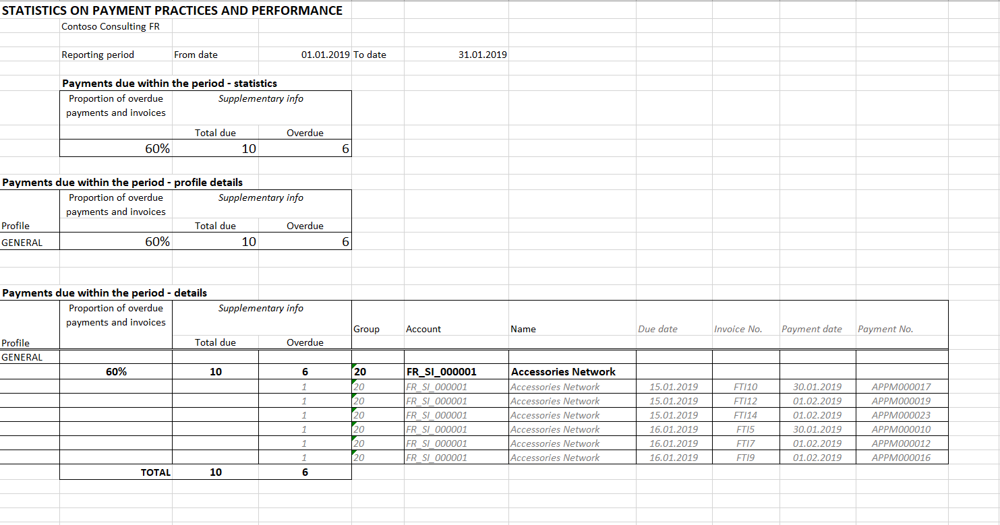

---
# required metadata
title: Statistics on payment practices report
description: This topic provides information about Statistics on payment practices report.
author: anasyash
manager: AnnBe
ms.date: 03/03/2020
ms.topic: article
ms.prod: 
ms.service: dynamics-ax-applications
ms.technology: 

# optional metadata

# ms.search.form:  
audience: Application User
# ms.devlang: 
ms.reviewer: kfend
ms.search.scope: Core, Operations
# ms.tgt_pltfrm: 
# ms.custom: 
ms.search.region: United Kingdom
# ms.search.industry: 
ms.author: anasyash
ms.search.validFrom: 2020-12-02
ms.dyn365.ops.version: 10.0.8

---

# Statistics on payment practices report

[!include [banner](../includes/banner.md)]

In the scope of reporting requirements, businesses in the United Kingdom (UK) must prepare and publish information about their payment practices and performance at they relate to qualifying contracts, for each reporting period in the financial year. The information for each reporting period must reflect the policies and practices which are applied during that period, and the business's performance for that period.

The report must be published on a web-based service provided by or on behalf of the government within 30 days of the end of the reporting period.

In the scope of report, there are some narrative descriptions of reporting practices as well as the following statistics:

- (1) The average number of days taken to make payments in the reporting period, from the date of receipt of invoice.
- (2) The percentage of payments made within the reporting period which were paid in 30 days or fewer, between 31 and 60 days, in 61 days or longer.
- (3) The percentage of payments due within the reporting period which were not paid within the agreed terms.

## Report

The report **Statistics on payment practices (UK)** is exported to Microsoft Excel and has two tabs:

- **Payments_made**: This tab contains the statistics of types (1) and (2) above, and the details per vendor account. The detailed view, also contains the details per payment that were made within a reporting period.
- **Payments_due**: This tab contains the statistics of type (3) above and the details per vendor account. The detailed view also contains details per invoice that are due within a reporting period.

Download the latest version of the ER configuration **Statistics on payment practices (UK)**, **Statistics on invoices** (ER model), and **Statistics on invoices model mapping** (ER model mapping) before using this report.

Review additional instructions in the topic, [Download Electronic reporting configurations from Lifecycle Services](../../dev-itpro/analytics/download-electronic-reporting-configuration-lcs.md).

## Post documents and define the date of receiving the invoice.

Before you generate the report, post and settle the appropriate invoices and payments. Payments that aren't settled can't be exported in the **Payments_made** tab because there is no information about the invoice to be paid with this payment, and number of days taken to make payments can't be calculated.

You can identify the date when the purchase invoice was received and use this date to calculate the number of days taken to make payments. Enter information in the field **Receive document date** in the following pages:

When creating and posting the new vendor invoice, enter information in the **Receive document date** field on the **Vendor invoice** page, in the **Vendor invoice header** tab, **Invoice dates** group of fields. The value defaults from the **Invoice date** field.

When you create the **Vendor invoice journal** line, you can define the **Receive document date** on the **General** tab.

You can also fill the **Receive document date** after the vendor invoice is posted but before it’s fully settled on the **General** tab of the **Vendor transactions** page.
 
## Generate report

1. Go to **Accounts payable** \> **Inquiries and reports** \> **Statistics** \> **Report on payment deadlines**.
2. In the dialog box, in the field, **Format mapping**, select **Statistics on payment practices (UK)**. 
3. In the **Electronic report parameters** dialog box, fill in the fields:

| **Field**                  | **Details**                                                                                                                                                                                                                                                                                                                                        |
|----------------------------|----------------------------------------------------------------------------------------------------------------------------------------------------------------------------------------------------------------------------------------------------------------------------------------------------------------------------------------------------|
| **Date criteria**          | Select one of the following options: **Invoice accounting date**, **Invoice date**, **Invoice receive date** Depending on what is selected, the number of days taken to make payments will be calculated between the **Payment date** and respective type of date chosen on the dialog: **Transaction date**, **Invoice date**, **Receive document date**. |
| **From date**, **To date** | Fill in start and end dates of reporting period.                                                                                                                                                                                                                                                                                                   |
| **Vendor posting profile** | Select the vendor profile to generate a report only for the selected profile.                                                                                                                                                                                                                                                                            |
| **Print document details** | Select **Yes** to export details of invoice and payment documents on the report.   |

4. Select **OK** to generate the report.
5. Review the **Payments made** tab.

6. Review the **Payments due** tab.

## Publish reporting on payment practices

After you generate the **Statistics report on payment practices** report in Excel, you can use the report data to prepare the final report on payment practices for publication.
