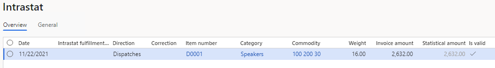
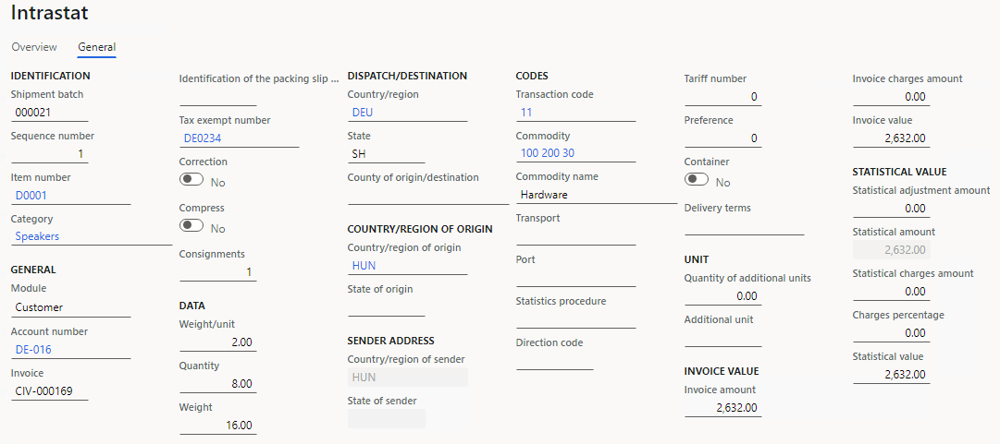
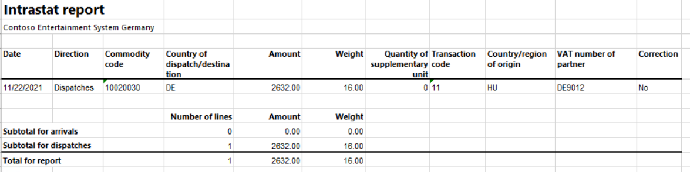
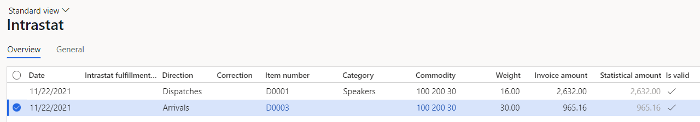
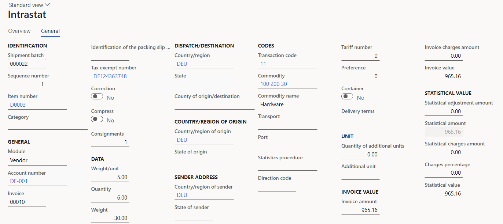
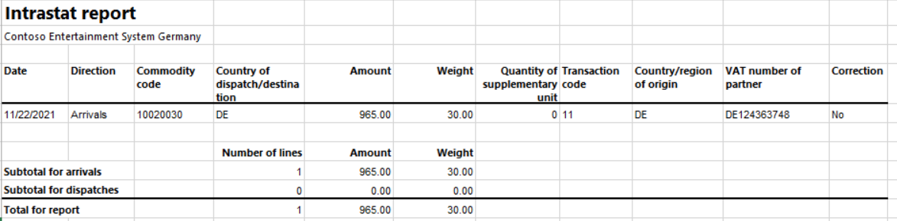

# Hungarian Intrastat

[!include[banner](../includes/banner.md)]

You can use the **Intrastat** page to generate and report information about trade among European Union (EU) countries/regions. The Hungarian Intrastat declaration contains information about the trade of goods for reporting.

The following fields are included in the Hungarian Intrastat declaration. All the fields except **VAT number of trading partner** are included on both arrivals and dispatches. The **VAT number of trading partner** field is included only on dispatches.

| Field name                      | Description                                                                                                                      |
|---------------------------------|----------------------------------------------------------------------------------------------------------------------------------|
| OSAP number                     | The report direction code. For arrivals, "2012" is printed. For dispatches, "2010" is printed.                                   |
| VAT number of trade operator    | The value-added tax (VAT) ID.                                                                                                    |
| VAT number of declaring party   | The same VAT ID that is used for the trade operator                                                                              |
| Declaration year                | The reference year of the declaration. Only the last two digits are printed.                                                     |
| Declaration month               | The reference month of the declaration.                                                                                          |
| Declarant's name                | The first and last names of the person who submits the declaration.                                                              |
| Declarant's phone               | The telephone number of the person who submits the declaration.                                                                  |
| Declarant's e-mail              | The email address of the person who submits the declaration.                                                                     |
| Comment                         | A free space for additional information. You can add this information on the **Intrastat** page when you generate the report.    |
| Commodity code                  | The commodity code according to the Combined Nomenclature (CN) classification. This code is set on the product page.             |
| Nature of transaction           | The transaction code. Companies in Hungary use two-digit codes.                                                                  |
| Member state of consignment     | The International Organization for Standardization (ISO) code of the country or region of the counterparty.                      |
| Country of origin               | The ISO code of the country or region where the goods were produced.                                                             |
| Quantity in net mass            | The net mass of the goods item in kilograms. The unit itself ("kg") isn't printed.                                        |
| Quantity in supplementary units | For some commodities, you must report the supplementary unit. The unit itself (for example, "pairs" or "dozens") isn't reported. |
| Invoice amount                  | The invoice value in the reporting currency.                                                                                     |
| Statistical value               | The statistical value in the accounting currency.                                                                                |
| VAT number of trading partner   | The customer's foreign VAT number in an EU member state.                                                                         |

## Preliminary setup

To work with the Intrastat report, you must activate the **Date of VAT register** feature. For more information, see [Tax point date (Date of VAT register)](emea-tax-point-date.md).

## Set up Intrastat

From the Global repository, import the latest version of the following Electronic reporting (ER) configurations:

- Intrastat model
- Intrastat report
- Intrastat (HU)

For more information, see [Download ER configurations from the Global repository of Configuration service](../../fin-ops-core/dev-itpro/analytics/er-download-configurations-global-repo.md).

## Set up VAT IDs

### Create a registration type for the company code

You must create VAT ID registration types for all the countries or regions that your company does business with.

1. Go to **Organization administration** > **Global address book** > **Registration types** > **Registration types**.
2. On the Action Pane, select **New** to create a registration type for the VAT ID.
3. In the **Enter registration type details** dialog box, in the **Name** field, enter a name for the new registration type. For example, enter **VAT ID**.
4. In the **Country/region** field, select the country or region of the trading partner.
5. Select **Create**.

### Match the registration type with a registration category

1. Go to **Organization administration** > **Global address book** > **Registration types** > **Registration categories**.
2. On the Action Pane, select **New** to create a link between a registration type and a registration category.
3. For the registration type for the VAT ID, select the **VAT ID** registration category.
4. Repeat steps 2 and 3 for the other registration types that you created for the countries or regions that your company does business with.

### Set up the VAT number of a trading partner

1. Go to **Accounts receivable** > **Customers** > **All customers.**
2. In the grid, select a customer.
3. On the Action Pane, on the **Customer** tab, in the **Registration** group, select **Registration IDs**.
4. On the **Registration ID** FastTab, select **Add** to create a registration ID.
5. In the **Registration type** field, select the registration type that you created for the company code earlier in this article.
6. In the **Registration number** field, enter the company's VAT number.
7. On the Action Pane, select **Save**. Then close the page.
8. On the **Invoice and delivery** FastTab, in the **Sales tax** section, in the **Tax exempt number** field, select the tax-exempt code that you created earlier.

For more information, see [Registration IDs](emea-registration-ids.md).

### Set up the VAT ID of the data provider for your company

1. Go to **Organization administration** > **Organizations** > **Legal entities**.
2. In the grid, select your company.
3. On the **Tax registration** FastTab, in the **Tax registration number** field, enter the VAT ID of your company's data provider.

## Set up product parameters for the Intrastat declaration

1. Go to **Product information management** > **Products** > **Released products**.
2. In the grid, select a product.
3. On the **Foreign trade** FastTab, in the **Intrastat** section, in the **Commodity** field, select the commodity code. The name of the commodity will be printed in the **Description of commodities** field on the Intrastat report.
4. In the **Origin** section, in the **Country/region** field, select the product's country or region of origin.
5. On the **Manage inventory** FastTab, in the **Net weight** field, enter the product's weight in kilograms.

## Set up foreign trade parameters

1. Go to **Tax** > **Setup** > **Foreign trade parameters**.
2. On the **Intrastat** tab, on the **Electronic reporting** FastTab, in the **File format mapping** field, select **Intrastat (HU)**.
3. In the **Report format mapping** field, select **Intrastat report**.
4. On the **Commodity code hierarchy** FastTab, in the **Category hierarchy** field, select **Intrastat**.
5. In the **Transaction code** field, select the transaction code for property transfers. You use this code for transactions that produce actual or planned transfers of property against compensation (financial or otherwise). You also use it for corrections. Companies in Hungary use two-digit transaction codes.
6. In the **Credit note** field, select the transaction code for the return of goods.
7. On the **Contact** tab, add information about the person who is employed by the enterprise and who fills in the report.
8. In the **Name** field, enter the first and last names of the employee.
    
    1. In the **Telephone** field, enter the telephone number of the employee.
    2. In the **Email** field, enter the email address of the employee.

9. On the **Country/region properties** tab, in the **Country/region** field, list all the countries or regions that your company does business with. For each country that is part of the EU, select **EU** in the **Country/region type** field, so that the country appears on your Intrastat report. For Hungary, select **Domestic** in the **Country/region type** field.

## Set up compression of Intrastat

- Go to **Tax** > **Setup** > **Foreign trade** > **Compression of Intrastat**, and select the fields that should be compared when Intrastat information is summarized. For Hungary, select the following fields:

    - Commodity
    - Transaction code
    - Country/region of origin
    - Country/region of sender
    - Correction
    - Country/region
    - Tax exempt number
    - Invoice
    - Direction

## Intrastat transfer

On the **Intrastat** page, on the Action Pane, you can select **Transfer** to automatically transfer the information about intracommunity trade from your sales orders, free text invoices, purchase orders, vendor invoices, vendor product receipts, project invoices, and transfer orders. Only documents that have an EU country as the country or region of destination or consignment will be transferred.

You can also manually enter transactions by selecting **New** on the Action Pane.

### Generate an Intrastat report

1. Go to **Tax** > **Declarations** > **Foreign trade** > **Intrastat**.
2. On the Action Pane, select **Output** > **Report**.
3. In the **Intrastat Report** dialog box, enter the start date for the report.
4. Set the **Generate file** option to **Yes** to generate a .csv file.
5. Set the **Generate report** option to **Yes** to generate an .xlsx file, and then enter a name for the file.
6. In the **Direction** field, select **Arrivals** if the report is about intracommunity arrivals or **Dispatches** if the report is about intracommunity dispatches.
7. In the **Comment** field, enter the additional information for the declaration.
8. In the **File format mapping** section, in the **Minutes required for completion** field, specify the amount of time that you spent filling in the report.
9. Select **OK**, and review the generated reports.

## Example

This example shows how to post arrivals and dispatches for Intrastat by using the **DEMF** legal entity.

### Preliminary setup

1. Go to **Organization administration** > **Organization** > **Legal entities**.
2. In the grid, select the **DEMF** legal entity.
3. On the **Addresses** FastTab, select **Edit**, and then, in the **Country/region** field, select **HUN (Hungary)**.
4. Import the latest version of the following ER configurations:

    - Intrastat model
    - Intrastat report
    - Intrastat (HU)

5. Go to **Workplaces** > **Feature** **management** > **All**.
6. In the grid, select **Date of VAT register**, and then select **Enable now**.
7. Go to **Modules** > **Tax** > **Indirect** **taxes** > **Sales tax** > **Sales tax groups**.
8. In the grid, select **AR-DOM**. This sales tax group will be used when the sales order is created.
9. On the **General** FastTab, in the **Date validation** section, in the **Date of VAT register filling** field, select **Document date**.

### Set up VAT IDs

#### Set up the VAT ID of the data provider for your company

1. Go to **Organization administration** > **Organizations** > **Legal entities**.
2. In the grid, select your company.
3. On the **Tax registration** FastTab, in the **Tax registration number** field, enter **12345678**.

#### Create registration types for partner company codes

1. Go to **Organization administration** > **Global address book** > **Registration types** > **Registration types**.
2. On the Action Pane, select **New** to create a registration type for the VAT ID.
3. In the **Enter registration type details** dialog box, in the **Name** field, enter **VAT ID**.
4. In the **Country/region** field, select **DEU**.
5. Select **Create**.

#### Match the registration type with a registration category

1. Go to **Organization administration** > **Global address book** > **Registration types** > **Registration categories**.
2. On the Action Pane, select **New** to create a link between the registration type and the registration category.
3. For the **VAT ID** registration type of the **DEU** country, select the **VAT ID** registration category.

#### Set up the customer's VAT registration number

1. Go to **Accounts receivable** > **Customers** > **All customers**.
2. In the grid, select **DE-016**.
3. On the Action Pane, on the **Customer** tab, in the **Registration** group, select **Registration IDs**.
4. On the **Registration ID** FastTab, select **Add** to create a registration ID.
5. In the **Registration type** field, select **VAT ID**.
6. In the **Registration number** field, enter **DE9012**.
7. On the Action Pane, select **Save**. Then close the page.
8. On the **Invoice and delivery** FastTab, in the **Sales tax** section, in the **Tax exempt number** field, select **DE9012**.

### Set up product information

1. Go to **Product information management** > **Products** > **Released products**.
2. In the grid, select **D0001**.
3. On the **Foreign trade** FastTab, in the **Intrastat** section, in the **Commodity** field, select **100 200 30**.
4. In the **Origin** section, in the **Country/region** field, select **HUN**.
5. On the **Manage inventory** FastTab, in the **Weight measurements** section, in the **Net weight** field, enter **2**.
6. On the Action Pane, select **Save**.
7. In the grid, select **D0003**.
8. On the **Foreign trade** FastTab, in the **Intrastat** section, in the **Commodity** field, select **100 200 30**.
9. In the **Origin** section, in the **Country/region** field, select **DEU**.
10.On the **Manage inventory** FastTab, in the **Weight measurements** section, in the **Net weight** field, enter **5**.
11.On the Action Pane, select **Save**.

### Set up foreign trade parameters

1. Go to **Tax** > **Setup** > **Foreign trade** > **Foreign trade parameters**.
2. On the **Intrastat** tab, on the **General** FastTab, in the **Transaction** **code** field, select **11**.
3. On the **Electronic reporting** FastTab, in the **File format mapping** field, select **Intrastat (HU)**.
4. In the **Report format mapping** field, select **Intrastat Report**.
5. On the **Commodity code hierarchy** FastTab, verify that the **Category hierarchy** field is set to **Intrastat**.
6. On the **Contact** tab, in the **Name** field, enter **Manish Chopra**.
7. In the **Telephone** field, enter **425-555-5068**.
8. In the **Email** field, enter manishc@contoso.com.
9. On the **Country/region properties** tab, select **New**.
10. In the **Party country/region** field, select **HUN**. Then, in the **Country/region type** field, select **Domestic**.
11. Select **New** again.
12. In the **Party country/region** field, select **DEU**. Then, in the **Country/region type** field, select **EU**.

### Change the site address

1. Go to **Warehouse management** > **Setup** > **Warehouse** > **Sites**.
2. In the grid, select **1**.
3. On the **Addresses** FastTab, select **Edit**.
4. In the **Edit address** dialog box, in the **Country/region** field, select **HUN**.
5. Select **OK**.

### Create a sales order with an EU customer

1. Go to **Accounts receivable** > **Orders** > **All sales orders**.
2. On the Action Pane, select **New**.
3. In the **Create sales order** dialog box, on the **Customer** FastTab, in the **Customer** section, in the **Customer account** field, select **DE-016**.
4. On the **General** FastTab, in the **Storage dimensions** section, in the **Site** field, select **1**.
5. In the **Warehouse** field, select **11**.
6. On the **Address** tab, verify that the **Address** field is set to **Teichgasse 12, Kiel, 24103, DEU**, because the customer is from Germany.
7. Select **OK**.
8. On the **Lines** tab, on the **Sales order lines** FastTab, in the **Item number** field, select **D0001**. Then, in the **Quantity** field, enter **8**.
9. On the **Line details** FastTab, on the **Foreign trade** tab, verify that the **Transaction code** field is set to **11**, the **Commodity** field is set to **100 200 30**, and the **Country/region of origin** field is set to **HUN**.
10. On the Action Pane, select **Save**.
11. On the Action Pane, on the **Invoice** tab, in the **Generate** group, select **Invoice**.
12. In the **Posting invoice** dialog box, on the **Parameters** FastTab, in the **Parameter** section, in the **Quantity** field, select **All**.
13. Select **OK** to post the invoice.

### Transfer the transaction to the Intrastat journal and review the result

1. Go to **Tax** > **Declarations** > **Foreign trade** > **Intrastat**.
2. On the Action Pane, select **Transfer**.
3. In the **Intrastat (Transfer)** dialog box, in the **Parameters** section, set the **Customer invoice** option to **Yes**.
4. Select **Filter**.
5. In the **Intrastat Filter** dialog box, on the **Range** tab, select the first line, and verify that the **Field** field is set to **Date**.
6. In the **Criteria** field, select the current date.
7. Select **OK** to close the **Intrastat Filter** dialog box.
8. Select **OK** to close the **Intrastat (Transfer)** dialog box, and review the result. The line represents the sales order that you created earlier.

    

9. Select the transaction line, and then select the **General** tab to view more details.

    

10. On the Action Pane, select **Output** > **Report**.
11. In the **Intrastat Report** dialog box, on the **Parameters** FastTab, in the **Date** section, in the **From date** field, select the first day of the current month.
12. In the **Export** **options** section, set the **Generate file** option to **Yes**.
13. Set the **Generate report** option to **Yes**. Then, in the **Report file name** field, enter the required name.
14. In the **Direction** field, select **Dispatches**.
15. In the **Comment** field enter **Report on dispatches**.
16. In the **File format mapping** section, in the **Minutes required for completion** field, enter **11**.
17. Select **OK**, and review the report in text format that is generated. The following table shows the values in the example report.

    | Field name                    | Value                |
    |-------------------------------|----------------------|
    | OSAP number                   | 2010                 |
    | VAT number of trade operator  | 12345678             |
    | VAT number of declaring party | 12345678             |
    | Declaration year              | 21                   |
    | Declaration month             | 11                   |
    | Declarant's name              | Manish Chopra        |
    | Declarant's e-mail            | manishc@contoso.com  |
    | Declarant's phone             | 425-555-5068         |
    | Comment                       | Report on dispatches |
    | Serial number                 | 00001                |
    | Commodity code                | 10020030             |
    | Nature of transaction         | 11                   |
    | Member state of consignment   | DE                   |
    | Country of origin             | HU                   |
    | Quantity in net mass          | 16                   |
    | Invoice amount                | 2632                 |
    | Statistical value             | 2632                 |
    | VAT number of trading partner | DE9012               |

18. Review the report in Microsoft Excel format that is generated.

   

### Create a purchase order

1. Go to **Accounts payable** > **Purchase orders** > **All purchase orders**.
2. On the Action Pane, select **New**.
3. In the **Create purchase order** dialog box, in the **Vendor account** field, select **DE-001**.
4. In the **Site** field select **1**.
5. In the **Warehouse** field select **11**.
6. Select **OK**.
7. On the **Lines** tab, on the **Purchase order lines** FastTab, in the **Item number** field, select **D0003**. Then, in the **Quantity** field, enter **6**.
8. On the **Line details** FastTab, on the **Foreign trade** tab, verify that the **Transaction code** is set to **11**, the **Commodity** field is set to **100 200 30**, and the **Country/region of origin** field is set to **DEU**.
9. On the Action Pane, on the **Purchase** tab, in the **Actions** group, select **Confirm**.
10. On the Action Pane, on the **Invoice** tab, in the **Generate** group, select **Invoice**.
11. On the Action Pane, select **Default from**, and then, in the **Default quantity for lines** field, select **Ordered quantity**. Then select **OK**.
12. On the **Vendor Invoice header** FastTab, in the **Invoice identification** section, in the **Number** field, enter **00010**.
13. In the **Invoice dates** section, in the **Invoice date** field, select the current date. This date will be used for Intrastat transfer.
14. In the **Date of VAT register** field, select the date of the VAT register.
15. On the Action Pane, select **Post** to post the invoice.

### Create an Intrastat declaration for arrivals

1. Go to **Tax** > **Declarations** > **Foreign trade** > **Intrastat**.
2. On the Action Pane, select **Transfer**.
3. In the **Intrastat (Transfer)** dialog box, set the **Vendor invoice** option to **Yes**.
4. Select **Filter**.
5. In the **Intrastat Filter** dialog box, on the **Range** tab, select the **Vendor invoice journal** line, and verify that the **Field** field is set to **Date**.
6. In the **Criteria** field, select the current date.
7. Select **OK** to close the **Intrastat Filter** dialog box.
8. Select **OK** to transfer the transaction, and review the Intrastat journal.

    

9. Review the information on the **General** tab for the purchase order.

    

10. On the Action Pane, select **Output** > **Report**.
11. In the **Intrastat Report** dialog box, on the **Parameters** FastTab, in the **Date** section, in the **From date** field, select the first day of the current month.
12. In the **Export** **options** section, set the **Generate file** option to **Yes**. Then, in the **File name** field, enter the required name.
13. Set the **Generate report** option to **Yes**. Then, in the **Report file name** field, enter the required name.
14. In the **Direction** field, select **Arrivals**.
15. In the **Comment** field, enter **Report on arrivals**.
16. In the **File format mapping** section, in the **Minutes required for completion** field, enter **11**.
17. Select **OK**, and review the report in XML format that is generated. The following table shows the values in the example report.

    | Field name                                         | Value               |
    |----------------------------------------------------|---------------------|
    | OSAP number                                        | 2012                |
    | VAT number of trade operator                       | 12345678            |
    | VAT number of declaring party                      | 12345678            |
    | Declaration year                                   | 21                  |
    | Declaration month                                  | 11                  |
    | Declarant's name                                   | Manish Chopra       |
    | Declarant's phone                                  | 425-555-5068        |
    | Declarant's e-mail                                 | manishc@contoso.com |
    | Comment                                            | Report on arrivals  |
    | Time spent filling in the questionnaire in minutes | 11                  |
    | Serial number                                      | 00001               |
    | Commodity code                                     | 10020030            |
    | Nature of transaction                              | 11                  |
    | Member state of consignment                        | DE                  |
    | Country of origin                                  | DE                  |
    | Quantity in net mass                               | 30                  |
    | Invoice amount                                     | 965                 |
    | Statistical value                                  | 965                 |

18. Review the report in Excel format that is generated.

   

[!INCLUDE[footer-include](../../includes/footer-banner.md)]
