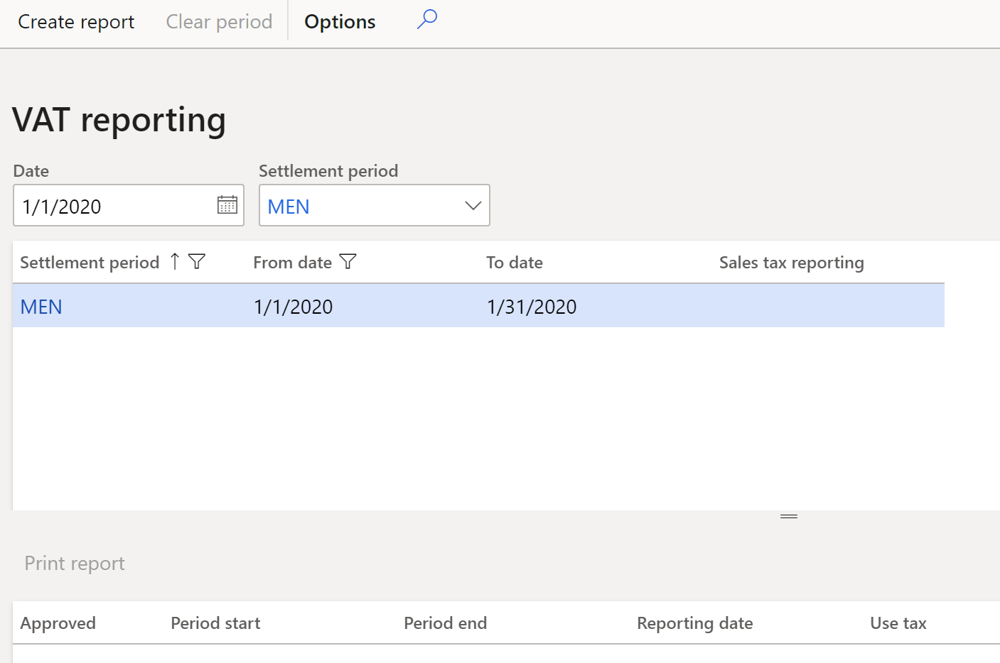

# Sales tax reports for Hungary

[!include [banner](../includes/banner.md)]

This article provides information about the **Sales tax declaration information** and **Itemized VAT statement** reports. You can generate these Microsoft Excel reports and use them to create the value-added tax (VAT) returns that must be submitted to the tax authorities.

- **Sales tax declaration information** – This report includes a list of invoices that are grouped by sales tax direction (sales tax receivable, sales tax payable, or use tax) and by sales tax code. For each sales tax direction and sales tax code, the report also includes the total sales tax amount and total gross invoice amount.
- **Itemized VAT statement** – This report includes the total number of invoices, total number of counteragents (partners), total VAT base, and total VAT amount for each item in the following table.

  | **Item number** | **Transactions that are included**            |
  |-----------------|-----------------------------------------------|
  | 01              | Sales invoices                                |
  | 02              | Credit note sales orders                      |
  | 04              | Purchases invoices                            |
  | 05              | Credit note purchase orders                   |
  | 06              | Purchase invoices that don't exceed the limit |

This report also includes the same information for each partner separately, and a list of invoices for each item.

## Setup

1. In [Microsoft Dynamics Lifecycle Services (LCS)](https://lcs.dynamics.com/V2), in the Shared asset library, download the latest versions of the following Electronic reporting (ER) configurations for the report format:

   * **Sales tax declaration info Itemized Excel format (HU)**
   * **Sales tax declaration info report format (HU)**

    For more information, see [Download Electronic reporting configurations from Lifecycle Services](../../fin-ops-core/dev-itpro/analytics/download-electronic-reporting-configuration-lcs.md).

2. Go to **General ledger** \> **Ledger setup** \> **General ledger parameters**.
3. On the **Sales tax** tab, on the **VAT statement** FastTab, set the **Enable to print itemized VAT statement** option to **Yes** to use the **Sales tax declaration info Itemized Excel format (HU) ER format and generate the Itemized VAT statement report**.

   Alternatively, set the option to **No** to use the **Sales tax declaration info report format (HU) ER format and generate the Sales tax declaration information** report.

4. If you set the **Enable to print itemized VAT statement option to Yes**, in the **Itemized VAT statement limit (HUF)** field, enter an amount limit in Hungarian forints (HUF). This field determines which invoice transactions will be included in the **Itemized VAT statement** report. Any invoice where the VAT amount exceeds the value of this field will be included.

## Generate and export the Sales tax declaration information report or Itemized VAT statement report

### Generate and print VAT reporting

1. Go to **Tax** \> **Periodic tasks** \> **VAT reporting**.
2. In the upper part of the **VAT reporting** page, set the **Date** and **Settlement period** fields. The grid shows settlement periods that are available for VAT reporting.

    

3. Select the line for the required settlement period, and then select **Create report**.
4. In the **Sales tax declaration information** dialog box, set the following fields.

    | **Field**      | **Description**                                                                                                                                                                                                                              |
    |----------------|----------------------------------------------------------------------------------------------------------------------------------------------------------------------------------------------------------------------------------------------|
    | Approve       | Set this option to **Yes** to approve the VAT report.              |
    | Include use-tax   | Set this option to **Yes** to include use tax transactions on the settlement report.                                                                                                                                                                              |
    | Generate file     | Set this option to **Yes** to create an export file for the **Itemized VAT statement** report.                                                                                                                                                                       |
    | Run mode | Select the currency that amounts on the report should be shown in:  - **Amounts in company currency for accounting**: Show the values in the accounting currency.  - **Amounts in company currency for sales tax reporting**: Show the values in the sales tax code currency.  - **Amounts in original currency**: Show the values in the transaction currency.                                                                                                                                                                                                       |

5. Select **OK**. In the grid in the lower part of the page, a line is created that has the VAT reporting data. Additionally, a ZIP archive that contains the report is generated.
6. Review the data on the line that is created.

    | **Field**      | **Description**                                                                                                                                                                                                                              |
    |----------------|----------------------------------------------------------------------------------------------------------------------------------------------------------------------------------------------------------------------------------------------|
    | Approved       | A selected check box indicates that the VAT report is approved. The setting of this check box is transferred from the **Approve** field in the **Sales tax declaration information** dialog box.                                             |
    | Period start   | The start date of the reporting period.                                                                                                                                                                                                      |
    | Period end     | The end date of the reporting period.                                                                                                                                                                                                        |
    | Reporting date | The date when the report is generated.                                                                                                                                                                                                       |
    | Use tax        | A selected check box indicates that use tax sales tax transactions were included in the processing. The setting of this check box is transferred from the **Include use-tax** field in the **Sales tax declaration information** dialog box. |

### Reprint a generated report

1. On the **VAT reporting** page, select **Print report to** print the generated VAT report.
2. In the **Sales tax declaration information** dialog box, set the **Approve**, **Include foreign trade**, **Generate file**, and **Run mode** fields as described in the previous section.
3. Select **OK**. Review the generated ZIP archive that contains the report.

### Re-create the report for a period

1. On the **VAT reporting** page, select **Cancel period** to clear the **Approved** check box from the previous reporting.
2. Select **Clear period** to delete the previously created line in the lower part of the page.
3. Select **Create report**, and follow the instructions in the [Generate and print VAT reporting](#generateandprintvatreporting) section to create a new line in the lower part of the **VAT reporting** page.

## Example

This example can be done in the **DEMF** legal entity.

### Setup

1. Go to **Tax** \> **Indirect taxes** \> **Sales tax** \> **Sales tax codes**, and set up the following three sales tax codes.

    | **Sales tax code** | **Percentage** | **Description**                                                                       |
    |--------------------|----------------|---------------------------------------------------------------------------------------|
    | VAT27              | 27             | Domestic sales at a rate of 27 percent.                                               |
    | InVAT27            | 27             | Domestic purchases at a rate of 27 percent.                                           |
    | EU18               | 18             | EU purchases at a rate of 18 percent, where the **Use tax** option is set to **Yes**. |

2.  Go to **Tax** \> **Setup** \> **Sales tax** \> **Tax exempt number**, and select **New** to create the following two lines.

    | **Country/region** | **Tax exempt number** |
    |--------------------|-----------------------|
    | HUN                | HU11651273            |
    | HUN                | HU34532985            |

### Create and post customer transactions

1. Go to **Accounts receivable** \> **Customers** \> **All customers**, and select customer **DE-010**.
2. On the **Address** FastTab, set **HUN** as the country, and then, on the **Invoice and Delivery** FastTab, set the **Tax exempt number** field to **HU11651273**.
3. Select **Save**.
4. Go to **Accounts receivable** \> **Orders** \> **All sales orders**, create the following order, and then generate an invoice.

    | **Date**        | **Customer** | **Amount net** | **VAT amount** | **Sales tax code** |
    |-----------------|--------------|----------------|----------------|--------------------|
    | January 1, 2020 | DE-010       | 800.00         | 216.00         | VAT27              |

5. Create a credit note for the order. Select the order that you created, and then select **Sell \> Create \> Credit note**. The following two new lines are added.

    | **Date**        | **Customer** | **Amount net** | **VAT amount** | **Sales tax code** |
    |-----------------|--------------|----------------|----------------|--------------------|
    | January 2, 2020 | DE-010       | \-800.00       | \-216.00       | VAT27              |
    | January 2, 2020 | DE-010       | 800.00         | 216.00         | VAT27              |

6. Change the amount on the second line as shown in the following table.

    | **Date**        | **Customer** | **Amount net** | **VAT amount** | **Sales tax code** |
    |-----------------|--------------|----------------|----------------|--------------------|
    | January 2, 2020 | DE-010       | \-800.00       | \-216.00       | VAT27              |
    | January 2, 2020 | DE-010       | **1,000.00**   | **270.00**     | VAT27              |

   > [!NOTE] 
   > If you manually create a credit note instead of selecting **Sell \> Create \> Credit note** (for example, you create a free text invoice that has a negative amount), the credit note will appear in item 01 (sales invoices) and will have a negative amount.

### Create and post vendor transactions

1. Go to **Accounts payable** \> **Vendors** \> **All vendors**, and select vendor **DE-001**.
2. On the **Address** FastTab, set **HUN** as the country, and then, on the **Invoice and Delivery** FastTab, set the **Tax exempt number** field to **HU34532985**.
3. Select **Save**, and close page.
4. Select vendor **DE-01001**.
5. On the **Address** FastTab, verify that **DEU** is set as the country, and then, on the **Invoice and Delivery** FastTab, set the **Tax exempt number** field to **DE192873939**.

6. Go to **Accounts payable \> Invoices \> Invoice journal**, create the following two invoices, and then post them.

    | **Date**        | **Vendor** | **Amount net** | **VAT amount** | **Sales tax code** |
    |-----------------|------------|----------------|----------------|--------------------|
    | January 1, 2020 | DE-001     | 1,500          | 405            | InVAT27            |
    | January 1, 2020 | DE-01001   | 1,100          | 198            | EU18               |

   > [!NOTE] 
   > If you manually a create credit note instead of selecting **Purchase \> Create \> Credit note** (for example, you create a vendor invoice that has a negative amount), the credit note will appear in item 04 (purchase invoices) and will have a negative amount.

### Generate and print the Sales tax declaration information report

1. Go to **General ledger** \> **Ledger setup** \> **General ledger parameters**.
2. On the **Sales tax** tab, on the **VAT statement** FastTab, make sure that the **Enable to print itemized VAT statement** option is set to **No**.
3. Go to **Tax \> Periodic tasks \> VAT reporting.**
4. Select the following line.

    | **Settlement period** | **From date** | **To date** |
    |-----------------------|---------------|-------------|
    | Mon                   | 1/1/2020      | 1/31/2020   |

5. Select **Create report**.
6. In the **Sales tax declaration information** dialog box, set the **Include use-tax** option to **Yes**.
7. Select **OK**, and review [the generated report](https://mbs.microsoft.com/files/customer/AX/Downloads/Taxupdates/SalesTaxDeclarationInformation.xlsx).

### Generate and print the Itemized VAT statement report

1. Go to **General ledger** \> **Ledger setup** \> **General ledger parameters**.
2. On the **Sales tax** tab, on the **VAT statement** FastTab, set the **Enable to print itemized VAT statement** option to **Yes**.
3. Select **Save**.
4. Go to **Tax \> Periodic tasks \> VAT reporting.**
5. Select the following line.

    | **Settlement period** | **From date** | **To date** |
    |-----------------------|---------------|-------------|
    | Mon                   | 1/1/2020      | 1/31/2020   |

6. Select **Clear period**, and then select **Create report**.
7. In the **Sales tax declaration information** dialog box, set the **Include use-tax** option to **Yes**.
8. Select **OK**, and review [the generated report](https://mbs.microsoft.com/files/customer/AX/Downloads/Taxupdates/ItemizedVATStatement.xlsx).

The **Itemized VAT statement** report contains the following data:

- Section **0065A-01-05** includes a table that shows totals by item.

    | &nbsp; |     &nbsp;          | Number of partners | Number of invoices | VAT Base | VAT Amount |
    |--------|---------------------|--------------------|--------------------|----------|------------|
    | 102.   | Total of 00 Line 01 | 1                  | 1                  | 800.00   | 216.00     |
    | 103.   | Total of 00 Line 02 | 1                  | 1                  | 200.00   | 54.00      |
    |        | Lines 102+103       | 1                  | 2                  | 1,000.00 | 270.00     |
    | 105.   | Total of 00 Line 04 | 2                  | 2                  | 2,600.00 | 405.00     |
    | 106.   | Total of 00 Line 05 | 0                  | 0                  | 0.00     | 0.00       |
    | 107.   | Total of 00 Line 06 | 0                  | 0                  | 0.00     | 0.00       |
    |        | Lines 105+106+107   | 2                  | 2                  | 2,600.00 | 405.00     |

In this table, line 102 includes the sales order, line 103 includes the credit note for the sales order, and line 105 includes two vendor invoices.
Other sections contain the same information for each partner separately, and the list of invoices for each item.

[!INCLUDE[footer-include](../../includes/footer-banner.md)]
