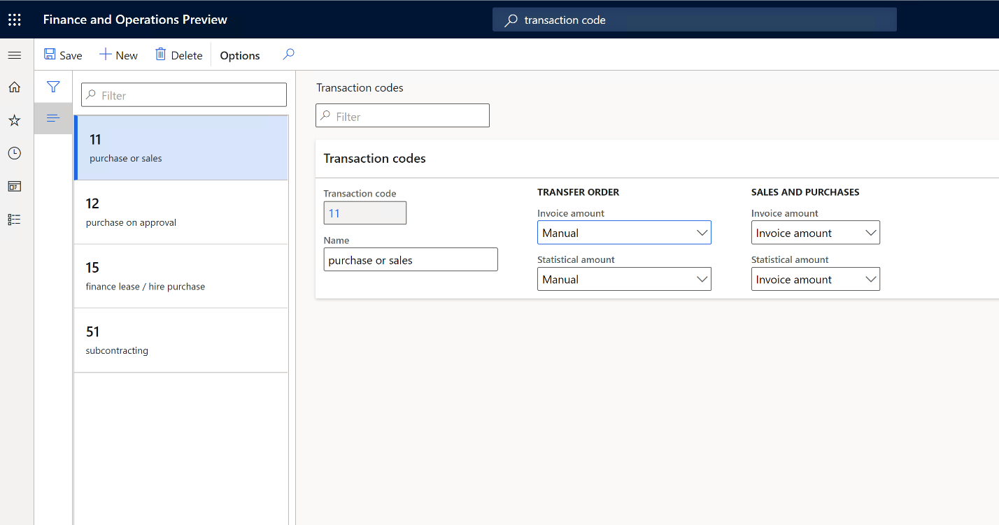
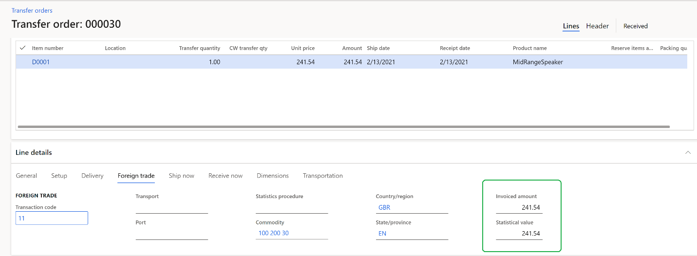
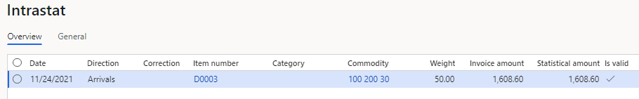
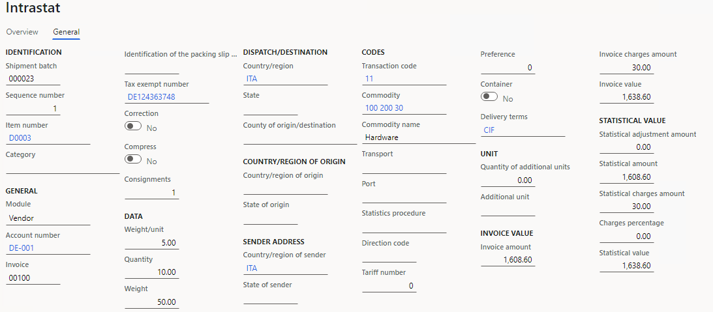
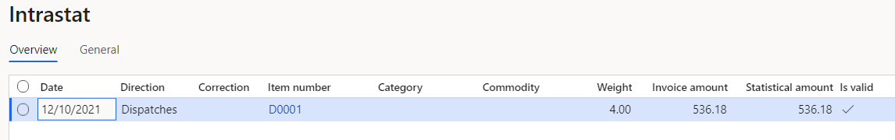
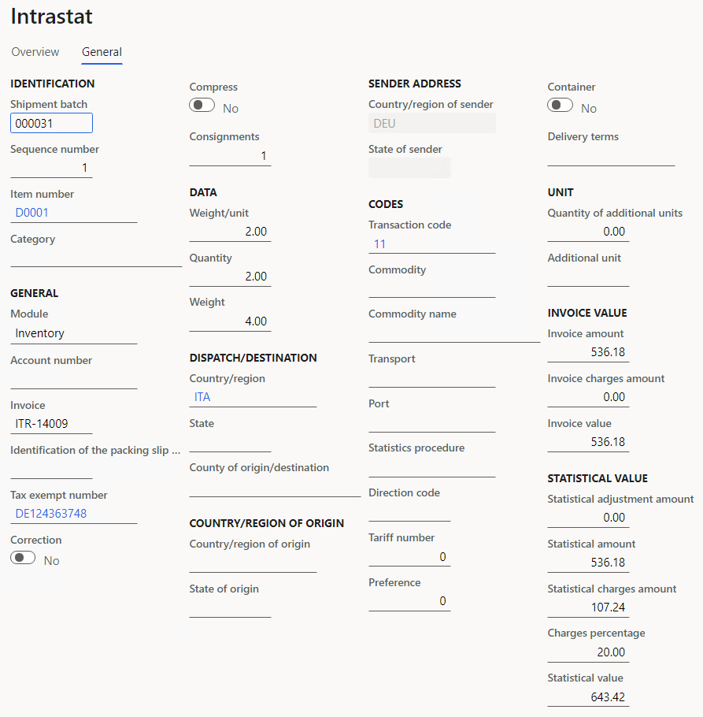
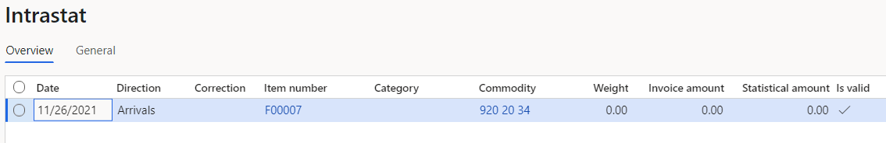
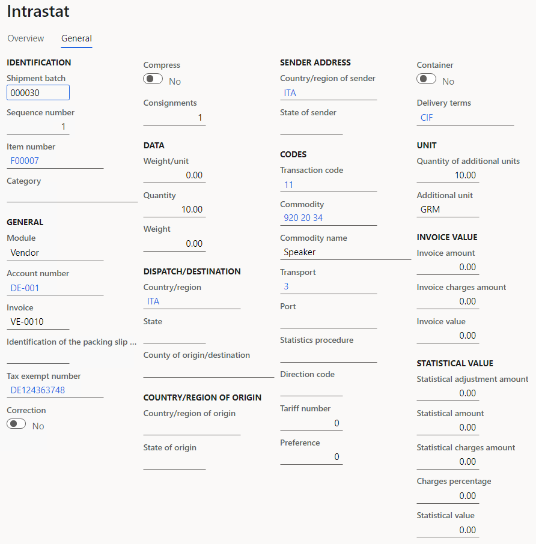

---
# required metadata

title: Intrastat overview
description: This article provides information about Intrastat reporting for the trade of goods and, in some cases, services among countries/regions of the European Union (EU). 
author: mrolecki
ms.date: 11/30/2022
ms.topic: overview
ms.prod: 
ms.technology: 

# optional metadata

ms.search.form: Intrastat
# ROBOTS: 
audience: Application User
# ms.devlang: 
ms.reviewer: kfend
# ms.tgt_pltfrm: 
ms.custom: ["28581", "intro-internal"]
ms.search.region: Austria, Belgium, Czech Republic, Denmark, Estonia, Finland, France, Germany, Hungary, Ireland, Italy, Latvia, Lithuania, Netherlands, Poland, Spain, Sweden, United Kingdom
# ms.search.industry: 
ms.author: mrolecki
ms.search.validFrom: 2016-11-30
ms.dyn365.ops.version: Version 1611

---

# Intrastat overview

[!include [banner](../includes/banner.md)]

This article provides information about Intrastat reporting for the trade of goods and, in some cases, services among countries/regions of the European Union (EU). This article also gives an overview of the reporting process, and describes the required settings and prerequisites.

Intrastat is the system for collecting information and generating statistics about the trade of goods among countries/regions of the European Union (EU). Intrastat reporting is required whenever a product crosses the border of another EU country/region. In several countries/regions, Intrastat reporting also applies to services. Mandatory and optional elements can be collected in Intrastat reporting. The following elements are mandatory: the value-added tax (VAT) number of the party that is responsible for providing information, the reference period, the flow (arrival or dispatch), the eight-digit commodity code, the partner member state (member state of consignment on arrivals and member state of destination on dispatches), the value of the goods, the quantity of the goods (net mass and supplementary unit), and the nature of the transaction. Countries/regions can also collect optional elements under various conditions. Some optional elements are the country/region of origin, the delivery terms, the mode of transport, a more detailed commodity code than CN8, the region of origin on dispatches and the region of destination on arrivals, the statistical procedure, the statistical value, a description of the goods, and the port/airport of loading/unloading.

## Overview of the Intrastat reporting process
The following sections describe the overall flow of information that is used for Intrastat reporting.

### Enter a transaction that crosses the border of another EU country/region

A customer invoice, free text invoice, purchase invoice, project invoice, customer packing slip, vendor product receipt, or transfer order is transferred to the Intrastat journal only if the country/region type of the destination (on dispatches) or consignment (on arrivals) is **EU**. This feature was extended for Microsoft Dynamics 365 for Operations (1611) and allows you to specify lading addresses for an intra-community transaction. If a lading address differs with a vendor business address (or customer business address for return order) the Intrastat reporting will operate with this information. When you create a sales order, free text invoice, purchase order, vendor invoice, project invoice, or transfer order, some fields that are related to foreign trade have default values in the document header or on the line. The default transaction code is taken from the corresponding field on the **Foreign trade parameters** page. The default commodity code, country/region of origin, and state/province of origin are taken from the item. You can change the default values and can also fill in other foreign trade–related information: the statistics procedure, transport method, and port.

### Use the Intrastat journal to generate information about trade among EU countries/regions

For statistical purposes, you generate information about trade among EU countries/regions every month. You can transfer transactions from a free text invoice, customer invoice, customer packing slip, vendor invoice, vendor packing slip, project invoice, or transfer order, according to the transfer criteria that are set up on the **Foreign trade parameters** page. Alternatively, you can enter transactions manually. You can manually update transferred transactions in the Intrastat journal, if any updates are required. Under specific conditions that are set up on the **Compression of Intrastat** page, you can compress the transactions in the Intrastat journal. Some countries/regions let you apply a small transaction threshold. You can then report transactions that are below that threshold under the specified commodity code. You can update the commodity code on the corresponding Intrastat journal lines, based on the **Minimum limit** setting on the **Foreign trade parameters** page. You can also compress those transactions, based on the **Compression of Intrastat** setting. You can validate the completeness of the transactions in the Intrastat journal, based on the **Check setup** setting on the **Foreign trade parameters** page. The data in corresponding fields might be validated for completeness: country/region, state or province, weight, commodity code, transaction code, additional unit, port, origin, terms of delivery, transport method, and tax exempt number. Transactions that aren't completed will be marked as not valid.

### Use the Intrastat journal to report information about trade among EU countries/regions

For statistical purposes, you report information about trade among EU countries/regions every month. You can print the Intrastat report, based on the **Report format mapping** settings on the **Foreign trade parameters** page. You can also generate an electronic file, based on the **File format mapping** settings on the **Foreign trade parameters** page. For more information about Intrastat reporting, including required prerequisites, see the Intrastat reporting task recordings:

  - Generate an EU Intrastat declaration,
  - Transfer transactions to the Intrastat,
  - Specifying lading address for an intra-community transaction.

## Prerequisites
The following table lists the prerequisites for Intrastat reporting.

|  Prerequisite  |  Description  |
|-------------------------|-------------------------|
| Address setup | Set up International Organization for Standardization (ISO) codes for countries/regions. |
| Legal entity | Set up tax exempt numbers for import/export, the branch number extension for import/export, and the Intrastat code that is assigned to the legal entity. |
| Product category hierarchy (sales hierarchy, procurement hierarchy) | Assign the Intrastat commodity codes to the category nodes on the **Commodity codes** tab of the **Category hierarchy** page. When you assign a commodity code to a parent category node, that code is applicable to all child category nodes. The selected commodity codes will be available in the **Selected** view when you select a commodity code in the product details, and on sales order, purchase order, and transfer order lines. |
| Released product details | Set up the following foreign trade data for released products:<ul><li>**Commodity code** – Select from either the list of selected commodities that is retrieved from assigned product categories or the full list of Intrastat commodity codes.</li><li>**Statistical charges percentage**</li><li>**Country/region of origin** – Select the default country/region where the goods were completely obtained or produced.</li><li>**State/province of origin/destination** – Select the default state/province of destination for arrivals and the state/province of origin for dispatches.</li><li>**Net weight in kg**</li><li>**Exclude** - Enable this parameter to not transfer transactions with this product to Intrastat</li></ul> |
| Customers | Set up the customer delivery address in the EU country/region. |
| Vendors | Set up the vendor address in the EU country/region. |
| Miscellaneous charges | Set up the miscellaneous charges code to include in the invoice amount, the statistical amount, or both. On the **Charges codes** page, on the **Foreign trade** tab, enable **Intrastat invoice value** to include the charges amount in the invoice value, and enable **Intrastat statistical value** to include the charges amount in the statistical value. For more information, review [Transaction codes and miscellaneous charges](#transaction-codes-and-miscellaneous-charges) example. |
| Electronic reporting | Set up electronic reporting configurations to export Intrastat data in an electronic file that has the format that is requested by the relevant authorities, and to preview Intrastat data in a user-friendly, readable format (for example, in Microsoft Excel). |
| Warehousing | Associate vendor accounts with warehouse codes for filling tax exempt number when transferring Transfer order. For more information, review [Transfer order](#transfer-order) example.|

## Setup
The following sections describe the settings that are required for Intrastat reporting.

### Commodity codes

Set up a category hierarchy of type **Commodity code**, and enter all commodity codes according to the combined nomenclature list. For each commodity, you set up the following information:<ul><li>The name of the commodity and the commodity code</li><li>The friendly name and/or translated name</li><li>Settings for reporting additional (supplementary) units on the **Foreign trade** tab. You can select the additional unit in the unit list. You can also specify whether the weight of commodities must be reported in addition to the selected additional unit.</li></ul>For more information, review [Additional units](#additional-units) example.

### Transaction codes 

A system of two-digit transaction codes is used to differentiate types of trade at the European level depending on nature of the transaction. For more information, see [European business statistics compilers' manual for international trade in goods statistics — 2021 edition - Products Manuals and Guidelines - Eurostat (europa.eu)](https://ec.europa.eu/eurostat/web/products-manuals-and-guidelines/-/ks-gq-21-004).

Set up the nature of the transaction according to the country's/region's requirements. For each transaction code that you set up, you must set up the rules for calculating invoice amounts and statistical amounts for transfer orders and sales/purchase orders.<ul><li>For transfer orders, you set up one of the following rules for calculating invoice amounts and statistical amounts:<ul><li>**Empty** – The amount will be 0 (zero).</li><li>**Financial cost amount** – The amount will be equal to the financial cost.</li><li>**Total cost** – The amount will be equal to the total cost of the transaction.</li><li>**Manual** – The amount will be equal to the amount that is manually specified on the transfer order line.</li></ul></li><li>For sales orders and purchase orders, you set up one of the following rules for calculating invoice amounts and statistical amounts:<ul><li>**Empty** – The amount will be 0 (zero).</li><li>**Invoice amount** – The amount will be equal to the amount that is invoiced for the commodity.</li><li>**Base amount** – The amount will be equal to the amount that would be invoiced before any discount is applied.</li></ul></ul>For more information, review [Transaction codes and miscellaneous charges](#transaction-codes-and-miscellaneous-charges) example. 

As of January 1, 2022, a unified system of two-digit transaction codes is used in EU countries.

1. Go to **Tax** > **Set up** > **Foreign trade** > **Transaction codes**.
2. Create the required transaction codes.

    

For each transaction code that you create, you must set up the rules that are used to calculate invoice amounts and statistical amounts for transfer orders, and for sales orders and purchase orders.

- For transfer orders, set up one of the following rules:

    - **Empty:** The amount will be 0 (zero).
    - **Financial cost amount:** The amount will equal the financial cost.
    - **Total cost:** The amount will equal the total cost of the transaction.
    - **Manual:** The amount will equal the amount that is specified in the **Invoiced amount** and **Statistical value** fields on the transfer order line. These values are taken from the **Amount** field on the transfer order line.

    

-   For sales orders and purchase orders, set up one of the following rules:

    - **Empty:** The amount will be 0 (zero).
    - **Invoice amount:** The amount will equal the amount that is invoiced for the commodity.
    - **Base amount:** The amount will equal the invoice amount that would be invoiced before any discount is applied.

### Transport methods 

Set up the transport mode according to your country's/region's requirements. For each delivery mode, you can set up a default transport method on the **Foreign trade** tab. 

### Ports 

Set up the port/airport of loading/unloading if this information is required for Intrastat reporting in country/region of a tax registration set up in the legal entity. 

### Statistics procedures

Set up the statistical procedure if this information is required for Intrastat reporting in country/region of a tax registration set up in the legal entity.

### Compressing rules for Intrastat transactions

On the **Compression of Intrastat** page, you can select the fields to use for compression. All transactions that have the same combination of values for the selected fields in the Intrastat journal will be compressed into a single transaction when you run the Compress function in the Intrastat journal.

### Foreign trade parameters

Use the **Foreign trade parameters** page to set up the parameters in the following table.

<table>
<colgroup>
<col width="50%" />
<col width="50%" />
</colgroup>
<thead>
<tr class="header">
<th>Tab > FasTab</th>
<th>Parameters</th>
</tr>
</thead>
<tbody>
<tr class="odd">
  <td><strong>Intrastat > General</strong></td>
  <td>Specify the following information:
    <li>The default transaction codes for sales orders, purchase orders, credit notes, and transfer orders. The transaction code that is set up for credit notes is also used as the code for physical goods return and is used for deviating physical returns versus correction credit notes. Returns of physical goods are reported in Intrastat transfer with a different direction. The return of arrival is reported as dispatch and the return of dispatch is reported as arrival.</li>
    <li>The employee who is responsible for preparing Intrastat reports.</li>
    <li>Tax authority.</li>
    <li>Special movement code - is available for Intrastat reporting reporting in the Czech Republic.</li>
  </td>
</tr>
<tr>
  <td><strong>Intrastat > Minimum limit</strong></td>
  <td>Specify the settings for updating transactions that are below the threshold:
     <li>The threshold amount and weight</li>
     <li>The commodity code to apply to transactions that are under the threshold</li>
  </td>
</tr>
<tr>
  <td><strong>Intrastat > Transfer</strong></td>
  <td>Specify the criteria for transferring transactions to the Intrastat journal. You can specify that transactions are transferred only when the items meet one or all of the following criteria:
     <li>The items aren&#39;t service items.</li>
     <li>The items have a commodity code.</li>
     <li>The items have a weight.</li>
     <li>The items have additional units.</li>
  </td>
</tr>
<tr>
  <td><strong>Intrastat > Check setup</strong></td>
  <td>Specify the rules for validating the completeness of Intrastat data. You can select which data is validated.</td>
</tr>
<tr>
  <td><strong>Intrastat > Exchange rate</strong></td>
  <td>Select the exchange rate type for Intrastat reporting</td>
</tr>
<tr>
  <td><strong>Intrastat > Rounding rules</strong></td>
  <td>Specify the following settings for rounding amounts and weights in Intrastat reporting:
      <li>The rounding rule (precision)</li>
      <li>The rounding method: up, down, or normal</li>
      <li>The number of decimal places for amounts and weights</li>
      <li>Instructions for rounding weights that are less than 1 kilogram (kg): up to 1 kg, normal, or no rounding</li>
  </td>
</tr>
<tr>
  <td><strong>Intrastat > Electronic reporting</strong></td>
  <td>Specify references to electronic reporting configurations, so that you can generate an electronic file and report. </td>
</tr>
<tr>
  <td><strong>Intrastat > Commodity code hierarchy</strong></td>
  <td>Specify the category hierarchy of the <strong>Commodity code</strong> type that represents Intrastat commodity code CN8.
     Otionally, specify an exchange rate in <strong>Exchange rate type</strong> field to be used to report Intrastat sales and purchase transactions in foreign currencies. This is used if the rate is different than the one applied when posting the transaction.
  </td>
</tr>
<tr class="even">
<td><strong>Agent contact information</strong></td>
<td>Specify the agent&#39;s name, address, tax exempt number, telephone number, and fax number.</td>
</tr>
<tr class="odd">
<td><strong>Country/region properties</strong></td>
<td>Set the country/region of the current legal entity to <strong>Domestic</strong>. Set the country/region of EU countries/regions that participate in EU trade with the current legal entity to <strong>EU</strong>. For each country/region, you also identify country/region code for foreign trade purposes. </td>
</tr>
<tr class="even">
<td><strong>Number sequence</strong></td>
<td>Specify the number sequence for the Intrastat journal.</td>
</tr>
</tbody>
</table>

For **Multiple VAT registration numbers** scenario, see [Multiple VAT registration numbers](emea-multiple-vat-registration-numbers.md).

For information on Intrastat reporting in **Multiple VAT registration numbers** scenario, see [Reporting for multiple VAT registrations](emea-reporting-for-multiple-vat-registrations.md).

## Example

### Transaction codes and miscellaneous charges

This article covers a scenario where a company in Germany must purchase goods from a company in Italy. To make this purchase, the German company must set up new transaction codes, and configure calculation rules for the invoice amount and statistical amount for those transaction codes. Additionally, when the company creates an invoice, it must specify miscellaneous charges and their percentages. Those values will be considered when the statistical value is calculated.

This scenario uses the **DEMF** legal entity.

#### Preliminary setup

1. Go to **Organization administration** > **Organization** > **Legal entities**, and select **DEMF**.
2. On the **Addresses** FastTab, verify that the **Country/region** field is set to **DEU(Germany)**.
3. Go to **Accounts payable** > **Vendors** > **All vendors**.
4. In the grid, select **DE-001**.
5. On the **Address** FastTab, select **Edit**.
6. In the **Edit address** dialog box, in the **Country/region** field, select **ITA**.
7. Select **OK** to close the dialog box.

#### Set up transaction codes

1. Go to **Tax** > **Setup** > **Foreign trade** > **Transaction codes**.
2. In the grid, select **11**. Then, on the Action Pane, select **Delete**.
3. On the Action Pane, select **New**.
4. On the **Transaction codes** FastTab, in the **Transaction** **code** field, enter **11**.
5. In the **Name** field, enter **Outright purchase/sale**.
6. In the **Sales and purchases** section, in the **Invoice amount** field, select **Invoice amount**.
7. In the **Statistical amount** field, select **Invoice amount**.
8. On the Action Pane, select **Save**.

#### Set up miscellaneous charges

1. Go to **Accounts payable** > **Charges setup** > **Charges code**.
2. In the grid, select **Freight**.
3. On the Action Pane, select **Edit**.
4. On the **Foreign trade** FastTab, set the **Intrastat invoice value** and **Intrastat statistical value** options to **Yes**.

#### Set up foreign trade parameters

1. Go to **Tax** > **Setup** > **Foreign trade** > **Foreign trade parameters**.
2. On the **Intrastat** tab, on the **General** FastTab, in the **Transaction** **code** field, select **11**.
3. On the **Commodity code hierarchy** FastTab, verify that the **Category hierarchy** field is set to **Intrastat**.

#### Create a purchase order

1. Go to **Accounts payable** > **Purchase orders** > **All purchase orders**.
2. On the Action Pane, select **New**.
3. In the **Create purchase order** dialog box, in the **Vendor account** field, select **DE-001**.
4. Select **OK**.
5. On the **Header** tab, on the **Foreign** **trade** FastTab, verify that the **Transaction code** field is set to **11**.
6. On the **Lines** tab, on the **Purchase order lines** FastTab, in the **Item number** field, select **D0003**. Then, in the **Quantity** field, enter **10**.
7. On the **Line details** FastTab, on the **Foreign trade** tab, in the **Foreign trade** section, verify that the **Transaction code** field is automatically set.
8. On the **Purchase order lines** FastTab, on the **Financials** menu, in the **Charges** section, select **Maintain charges**.
9. In the **Charges code** field, select **FREIGHT**.
10. In the **Charges value** field, enter **30**.
11. On the Action Pane, select **Save**. Then close the page.
12. On the Action Pane, on the **Purchase** tab, in the **Actions** group, select **Confirm**.
13. On the Action Pane, on the **Invoice** tab, in the **Generate** group, select **Invoice**.
14. On the Action Pane, select **Default from**. In the **Default quantity for lines** field, select **Ordered quantity**. Then select **OK**.
15. On the **Vendor invoice header** FastTab, in the **Invoice identification** section, in the **Number** field, enter **00100**.
16. In the **Invoice dates** section, in the **Invoice date** field, select **11/24/2021** (November 24, 2021).
17. On the Action Pane, select **Post** to post the invoice.

### Transfer the vendor invoice to the Intrastat journal

1. Go to **Tax** > **Declarations** > **Foreign trade** > **Intrastat**.
2. On the Action Pane, select **Transfer**.
3. In the **Intrastat (Transfer)** dialog box, set the **Vendor invoice** option to **Yes**.
4. Select **OK** to transfer the transactions, and review the Intrastat journal.

   

5. Review the **General** tab for the purchase order. Notice that the **Invoice value** field shows the sum of the **Invoice amount** and **Invoice charges amount** fields, and the **Statistical value** field shows the sum of the **Statistical amount** and **Statistical charges amount** fields.

   

### Transfer order

In this example, a company in Germany must move two units of goods from a warehouse in Germany to a warehouse in Italy. Charges at a rate of 20 percent must also be specified for this product for accounting in the **Statistical value** field. This example uses the **DEMF** legal entity.

#### Preliminary setup

1. Go to **Organization administration** > **Organization** > **Legal entities**, and select **DEMF**.
2. On the **Addresses** FastTab, verify that the **Country/region** field is set to **DEU(Germany)**.
3. Go to **Tax** > **Setup** > **Foreign trade** > **Foreign trade parameters**.
4. On the **Commodity code hierarchy** FastTab, verify that the **Category hierarchy** field is set to **Intrastat**.
5. Go to **Accounts payable** > **Vendors** > **All vendors**.
6. In the grid, select **DE-001**.
7. On the **Address** FastTab, select **Edit**.
8. In the **Edit address** dialog box, in the **Country/region** field, select **ITA**.
9. Select **OK** to close the dialog box.

#### Set up transaction codes

1. Go to **Tax** > **Setup** > **Foreign trade** > **Transaction codes**.
2. In the grid, select **11**. Then, on the Action Pane, select **Delete**.
3. On the Action Pane, select **New**.
4. On the **Transaction codes** FastTab, in the **Transaction** **code** field, enter **11**.
5. In the **Name** field, enter **Outright purchase/sale**.
6. In the **Transfer order** section, in the **Invoice amount** field, select **Total cost**.
7. In the **Statistical amount** field, select **Total cost**.
8. On the Action Pane, select **Save**.
9. Go to **Tax** > **Setup** > **Foreign trade** > **Foreign trade parameters**.
10. On the **Intrastat** tab, on the **General** FastTab, in the **Transfer order** field, select **11**.

#### Set up charges for an item

1. Go to **Product information management** > **Products** > **Released products**.
2. In the grid, select **D0001**.
3. On the **Foreign trade** FastTab, in the **Intrastat** section, in the **Charges percentage** field, enter **20**.

#### Change the site address

1. Go to **Warehouse management** > **Setup** > **Warehouse** > **Sites**.
2. In the grid, select **1**.
3. On the **Addresses** FastTab, select **Edit**.
4. In the **Edit address** dialog box, in the **Country/region** field, select **DEU**.
5. Select **OK**.
6. In the grid, select **2**.
7. On the **Addresses** FastTab, select **Edit**.
8. In the **Edit address** dialog box, in the **Country/region** field, select **ITA**.
9. Select **OK**.
10. Go to **Warehouse management** > **Setup** > **Warehouse** > **Warehouses**.
11. In the grid, select **21**.
12. On the **General** FastTab, in the **Reference** section, in the **Vendor account** field, select **DE-001**.

#### Create a transfer order

1. Go to **Inventory management** > **Outbound orders** > **Transfer order**.
2. On the Action Pane, select **New**.
3. On the **Lines** tab, on the **Transfer order header** FastTab, in the **Overview** section, in the **From warehouse** field, select **11**. In the **To warehouse** field, select **21**.
4. On the **Lines** tab, on the **Transfer order lines** FastTab, select **Add**.
5. In the **Item number** field, select **D0001**. Then, in the **Transfer quantity** field, enter **2**.
6. On the **Line details** FastTab, on the **Foreign trade** tab, in the **Foreign trade** section, verify that the **Transaction code** field is automatically set.
7. On the Action Pane, on the **Ship** tab, in the **Operations** group, select **Ship transfer order**.
8. In the **Shipment** dialog box, on the **Overview** tab, in the **Update** field, select **All**.
9. Select **OK** to ship the order.
10. On the Action Pane, on the **Receive** tab, in the **Operations** group, select **Receive**.
11. In the **Receive** dialog box, on the **Overview** tab, in the **Update** field, select **All**.
12. Select **OK** to ship the order.

#### Transfer the transfer order to the Intrastat journal

1. Go to **Tax** > **Declarations** > **Foreign trade** > **Intrastat**.
2. On the Action Pane, select **Transfer**.
3. In the **Intrastat (Transfer)** dialog box, set the **Transfer order** option to **Yes** and all other options to **No**.
4. Select **OK** to transfer the transactions, and review the Intrastat journal.

   

5.  Review the **General** tab for the transfer order.

    Notice that the fields in the **Invoice value** and **Statistical value** sections are automatically set. The values of the **Invoice amount** and **Statistical amount** fields are based on settings on the **Transaction codes** page. The value **20** in the **Charges percentage** field is the value that is set on the **Released product** page. The value in the **Statistical charges amount** field is a quantitative expression of the charges (because 107.24 equals 20 percent of 536.18). The value of the **Statistical value** field is the sum of values from the **Statistical amount** and **Statistical charges amount** fields.

  

### Additional units

In this example, a company in Germany must purchase 10 units of goods from a company in Italy. In addition to commodity codes, additional units must be specified for those goods. The example shows how to create new units of measure, assign additional units to the Intrastat commodity code, post transactions that have additional units, and review the Intrastat journal where the field for the additional units is set.

#### Preliminary setup

1. Go to **Organization administration** > **Organization** > **Legal entities**, and select **DEMF**.
2. On the **Addresses** FastTab, verify that the **Country/region** field is set to **DEU(Germany)**.
3. Go to **Tax** > **Setup** > **Foreign trade** > **Foreign trade parameters**.
4. On the **Intrastat** tab, on the **General** FastTab, in the **Transaction** **code** field, select **11**.
5. On the **Commodity code hierarchy** FastTab, verify that the **Category hierarchy** field is set to **Intrastat**.
6. Go to **Accounts payable** > **Vendors** > **All vendors**.
7. In the grid, select **DE-001**.
8. On the **Address** FastTab, select **Edit**.
9. In the **Edit address** dialog box, in the **Country/region** field, select **ITA**.
10. Select **OK** to close the dialog box.

#### Create a unit of measure

1. Go to **Organization administration** > **Setup** > **Units** > **Units**.
2. On the Action Pane, select **New**.
3. In the **Unit** field, enter a name for the unit of measure. For this example, enter **GRM**.
4. On the **General** FastTab, in the **Classification** section, in the **Unit class** field, select the property that the unit measures. For this example, select **Mass**.
5. In the **System of units** field, select the measurement system that the unit belongs to. For example, select **Metric units**.

#### Set up unit conversions

1. Go to **Organization administration** > **Setup** > **Units** > **Unit conversions**.
2. On the **Inter-class conversions** tab, select **New**.
3. In the **Unit conversion** dialog box, in the **Product** field, select **F00007**.
4. In the **From unit** field, select **ea**.
5. In the **To unit** field, select **GRM**.
6. Verify that the conversion rate is **1 = 1**.
7. Select **OK**.
8. Go to **Product information management** > **Products** > **Released products**.
9. In the grid, select **F00007**.
10. On the **Manage inventory** FastTab, in the **Inventory** section, in the **Unit** field, select **GRM**.
11. On the Action Pane, select **Save**.

#### Set up product information

1. Go to **Product information management** > **Products** > **Released products**.
2. In the grid, select **F00007**.
3. On the **Foreign trade** FastTab, in the **Intrastat** section, in the **Commodity** field, select **920 20 34**.
4. On the Action Pane, select **Save**.

#### Assign the additional unit to an intrastate commodity code

1. Go to **Product information management** > **Setup** > **Categories and attributes** > **Category hierarchies**.
2. In the list, select **Intrastat**.
3. In the grid, select **Speaker**.
4. On the **Foreign trade** FastTab, in the **Additional units** field, select **GRM**.
5. On the Action Pane, select **Save**.

   For more information, see [Manage units of measure](../../supply-chain/pim/tasks/manage-unit-measure.md).

#### Create a purchase order

1. Go to **Accounts payable** > **Purchase orders** > **All purchase orders**.
2. On the Action Pane, select **New**.
3. In the **Create purchase order** dialog box, in the **Vendor account** field, select **DE-001**.
4. Select **OK**.
5. On the **Header** tab, on the **Foreign** **trade** FastTab, verify that the **Transaction code** field is set to **11**.
6. On the **Lines** tab, on the **Purchase order lines** FastTab, in the **Item number** field, select **F00007**. Then, in the **Quantity** field, enter **10**.
7. On the **Line details** FastTab, on the **Foreign trade** tab, in the **Foreign trade** section, verify that the **Transaction code** and the **Commodity** fields are automatically set.
8. On the Action Pane, on the **Purchase** tab, in the **Actions** group, select **Confirm**.
9. On the Action Pane, on the **Invoice** tab, in the **Generate** group, select **Invoice**.
10. On the Action Pane, select **Default from**. In the **Default quantity for lines** field, select **Ordered quantity**. Then select **OK**.
11. On the **Vendor invoice header** FastTab, in the **Invoice identification** section, in the **Number** field, enter **VE-0010**.
12. In the **Invoice dates** section, in the **Invoice date** field, select **10/5/2021** (October 5, 2021).
13. On the Action Pane, select **Post** to post the invoice.

#### Transfer the vendor invoice to the Intrastat journal

1. Go to **Tax** > **Declarations** > **Foreign trade** > **Intrastat**.
2. On the Action Pane, select **Transfer**.
3. In the **Intrastat (Transfer)** dialog box, set the **Vendor invoice** option to **Yes**.
4. Select **OK** to transfer the transactions, and review the Intrastat journal.

   

5. Review the **General** tab for the purchase order. Notice that the **Quantity of additional units** and **Additional unit** fields in the **Unit** section are automatically set.

   
   
## List of country/region-specific articles
The following table lists the available country/region-specific intrastat articles.

| Country          | Link      |
|------------------|-----------|
| Austria          |[Austrian Intrastat](emea-aut-intrastat.md)| 
| Belgium          |[Belgium Intrastat](emea-bel-intrastat.md)|
| Czech Republic   |[Czech Intrastat](emea-cze-intrastat.md)|
| Denmark          |[Danish Intrastat](emea-dnk-intrastat.md)|
| Estonia          |[Estonian Intrastat](emea-est-intrastat.md)|
| Finland          |[Finnish Intrastat](emea-fin-intrastat.md)|
| France           |[French Intrastat](emea-fra-intrastat.md)|
| Germany          |[German Intrastat](emea-deu-intrastat.md)|
| Hungary          |[Hungarian Intrastat](emea-hun-intrastat.md)|
| Italy            |[Italian Intrastat](emea-ita-intrastat.md)|
| Latvia           |[Latvian Intrastat](emea-lva-intrastat.md)|
| Lithuania        |[Lithuanian Intrastat](emea-ltu-intrastat.md)|
| Netherlands      |[Netherlands Intrastat](emea-nl-intrastat.md)|
| Poland           |[Polish Intrastat](emea-pol-intrastat.md)|
| Spain            |[Spanish Intrastat](emea-esp-intrastat.md)|
| Sweden           |[Swedish Intrastat](emea-swe-intrastat.md)|

[!INCLUDE[footer-include](../../includes/footer-banner.md)]
