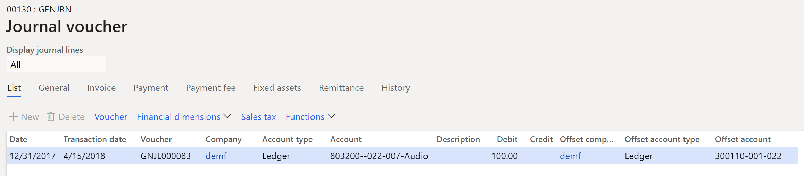
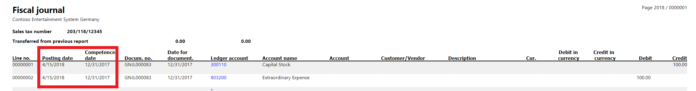
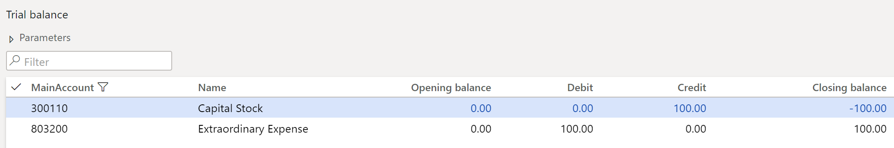

# Competence date for transactions in Italy

This article provides information about the competence date and explains how to turn on the functionality for transactions in Italy.

In Italy, companies must use a posting date when they post transactions. The posting date in the fiscal journal is the date when the company acknowledges the transaction.

Usually, adjustment and closing transactions occur on the date when the balance sheet is approved by the Board of Directors. However, they can also be completed several months after the last day of the fiscal year. These transactions must be reported in the Italian fiscal journal on the posting date, which must be the same as the acknowledgment date. However, the transactions must have a reference to their competence date, which represents the date when the transaction affects the balance amount.

## Turn on the competence date functionality

1.  Go to **General ledger** > **Ledger setup** > **General ledger parameters**.
2.  On the **General ledger parameters** page, on the **Ledger** tab, set the **Transaction date reference to competence date** option to **Yes**.

    After the competence date functionality is turned on, you can specify **Transaction date** as an acknowledgment date for each journal that can be used to post the adjustment and closing transactions for the fiscal year:

    -   General journal (**General ledger** > **Journal entries** > **General journals**)
    -   Fixed assets journal (**Fixed assets** > **Journal entries** > **Fixed assets journal**)
    -   Bank account reconciliation (**Cash and bank management** > **Bank accounts** > **Bank accounts** > **Reconcile** > **Account reconciliation**)
    -   Closing period adjustments (**General ledger** > **Period close** > **Closing period adjustments**)
    -   Year-end close (**General ledger** > **Period close** > **Year end close** > **Run fiscal close**)
    -   Project – Post costs (**Project management and accounting** > **Periodic** > **Time and Material** > **Post Costs** > **Post**)
    -   Project – Accrue revenue (**Project management and accounting** > **Periodic** > **Time and material** > **Accrue revenue**)
    -   Project – Estimate post (**Project management and accounting** > **Periodic** > **Estimates** > **Post estimates**)
    -   Project – Estimate reverse (**Project management and accounting** > **Periodic** > **Estimates** > **Reverse estimates**)

## Example

The company's fiscal year is from January 1 through December 31. The balance sheet is approved on April 15. Therefore, adjustment and closing transactions are reported in the Italian fiscal journal in April, but they affect the balance on December 31.

1. Go to **General ledger** > **Journal entries** > **General journals**.
2. On the **General journal** page, in the **Date** field, specify December 31.
3. In the **Transaction date** field, specify April 15.
4. Post the transaction.

    

5. Go to **General ledger** > **Inquiries and reports** > **Fiscal journal**, and run the report. The transaction is reported on the fiscal journal line. The **Posting date** field is set to April15, and the **Competence date** field is set to December 31.

    

6. Go to **General ledger**> **Inquiries and reports** > **Trial balance**, and run the report.

    

7. Go to **General ledger** > **Inquiries and reports** > **Voucher transactions**.
8. On the **Voucher transactions** page, add the **Transaction date** column.
9. Verify that the **Date** field is set to December 31, and the **Transaction date** field is set to April 15.

[!INCLUDE[footer-include](../../includes/footer-banner.md)]

