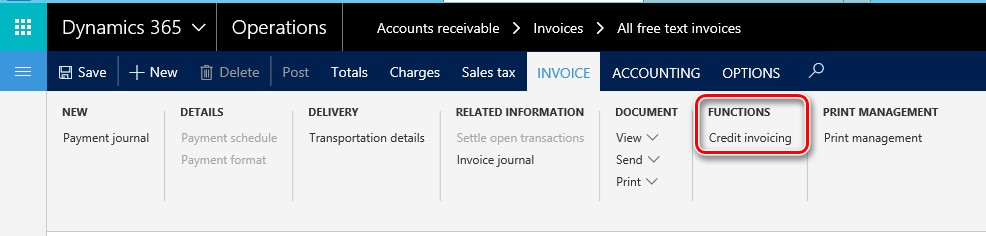
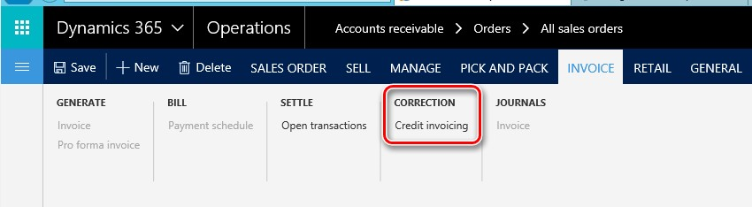
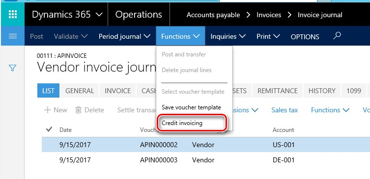
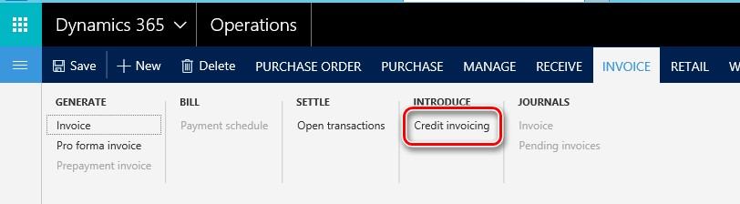

---
# required metadata

title: Credit invoicing (Italy)
description: This topic explains how to set up and use the credit invoicing functionality in Italy. 
author: liza-golub
ms.date: 09/15/2021
ms.topic: article
ms.prod: 
ms.technology: 

# optional metadata

ms.search.form: TaxYearlyCom_IT, TaxAuthority, TaxPeriod
audience: Application User
# ms.devlang: 
ms.reviewer: kfend
# ms.tgt_pltfrm: 
ms.custom: 269664
ms.assetid: af07d122-5694-4de6-96bf-7bf5478b0175
ms.search.region: Italy
# ms.search.industry: 
ms.author: elgolu
ms.search.validFrom: 2019-09-17
ms.dyn365.ops.version: Version 1611

---

# Credit invoicing (Italy)

[!include [banner](../includes/banner.md)]

## Activate credit invoicing

To activate the credit invoicing functionality complete the following steps.

1. Go to **Accounts payable** > **Setup** > **Parameters**, and on the **Updates** tab, select the **Credit invoicing** check box.
2. Go to **Accounts receivable** > **Setup** > **Parameters**, and on the **Updates** tab, select the **Credit invoicing** check box.

## Find the Credit invoicing button

1. Go to **General ledger** > **Journal entries** > **General journal** and select **Lines**.
2. On the Action Pane, select **Functions** \> **Credit invoicing**.

    

3. Go to **Accounts receivable** > **Invoices** > **All free text invoices**.
4. On the Action Pane, on the **Invoice** tab, in the **Functions** group, select **Credit invoicing**.

   

5. Go to **Accounts receivable** > **Orders** > **All sales orders**.
6. On the Action Pane, on the **Invoice** tab, in the **Correction** group, select **Credit invoicing**.

    

7. Go to **Accounts payable** > **Invoices** > **Invoice journal**.
8. Select **Lines**, and  on the Action Pane, select **Functions** > **Credit invoicing**.

   

9. Go to **Accounts payable** > **Purchase orders** > **All purchase orders**.
10. On the Action Pane, on the **Invoice** tab, in the **Introduce** group, select **Credit invoicing**.

   

[!INCLUDE[footer-include](../../includes/footer-banner.md)]
