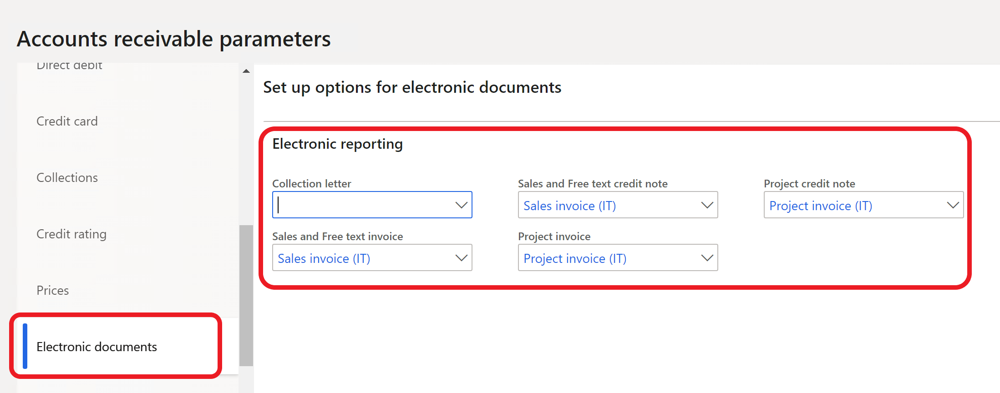
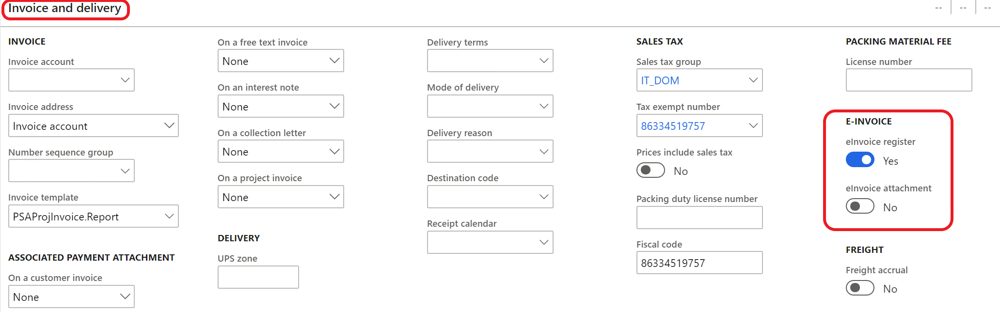
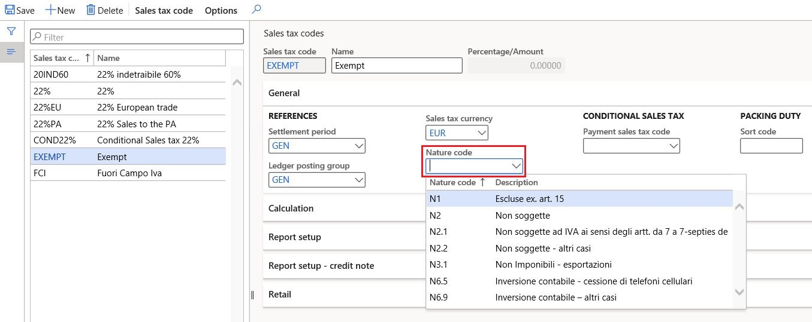
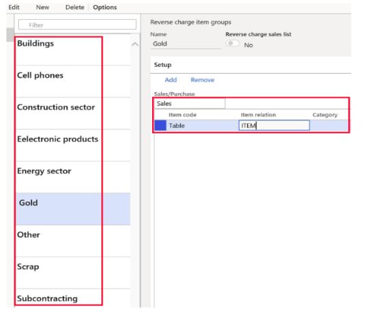
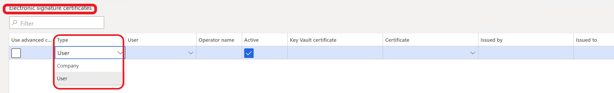
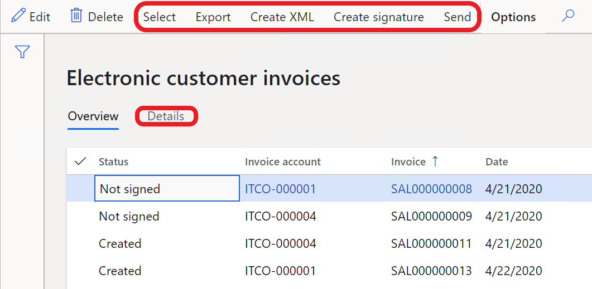

# Customer electronic invoices

[!include [banner](../includes/banner.md)]

This article describes how to set up and work with the functionality for creating and sending sales invoices and project invoices in an electronic format (FatturaPA).

As of version 1.2 of the FatturaPA format, electronic invoices can be used for all types of businesses. These types include public administrations, private companies, and professionals.

## Prerequisites

The primary address of the legal entity must be in Italy.

This article contains the following information:

- [Setup information](#setup)
- [Maintaining related base documents](#relateddoc)
- [Overview of the Electronic invoice register](#einvoiceregister)
- [Additional functionality that affects the XML file](#additionalfunctionality)

## Setup

Before you can begin to work with the electronic invoice functionality, the following data must be set up:

- [Accounts receivable parameters](#arparameters)
- [Electronic invoice currency](#electronicinvoicecurrency)
- [Electronic invoice parameters](#einvoicesparameters)
- [Electronic document properties](#edproperties)
- [Customers](#customers)
- [Items](#items)
- [Natura codes](#natura)
- [Invoice types](#invoicetypes)
- [Digital certificates](#digitalcert)
- [Optional: Destination for XML file output](#destination)

### Accounts receivable parameters

Select the configurations that are used to create electronic invoice XML files for sales and free text invoices, sales and free text credit notes, project invoices, and project credit notes. You can find these configurations on the **Electronic document** tab of the **Accounts receivable parameters** page (**Accounts receivable** \> **Setup** \> **Accounts receivable parameters**).

> [!NOTE]
> The configurations must be imported before they can be selected. For more information, see [Download ER configurations from the Global repository of Configuration service](../../fin-ops-core/dev-itpro/analytics/er-download-configurations-global-repo.md).

### Electronic invoice currency

To report invoices in the euro (EUR) currency in an XML file, set the **Print amount in currency representing the euro** option to **Yes** on the **General** FastTab of the **Form setup** page in Accounts receivable (**Accounts receivable** \> **Setup** \> **Form setup**) and/or in Project management and accounting (**Project management and accounting** \> **Setup** \> **Form setup**).

> [!NOTE] 
> If the **Print amount in currency representing the euro** option is set to **No**, a related XML file will be generated in the original invoice currency. 

To use this functionality, import the following Electronic reporting (ER) configurations, or later version of them, from Shared asset library in Microsoft Dynamics Lifecycle Services (LCS):

- Invoice model.version.231
- Invoice model mapping.version.231.164
- Sales invoice (IT).version.231.91
- Project invoice (IT).version.231.90

### Electronic invoice parameters

You must set electronic invoice parameters to specify business scenarios and company-specific information.

1. Go to **Accounts receivable** \> **Setup** \> **Electronic invoice parameters**.
2. On the **General** tab, specify the electronic signature requirement.
3. On the **Company information** tab, specify the company information and tax representative, as required. This information overrides the information in the legal entity record.
4. On the **Art. 2250 Civil code registration** tab, provide any required information if the company is registered under the terms of Article 2250 of the Italian Civil Code.
5. On the **Number sequences** tab, fill in number sequences for the **eInvoice unique file number** and **eInvoice transmission number** references.

### Electronic document properties

The functionality for electronic document properties is used to set up the output to XML document blocks for different business cases. Here are some examples:

- A value-added tax (VAT) registration number for customers who aren't in the European Union (EU) and don't have VAT registration codes
- A certified email address (posta elettronica certificata \[PEC\]) for private companies or professionals
- A stamp duty (payable and not payable by the customer)
- Data about a customer's representative

For the functionality to work, the following data must be set up:

- Electronic document property types (**Accounts receivable** \> **Setup** \> **Electronic document property types**) and the table that each document property type is applicable to. For electronic invoice functionality, the **Customers** and **Legal entities** tables are used.

    

- Required values in the specified tables at the customer and legal entity levels:

    - **Customer:** Go to **Accounts receivable** \> **Customers** \> **All customers**, and then, on the Action Pane, on the **Customer** tab, select **Electronic document properties**.
    - **Legal entity:** Go to **Organization administration** \> **Organizations** \> **Legal entities**, and then, on the Action Pane, select **Electronic document properties**.

The specified values are used for output to the XML file blocks. The following table provides information about how and where those values are used.

| Business scenario | Electronic document property type | Electronic document property type description | Applicability (table) | Where to use the values | Element in the XML file |
|-------------------|-----------------------------------|-----------------------------------------------|-----------------------|--------------|-------------------------|
| Customers who are outside the EU and don't have VAT registration codes. For these customers, the VAT registration number should be **00000000000**. | VATnonEU | Example: **Customer, non-EU VAT number** | **CustTable** (Customers) | In customer electronic document properties, set the **Value** field to **00000000000**. | **IdCodice** (**CessionarioCommittente\\DatiAnagrafici\\IdFiscaleIVA** block) |
| Certified email address (PEC) for private companies or professionals | PEC | Example: **Customer, Certified email address** | **CustTable** (Customers) | In customer electronic document properties, set the **Value** field to **\<PEC\>**. | **PECDestinatario** (**DatiTrasmissione** block) |
| Stamp duty that isn't included in the invoice total for sales invoices, and that is or isn't included for project invoices | Bollo
<strong>Note:</strong> This document property type is used for sales order invoices, free text invoices, and project invoices.
 | Example: **Stamp duty, included/not included into invoice totals** | **CompanyInfo** (Legal entities) | In legal entity electronic document properties, set the **Value** field to **\<Charge code/project category that is used for stamp duties\>**:<ul><li>**Charge code** – The debit type for this charge code should be **Ledger**.</li><li>**Project category** – This project category should be billable.</li></ul> | **ImportoBollo** (**DatiBollo** block) |
| Stamp duty that is included in the invoice total | BolloPay
<strong>Note:</strong> This document property type is used only for sales order invoices and free text invoices.
 | Example: **Stamp duty, included into invoice totals** | **CompanyInfo** (Legal entities) | In legal entity electronic document properties, set the **Value** field to **\<Charge code/project category that is used for stamp duties\>**:<ul><li>**Charge code** – The debit type should be **Customer/Vendor**.</li></ul> | **ImportoBollo** (**DatiBollo** block) |
| Representative | TaxRepPaese, TaxRepCodice, TaxRepDenominazione, TaxRepNome, TaxRepCognome | Any description | **CustTable** (Customers) | In customer electronic document properties, set the **Value** field to **IT** for the **TaxRepPaese** document property type. For other types, fill in data for the representative. | **Cognome** (**RappresentanteFiscale** block) |
| Invoice types | DocumentType | Example: **Invoice, document type** | **CustInvoiceJour** (Customer invoice journal), **ProjInvoiceJour** (Project invoice) | Go to **Accounts receivable \> Inquiries and reports \> Invoices \> Invoice journal** or **Project management and accounting \> Project invoices \> Project invoices**, and set the **Value** field to a document type, such as **TD16**. | **TipoDocumento** (**DatiGeneraliDocumento** block) |

> [!NOTE]
> The preceding table uses the following shorthand:
>
> - "Customer electronic document properties" refers to the **Electronic document properties** page that is opened by selecting **Electronic document properties** on the **Customer** tab on the Action Pane of the **All customers** page (**Accounts receivable \> Customers \> All customers**).
> - "Legal entity electronic document properties" refers the **Electronic document properties** page that is opened by selecting **Electronic document properties** on the Action Pane of the **Legal entities** page (**Organization administration \> Organizations \> Legal entities**).
>
> On the **Electronic document property types** list page, the **Description** field is automatically filled in when a user enters information in the **Group description** and **Description** fields.
>
> The electronic document property type must have the same code that is specified in the table.

#### Use project categories for stamp duty

Go to **Project management and accounting** \> **Setup** \> **Categories** \> **Project categories** to set up project categories that have a transaction type of **Fee** or **Expense**. The category ID should equal the value that is defined for the **Bollo** document property type at the legal entity level. For more information, see the previous table.

The project category of the **Fee** transaction type can be used only for stamp duty that is included in the invoice. The project category of the **Expense** transaction type can be used for both stamp duty that is included in a customer invoice and stamp duty that isn't included. In both cases, the **Bollo** document property type is used.

When you create **Fee** or **Expense** journal lines, select the category that was defined for stamp duty, and enter a cost price. The system considers this cost price the stamp duty amount. If you enter a sales price that equals the cost price amount, the system considers this amount included in invoice totals. The sales price amount equals 0 (zero), and the transaction isn't included in invoice totals.

> [!NOTE]
> You can use only one of the journal types (**Fee** or **Expense**) for stamp duty. A company that uses only payable stamp duty can use the **Fee** journal type. If a company uses both payable and non-payable stamp duty, it's better to use the **Expense** journal type.

### Customers

#### Authority office field

You can find the **Authority office** field on the **Sales demographics** FastTab of a customer record (go to **Accounts receivable** \> **Customers** \> **All customers**, and open the customer record in **Edit** mode).

The value of this field is used to define the type of communication (business-to-government \[B2G\] or business-to-business \[B2B\]):

- If the length of the value is 6, the customer is considered a public administration (the transmission format equals **FPA12**).
- If the length of the value is 7, the customer is considered a private company or professional (the transmission format equals **FPR12**).

In both cases, the system enters the value of this field in the **CodiceDestinatario** tag in the XML file.

If the **Authority office** field is blank, the system considers the customer a private company or professional (the transmission format equals **FPR12**), and enters **0000000** in the **CodiceDestinatario** tag in the XML file. In this case, a certified email address (PEC) should be set up. For more information, see the table in the [Electronic documents properties](#edproperties) section earlier in this article.

#### Activate automatic creation of electronic invoices

Go to **Accounts receivable** \> **Customers** \> **All customers**, and open a customer record in **Edit** mode. Then, on the **Invoice and delivery** FastTab, in the **E-invoice** section, find the **eInvoice register** option. If this option is set to **Yes**, the system automatically creates the record on the **Electronic customer invoices** list page. For more information, see the [Electronic invoice register](#einvoiceregister) section later in this article.

In the **E-invoice** section, you can also set the **eInvoice attachment** option to **Yes**. In this case, after you print an invoice (either during or after posting), the system automatically attaches the PDF file to the invoice and electronic invoice (see the [Electronic invoice register](#einvoiceregister) section), and the file is included in the XML file (**Allegati** block).

### Items

If there are product lines on an invoice, the **CodiceArticolo** block is filled in based on product data. This data includes the product bar code, the internal product number or item number, and the external item description. This information can be found by selecting options in the **Related information** group on the **Sell** tab on the Action Pane of the **Released products** page (**Product information management** \> **Products** \> **Released products**).

The **CodiceTipo** field is set according to the following rules:

- If there is a bar code, this field is set to **EAN**.
- If there isn't a bar code, and the record on the **External item description** page exists for the product and the customer, this field is set to the value from the **Description** field.
- If there isn't a bar code, and the record on the **External item description** page doesn't exist for the product, this field is set to the **Codice Art. fornitore** text.

The **CodiceValore** field is set according to the following rules:

- If there is a bar code, this field is set to the bar code.
- If there isn't a bar code, and the record on the **External item description** page exists for the product and the customer, this field is set to the value from **External item number** field.
- If there isn't a bar code, and the record on the **External item description** page doesn't exist for the product and customer, this field is set to the value from the **Item number** field.

### Natura codes

You can manually associate Natura codes with related sales tax codes, or you can let the system automatically determine the appropriate Natura codes for transactions. Manually associated Natura codes have higher priority than automatically determined Natura codes and will override them.

Follow these steps to define Natura codes and manually associate them with sales tax codes.

1. Go to **Tax** \> **Setup** \> **Sales tax** \> **Nature codes**.
2. Create a record.
3. In the **Nature code** field, enter a valid Natura code.
4. In the **Description** field, enter an explanation of what the code is used for.
5. Repeat steps 2 through 4 to create as many additional Natura codes as you require to cover all related business operations.
6. Go to **Tax** \> **Indirect taxes** \> **Sales tax** \> **Sales tax codes**, and select a required sales tax code.
7. On the **General** FastTab, in the **Nature code** field, select one of the Natura codes that you just created.

### Reverse charge groups

Reverse charge groups are required when a company uses the reverse charge functionality. They are used to automatically determine the Natura codes that are specific to reverse charge operations.

To define specific reverse charge groups for specific products or categories, go to **Tax** \> **Setup** \> **Reverse charge item groups**.

Additionally, you should set up application-specific parameters that use these reverse charge groups.

For more information about this functionality, see the "Reverse charge configuration" section in [A country-specific hotfix to support changes in "FatturaPA" format of Italian electronic invoices in Microsoft Dynamics 365 Finance](https://support.microsoft.com/help/4569342/a-country-specific-hotfix-to-support-changes-in-fatturapa-format-of-it).

### Automatically assigned Natura codes

The system automatically assigns the following Natura codes, depending on the operation.

| Code    | Description | Required configuration |
|---------|-------------|------------------------|
| N1      | Excluded pursuant to Art. 15 | The sales tax code's **VAT type** field is set to **Exempt**, and the sales tax code is associated with the exempt code that is marked as **Exempt Art.15** in the **Exempt reason** field. |
| N2.2    | Not subject to VAT - other cases | The sales tax code's **VAT type** field is set to **Not subject to VAT**.|
| N3.1    | Non-Taxable - exports | The sales tax code's **VAT type** field is set to **Zero**, and the customer's address is outside the EU.|
| N3.2    | Non-Taxable - intra-community transfers | The sales tax code's **VAT type** field is set to **Zero**, and the customer's address is in the EU.|
| N3.3    | Non-Taxable - sales to San Marino | The sales tax code's **VAT type** field is set to **Zero**, and the customer's address is in San Marino.|
| N3.5    | Non-Taxable - following declarations of intent | The sales tax code's **VAT type** field is set to **Zero**, and a valid intent letter is registered.|
| N3.6    | Non-Taxable - other cases | This code is the default value for all other cases where the sales tax code's **VAT type** field isn't set to **Standard**.|
| N4      | Exempt | The sales tax code's **VAT type** field is set to **Exempt**, and the sales tax code is associated with an exempt code that is marked as something other than **Exempt Art.15** or **Edge regime** in the **Exempt reason** field.|
| N5      | Margin scheme / VAT not shown on the invoice | The sales tax code's **VAT type** field is set to **Exempt**, and the sales tax code is associated with the exempt code that is marked as **Edge regime** in the **Exempt reason** field.|
| N6.1    | Reverse charge - transfer of scrap and other recycled materials | The sales tax code is marked as **Reverse charge**, and the related reverse charge group is associated with the **Scrap** value in the application-specific parameters.|
| N6.2    | Reverse charge - transfer of gold and pure silver | The sales tax code is marked as **Reverse charge**, and the related reverse charge group is associated with the **Gold** value in the application-specific parameters. |
| N6.3    | Reverse charge - subcontracting in the construction sector | The sales tax code is marked as **Reverse charge**, and the related reverse charge group is associated with the **Subcontracting** value in the application-specific parameters. |
| N6.4    | Reverse charge - sale of buildings | The sales tax code is marked as **Reverse charge**, and the related reverse charge group is associated with the **Buildings** value in the application-specific parameters. |
| N6.5    | Reverse charge - sale of cell phones | The sales tax code is marked as **Reverse charge**, and the related reverse charge group is associated with the **Cell phones** value in the application-specific parameters.|
| N6.6    | Reverse charge - sale of electronic products | The sales tax code is marked as **Reverse charge**, and the related reverse charge group is associated with the **Electronic products** value in the application-specific parameters.|
| N6.7    | Reverse charge - services for the construction sector and related sectors | The sales tax code is marked as **Construction sector**, and the related reverse charge group is associated with the **Scrap** value in the application-specific parameters.|
| N6.8    | Reverse charge - energy sector operations | The sales tax code is marked as **Reverse charge**, and the related reverse charge group is associated with the **Energy sector** value in the application-specific parameters.|
| N6.9    | Reverse charge - other cases | The sales tax code is marked as **Reverse charge**, and the related reverse charge group is associated with the **Other** value in the application-specific parameters.|
| N7      | VAT paid in another EU state | The sales tax code's **Country/region type** field is set to **EU**. |

### Invoice types

The following types of invoice documents are supported and will automatically be filled in:

- TD01 – Invoice
- TD04 – Credit note
- TD05 – Debit note
- TD20 – Self-invoice

If a required document type isn't listed, you can manually adjust the document type in the invoice journals. To enable manual adjustment, complete the following setup:

- Electronic document property definition
- Invoice document type registration

For more information, see the "Invoice types configuration" section in [A country-specific hotfix to support changes in "FatturaPA" format of Italian electronic invoices in Microsoft Dynamics 365 Finance](https://support.microsoft.com/help/4569342/a-country-specific-hotfix-to-support-changes-in-fatturapa-format-of-it).

### Digital certificates

To electronically sign electronic invoices by using a certificate of either the **Company** type or the **User** type, go to **Accounts receivable** \> **Setup** \> **Electronic signature certificates**.

The party that is issuing invoices must use a qualified signature certificate to sign each FatturaPA file that is transmitted to the exchange system (Sistema di Interscambio \[SdI\]). A qualified signature certificate can be obtained from one of the certifiers in the [list of authorized certifiers](http://www.digitpa.gov.it/firma-digitale/certificatori-accreditati).

Microsoft Dynamics 365 Finance supports the **XAdES-BES** signature format. To enable Finance to support FatturaPA, follow these steps.

1. On client computers, in the **Application server machine** field of the **Personal** node, install and configure digital certificates that have private and public keys.

    > [!NOTE]
    > You can complete the installation and configuration by using standard Windows functionality.

2. Define company-level certificates and user-level certificates, as required.

### Destination for XML file output

If XML files must be sent as output to a specific place when invoices are posted (for example, if they must be sent to a SharePoint folder), set up a document type, and then set up a destination. For more information about these steps, see [Configure document management](../../fin-ops-core/fin-ops/organization-administration/configure-document-management.md) and [Electronic reporting (ER) destinations](../../fin-ops-core/dev-itpro/analytics/electronic-reporting-destinations.md).

> [!NOTE]
> The **Print invoice** option must be set to **Yes**. If the destination is set up, the status of the electronic invoice record for the invoice is automatically set to **Sent**.

## Maintain related base documents

Companies can report additional information about some base documents that are related to invoices. This section describes how to enter additional data, such as the tender procedure identification code (Codice Identificativo di Gara \[CIG\]) and the unique project code (Codice Unico di Progetto \[CUP\]) that is managed by the Inter Ministerial Committee for Economic Planning.

Here are some examples:

- The **DatiOrdineAcquisto** block contains information that is related to the purchase order.
- The **DatiContratto** block contains information that is related to the contract.
- The **DatiConvenzione** block contains information that is related to the agreement.
- The **DatiRicezione** block contains information that is related to data about the reception phase. This data is present in the management system that is used by the PA (tax agencies).
- The **DatiFattureCollegate** block contains information that is related to invoices that were previously transmitted and that the current document is connected to. This block is used for cases where a credit note and/or invoice is forwarded in accordance with previous advance payment invoices.

To enable the system to enter information in these blocks, set the following fields:

- On the **Sales order** page (**Accounts receivable** \> **Orders** \> **All sales orders**), in the **Header** view, on the **Setup** FastTab, set the fields in the **Base document** section.
- On the **Free text invoice** page (**Accounts receivable** \> **Invoices** \> **All free text invoices**), in the **Header** view, on the **General** FastTab, set the fields in the **Base document** section.
- On the **Project proposal** page (**Project management and accounting** \> **Projects** \> **All projects**), on the Action Pane, on the **Manage** tab, in the **Bill** group, select **Invoice proposal**, and then set the fields in the **Base document** section.

> [!NOTE]
> As the following table shows, data from the fields in the **Base document** section is sent as output from different blocks, depending on the value of the **Base document** field.
> 
> | Value of the Base document field | Block that data is sent from |
> |---|---|
> | Payment order | DatiOrdineAcquisto |
> | Contract | DatiContratto |
> | Agreement | DatiConvenzione |
> | Management system | DatiRicezione |
> | Original invoice | DatiFattureCollegate |

For each base document, users can add details about the document number and date, tender procedure identification code (CIG), unique project code (CUP), and agreement code.

### Base documents for public sector companies

In Italy, there is a legal requirement that public sector companies provide traceability of tender procedures codes (CIG) and projects codes (CUP) during invoicing and payments. To provide traceability, additional control of CIG and CUP codes is implemented for public sector companies. For more information about this functionality, see [Italian localization - Payment traceability](emea-ita-payment-traceability.md).

## Electronic invoice register

To view all customer electronic invoices and perform various actions, go to **Accounts receivable** \> **Invoices** \> **E-Invoices** \> **Electronic invoices**.

On the **Electronic customer invoices** page, you can perform the following actions:

- Select **Select** to select invoices, based on various criteria. This function is useful if the **eInvoice register** option is set to **No**.
- Select **Create XML**, **Create signature**, and **Send** to create XML files and a digital signature for selected invoices, and send the invoices.
- Select **Export** to export a selected invoice to an XML file.

    > [!NOTE]
    > The system sends a file to the folder that is set up on your computer. The destination settings aren't used.

- Select the **Details** tab to view details of the electronic invoice.

> [!NOTE]
> The **Electronic invoices** page (**Project management and accounting** \> **Project invoices** \> **E-invoices** \> **Electronic invoices**) resembles the **Electronic customer invoices** page and has the same functions.

### Move electronic invoices XML files to attachments

Starting in Finance version **10.0.36**, you can move previously generated XML files of already existing electronic invoices to attachments and configure the system to automatically save the generated XML files of new electronic invoice as attachements. This functionality is available only for legal entities with the primary address in Italy or Spain.

To activate the capability to save XML files of electronic invoice as attachements, enable the **(Italy, Spain) Move electronic invoices XML file to attachments** feature in the [Feature management](../../fin-ops/get-started/feature-management/feature-management-overview.md#the-feature-management-workspace) workspace.

> [!NOTE]
> The process of moving previously generated XML files of existing electronic invoices to attachments automatically starts after you enable the feature. The electronic invoices are processed in batches of 10,000 records. The interval between batches is set to three hours. 

## Additional functionality that affects the XML file

### Tax invoice for goods delivered for free

For information about how to set up and work with this functionality, see [Tax invoice for goods delivered for free](emea-ita-exil-goods-for-free.md).

On the **Distribution** page (**Sales and marketing** \> **Setup** \> **Distribution**), if the **Reason for delivery** field is set to **Goods for free**, and the **Invoice account** field is blank, the **TipoCessionePrestazione** element is sent as output in the XML file.

### Intent letters – Invoicing of usual exporters

For information about how to set up and work with this functionality, see [Intent letters – Invoicing of usual exporters](emea-ita-exil-intent-letter.md).

If an intent letter is set up for a customer, the **Causale** element (**DatiGeneraliDocumento** block) that has the number of the intent letter is sent as output in the XML file.

[!INCLUDE[footer-include](../../includes/footer-banner.md)]
