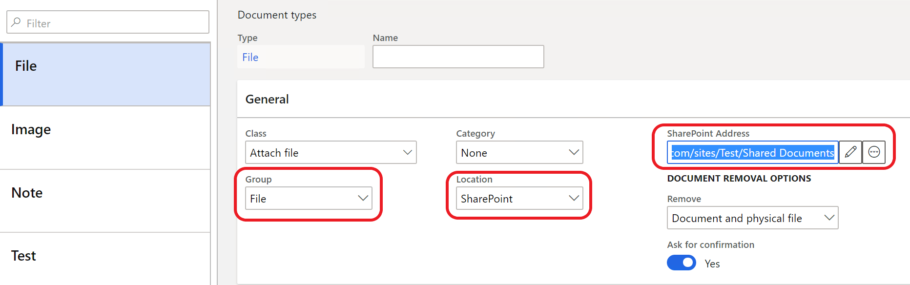
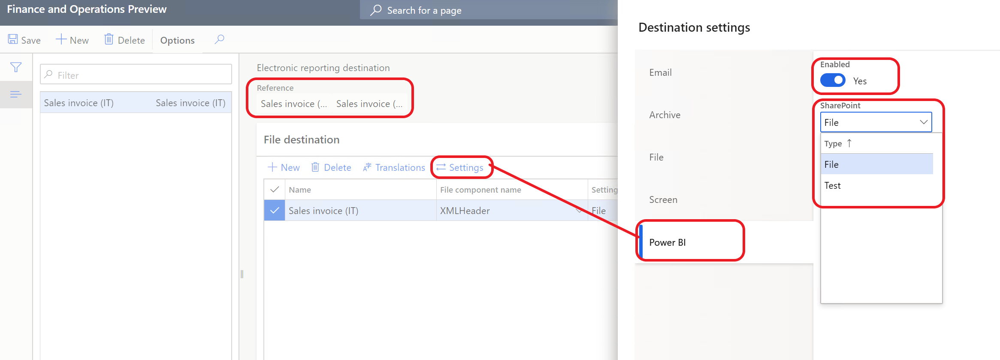

---
# required metadata

title: Customer electronic invoices
description: This topic provides information about customer electronic invoices management for Italy.
author: v-oloski
manager: 
ms.date: 04/24/2020
ms.topic: article
ms.: 
ms.service: dynamics-ax-applications
ms.technology: 

# optional metadata

# ms.search.form:
audience: Application User
# ms.devlang: 
ms.reviewer: 
ms.search.scope: Core, Operations
# ms.tgt_pltfrm: 
# ms.custom
ms.search.region: Italy
# ms.search.industry: 
ms.author: v-oloski
---

# Customer electronic invoices

[!include [banner](../includes/banner.md)]

This topic describes how to set up and work with the functionality for creation
and sending sales and project invoices in electronic format (FatturaPA).  
  
Effective June 6, 2014, the Italian Ministries, the Tax Authorities (Agenzia
delle Entrate, Agenzia del Demanio, Agenzia del Territorio, Agenzia delle
Dogane), and various national social security and welfare entities that are
listed by the Istituto Nazionale di Statistica (Istat) (for example, INARCASSA,
cassa forense, cassa geometri, cassa del notariato) will no longer be entitled
to accept paper invoices. Additionally, three months after the June 6 date,
these same groups will no longer process payments (even partly) until an invoice
is submitted in electronic format.

In addition the format for electronic invoices "FatturaPA" version 1.2 can be
used for all types of businesses, including public administrations and private
companies and professionals.  
Specifically, the invoices in question must be in .xml format, must be endorsed
by using a qualified or digital electronic signature, and must be transmitted
through an interchange data system or an authorized intermediary on the
following websites:

-   Italian: <http://www.fatturapa.gov.it/export/fatturazione/it/index.htm>

-   English: <http://www.fatturapa.gov.it/export/fatturazione/en/index.htm?l=en>

# Setup

Before starting work with the electronic invoice functionality, it is
necessary to fulfil the following settings:
- [Accounts receivable parameters](/accounts-receivable-parameters).
- [E-invoice parameters](/e-invoices-parameters).
- [Electronic documents properties](/electronic-document-properties)
- [Customers](/customers).
- [Digital certificate](/digital-certificates).
- [Destination for xml file output](/destination-for-xml-file-output) (optional)

## Accounts receivable parameters

Select the configurations which are used for creation electronic invoices xml
files for Sales and Free text invoices, Sales and Free text credit notes,
Project invoice, Project credit notes (**Accounts receivable \> Setup \>
Accounts receivable parameters**, **Electronic documents** tab).

 > [!NOTE] 
 > It is necessary to import the configurations before their selection.
 >   See [Download Electronic reporting configurations from Lifecycle Services](https://docs.microsoft.com/en-us/dynamics365/unified-operations/dev-itpro/analytics/download-electronic-reporting-configuration-lcs).

## E-Invoices parameters

**Accounts receivable \> Setup \> Electronic invoice parameters**)

Use these parameters to specify business scenarios and company specific information (**General**, **Company information** and **Art. 2250 Civil code registratio**n tabs).

On **Number sequences** tab fill in number sequences for e-invoice file number
and transmission number.

## Electronic document properties
Electronic document properties functionality are used for setup of different business cases: 
1. VAT registration number for customers who are out of EU and don't have VAT registration codes.  
2. Certified e-mail address (PEC) for private or professional companies.
3. Stamp duty (payable and not payble by customer).
2. Representative data

for the functionality to work it is necessary to set up:
1. **Document property types** (**Account receivable > Setup > Electronic document property types**) and to which table the document property type is aaplied. For the listed business cases the **Customers** and **Legal entities** tables are applied (**Applicability** button).
2. Required values in set up tables (on the level of the customer and the legal entity). Open **Accounts receivable \> Customers \> All customers, Customer** tab, **Properties** and **Organization administration > Organizations > Legal entities**, **Electronic document properties** button.

Set values are used for output in the xml file blocks (see the table bellow how to fiil and where these values are used).

| Business scenario | Electronic document property type | Electronic document property type description | Applicability (Table) | Where to use | Element in the xml file |
|-------------------|-----------------------------------|-----------------------------------------------|-----------------------|--------------|-------------------------|
| For customers who are out of EU and don't have VAT registration codes VAT registration number should be 00000000000 | **VATnonEU** | For example: Customer, non-EU VAT number|**CustTable** (Customers) | **Account receivable > Customers > All customers**, **Customer** tab, **Electronic document properties** button. Value=00000000000 |**IdCodice** (CessionarioCommittente\ DatiAnagrafici\ IdFiscaleIVA block) |
| Certified e-mail address (PEC) for private or professional company | **PEC** | For example: Customer, Certified e-mail address | **CustTable** (Customers) | **Account receivable > Customers > All customers**, **Customer** tab, **Electronic document properties** button. Value=</>      | **PECDestinatario** (DatiTrasmissione block) |
| Stamp duty not included into invoice total | **Bollo** Note. Used for sales order, free text and project invoices | For example:Stamp duty, not included into invoice totals | **CompanyInfo** (Legal entities) | **Organization administration > Legal entities**, **Electronic document properties** button Value=<Charge code/ Project category, which is used for stamp duties>. **Charges code**:Debit type for this charge code should be Ledger  **Project category**: should be billable | **ImportoBollo** (DatiBollo block) |
| Stamp duty included into invoice total | **BolloPay**. Note. Used only for sales order and free text invoices | For example: Stamp duty, included into invoice totals | **CompanyInfo** (Legal entities) | **Organization administration > Legal entities**, **Electronic document properties** button, Value=<Charge code/ Project category, which is used for stamp duties>. **Charges code**: Debit type should be Customer/ Vendor, **Project category**: should be billable | **ImportoBollo** (DatiBollo block) |
| Representative | TaxRepPaese, TaxRepPaese, TaxRepCodice, TaxRepDenominazione, TaxRepNome, TaxRepCognome | Any description | **CustTable** (Customers) | **Account receivable > Customers > All customers**, **Customer** tab, **Electronic document properties** button. Value=IT (for TaxRepPaese) For other types, fill in data of representative | **Cognome** (RappresentanteFiscale block) |
 

## Customers 

### Authority office 
**Accounts receivable \> Customers \> All customers**, open a customer in **Edit** mode**, Sales demographics** FastTab, **Authority office** field).

The system uses this field value for defining the type of communication (B2G or B2B). If the length of this value is 6 then the customer will be considered as public administration (Transmission Format is **FPA12**) and if the length of this value is 7 then this customer will be considered as private companies or professionals (Transmission Format is **FPR12**). 
In these both cases the system fills in the CodiceDestinatario tag (xml file) with this field value.

If **Authority office** field value is empty, the system considers a customer as a private company or professional (Transmission Format is **FPR12**) and fills in the CodiceDestinatario tag (xml file) with **0000000**.

In this case a certified e-mail address (**PEC**) should be entered on Customer level.
To do this:
-   Set up Electronic document property types (**Accounts receivable \> Setup \> Electronic document property types**).

> [!NOTE]  
> The **Description** field (left) is filled in automatically when a user is filling **Group description** and **Description** (right) fields.

Use **Applicability** button and fill in CustTable in the **Table name** field

- After this setting it is possible to fill in **Electronic document properties**
for a customer (**Accounts receivable \> Customers \> All customers, Customer**
tab, **Properties**). Fill in **Value** field. The system fills in the **PECDestinatario** tag with this value.
### Activate automatic creation of e-invoices  
**Accounts receivable \> Customers \> All customers,** open a customer in **Edit** mode**, Invoice and delivery** FastTab, **E-INVOICE** field group, **eInvoice registe** option.
If this option is set to **Yes**, the system automatically creates the record in **Electronic customer invoices** page list (see [Overview of electronic invoices page](/overview-of-electronic-invoices-page).

## Digital Certificates

Open **Accounts receivable \> Setup \> Electronic invoice digital certificates**
This functionality can perform electronic singing of e-Invoices by using either **Company** certificate or **User** certificate.

Each [FatturaPA file](http://www.fatturapa.gov.it/export/fatturazione/en/b-2.htm) that is transmitted to the [Exchange System](http://www.fatturapa.gov.it/export/fatturazione/en/sdi.htm) must be signed by using a qualified signature certificate by the party that is issuing the invoice.  
A qualified signature certificate may be obtained from one of the certifiers in the [list of authorized certifiers](http://www.digitpa.gov.it/firma-digitale/certificatori-accreditati).  
  
The current release supports the **XAdES-BES** signature format.  
To be able to support FatturaPA you must perform the following steps:

-   Install and configure digital certificates that have private and public keys
    in Certificate Server to the **Personal** node on client computers.  
      
  > [!NOTE] 
  > You can do this by using standard Windows functionality.

-   Define Company-level certificates and User-level certificates, as required.

## Destination for xml file output

If it is necessary to output xml files to specified place (for example, SharePoint folder) when invoices are posting (**Print invoice** option must be set to **Yes**), first set up a document type (**Organization administration \> Document management \> Document types**) and then set up a destination (**Organization administration \> Electronic reporting \> Electronic reporting destination**) (see setting details under the links [Configure document management](https://docs.microsoft.com/en-us/dynamics365/fin-ops-core/fin-ops/organization-administration/configure-document-management) and [Electronic reporting (ER) destinations](https://docs.microsoft.com/en-us/dynamics365/fin-ops-core/dev-itpro/analytics/electronic-reporting-destinations)).

> [!NOTE] 
> **Print invoice** option must be set to **Yes** and if destination is set up the e-invoice record for this invoice  is set to **Sent** status automatically.(see **Overview of electronic invoices page**).

Example of setup:

- Document type:

- Destination for Sales invoice (IT) format:

## Overview of electronic invoices page 

To overview all customer e-invoices and fulfil different actions open **Electronic customer invoices** page list (**Accounts receivable \> Invoices \> E-invoices \> Electronic invoices**).

In this page list a user can:

-   Select invoice manually by different criteria (Select button). This function
    is useful if the **eInvoice register** option is not set to **Yes** in
    customers.

-   Create xml files, digital signature for selected invoices and send them

-   Export the selected invoice to xml file.
>[NOTE]
>The system outputs a file to the folder set up on your computer (doesn't use the destination settings).   

-   Overview details of the electronic invoice.

> [!NOTE]  
> The similar page list with the same functions is in **Project management
and accounting \> Project invoices \> E-invoices \> Electronic invoices.**

 
