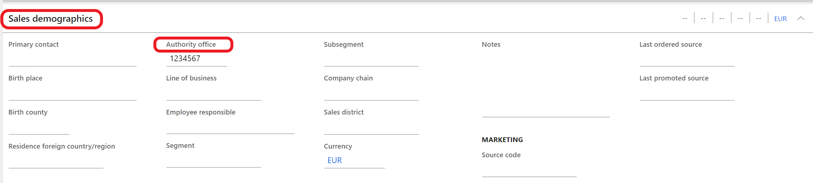

---
# required metadata

title: Customer electronic invoices
description: This topic provides information about management of customer electronic invoices for Italy.
author: v-oloski
manager: 
ms.date: 05/21/2020
ms.topic: article
ms.: 
ms.service: dynamics-ax-applications
ms.technology: 

# optional metadata

# ms.search.form:
audience: Application User
# ms.devlang: 
ms.reviewer: 
ms.search.scope: Core, Operations
# ms.tgt_pltfrm: 
# ms.custom
ms.search.region: Italy
# ms.search.industry: 
ms.author: v-oloski

---

# Customer electronic invoices

[!include [banner](../includes/banner.md)]

This topic describes how to set up and work with the functionality for creating and sending sales and project invoices in an electronic format (FatturaPA).

Version 1.2 of FatturaPA electronic invoices can be used for all types of businesses, including public administrations, private companies, and professionals. 

> [!NOTE] 
> The primary address of the legal entity must be in Italy.

This topic contains the following information:

- Setup information
- How to fill in data for output of a tender procedure identification code (Codice Identificativo di Gara \[CIG\]) and unique project code (Codice Unico di Progetto \[CUP\])
- Overview of the Electronic invoice register.

## Setup

Before you can begin to work with the electronic invoice functionality, the following data must be set up:

- [Accounts receivable parameters](#arparameters)
- [Electronic invoice parameters](#einvoicesparameters)
- [Electronic documents properties](#edproperties)
- [Customers](#customers)
- [Digital certificates](#digitalcert)
- Optional: [Destination for XML file output](#destination)

### Accounts receivable parameters

Select the configurations that are used to create electronic invoice XML files for sales and free text invoices, sales and free text credit notes,
project invoices, and project credit notes. You can find these configurations on the **Electronic document** tab of the **Accounts receivable parameters** page (**Accounts receivable \> Setup \> Accounts receivable parameters**).

> [!NOTE] 
> The configurations must be imported before they can be selected. For more information, see [Download Electronic reporting configurations from Lifecycle Services](../../dev-itpro/analytics/download-electronic-reporting-configuration-lcs.md).

### Electronic invoice parameters

Use these parameters to specify business scenarios and company-specific information. 

1. Go to **Accounts receivable \> Setup \> Electronic invoice parameters**.
2. On the **General** tab, specify the electronic signature requirement.
3. On the **Company information** tab, specify the company information and tax representative, as required. This information overrides the information in the legal entity record.
4. On the **Art. 2250 Civil code registration** tab, provide any required information if the company is registered under the terms of Article 2250 of the Italian Civil Code.
5. On the **Number sequences** tab, fill in number sequences for the **eInvoice unique file number** and **eInvoice transmission number** references.

### Electronic document properties

Electronic document properties functionality is used to set the output to XML document blocks for different business cases. Here are some examples: 

- A value-added tax (VAT) registration number for customers who aren't in the European Union (EU) and don't have VAT registration codes
- A certified email address (posta elettronica certificata \[PEC\]) for private companies or professionals
- A stamp duty (payable and not payable by the customer)
- Data about a customer's representative 

For the functionality to work, the following data must be set up:

- Electronic document property types (**Accounts receivable \> Setup \> Electronic document property types**) and the table that each document property type is applicable to. For electronic invoice functionality, the **Customers** and **Legal entities** tables are used.

    

- Required values in the specified tables at the customer and legal entity levels:

    - **Customer:** Go to **Accounts receivable \> Customers \> All customers**, and then, on the Action Pane, on the **Customer** tab, select **Electronic document properties**.
    - **Legal entity:** Go to **Organization administration \> Organizations \> Legal entities**, and then, on the Action Pane, select **Electronic document properties**.

The specified values are used for output to the XML file blocks. The following table provides information about how and where those values are used.

| Business scenario | Electronic document property type | Electronic document property type description | Applicability (table) | Where to use the values | Element in the XML file |
|-------------------|-----------------------------------|-----------------------------------------------|-----------------------|--------------|-------------------------|
| Customers who are outside the EU and don't have VAT registration codes. For these customers, the VAT registration number should be **00000000000**. | VATnonEU | Example: **Customer, non-EU VAT number** | **CustTable** (Customers) | In customer electronic document properties, set the **Value** field to **00000000000**. | **IdCodice** (**CessionarioCommittente\\DatiAnagrafici\\IdFiscaleIVA** block) |
| Certified email address (PEC) for private companies or professionals | PEC | Example: **Customer, Certified e-mail address** | **CustTable** (Customers) | In customer electronic document properties, set the **Value** field to **\<PEC\>**. | **PECDestinatario** (**DatiTrasmissione** block) |
| Stamp duty that isn't included in the invoice total for sales invoices, and is or isn't included for project invoices | Bollo
<strong>Note:</strong> This document property type is used for sales order invoices, free text invoices, and project invoices.
 | Example: **Stamp duty, included/not included into invoice totals** | **CompanyInfo** (Legal entities) | In legal entity electronic document properties, set the **Value** field to **\<Charge code/Project category that is used for stamp duties\>**:<ul><li>**Charge code** – The debit type for this charge code should be **Ledger**.</li><li>**Project category** – This project category should be billable.</li></ul> | **ImportoBollo** (**DatiBollo** block) |
| Stamp duty that is included in the invoice total | BolloPay
<strong>Note:</strong> This document property type is used only for sales order invoices and free text invoices.
 | Example: **Stamp duty, included into invoice totals** | **CompanyInfo** (Legal entities) | In legal entity electronic document properties, set the **Value** field to **\<Charge code/Project category that is used for stamp duties\>**:<ul><li>**Charge code** – The debit type should be **Customer/Vendor**.</li></ul> | **ImportoBollo** (**DatiBollo** block) |
| Representative | TaxRepPaese, TaxRepCodice, TaxRepDenominazione, TaxRepNome, TaxRepCognome | Any description | **CustTable** (Customers) | In customer electronic document properties, set the **Value** field to **IT** for the **TaxRepPaese** document property type. For other types, fill in data of the representative. | **Cognome** (**RappresentanteFiscale** block) |

> [!NOTE] 
> The preceding table uses the following shorthand:
>
> - "Customer electronic document properties" refers to the **Electronic document properties** page that is opened by selecting **Electronic document properties** on the **Customer** tab on the Action Pane of the **All customers** page (**Accounts receivable \> Customers \> All customers**).
> - "Legal entity electronic document properties" refers the **Electronic document properties** page that is opened by selecting **Electronic document properties** on the Action Pane of the **Legal entities** page (**Organization administration \> Organizations \> Legal entities**).
> 
> On the **Electronic document property types** list page, the **Description** field is automatically filled in when a user enters information in the **Group description** and **Description** fields.
>
> The electronic document property type must have the same code that is specified in the table.

#### Use project categories for stamp duty

Go to **Project management and accounting \> Setup \> Categories \> Project categories** to set up project categories that have a **Fee** or **Expense** transaction type. The category ID should equal the value that is defined for **Bollo** at the legal entity level. For more information, see the previous table.

The project category of the **Fee** transaction type can be used only for stamp duty that is included in the invoice. The project category of the **Expense** transaction type can be used both for stamp duty that is included and isn't included in a customer invoice. In both cases, the **Bollo** document property type is used.

When you create **Fee** or **Expense** journal lines, select the category that was defined for stamp duty, and enter a cost price. The system considers this cost price the stamp duty amount. 'If you enter a sales price that equals the cost price amount, the system considers this amount included in invoice totals. The sales price amount equals 0 (zero), and the transaction isn't included in invoice totals. 

> [!NOTE]
> You can use only one of the journal types (**Fee** or **Expense**) for stamp duty. A company that uses only payable stamp duty can use the **Fee** journal type. If a company uses both payable and non-payable stamp duty, it's better to use the **Expense** journal type.

### Customers 

#### Authority office field

You can find the **Authority office** field on the **Sales demographics** FastTab of a customer record (go to **Accounts receivable** \> **Customers** \> **All customers**, and open the customer record in **Edit** mode).

The value of this field is used to define the type of communication (business to government \[B2G\] or business to business \[B2B\]):

- If the length of the value is 6, the customer is considered a public administration (the transmission format equals **FPA12**).
- If the length of the value is 7, the customer is considered a private company or professional (the transmission format equals **FPR12**).

In both cases, the system enters the value of this field in the **CodiceDestinatario** tag in the XML file.

If the **Authority office** field is blank, the system considers the customer a private company or professional (the transmission format equals **FPR12**) and enters **0000000** in the **CodiceDestinatario** tag in the XML file. In this case, a certified e-mail address (PEC) should be set up. For more information, see the table in the [Electronic document properties](/electronic-document-properties) section earlier in this topic.

#### Activate automatic creation of e-invoices

Go to **Accounts receivable** \> **Customers** \> **All customers**. Open a customer record in **Edit** mode, and then, on the **Invoice and delivery** FastTab, in the **E-invoice** section, find the **eInvoice register** option. If this option is set to **Yes**, the system automatically creates the record on the **Electronic customer invoices** list page. For more information, see [Overview of electronic invoices page](/overview-of-electronic-invoices-page).

### Digital certificates

Go to **Accounts receivable** \> **Setup** \> **Electronic signature certificates** to electronically sign electronic invoices by using a certificate of either the **Company** type or the **User** type.

Each [FatturaPA file](http://www.fatturapa.gov.it/export/fatturazione/en/b-2.htm) that is transmitted to the [Exchange System](http://www.fatturapa.gov.it/export/fatturazione/en/sdi.htm) must be signed by the party that is issuing the invoice, by using a qualified signature certificate.

A qualified signature certificate can be obtained from one of the certifiers in the [list of authorized certifiers](http://www.digitpa.gov.it/firma-digitale/certificatori-accreditati).

Microsoft Dynamics 365 Finance supports the **XAdES-BES** signature format. To enable Finance to support FatturaPA, follow these steps.

1. On client computers, install and configure digital certificates that have private and public keys in the **Application server machine** to the **Personal** node.

    > [!NOTE] 
    > You can complete the installation and configuration by using standard Windows functionality.

2. Define company-level certificates and user-level certificates, as required.

### Destination for XML file output

If XML files must be sent as output to a specific place when invoices are posted (for example, to a SharePoint folder), set up a document type, and then set up a destination. For more information about these steps, see [Configure document management](../../fin-ops-core/fin-ops/organization-administration/configure-document-management.md) and [Electronic reporting (ER) destinations](../../dev-itpro/analytics/electronic-reporting-destinations.md).

> [!NOTE] 
> The **Print invoice** option must be set to **Yes**. If the destination is set up, the status of the electronic invoice record for this invoice is automatically set to **Sent**.

## Fill in data for related documents

Companies can report additional information about some base documents that are related to invoices. Here are some examples: 

- The **DatiOrdineAcquisto** block contains information that is related to the purchase order. 
- The **DatiContratto** block contains information that is related to the contract. 
- The **DatiConvenzione** block contains information that is related to the agreement. 
- The **DatiRicezione** block contains information that is related to the data about the reception phase that is present in the management system that is used by the PA (tax agencies). 
- The **DatiFattureCollegate** block contains information that is related to invoices that were previously transmitted and that the present document is connected to. This block is used for cases where a credit note and/or invoice is forwarded pursuant to previous advance payment invoices.

To enable the system to enter information in these blocks, set the following fields:

- On the **Sales order** page (**Accounts receivable** \> **Orders** \> **All sales orders**), in the **Header** view, on the **Setup** FastTab, set the fields in the **Base document** section.
- On the **Free text invoice** page (**Accounts receivable** \> **Invoices** \> **All free text invoices**), in the **Header** view, on the **General** FastTab, set the fields in the **Base document** section.
- On the **Project proposal** page (**Project management and accounting** \> **Projects** \> **All projects**), on the Action Pane, on the **Manage** tab, in the **Bill** group, select **Invoice proposal**, and then set the fields in the **Base document** section.

> [!NOTE]
> Data from the fields in the **Base document** section is sent as output from different blocks, depending on the value of the **Base document** field.
> 
> | Value of the Base document field | Block that data is sent from |
> |---|---|
> | Payment order | DatiOrdineAcquisto |
> | Contract | DatiContratto |
> | Agreement | DatiConvenzione |
> | Management system | DatiRicezione |
> | Original invoice | DatiFattureCollegate

For each base document, users can add details about the document number and date, CUP (unique project code, which is managed by the Inter Ministerial Committee for Economic Planning), CIG (tender procedure identification code), and agreement code.

## Electronic invoice register 

To view all customer electronic invoices and perform various actions, go to **Accounts receivable** \> **Invoices** \> **E-Invoices** \> **Electronic invoices** to open the **Electronic customer invoices** page.

On this page, you can perform any of the following actions:

- Select **Select** to select invoices, based on various criteria. This function is useful if the **eInvoice register** option is set to **No**.
- Select **Create XML**, **Create signature**, and **Send** to create XML files and a digital signature for selected invoices, and send them.
- Select **Export** to export a selected invoice to an XML file.

    > [!NOTE]
    > The system sends a file to the folder that is set up on your computer. (The destination settings aren't used.)

- Select the **Details** tab to view details of the electronic invoice.

> [!NOTE]
> The **Electronic invoices** page (**Project management and accounting** \> **Project invoices** \> **E-invoices** \> **Electronic invoices**) resembles the **Electronic customer invoices** page and has the same functions.

