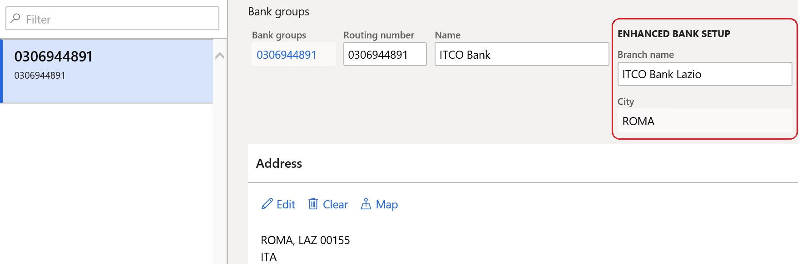

---
# required metadata

title: Bank data usability enhancement
description: This topic explains how you can help save time and simplify bank data registration for customers and vendors.
author: ilkond
ms.date: 11/12/2019
ms.topic: article
ms.prod: 
ms.technology: 

# optional metadata

ms.search.form: 
audience: Application User
# ms.devlang: 
ms.reviewer: kfend
# ms.tgt_pltfrm: 
# ms.custom: 
ms.search.region: Italy
# ms.search.industry: 
ms.author: ilyako
ms.search.validFrom: 2019-11-29
ms.dyn365.ops.version: 10.0.7

---

# Bank data usability enhancement

[!include [banner](../includes/banner.md)]

Companies often have to enter and maintain a large amount of banking information. The cost of entering incorrect bank information can be very high. To help save time and simplify bank data registration, you can import Italian bank information from reliable sources. In this way, you help reduce the risk of errors when bank data for customers and vendors is used.

## Prerequisites

Before you begin, the following prerequisites must be met:

- The primary address of the legal entity must be in Italy.
- The **Bank account setup enhancement** feature must be turned on in the **Feature management** workspace. For more information, see [Feature management overview](../../fin-ops-core/fin-ops/get-started/feature-management/feature-management-overview.md).

## Import bank groups

You can import the list of banks by using the **Bank groups** entity and the Data management framework. For more information, see [Data import and export jobs overview](../../fin-ops-core/dev-itpro/data-entities/data-import-export-job.md).

The source data that is used to import bank groups can be presented as a Microsoft Excel file that has the following column names:

- BANKGROUPID
- ADDRESSCITY
- ADDRESSCOUNTRY
- ADDRESSCOUNTY
- ADDRESSDESCRIPTION
- ADDRESSDISTRICTNAME
- ADDRESSLATITUDE
- ADDRESSLOCATIONID
- ADDRESSLONGITUDE
- ADDRESSSTATE
- ADDRESSSTREET
- ADDRESSTIMEZONE
- ADDRESSVALIDFROM
- ADDRESSVALIDTO
- ADDRESSZIPCODE
- NAME
- ROUTINGNUMBER
- ROUTINGNUMBERTYPE
- STATEMENTFORMATID
- SUFFIX
- BRANCHNAME\_IT

> [!NOTE]
> The **BANKGROUPID** value must match the **ROUTINGNUMBER** value.

## Use the enhanced list of bank groups

When the Bank account setup enhancement feature is turned on, two additional descriptive fields, **Branch name** and **City**, become available for bank groups.

During the setup of a bank account, the additional descriptive fields for bank groups are available and allow for more precise selection of a bank.

[!INCLUDE[footer-include](../../includes/footer-banner.md)]