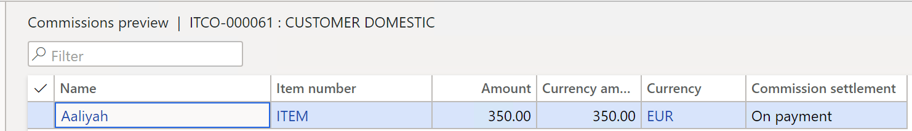

---
# required metadata

title: Commission settlement on payments
description: Commission settlement on payments.
author: ilkond
manager: AnnBe
ms.date: 03/09/2020
ms.topic: article
ms.prod: 
ms.service: dynamics-ax-applications
ms.technology: 

# optional metadata

ms.search.form: 
audience: Application User
# ms.devlang: 
ms.reviewer: kfend
ms.search.scope: Core, Operations
# ms.tgt_pltfrm: 
# ms.custom: 
ms.search.region: Italy
# ms.search.industry: 
ms.author: ilyako
ms.search.validFrom: 2020-06-01
ms.dyn365.ops.version: 10.0.10

---

# Commission settlement on payments

[!include [banner](../includes/banner.md)]

In Italy, it is common for companies to settle the commissions for their sales agents when customers pay the full balance of their invoices, not when the invoice is issued.

## Prerequisites
Before you can use commission settlement on payment functionality, the following prerequisites must be met:

- The primary address of the legal entity must be in Italy
- Enable the feature, **Commission settlement on payments** in the **Feature management** workspace. For more information, see [Feature management overview](../../fin-and-ops/get-started/feature-management/feature-management-overview.md).

## Set up commission settlement by default
1. Go to **Accounts receivable** \> **Setup** \> **Accounts receivable parameters**.
2. On the **Account receivable parameters** page, on the **Settlement** tab, on the **Other** FastTab, in the **Commission settlement** field, select the method that will be used when a sales order is created by default. 

 
 
The field **Commission settlement** has two values:

-	**On invoice**: Commissions are charged during the invoice process
-	**On payment**: Commissions are charged during the payment process

## Set up commission calculation
Additionally, you can set up the calculation of commissions for an **On payment** commission by navigating to **Sales and marketing** \> **Commissions** \> **Commission calculation**.

 
 
If the **Payment thresholds** is set to **Yes**, it is possible to specify two boundaries for commissions calculation:

-	If the reached commission amount (in percentage on the reachable amount) is below the lower threshold, no commissions are accrued.
-	When the upper bound is reached the whole reachable amount is accrued.
-	Within the two boundaries, commissions normally accrue.

### Example
Consider the following example.

-	Invoice total amount: 1000€ 
-	Lower limit: 10% 
-	Upper limit: 80% 

Payments include:

- 50€ (5%):  Because commissions are below the threshold of 10%, no accrual occurs.
- 100€ (10% of the total): The invoice is settled at 15%, so commissions accrue with that percentage.
- 500€ (other 50% of the total amount of the invoice): The invoice is settled at 65%. Commissions are also accrued at 65%.
- 200€ (20%): The invoice is settled ad 85%. As this is above the upper threshold, commissions become fully settled at 100%.
- Any further payment doesn’t change the accrued amount because it already reached the top, but accrual transactions are still created.

Another setup can be added to the single agent that belongs to a specific group. The setup of the employee has the priority in commission calculation as compared to the setup on sales.

## Set the commission settlement and preview commision transactions on the Sales order page

After a sales order is created, a user may update commission settlement on the sales order header by going to **Accounts receivable**\> **Orders**\> **All sales orders**.
2. Select and open a sales order.
On the **Sales order details** page, on the **Header** view, select the **Setup** FastTab. 

By default, the commision settlement value is inherited from the **Account receivable parameters** page. For more information, see [Set up commission settlement by default](emea-ita-exil-commission-settlement.md#Set-up-commission-settlement-by-default).

You can also preview the sales commission calculation from sales order either for open or invoiced orders. To do this, on the **General** tab, select **Related information** \> **Commission preview**.

> [!NOTE]
> A user can combine sales orders in single invoice iff all the sales orders for invoicing have the same **Commission settlement** value in the sales order header.

### Overview commission transactions on a sales order invoice
You can also view commission transactions on the **Invoice journal** page.

1. Go to **Accounts receivable** \> **Inquiries and reports** \> **Invoices** \> **Invoice journal**. 
2. On the **Invoice** tab, select **Details** \> **Commission transactions**.

> [!NOTE]
> When you post the invoice, the system creates commission and voucher transactions. If the value in the **Commission settlement** field is **On invoice** in the sales order header, the system creates a **Settlement** record. If the value in the **Commission settlement** field is **On payment** in sales order header, the **Settlement** record is created only after settling the invoice and a payment.  
