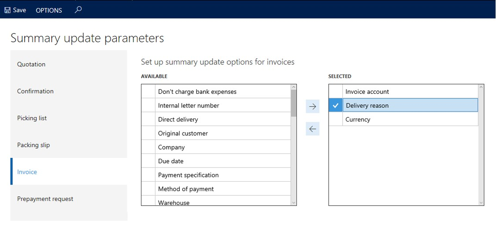
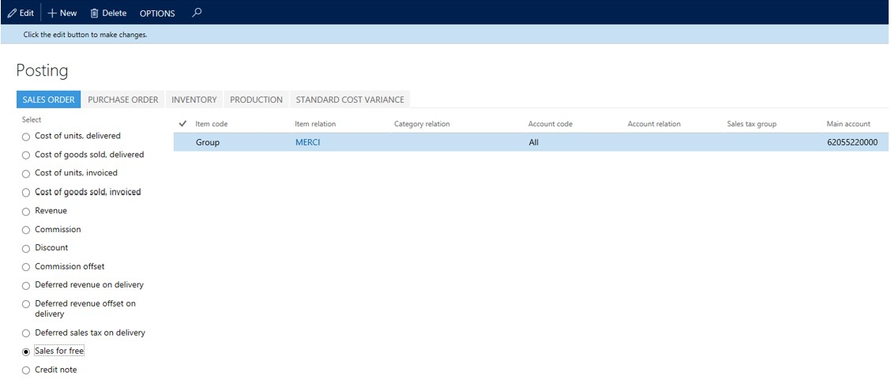
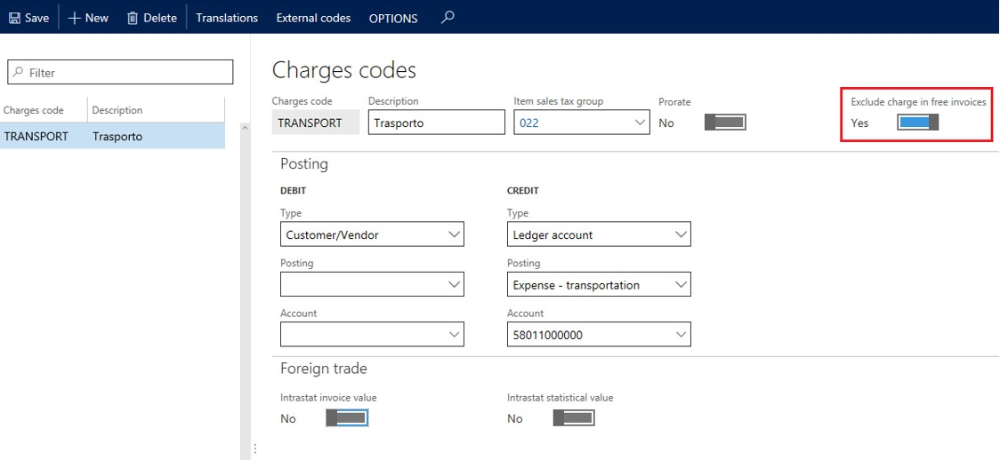
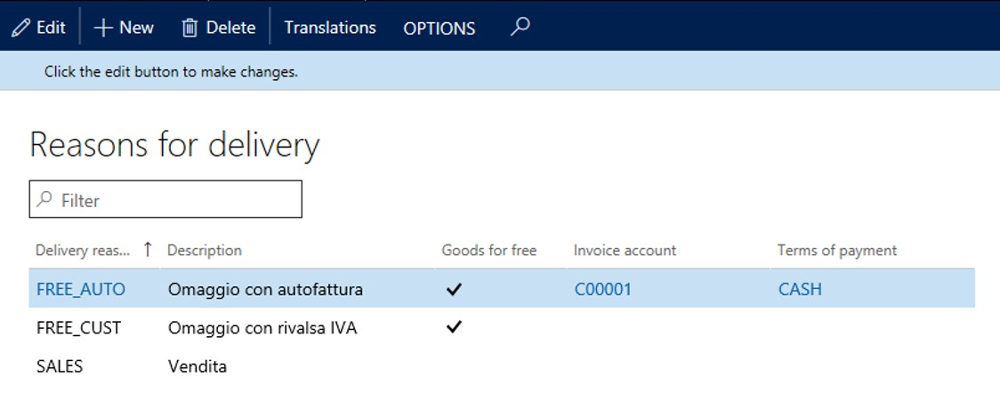
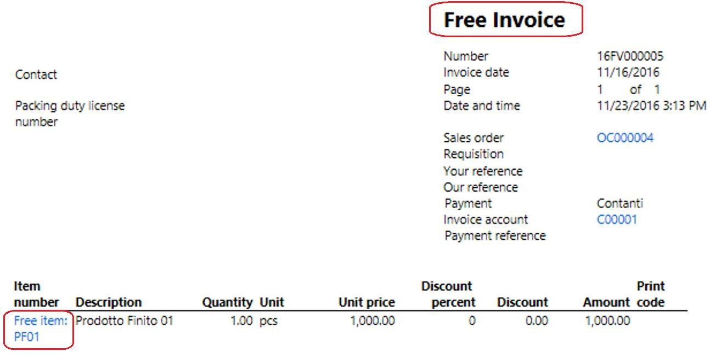

---
# required metadata

title: Tax invoice for goods delivered for free
description: This topic provides information about tax invoices for goods that were delivered for free.
author: ilkond
manager: AnnBe
ms.date: 12/18/2019
ms.topic: article
ms.prod: 
ms.service: dynamics-ax-applications
ms.technology: 

# optional metadata

ms.search.form: 
audience: Application User
# ms.devlang: 
ms.reviewer: kfend
ms.search.scope: Core, Operations
# ms.tgt_pltfrm: 
# ms.custom: 
ms.search.region: Italy
# ms.search.industry: 
ms.author: mrolecki
ms.search.validFrom: 2019-11-01
ms.dyn365.ops.version: 10.0.8

---

# Tax invoice for goods delivered for free

[!include [banner](../includes/banner.md)]

This topic describes how to manage goods that were delivered free of charge. This functionality makes it possible to generate invoices with the words "free invoice" and the total of invoice to be equal to the tax amount only. To do this, you must set up delivery reasons to be used in the sales order. There are two cases where this can happen depending on who pays the taxes on these items:

- When your company pays the sales tax, the system will generate a self-invoice and accounting entries for payment.
- The customer pays the sales tax. 

The **Delivery reason** on the invoice will determine which case you use.

## Prerequisites

- The primary address of the legal entity must be in Italy.
- In the **Feature management** workspace, enable the **Tax invoice for goods delivered for free** feature. For more information, see [Feature management overview](../../fin-and-ops/get-started/feature-management/feature-management-overview.md).

## Set up Summary update parameters
To set up the Summary update parameters, a delivery reason must be available for both the packing slip and the invoice.

1.	Go to **Accounts receivable** > **Setup** > **Accounts receivable parameters**.
2.	On the **Summary update** tab, select **Summary update parameters**.
3.	The  **Delivery reason** summary update parameter must be selected for packing slips and invoices. To do this, on the **Invoice** tab, use the right-arrow to move  **Delivery reason** to **Selected**. Repeat the same on the **Packing slip** tab.

## Set up Sales for free account
Complete the following steps to set up the accounting account for sales for free.

1. Go to **Inventory management** > **Setup** > **Posting** > **Posting**.
2. Select the radio button, **Sales for free**.
3. Set up the **Main account** by selecting the required relations and account codes.

## Set up Miscellaneous charges

Miscellaneous charges are not always needed or wanted when issuing free sales invoices. To exclude them when they are generated automatically, complete the following steps to enable the **Exclude charge in free invoice** parameter on the **Charge codes** page.

1. Go to **Accounts receivable** > **Charges setup** > **Charges code**.
2. Create or select an existing charges code.
2. Select the **Exclude charge in free invoices** parameter.

## Set up Delivery reasons

1. Go to **Sales and marketing** > **Setup** > **Distribution** > **Reasons for delivery**.
2. Enable the **Goods for free** toggle.
3. In the **Invoice account** field, select the customer account that represents your company.
4. In the **Term of payment** field, set the cash term of payment.

> [!NOTE]
> The company issues a self-invoice to account for required taxes for goods that are delivered for free. In addition to the invoice posting, the accounting entries for the payment must be also generated. To enable that process, you must have a customer account that represents your company. In this case, the invoice account on a sales order will be defaulted to the company customer account, and conseqently the issued invoice will be a self-invoice. When you specify cash term of payments, the payment occurs in addition to the self-invoice. Finally, the customer transaction is closed, and the amount is posted to the cash account specified in the **Term of payment** field. This field will be also defaulted in a sales order header. When your customer pays the taxes, it is necessary to leave **Invoice account** and **Term of payment** fields empty.

## Posting tax invoice for goods delivered for free
When you create a sales order for goods that are delivered for free, the specified delivery reason will determine whether a self-invoice is generated for your company or if an invoice is generated for your customer. If you use cash payment term, the payment accounting entries will also be created when you post the sales invoice.

## Printing Tax invoice for goods delivered for free
The invoice printout will show the title **Free invoice** and items will be prefixed with **Free item:** if the flag **Goods for free** is active on the delivery reason used for the order.

