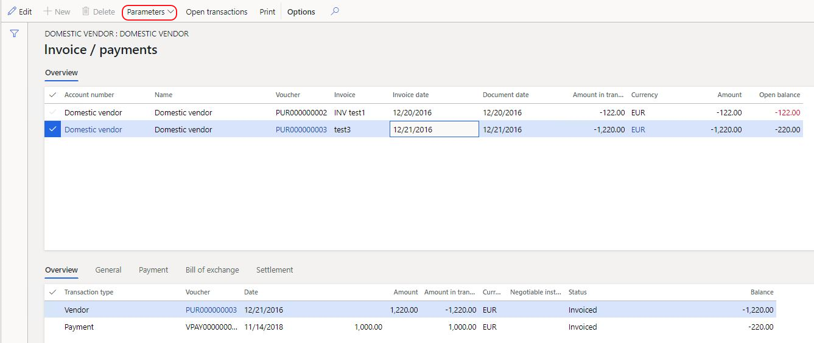
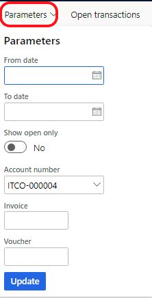

---
# required metadata

title: Improved inquiry on debit/credit settlement
description: Improved inquiry on debit/credit settlement.
author: ilkond
manager: AnnBe
ms.date: 10/29/2019
ms.topic: article
ms.prod: 
ms.service: dynamics-ax-applications
ms.technology: 

# optional metadata

ms.search.form: 
audience: Application User
# ms.devlang: 
ms.reviewer: kfend
ms.search.scope: Core, Operations
# ms.tgt_pltfrm: 
# ms.custom: 
ms.search.region: Italy
# ms.search.industry: 
ms.author: ilyako
ms.search.validFrom: 2019-11-01
ms.dyn365.ops.version: 10.0.8

---

# Improved inquiry on debit/credit settlement

[!include [banner](../includes/banner.md)]

This topic provides description how to overview information on settlements of invoices and payments in convenient and simple form.

## Prerequisites

- The primary address of the legal entity must be in Italy.
- In the **Feature management** workspace, turn on the **Improved inquiry on debit/credit settlement** feature. For more information, see [Feature management overview](../../fin-and-ops/get-started/feature-management/feature-management-overview.md).

## Use Invoice/ Payment list pages
To open the **Invoice/ Payments** list page go to **Account receivable > Customers > All customers, Inoice tab > Related information > Invoice/ Payments**
OR
**Account payable > Vendors > All vendors, Inoice tab > Related information > Invoice/ Payments**
Top list page displays Customer/ Vendor invoices sorted by invoice number and date. 
Bottom list page displays Customer/ Vendor Debit/ Credit transactions (invoices, payment, foreign currency revaluation transactions and etc.).

Below the list page example for the vendor invoices. Non-zero balance in invoices is highlighted in red.

In parameters a user may set filter for displaying data in the list page.

