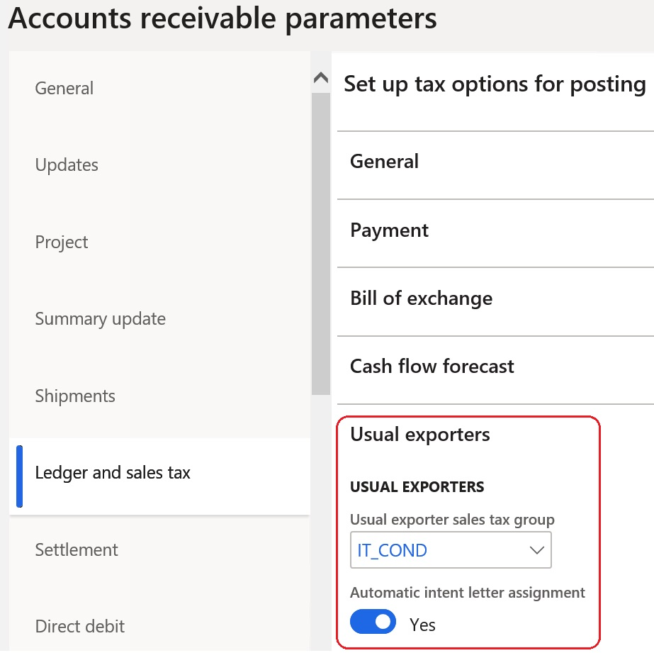
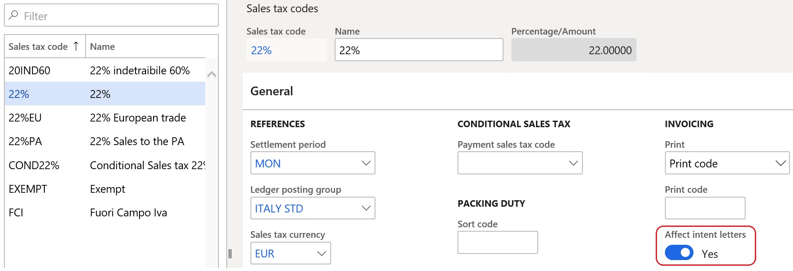
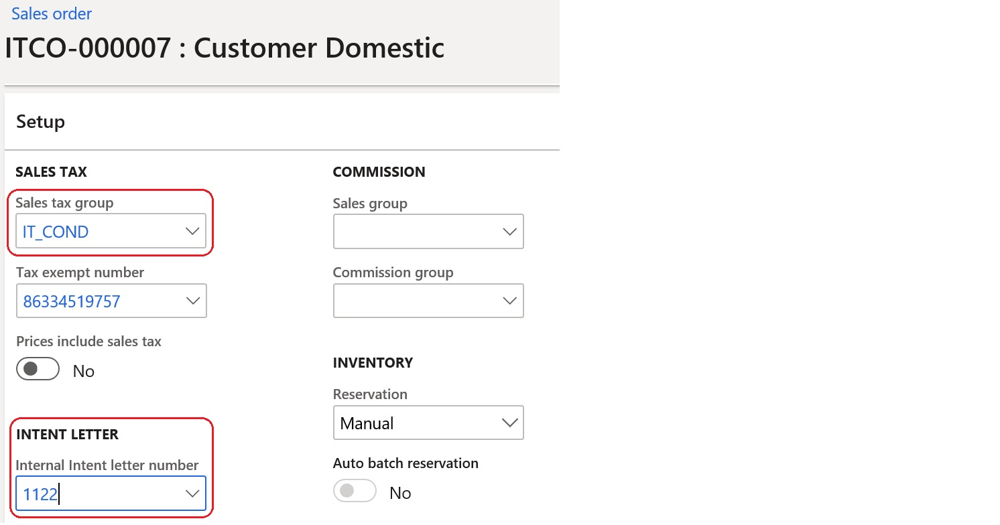
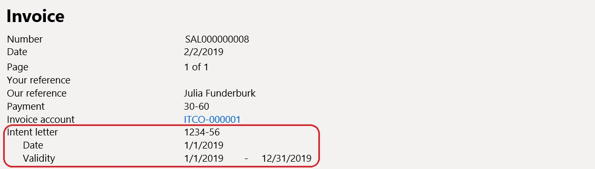

---
# required metadata

title: Intent letters - Invoicing usual exporters
description: This topic provides information about how to set up intent letters and how to use them when you issue invoices.
author: ilkond
ms.date: 12/28/2020
ms.topic: article
ms.prod: 
ms.technology: 

# optional metadata

ms.search.form: 
audience: Application User
# ms.devlang: 
ms.reviewer: kfend
# ms.tgt_pltfrm: 
# ms.custom: 
ms.search.region: Italy
# ms.search.industry: 
ms.author: ilyako
ms.search.validFrom: 2020-01-01
ms.dyn365.ops.version: 10.0.9

---

# Intent letters - Invoicing of usual exporters

[!include [banner](../includes/banner.md)]

To receive a supply of goods or services free of sales tax in Italy, companies that are categorized as usual exporters must send an intent declaration (a numbered and dated letter) to the Italian tax authorities and to company counteragents.
 
## Prerequisites

The following prerequisites must be met before you invoice:

- The primary address of the legal entity must be in Italy.
- The **Intent letters - invoicing of usual exporters** feature must be turned on in the **Feature management** workspace. For more information, see [Feature management overview](../../fin-ops-core/fin-ops/get-started/feature-management/feature-management-overview.md).

## Set up Accounts receivable parameters

1. Go to **Accounts receivable** \> **Setup** \> **Accounts receivable parameters**.
2. On the **Ledger and sales tax** tab, on **Usual exporters** FastTab, in **Usual exporter sales tax group** field, define a sales tax group that is used only for usual exporters.
3. Set the **Automatic intent letter assignment** option to **Yes** to turn on the automatic assignment of intent letters during invoicing.

## Set up sales tax codes

1. Go to **Tax** \> **Indirect taxes** \> **Sales tax** \> **Sales tax code**.
2. Select a sales tax code, and then, on the **General** FastTab, in the **Invoicing** section, set the **Affect intent letters** option to **Yes**.

## Set up customers

1. Go to **Accounts receivable** \> **Customers** \> **All customers**.
2. Select a customer, and then, in the **Invoice and delivery** section, select the **Usual exporter** option to indicate that the customer belongs to the group of usual exporters.

## Set up a number sequence for intent letters

1. Go to **Accounts receivable** \> **Setup** \> **Accounts receivable parameters**.
2. On the **Number sequences** tab, in **Internal letter number** field, specify the reference to the number sequence that will be used to number intent letters.

## Create an intent letter

Follow these steps to create an intent letter for a selected customer.

1. Go to **Accounts receivable** \> **Customers** \> **All customers**.
2. Select a customer, and then, on the Action Pane, on the **Sell** tab, in the **Setup** group, select **Setup** \> **Intent letters**.
3. Select **New**.
4. Enter the data for the new intent letter.

Alternatively, you can create an intent letter for any applicable customer by going to **Accounts receivable** \> **Intent letters** \> **Intent letters**.

The following actions are available for existing intent letters:

- **Close intent letter** – Close an open intent letter.
- **Cancel intent letter** – Cancel an intent letter. This operation requires a reason for cancellation.
- **Update sales orders** – Update existing applicable sales orders with the reference to an intent letter.
- **Open intent letter** – Open an intent letter that was closed.
- **Posted sales tax** – Show the sales tax transactions that are related to the selected intent letter.

## Using intent letters

When you create a sales order or a free text invoice for a customer who is categorized as a usual exporter, if the creation date is in the validity period of the intent letter, the **Usual exporter sales tax group** value is used in the order or invoice. Additionally, the intent letter number is entered if the **Automatic intent letter assignment** option is set to **Yes**.

The amount of the invoice transaction will be subject to sales tax calculation only if it doesn't exceed the amount of the intent letter.

The details of the intent letter will be also included in a printable layout of the invoice.

[!INCLUDE[footer-include](../../includes/footer-banner.md)]