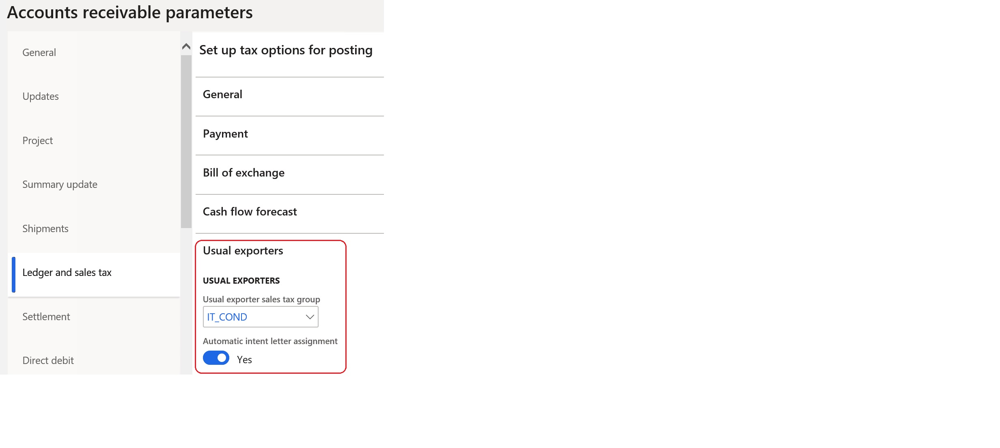

---
# required metadata

title: Intent letters - invoicing of usual exporters
description: Intent letters - invoicing of usual exporters.
author: ilkond
manager: AnnBe
ms.date: 11/11/2019
ms.topic: article
ms.prod: 
ms.service: dynamics-ax-applications
ms.technology: 

# optional metadata

ms.search.form: 
audience: Application User
# ms.devlang: 
ms.reviewer: kfend
ms.search.scope: Core, Operations
# ms.tgt_pltfrm: 
# ms.custom: 
ms.search.region: Italy
# ms.search.industry: 
ms.author: ilyako
ms.search.validFrom: 2020-01-01
ms.dyn365.ops.version: 10.0.9

---

# Intent letters - invoicing of usual exporters

[!include [banner](../includes/banner.md)]

In Italy, companies that are considered as usual exporters must send an intent declaration (a numbered and dated letter) to the Italian tax authorities and to compamies' contragents in order to receive a supply of goods or services free of sales tax. 

This article explains how to setup intent letters and use it during invoices issuing.
 

## Prerequisites

- The primary address of the legal entity must be in Italy.
- In the **Feature management** workspace, turn on the **Intent letters - invoicing of usual exporters** feature. For more information, see [Feature management overview](../../fin-and-ops/get-started/feature-management/feature-management-overview.md).

## Set up Accounts receivable parameters
In **Accounts receivable > Setup > Accounts receivable parameters**, in **Ledger and sales tax**, in **Usual exporters** section, in **Usual exporter sales tax group** field define a salex tax group specific for usual exportrs.

Addiyionally, turn on **Automatic intent letter assignment** parameter if you want to activate automatic assignment of intent letters when invoicing.

## Set up Sales tax code
In **Tax > Indirect taxes > Sales tax > Sales tax code**, for the selected Sales tax code, in **General** section, turn on **Affect intent letters** parameter.

## Use...

### Post

When you post...

> [!NOTE]
> Warning...
