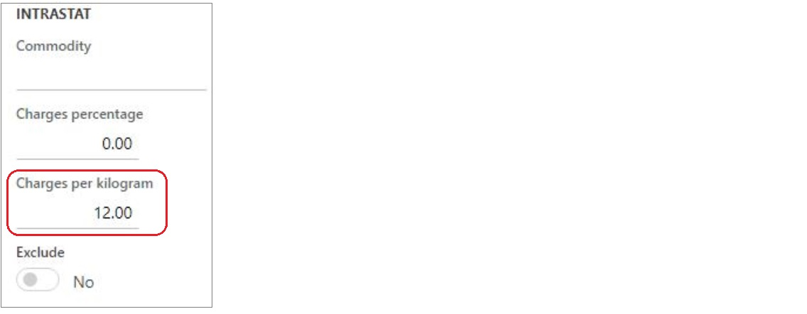

---
# required metadata

title: Miscellaneous charges per kilogram in an Intrastat declaration
description: This topic explains how to enable, set up, and use miscellaneous charges per kilogram for Intrastat declaration.
author: ilkond
manager: AnnBe
ms.date: 10/28/2019
ms.topic: article
ms.prod: 
ms.service: dynamics-ax-applications
ms.technology: 

# optional metadata

ms.search.form: 
audience: Application User
# ms.devlang: 
ms.reviewer: kfend
ms.search.scope: Core, Operations
# ms.tgt_pltfrm: 
# ms.custom: 
ms.search.region: Italy
# ms.search.industry: 
ms.author: ilyako
ms.search.validFrom: 2019-11-29
ms.dyn365.ops.version: 10.0.8

---

# Miscellaneous charges per kilogram in an Intrastat declaration

[!include [banner](../includes/banner.md)]

[!include [banner](../includes/preview-banner.md)]

Intrastat is the system for collecting information and generating statistics about the trade of goods among countries/regions of the European Union (EU). For more information, see [Intrastat overview](emea-intrastat.md).

Among other reporting elements Intrastat declaration contains information about miscellaneous charges that are usually calculated as a percentage on the invoice amount. In Italy miscellaneous charges are often calculated as the multiplication of the cost for each kilogram and goods weight in kilograms.

## Prerequisites

- The primary address of the legal entity must be in Italy.
- In the **Feature management** workspace, turn on the **Miscellaneous charges per kilogram in Intrastat declaration** feature. For more information, see [Feature management overview](../../fin-and-ops/get-started/feature-management/feature-management-overview.md).

## Set up miscellaneous charges per kilogram

On the **Released products master data** page, on the **Foreign trade** FastTab, in the **Intrastat** section, define the charge amount per kilogram in the **Cost charges per kg** field.

> [!NOTE]
> Verify that the products weight is defined in kilograms.

## Miscellaneous charges calculation

When transferring transactions to an Intrastat declaration, **Statistical charges amount** will be calculated using the formula:

    *Statistical charges amount = Cost of each kilogram * Net weight (in kilograms)*

If **Chagres percentage** is also defined then both types of miscellaneous charges will be used in the calculation:

    *Statistical charges amount = (Invoice amount * Charges percentage) + (Cost of each kilogram * Net weight)*

For more information, see [Transfer transactions to the Intrastat](tasks/transfer-transactions-intrastat.md)
