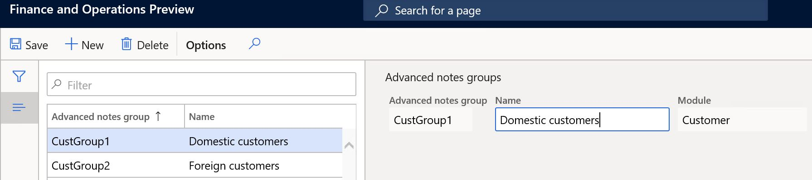
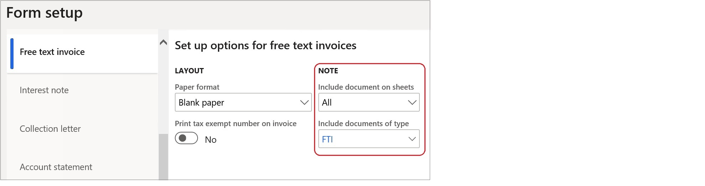
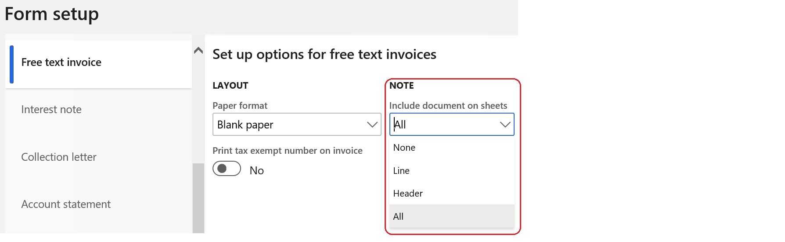

---
# required metadata

title: Advanced notes management
description: This topic explains how to set up and print predefined notes for customers, vendors, and products.
author: ilkond
manager: AnnBe
ms.date: 12/18/2019
ms.topic: article
ms.prod: 
ms.service: dynamics-ax-applications
ms.technology: 

# optional metadata

ms.search.form: 
audience: Application User
# ms.devlang: 
ms.reviewer: kfend
ms.search.scope: Core, Operations
# ms.tgt_pltfrm: 
# ms.custom: 
ms.search.region: Italy
# ms.search.industry: 
ms.author: ilyako
ms.search.validFrom: 2019-11-29
ms.dyn365.ops.version: 10.0.8

---

# Advanced notes management

[!include [banner](../includes/banner.md)]

The Advanced notes management feature lets you set up predefined notes that apply to all or specific customers, vendors, and products. You can then add these notes to specific business documents.

## Prerequisites

Before you begin the setup, the following prerequisites must be met:

- The primary address of the legal entity must be in Italy.
- The **Advanced notes management** feature must be turned on in the **Feature management** workspace. For more information, see [Feature management overview](../../fin-and-ops/get-started/feature-management/feature-management-overview.md).

## Advanced notes setup

### Set up customer and vendor groups for advanced notes

If similar notes must be printed on documents for groups of customers, you can define new groups specifically for advanced notes. To define group codes and descriptions, go to **Accounts receivable** \> **Setup** \> **Advanced notes** \> **Customers advanced notes groups**.

After you create the groups, go to **Accounts receivable** \> **Customers** \> **All customers**. Then, on the **Sales orders defaults** FastTab, in the **Advanced notes** section, assign the references for the required customers to the new groups.

To set up advanced notes groups for vendors, go to **Accounts payable** \> **Setup** \> **Advanced notes** \> **Vendors advanced notes groups**.

### Set up advanced notes for customers and vendors

To enter the text of advanced notes for customers and set up the applicability of the notes, go to **Accounts receivable** \> **Setup** \> **Advanced notes** \> **Customers advanced notes setup**.

In the lower part of the page, you can enter the note text in the user's default language. To enter the note text in other languages, select **Translations**.

In the upper part of the **Advanced notes setup** page, you can set up the applicability of the advanced notes. Select the appropriate check boxes to turn on notes for the various available documents. On the **Header** tab, you can define notes for all customers, individual customers, or customer groups. On the **Lines** tab, you can define notes for all items or individual items.

To set up advanced notes for vendors, go to **Accounts payable** \> **Setup** \> **Advanced notes** \> **Vendors advanced notes setup**.

> [!NOTE]
> For vendor advanced notes, **Purchase order** is the only document that is available.

### Set up document types

Go to **Organization administration** \> **Document management** \> **Document types** to define the document types that are used when the related document attachments are created. In the **Class** field, select **Simple note**.

### Set up forms

Go to **Accounts receivable** \> **Setup** \> **Forms** \> **Forms setup** to set up the references to document types for the related documents. Additionally, you can define whether the notes are applicable to a document's header, lines, or both.

## Advanced notes processing

### Generating advanced notes

In Accounts receivable, the notes for confirmations, picking lists, packing slips, and invoices are automatically generated as attachments to the sales orders that are generated for selected customers and products.

The notes for quotations and free text invoices are automatically generated in the appropriate documents.

In Accounts payable, notes are automatically generated as attachments to new purchase orders for applicable vendors and products.

### Printing advanced notes

Advanced notes which are defined as **External** are printed in the related business documents depending on the settings on the **Form setup**

