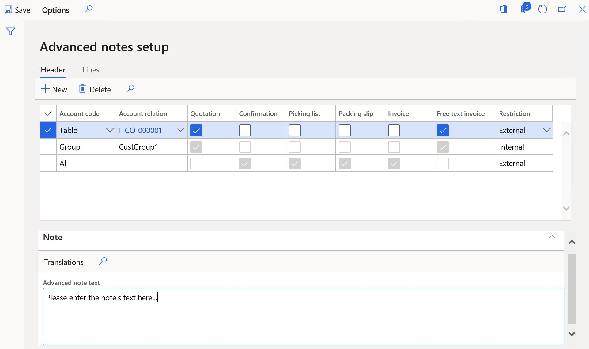
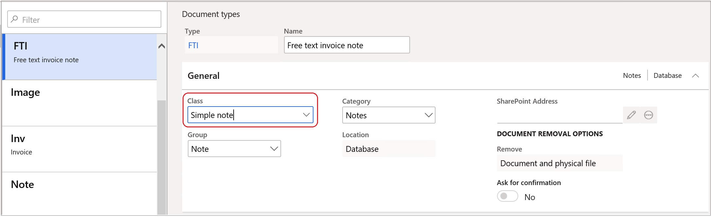

---
# required metadata

title: Advanced notes management
description: This topic provides information about how to set up and print predefined notes for customers, vendors, and products.
author: ilkond
manager: AnnBe
ms.date: 11/12/2019
ms.topic: article
ms.prod: 
ms.service: dynamics-ax-applications
ms.technology: 

# optional metadata

ms.search.form: 
audience: Application User
# ms.devlang: 
ms.reviewer: kfend
ms.search.scope: Core, Operations
# ms.tgt_pltfrm: 
# ms.custom: 
ms.search.region: Italy
# ms.search.industry: 
ms.author: ilyako
ms.search.validFrom: 2019-11-29
ms.dyn365.ops.version: 10.0.8

---

# Advanced notes management

[!include [banner](../includes/banner.md)]

This functionality allows you to set up predefined notes that are applicable for all or specific customers, vendors, and products. YOu can then add these notes to specific business documents.
 
## Prerequisites
Before you begin setup, the following prerequisites must be met:

- The primary address of the legal entity must be in **Italy**.
- The feature **Advanced notes management**, must be enabled in the **Feature management** section. For more information, see [Feature management overview](../../fin-and-ops/get-started/feature-management/feature-management-overview.md)

## Advanced notes setup
### Customer and vendor groups for advanced notes
To group customers that will have similar notes printed in documents, you can define new groups specifically for advanced notes. To define group codes and descriptions, go to **Accounts receiveable** > **Setup** > **Advanced notes** > **Customers advanced notes groups**.

After you create the groups, go to **Accounts receivable** > **Customers** > **All customers** > **Sales orders defaults** (FastTab) > **ADVANCED NOTES** (section) to assign the references for the required customers to the new groups.

Advanced notes groups can also be setup for vendors in **Accounts payable** > **Setup** > **Avdanced notes** > **Vendors advanced notes groups**.

### Advanced notes setup for customers
Go to **Accounts receivable** > **Setup** > **Avdanced notes** > **Customers advanced notes setup** page to enter notes text and control notes applicability.

In the bottom part of the **Customers advaned notes setup** page, you can enter the note text in user's default language. To enter the note text in other languages, select **Translations**.

In the top part of the page, set up notes applicability. Select the related check boxes to enable notes for the available documents.
On the documents **Header** level, you can define notes for all customers, individual customers, or customer groups.
On the documents **Line** level, you can define notes for all items or for individual items.

You can set up advanced notes for vendors in **Accounts payable** > **Setup** > **Avdanced notes** > **Vendors advanced notes setup**.

> [!NOTE]
> In **Accounts payable**, only **Purchase order** is available as a supported document.

### Document types setup

Go to **Organization administration** > **Document management** > **Document types**, to define the document types that will be used when the related documents attachements are created. In the **Class** field, select **Simple note**.

### Forms setup
Go to **Accounts receivable** > **Setup** > **Forms** > **Forms setup**, to set up the references to **Document types** for the related documents.
Additionally, you can define whether the notes are applicable to a documents **Header**, **Lines**, or both.

## Advanced notes processing

### Advanced notes generation
In **Accounts receivable**, the notes enabled for **Confirmation**, **Picking list**, **Packing slip**, and **Invoice** will be automatically generated as attachements in sales orders that are generated for select customers and products.

The notes enabled for quotations and free text invoices will be automatically generated in their respective documents.

In **Accounts payable**, the notes will be automatically generated generated as attachements in new **Purchase orders** for applicable Vendors and Products.

### Advanced notes printing
External notes are printed as they relate to business documents according to the **Forms** setup in the **Headers** section, the **Lines** section, or in both sections.

