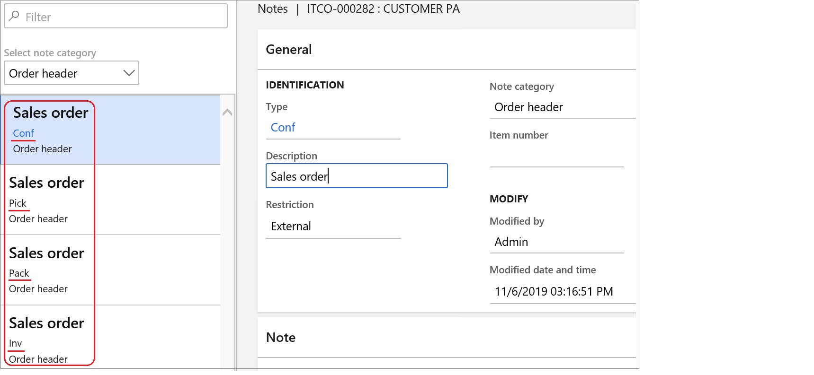

---
# required metadata

title: Advanced notes management
description: Advanced notes management.
author: ilkond
manager: AnnBe
ms.date: 18/10/2019
ms.topic: article
ms.prod: 
ms.service: dynamics-ax-applications
ms.technology: 

# optional metadata

ms.search.form: 
audience: Application User
# ms.devlang: 
ms.reviewer: kfend
ms.search.scope: Core, Operations
# ms.tgt_pltfrm: 
# ms.custom: 
ms.search.region: Italy
# ms.search.industry: 
ms.author: ilyako
ms.search.validFrom: 2019-11-29
ms.dyn365.ops.version: 10.0.8

---

# Advanced notes management

[!include [banner](../includes/banner.md)]

This functionality allows users to set up predefined notes applicable for all or specific customers, vendors and products and print these notes in specific business documents.
 
## Prerequisites

- The primary address of the legal entity must be in **Italy**.
- In **Feature management**, enable the feature **Advanced notes management**. For more information, see [Feature management overview](../../fin-and-ops/get-started/feature-management/feature-management-overview.md)

## Advanced notes setup
### Customers and Vendors groups for advanced notes
In order to group customers to have similar notes printed in documents, you can define new groups specifically for advanced notes. 
Use **Accounts receivable** > **Setup** > **Avdanced notes** > **Customers advanced notes groups** to define groups codes and descriptions.

Once completed, assign the references to the created groups for the required customers in **Accounts receivable** > **Customers** > **All customers** > **Sales orders defaults** (FastTab) > **ADVANCED NOTES** (Section).

Symmetrically, advanced notes groups can be setup for Vendors in **Accounts payable** > **Setup** > **Avdanced notes** > **Vendors advanced notes groups**.

### Advanced notes setup for Customers
Use **Accounts receivable** > **Setup** > **Avdanced notes** > **Customers advanced notes setup** form to enter notes texts and control notes applicability.

In the bottom part of the form you can enter the note's text in User's default language. To enter the note's texts in other languages please use **Translations** button.

In the top part of the form set up notes applicability. Mark related check-boxes to enable notes for the available documents.
On documents **Header** level you can define notes for all customers, individual customers or customers groups.
On documents **Line** level you can additionally define notes for all or individual items.

Symmetrically, set up advanced notes for Vendors in **Accounts payable** > **Setup** > **Avdanced notes** > **Vendors advanced notes setup**
> [!NOTE]
> In **Accounts payable** only **Purchase order** is available among the supported documents.

### Document types setup

In **Organization administration** > **Document management** > **Document types** define document types that will be used during related documents attachements creation. Select **Simple note** value in **Class** field.

### Forms setup
In **Accounts receivable** > **Setup** > **Forms** > **Forms setup** set up the references to **Document types** for the related documents.
Additionally, define whether the notes are applicable to documents **Header**, **Lines** or both.

## Advanced notes processing
### Advanced notes generation
In **Accounts receivable**, the notes enabled for **Confirmation**, **Picking list**, **Packing slip** and **Invoice** will be automatically generated as attachements in new **Sales orders** for applicable Customers and Products.

The notes enabled for **Quatation** and **Free text invoice** will be automatically generated in respective documents - new quotations and free text invoices.

In **Accounts payable**, the notes will be automatically generated generated as attachements in new **Purchase orders** for applicable Vendors and Products.

> [!NOTE]
> In As many times as...

### Advanced notes printing
External. Standard way.
