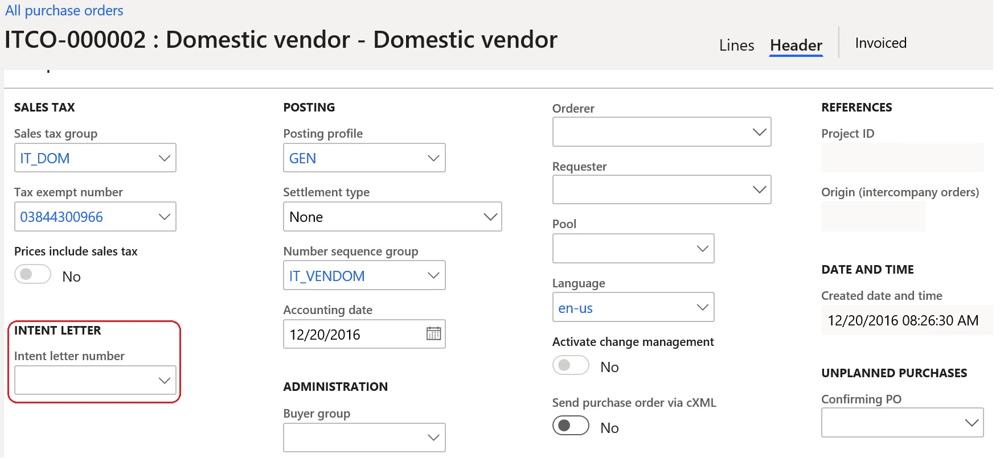

---
# required metadata

title: Tax plafond
description: This topic provides information about how to set up and work with tax plafond, which is a tax-exemption process.
author: ilkond
manager: AnnBe
ms.date: 04/20/2020
ms.topic: article
ms.prod: 
ms.service: dynamics-ax-applications
ms.technology: 

# optional metadata

ms.search.form: 
audience: Application User
# ms.devlang: 
ms.reviewer: kfend
ms.search.scope: Core, Operations
# ms.tgt_pltfrm: 
# ms.custom: 
ms.search.region: Italy
# ms.search.industry: 
ms.author: ilyako
ms.search.validFrom: 2020-06-01
ms.dyn365.ops.version: 10.0.9

---

# Tax plafond

[!include [banner](../includes/banner.md)]

Tax plafond is a tax-exemption process that allows companies, usually exporters, to purchase and import goods and services without paying sales tax within a limited value of their sales to foreign countries in the previous period. 
A company is a *usual exporter* if in the previous year, 10 percent of the company's revenue value came from selling to a foreign country. To support that, the initial plafond amount and its validity dates are established at the beginning of the period. 
The company can buy without paying sales tax until the purchases value is below the initial plafond.

This topic describes how to:
 - Set up the system to use the **Tax plafond** feature
 - Work with**Tax plafond** and the **Intent letter**
 - Report tax payments that include tax plafond information

## Prerequisites

- The primary address of the legal entity must be in Italy.
- In the **Feature management** workspace, turn on the **Tax plafond** feature. For more information, see [Feature management overview](../../fin-and-ops/get-started/feature-management/feature-management-overview.md).

## Set up parameters
### Set up Accounts payable parameters

1. Go to **Accounts payable** > **Setup** > **Accounts payable parameters**. 
2. On the **Number sequences** FastTab, specify number sequences for:

 - Plafond number
 - Intent letter number

3. In **Accounts payable**, go to **Setup** > **Accounts payable parameters** and on the **Intent letters - Telematic model** FastTab, specify the reference to the Intent letter telematic model configuration.

> [!NOTE] 
> The configuration must be imported by using **Electronic reporting**. For more information about how to download ER configurations
see [Download Electronic reporting configurations from Lifecycle Services](../../fin-ops-core/dev-itpro/analytics/download-electronic-reporting-configuration-lcs.md)

4. In **Accounts payable**, go to **Setup** > **Accounts payable parameters**, and on the **Ledger and sale tax** FastTab, in the **Sales tax** section, specify **Plafond tax group** and **Default plafond date** parameters.

### Set up General ledger parameters

1. Go to **General ledger** > **Ledger setup** > **General ledger parameters**.
2. On the **Number sequences** FastTab, specify the number sequence for **Intent letter telematic model ID**.

### Set up sales tax codes

1. Go to **Tax** \> **Indirect taxes** \> **Sales tax** \> **Sales tax code**.
2. On the **General** FastTab, in the **Invoicing** section, set the **Affect intent letters** option to **Yes**.

## Create tax plafond

1. To register a new tax plafond, go to **Tax** > **Indirect taxes** > **Sales tax** > **Tax plafond**.
2. On the Action Pane, select **Functions** > **Create new** and enter information for the tax plafond.

Tax plafond fields description:

| **Field name**                                                 | **Description**                                                                                                                                                                               |
|----------------------------------------------------------------|-----------------------------------------------------------------------------------------------------------------------------------------------------------------------------------------------|
| **Plafond number**                                             | The number of the tax plafond. This value is defined according to Number sequence defined for Plafond number reference on the **Accounts payable parameters** page.                                        |
| **Description**                                                | The description of the tax plafond, specified manually.                                                                                                                                    |
| **From date**                                                  | The start date of the period in which the tax plafond is effective.                                                                                                         |
| **To date**                                                    | The end date of the period in which the tax plafond is effective.                                                                                                              |
| **Closed date**                                                | The calculated date on which the tax plafond is closed.                                                                                                                                                  |
| **Initial plafond amount**                                     | Enter the amount of the tax plafond.                                                                                                                                                |
| **Initial current amount**                                     | The calculated amount available on tax plafond.                                                                                                                                              |
| **Plafond warning type, amount, %.**                           | The type of check and related amount or percentage starting from which user will get a warning about the tax plafond remaining amount . |
| **Settlement period**                                          | Specify the settlement period.                                                                                                                                  |
| **Operations contributing to the plafond** | Turn on/off the options for inclusion into intent letters report.                                                                                                                                            |

To review posted tax transactions for an existing tax plafond, on the **Tax plafond** page, on the Action Pane, select **Plafond transactions**.

## Create intent letters

1. To create a new intent letter for a vendor, go to **Accounts payable** > **Intent letters** > **Intent letters**.
2. On the Action Pane, select **New** and enter information for the intent letter.

| **Field name**   | **Description**                                                          |
|------------------|--------------------------------------------------------------------------|
| **Posting date** | Specify the posting date for the intent letter.                              |
| **Letter type**  | Select **Amount** or **Specific operation** type for the intent letter.      |
| **From date**    | Specify the start date of the period in which intent letter is effective. |
| **To date**      | Specify the end date of the period in which intent letter is effective.      |
| **Amount**       | Specify the amount for intent letter.                                        |

3. On **Records to include** FastTab, select **Filter** to select the vendors for which intent letters must be created.
4. Select **OK** to finalize the selection.
5.	On the next page, select **Update existing purchase orders** if you want to apply new intent letters to existing but not invoiced purchase orders for the selected vendors.
6.	Select **Re-confirm purchase orders** if you want to re-confirm purchase orders for which intent letters are applied in case they were confirmed.
7.	Select **Exclude delivered or partly delivered purchase orders** if you want to exclude delivered or partly delivered purchase orders from the list of purchase orders to be updated with intent letters.

8.	Select **OK** to create intent letters with specified parameters.

> [!NOTE] 
> When Intent letters are created, they are numbered automatically by the system according to the related number sequence defined in **Accounts payable parameters**.

9. For created intent letters you can specify the field values for the generated telematic model, on the **General** tab.

| **Field name**    | **Description**                                                                                                                                                                                                                       |
|-----------------------|-------------------------------------------------------------------------------------------------------------------------------------------------------------------------------------------------------------------------------|
|   **Model ID**        | Identification of the telematic model in which the letter was included. This system-assigned value is defined according to Number sequence specified for **Intent letter telematic model ID** reference on the **General ledger parameters** page. |
|   **Purchase type**   | Select the type of purchase,  purchases or exposures.                                                                                                                                                                                  |
> [!NOTE] 
> The **Period** type of intent letters is not supported. Creating this type of intent letters is prevented. The **Period** type is kept for historical data of those users which were using this type in the past as well as the **Automatic intent letter assignment** parameter on **Ledger and sales tax** tab of **Accounts payable parameters** page.

## Work with intent letters

Intent letters that are created for vendors can be applied to purchase orders or vendor invoice journal before invoice posting.

To apply an intent letter to a purchase order or vendor invoice journal, select the intent letter in the **Intent letter number** field of the related purchase order or vendor invoice journal. 

The **Sales tax group** specified in **Plafond tax group** field of **Accounts payable parameters** will be automatically filled for the purchase order or vendor invoice journal.

You can also review intent letters for a specific vendor from vendor master data.

1. Go to **Accounts payable** \> **Vendors** \> **All vendors**.
2. On **Vendor** tab, on the Action Pane, in the **Related information** group, select **Intent letters** to see the intent letters related to the selected vendor.

## Generation of telematic model for intent letters

To generate telematic model of an intent letter, complete the following steps:

1. Go to **Tax** \> **Declarations** \> **Sales tax** \> **Intent letters – Telematic model**.
2. On the Action Pane, select **New** to create a new record for telematic model reporting. The Model ID is defined automatically according to the number sequence specified on the **General ledger parameters** page for the **Intent letter telematic model ID** reference.
3. Specify **Internal description** for the new telematic model in the related field.
4. On the **General** tab, fill in any related information for the new telematic model about signatory, writer, integrative parameters, and the file name.
5. On the Action Pane, select **Transfer** and then select the intent letters to include in the current model. Selected intent letters will be shown on the **Intent letters** FastTab. 

> [!NOTE] 
> Intent letters that are already included in other models can’t be selected.

6.  On the Action Pane, select **Export** to generate the **Intent letter telematic model** output file.
