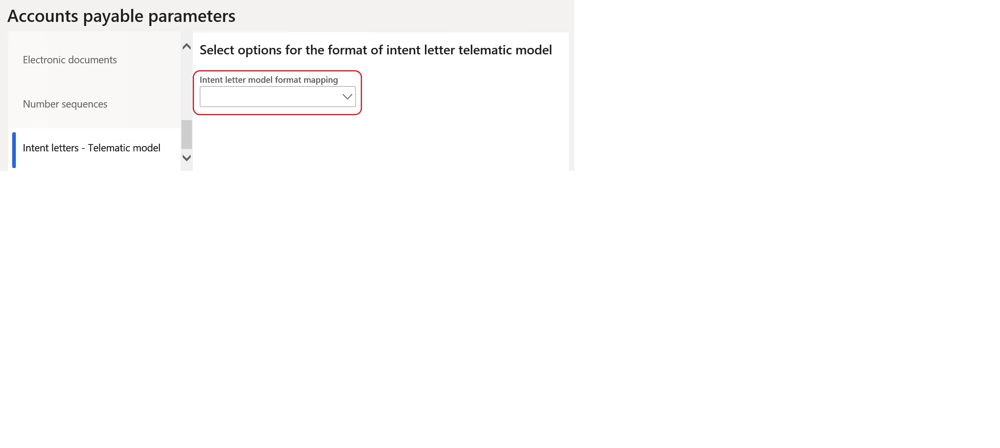
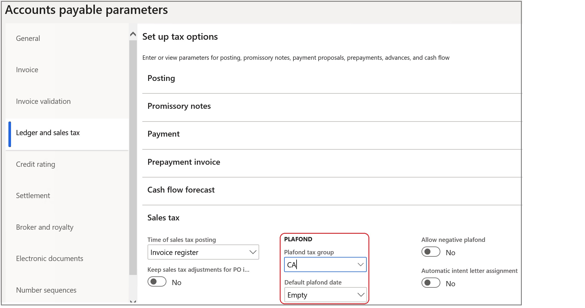

---
# required metadata

title: Tax plafond
description: Tax plafond.
author: ilkond
manager: AnnBe
ms.date: 11/13/2019
ms.topic: article
ms.prod: plafond
ms.service: dynamics-ax-applications
ms.technology: 

# optional metadata

ms.search.form: 
audience: Application User
# ms.devlang: 
ms.reviewer: kfend
ms.search.scope: Core, Operations
# ms.tgt_pltfrm: 
# ms.custom: 
ms.search.region: Italy
# ms.search.industry: 
ms.author: ilyako
ms.search.validFrom: 2020-06-01
ms.dyn365.ops.version: 10.0.9

---

# Tax plafond

[!include [banner](../includes/banner.md)]

Companies in Italy which engage in resale activities outside of Italy can be exempt from VAT under tax plafond arrangement.
VAT exempt under plafond arrangement can be provided for companies fulfilling the following conditions:
 - Company must be considered as usual exporter.
 - Company must release an intent letter to vendor, in which status of usual exporter is declared.

This topic describes how to:
 - Set up the system to use **Tax plafond** feature;
 - Work with **Tax plafond** and **Intent letter**;
 - Report Tax payments including tax plafond information.

## Prerequisites

- The primary address of the legal entity must be in Italy.
- In the **Feature management** workspace, turn on the **Tax plafond** feature. For more information, see [Feature management overview](../../fin-and-ops/get-started/feature-management/feature-management-overview.md).

## Set up parameters
### Set up Accounts payable parameters

In **Accounts payable** > **Setup** > **Accounts payable parameters** > **Number sequences** FastTab, specify number sequences for:
 - Plafond number;
 - Intent letter number.

In **Accounts payable** > **Setup** > **Accounts payable parameters** > **Intent letters - Telematic model** FastTab, specify the reference to Intent letter telematic model configuration.

> [!NOTE] The configuration must be preliminary imported in **Electronic reporting**. For more information about how to download ER configurations
see [Download Electronic reporting configurations from Lifecycle Services](https://docs.microsoft.com/en-us/dynamics365/fin-ops-core/dev-itpro/analytics/download-electronic-reporting-configuration-lcs)

In **Accounts payable** > **Setup** > **Accounts payable parameters** > **Ledger and sale tax** FastTab, in the **Sales tax** section, specify **Plafond tax group** and **Default plafond date** parameters.

### Set up General ledger parameters

In **General ledger** > **Ledger setup** > **General ledger parameters** > **Number sequences** FastTab, specify the number sequence for **Intent letter telematic model ID**.

### Set up sales tax codes

In **Tax** \> **Indirect taxes** \> **Sales tax** \> **Sales tax code** \> **General** FastTab, in the **Invoicing** section, set the **Affect intent letters** option to **Yes**.

## Create tax plafond

To register a new tax plafond, go to **Tax** > **Indirect taxes** > **Sales tax** > **Tax plafond**, on the Action pane, сlick **Functions** > **Create new** and fill in the fields for the tax plafond.

Tax plafond fields description:

### Post

When you post...

> [!NOTE]
> Warning...
