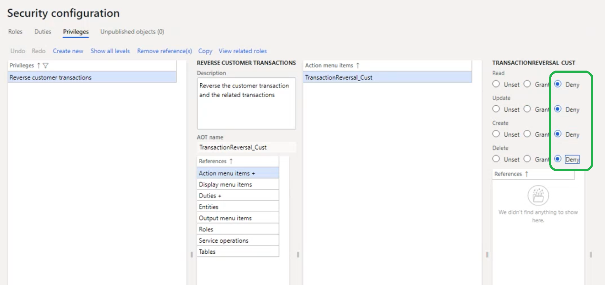
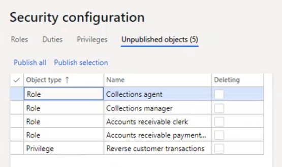

# Italian sales tax books

[!include [banner](../includes/banner.md)]

The article describes how to set up and use Italian sales tax books and Italian sales tax book sections.

According to Italian fiscal legislation, every value-added tax (VAT) transaction must belong to a tax book (*Libro IVA*) that will be used for tax reporting. To fulfill these legislative requirements, Dynamics 365 Finance implements Italian sales tax books. Sales tax books can be of different types. You must specify the sales tax book type to help guarantee that all sales and purchase transactions are included on the **Italian sales tax payment** report. You can keep as many sales tax books of the **Sales** and **Purchase** types as you require. Every tax book can be divided into multiple tax book sections (*Sezionale IVA*). All sales tax transactions must be sequentially numbered (without gaps) and ordered by posting date. A tax book section is equivalent to a number sequence for the Italian sales tax voucher number (*Protocollo IVA*) that must always be applied during posting to help guarantee chronological order by posting date.

## Prerequisites
The following table shows the prerequisites that must be in place before you start.

<table>
<colgroup>
<col width="50%" />
<col width="50%" />
</colgroup>
<thead>
<tr class="header">
<th>Category</th>
<th>Prerequisite</th>
</tr>
</thead>
<tbody>
<tr class="odd">
<td><strong>Setup:</strong> Legal entity</td>
<td>The primary address of the legal entity must be in Italy. (Click <strong>Organization administration</strong> &gt; <strong>Organizations</strong> &gt; <strong>Legal entities</strong> &gt; <strong>Addresses</strong> &gt; <strong>Country/region</strong>.)</td>
</tr>
<tr class="even">
<td><strong>Setup:</strong> Number sequences</td>
<td>Set up as many number sequences as you require to cover all the required types of sales tax transactions. (Click <strong>Organization administration</strong> &gt; <strong>Number sequences</strong> &gt; <strong>Number sequences</strong>.) All these number sequences must be continuous and must have <strong>Company</strong> scope.</td>
</tr>
<tr class="odd">
<td><strong>Setup:</strong> Journal names</td>
<td>Set up the required journal names. (Click <strong>General Ledger</strong> &gt; <strong>Journal setup</strong> &gt; <strong>Journal names</strong> or <strong>Project management and accounting</strong> &gt; <strong>Setup</strong> &gt; <strong>Journals</strong> &gt; <strong>Journal names</strong>.) On the <strong>General</strong> FastTab, in the <strong>Sales tax</strong> section, in the <strong>Italian sales tax book</strong> field, specify one of the following values:
<ul>
<li><strong>Not included</strong> – Select this value for invoices and credit notes that come from countries/regions that are outside the European community.</li>
<li><strong>Purchase</strong> – Select this value for purchase invoices and credit notes.</li>
<li><strong>Sales</strong> – Select this value for sales invoices and credit notes.</li>
<li><strong>Empty</strong> – Select this value for all other types of transactions.</li>
</ul>
In some cases, the <strong>Italian sales tax book</strong> field is set automatically, based on the <strong>Journal type</strong> value. For example, if the <strong>Journal type</strong> field is set to <strong>Invoice register</strong>, the <strong>Italian sales tax book</strong> field is set to <strong>Purchase</strong> by default.</td>
</tr>
<tr class="even">
<td><strong>Setup:</strong> Module parameters</td>
<td>For vouchers to follow the number sequences of the related invoices and credit notes, you must select the <strong>Reuse numbers</strong> check box when you define the number sequences for those invoices and credit notes. You can find this check box on the <strong>Number sequences</strong> tab of the following pages:
<ul>
<li>Accounts receivable parameters</li>
<li>Accounts payable parameters</li>
<li>Project management and accounting parameters</li>
</ul>
For example, on the <strong>Accounts receivable parameters</strong> page, on the <strong>Number sequences</strong> tab, select the <strong>Reuse numbers</strong> check box for <strong>Free text invoice voucher</strong> to synchronize number allocation for free text invoice vouchers and free text invoices.

In the Italian localization, corrections to the Italian sales tax payment report for an already settled sales tax period are not supported. So on the <strong>General ledger parameters</strong> page, on the <strong>Sales tax</strong> tab, set the Special report **Include corrections** option to **NO**.
</td>
</tr>
<tr class="odd">
<td><strong>Setup:</strong> Sales tax settlement period</td>
<td>For a <strong>Sales tax settlement period</strong> that's set up and used for sales tax accounting, specify the parameters, <strong>Include zero lines</strong> and <strong>Include reverse transactions</strong> to determine whether zero and reverse transactions must be included into sales tax books by default. Values from these parameters are used as default values during the sales tax settlement process. For each period interval of the sales tax settlement, these parameters can be changed specifically during the sales tax settlement process. If the sales tax settlement process is run in batch, Finance applies the default parameter values of <strong>Include zero lines</strong> and <strong>Include reverse transactions</strong> parameters from the <strong>Sales tax settlement period</strong> setup. You can see the values of the <strong>Include zero lines</strong> and <strong>Include reverse transactions</strong> parameters that were used for each closed period interval of sales tax settlement period on the <strong>Sales tax payment</strong> page. You can't change the values of the parameters <strong>Include zero lines</strong> and <strong>Include reverse transactions</strong> for the closed period interval of the sales tax settlement period. Including zero and reverse transactions to the sales tax books may impact the page numbering in the report.</td>
</tr>
</tbody>
</table>

## Set up sales tax books
Sales tax books are used for sales tax reporting. To set up Italian sales tax books, click **Tax** &gt; **Setup** &gt; **Sales tax** &gt; **Italian sales tax books**. The following table describes the fields that are available on the **Italian sales tax books** page.

<table>
<colgroup>
<col width="50%" />
<col width="50%" />
</colgroup>
<thead>
<tr class="header">
<th>Field</th>
<th>Description</th>
</tr>
</thead>
<tbody>
<tr class="odd">
<td>Sales tax book</td>
<td>Enter the ID of the sales tax book.</td>
</tr>
<tr class="even">
<td>Name</td>
<td>Enter a description of the sales tax book.</td>
</tr>
<tr class="odd">
<td>Sales tax book type</td>
<td>Select the nature of the operations that will be performed through the sales tax book sections that you will attach to the sales tax book. The following values are available:
<ul>
<li><strong>Purchase</strong> – Select this value for purchase invoices and credit notes.</li>
<li><strong>Sales</strong> – Select this value for sales invoices and credit notes.</li>
<li><strong>Not included</strong> – Select this value for invoices and credit notes that come from countries/regions that are outside the European community. This type is used only for statistical purposes and won&#39;t be included on the final fiscal tax book reports.</li>
</ul></td>
</tr>
<tr class="even">
<td>Settlement period</td>
<td>Select an existing sales tax settlement period. When a sales tax book is printed, if the <strong>Update</strong> check box is selected on the <strong>Sales tax payment</strong> page, the date in the <strong>From date</strong> field is compared to the selected settlement period. The settlement period is also used to identify which sales tax books and sales tax book sections must be closed when a sales tax settlement is updated for a settlement period.</td>
</tr>
<tr class="odd">
<td>Closed to</td>
<td>The latest closing date from the related sales tax book sections that belong to the selected sales tax book.</td>
</tr>
<tr class="even">
<td>EU sales</td>
<td>Select a sales tax book of the <strong>Sales</strong> type, and attach it to the current sales tax book of the <strong>Purchase</strong> type. This field is used if the selected sales tax book must include European Union (EU) purchase transactions from the current book on sales tax reports. This field is unavailable for sales tax books of the <strong>Sales</strong> and <strong>Not included</strong> types.</td>
</tr>
<tr class="odd">
<td>ATECOFIN Code</td>
<td>Select the tax code for reporting.</td>
</tr>
<tr class="even">
<td>Print summary and payment</td>
<td>Select this option to print the summary and payment report. This field is available only for sales tax books of the <strong>Sales</strong> type.</td>
</tr>
</tbody>
</table>

## Set up sales tax book sections
Sales tax book sections are a repository where ledger transactions are posted according to their nature. The voucher numbering is driven by the sales tax book sections. To set up Italian sales tax book sections, click **Tax** &gt; **Setup** &gt; **Sales tax** &gt; **Italian sales tax book sections**. The following table describes the fields that are available on the **Italian sales tax book sections** page.

<table>
<colgroup>
<col width="50%" />
<col width="50%" />
</colgroup>
<thead>
<tr class="header">
<th>Field</th>
<th>Description</th>
</tr>
</thead>
<tbody>
<tr class="odd">
<td>Sales tax book</td>
<td>Select one of the existing sales tax books that the sales tax book section is attached to.</td>
</tr>
<tr class="even">
<td>Sales tax book section</td>
<td>Enter the ID of sales tax book section.</td>
</tr>
<tr class="odd">
<td>Name</td>
<td>Enter a description of the sales tax book section.</td>
</tr>
<tr class="even">
<td>Number sequence code</td>
<td>Select the number sequence code for the sales tax book section. The number sequence code that you select depends on the type of sales tax book that the sales tax book section is attached to:
<ul>
<li>For a sales tax book of the <strong>Purchase</strong> type: Select number sequence codes that are defined for purchase invoice vouchers or purchase credit note vouchers on the <strong>Accounts payable parameters</strong> page, or number sequence codes that are used on the <strong>Journal names</strong> page for vouchers that have the <strong>Italian sales tax book</strong> field set to <strong>Purchase</strong>.</li>
<li>For a sales tax book of the <strong>Sales</strong> type: Select number sequence codes that are defined for sales invoice vouchers or sales credit note vouchers or free text invoice vouchers or free text credit note vouchers on the <strong>Accounts receivable</strong> <strong>parameters</strong> page, or number sequence codes that are used on the <strong>Journal names</strong> page for vouchers that have the <strong>Italian sales tax book</strong> field set to <strong>Sales</strong>.</li>
<li>For a sales tax book of the <strong>Not included</strong> type: Select any suitable number sequence code.</li>
</ul></td>
</tr>
<tr class="odd">
<td>Closed to</td>
<td>Enter the end date of the last closed sales tax settlement period. This field is used to filter data on the sales tax report.</td>
</tr>
<tr class="even">
<td>Close Italian sales tax book section</td>
<td>The closing date of the Italian sales tax book for a tax period. You can&#39;t post or reverse an invoice that has a date that is earlier than the closing date of the tax period. This field is updated with the closing date of the tax period. The <strong>Update</strong> check box must also be selected on the <strong>Sales tax payment</strong> page.</td>
</tr>
</tbody>
</table>

The following button is also available.

| Button | Description                                                                                                                                                                                                                                                                                                                                                                                                                                                                                                                                                                                                                                                                                                                                                                                                                                                                                                                                                                                                                                                                                                                                                                          |
|--------|--------------------------------------------------------------------------------------------------------------------------------------------------------------------------------------------------------------------------------------------------------------------------------------------------------------------------------------------------------------------------------------------------------------------------------------------------------------------------------------------------------------------------------------------------------------------------------------------------------------------------------------------------------------------------------------------------------------------------------------------------------------------------------------------------------------------------------------------------------------------------------------------------------------------------------------------------------------------------------------------------------------------------------------------------------------------------------------------------------------------------------------------------------------------------------------|
| Create | Automatically create all the required sales tax book sections for existing sales tax books of the **Sales** and **Purchase** types. Sales tax book sections are created for every number sequence that is defined for purchase invoice vouchers or purchase credit note vouchers or sales invoice vouchers or sales credit note vouchers or free text invoice vouchers or free text credit note vouchers on the **Accounts payable parameters**, **Accounts receivable parameters**, or **Project management and accounting parameters** page, and for every number sequence that is used on the **Journal names** page for vouchers that have the **Italian sales tax book** field set to **Purchase** or **Sales**. Every sales tax book section that is created is automatically attached to the default sales tax book. (The sales tax book must be created before the sales tax book sections.) If several sales tax books of the same sales tax book type (**Sales** or **Purchase**) exist, the first sales tax book is used by default. However, you can manually change this attachment. If no sales tax book exists, no sales tax book sections are automatically created. |

## Sales tax book status
When a new sales tax period is created, sales tax book lines are automatically set up for every sales tax book that exists. If an additional sales tax book is created, lines can be manually created for existing periods that haven't been closed. Click **Tax** &gt; **Indirect taxes** &gt; **Sales tax** &gt; **Sales tax settlement periods**, and then click **Sales tax book status**. The following table describes the tabs on the **Sales tax book status** page.

| Tab      | Description                                                                                               |
|----------|-----------------------------------------------------------------------------------------------------------|
| Overview | View the page status of the sales tax books. All the fields are locked for manual updates.                |
| General  | View the same information that appears on the **Overview** tab, but only for the selected sales tax book. |

The following table describes the fields that are available.

| Field             | Description                                                                                      |
|-------------------|--------------------------------------------------------------------------------------------------|
| Sales tax book    | Select the sales tax book ID that you set up on the **Italian sales tax books** page.            |
| Name              | Enter the name of the tax book.                                                                  |
| First page number | The first page number that will be used on the final sales tax report for this sales tax period. |
| Changed to        | The page number that is specified in the **Change first page number** dialog box.                |
| Last page number  | The last page number that will be used on the final sales tax report for this sales tax period.  |
| Settlement period | The settlement period that is used in the sales tax book.                                        |
| From date         | The start date for the settlement period.                                                        |
| To date           | The end date for the settlement period.                                                          |

The following button is also available.

| Button                   | Description                                                                                                                                            |
|--------------------------|--------------------------------------------------------------------------------------------------------------------------------------------------------|
| Change first page number | Open the **Change first page number** dialog box, where you can change the first page number that will be used for the current open settlement period. |

### Change first page number dialog box

Use the **Change first page number** dialog box to change the number of the first page on the final sales tax report for this sales tax settlement period. The page number then appears in the **Changed to** column on the **Sales tax book status** page and is used as the first page number of the final sales tax report that is printed for the current tax period. The following table describes the fields that are available in the **Change first page number** dialog box.

| Field             | Description                                                           |
|-------------------|-----------------------------------------------------------------------|
| First page number | The current first page number for the selected sales tax book.        |
| Changed to        | Enter the new first page number to use on the final sales tax report. |

## Using sales tax books
When the setup is completed, the sales tax book section that corresponds to the appropriate number sequence code appears in the **Sales tax book section** column on the **Number sequences** tab of the following pages:

-   Accounts receivable parameters
-   Accounts payable parameters
-   Project management and accounting parameters

Voucher numbers that are assigned during posting must be sequentially ordered by posting date. Sales tax transactions that use the same number sequence code must be posted in order. If the voucher numbers aren't sequentially ordered, you will receive an error message. Additionally, posting is interrupted if a sales tax transaction isn't assigned to a sales tax book section when you update an invoice. When a voucher is posted through a sales tax book section, the identifiers of the related sales tax book and sales tax book section are saved in the tax transactions. (Go to **Tax** \> **Sales tax inquiries** \> **Posted sales tax**, and then select the **Posting** tab.) This data can be used during further sales tax reporting. Italian sales tax books are used for filtering, grouping, and sorting on the **Sales Tax (Italy)** report.

## Sales Tax (Italy) report

To report sales tax for Italy, follow these steps.

1. Go to **Tax** \> **Declarations** \> **Sales tax** \> **Sales Tax (Italy)**.
2. In the **Settlement period** field, select the sales tax settlement period to generate the report for.
3. In the **From date** field, specify a date in the interval of the settlement period that you want to generate the report for.
4. In the **Sales tax book type** field, select the type of sales tax book to generate the report for. If this field is blank, the report is generated for all types.
5. In the **From sales tax book** and **To sales tax book** fields, specify the sales tax books to generate the report for. If these fields are blank, the report is generated for all sales tax books.
6. In the **Printout** section, select the **Sales tax books** checkbox to generate a report that includes the details of the taxable documents in the sales tax books.
7. Select the **Sales tax summary** checkbox to generate a report that includes a summary section of the sales tax books.
8. Select the **Sales tax payment** checkbox to generate a report that includes the **Sales tax payment** page of the report.
9. Select the **Include zero lines** checkbox if you selected the **Sales tax books** checkbox and want to generate a report that includes details and zero-line details of the taxable documents in the sales tax books.
10. Select the **Include reverse transaction** checkbox if you selected the **Sales tax books** checkbox and want to generate a report that includes details and reverse transaction details of the taxable documents in the sales tax books.
11. On the **Destination** FastTab, set up a destination where the report must be generated.
12. On the **Run in the background** FastTab, set up batch parameters if you want to generate the report in batch mode.
13. Select **OK** to generate the report.

## Additional information
Due to the fiscal requirements of sequential document numbering and how this information is used in the sales tax books, users in Italy should not have access to the following functions:

 - Reverse customer transaction (**All customers** page, select **Transactions** > **Reverse**) 
 - Reverse vendor transaction (**All vendors** page, select **Transactions** > **Reverse**). 
 
These functions must be hidden using the functionality of Privileges. For more information, see [Role based security privileges](../../fin-ops-core/dev-itpro/sysadmin/role-based-security.md#privileges) 

To hide these functions from the user interface for all security roles, follow these steps:

1.	Go to **System administration** > **Security** > **Security configuration**.
2.	On the **Privileges** tab, select **Reverse customer transactions**.
3.	Select **Action menu items** > **TransactionReversal_Cust**. 
4.	Select **Deny** for **Read**, **Update**, **Create**, **Delete**.

5.	On the **Unpublished objects** tab, select **Publish all**.

7.	Repeat these steps for the privilege, **Reverse vendor transactions**.

[!INCLUDE[footer-include](../../includes/footer-banner.md)]
