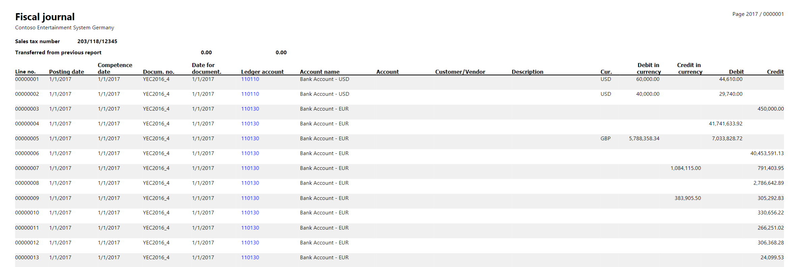
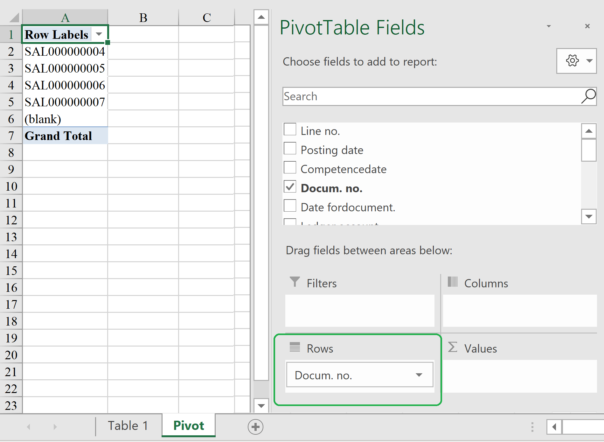

# Fiscal journal report

The Italian **Fiscal journal** report is a monthly report that lists all the vouchers and journal entries in order of posting date. To access it, go to **General ledger** \> **Inquiries and reports** \> **Fiscal journal**.

This report includes fields for the following information:

- Line number
- Posting date
- Competence date
- Document number (voucher number)
- Date for document
- Ledger account number and name
- Customer/vendor account number and name
- Description
- Currency
- Debit or credit amount of the document

> [!NOTE]
> The [One voucher](../general-ledger/one-voucher.md) functionality introduces a limitation on further fiscal journal reporting for some scenarios that are subject to this report. Specifically, a bank statement scenario must be posted by using different vouchers for transactions that have different counteragent accounts. We recommend that you set the **Allow multiple transactions within one voucher** option on the **General ledger parameters** page to **No** in your legal entity if you post transactions that are part of the **Fiscal journal** report. For information about One voucher functionality, see [One voucher](../general-ledger/one-voucher.md).

## Fiscal journal page numbering improvements

You can enable the **(Italy) Fiscal journal page numbering improvements** feature in the **Feature management** workspace.

This feature improves the calculation logic for page numbering on the Italian **Fiscal journal** report. To update and store the page numbers, either print the report to the screen while the **Report PDF Viewer** feature is enabled, or print the report to a file in PDF format. The new algorithm for calculating page numbers is used when the fiscal journal report is printed in PDF format. Page numbers are stored. Therefore, the pages for the next month's report are numbered sequentially, starting from the number after the last stored page number.

This feature also enables an algorithm for grouping lines that have the same column values into one line. Therefore, only the necessary pages are included on the report printout.

If you must calculate the number of documents that are included in the Fiscal journal, follow these steps.

1. Print the report in PDF file format.
2. Convert the PDF to Microsoft Excel format by using conversion software.
3. Create a PivotTable. In the **Rows** field, select **Docum. No.**.

    

The number of documents equals the number of lines in the PivotTable.

[!INCLUDE[footer-include](../../includes/footer-banner.md)]

