# Post arrivals and dispatches for Intrastat

[!include [banner](../includes/banner.md)]

This article provides an example that shows how to post arrivals and dispatches for Intrastat. The example uses the **ITCO** legal entity.

## Setup

1. Import the latest version of the following Electronic reporting (ER) configurations:

    - Intrastat model
    - Intrastat report
    - Intrastat (IT)

    Find more details in [Download ER configurations from the Global repository of Configuration service](../../fin-ops-core/dev-itpro/analytics/er-download-configurations-global-repo.md).

2. In Microsoft Dynamics 365 Finance, define the following number sequences as continuous: **Gene\_397**, **Acco\_16403**, **Gene\_407**, and **PUR\_EU**.

    1. Go to **Organization administration** > **Number sequences** > **Number sequences**.
    2. In the grid, select one of the number sequence codes.
    3. On the Action Pane, select **Edit**.
    4. On the **General** FastTab, in the **Setup** section, set the **Continuous** option to **Yes**.
    5. On the Action Pane, select **Save**.

3. Set a warehouse address.

    1. Go to **Warehouse management** &gt; **Setup** &gt; **Warehouse** &gt; **Warehouses**.
    2. In the list, select warehouse **11**.
    3. On the **Address** FastTab, select **Add**.
    4. In the **New** **address** dialog box, in the **Name** **or** **description** field, enter **Main**.
    5. In the **Country/region** field, select **ITA (Italy)**.
    6. In the **City** field select **Aprilia**.
    7. Select **OK**.

4. Set up transaction codes.

    1. Go to **Tax** > **Setup** > **Foreign trade** > **Transaction codes**.
    2. Select **New**, and set up a transaction code for transfers of property.

        - In the **Transaction code** field, enter **1**.
        - In the **Name** field, enter **Transfer of property**.

    3. Select **New**, and set up a transaction code for returns.

        - In the **Transaction** **code** field, enter **2**.
        - In the **Name** field, enter **Return of goods**.

5.  Set up foreign trade parameters.

    1. Go to **Tax** > **Setup** > **Foreign trade** > **Foreign trade parameters**.
    2. On the **Intrastat** tab, on the **General** FastTab, in the **Transaction** **code** field, select **1**.
    3. In the **Credit note** field, select **2**.
    4. In the **Sales reporting period** field, select **Month**.
    5. In the **Purchase reporting period** field, select **Month**.
    6. On the **Electronic reporting** FastTab, in the **File format mapping** field, select **Intrastat (IT)**.
    7. In the **Reporting format mapping** field, select **Intrastat report**.
    8. In the **Commodity code hierarchy** FastTab, in the **Category hierarchy** field, select **Intrastat**.
    9. On the **Statistical value** FastTab, set the **Print and export statistical data** option to **Yes**.
    10. On the **Country/region properties** tab, verify that the following lines exist.

        | **Party/country/region** | **Intrastat code** | **Currency** | **Country/region type** |
        |--------------------------|--------------------|--------------|-------------------------|
        | ITA                      | IT                 | EUR          | Domestic                |
        | SMR                      | SM                 | EUR          | Special domestic        |

    11. On the toolbar, select **New** to create the following line.

        | **Party/country/region** | **Intrastat code** | **Currency** | **Country/region type** |
        |--------------------------|--------------------|--------------|-------------------------|
        | DNK                      | DK                 | DKK          | EU                      |

6. Set up tax-exempt numbers.

    1. Go to **Tax** > **Setup** > **Sales tax** > **Tax exempt numbers**.
    2. On the Action Pane, select **New** to create the following lines.

        | **Country/region** | **Tax exempt number** | **Company name** |
        |--------------------|-----------------------|------------------|
        | DEU                | DE3456789012          | UE VENDOR        |
        | DNK                | DK0987654321          | Customer ER      |

7. Set the vendor address.

    1. Go to **Accounts payable** &gt; **Vendors** &gt; **All vendors**.
    2. In the grid, select **UE Vendor**.
    3. On the **Addresses** FastTab, select **Add**.
    4. In the **New address** dialog box, in the **Name or description** field, enter **Germany**.
    5. In the **Country/region** field, select **DEU**.
    6. Select **OK** to create the new address.
    7. On the **Invoice and delivery** FastTab, in the **Sales tax** section, in the **Tax exempt number** field, select **All**, and then select **DE1234567890**.
    8. On the Action Pane, select **Save**.

8. Set customer addresses.

    1. Go to **Accounts receivable** > **Customers** > **All customers**.
    2. In the grid, select **ITCO-000001**.
    3. On the **Addresses** FastTab, select **Edit**.
    4. In the **New address** dialog box, in the **Name or description** field, enter **San Marino**.
    5. In the **Country/region** field, select **SMR**.
    6. Select **OK** to create the new address.
    7. On the **Invoice and delivery** FastTab, in the **Invoice** section, in the **Invoice account** field, select **ITCO-000001**.
    8. In the **Number sequence group** field, select **IT\_VENDOM**.
    9. On the Action Pane, select **Save**, and close the page.
    10. On the **All customers** page, in the grid, select **ITCO-000002**.
    11. In the **Addresses** FastTab, select **Add**.
    12. In the **New address** dialog box, in the **Name or description** field, enter **Denmark**.
    13. In the **Country/region** field, select **DNK**.
    14. Select **OK** to create the new address.
    15. On the **Sales demographics** FastTab, in the **Currency** field, select **DKK**.
    16. On the **Invoice and delivery** FastTab, in the **Sales tax** section, in the **Sales tax group** field, select **IT\_PUREU**.
    17. In the **Tax exempt number** field, select **All**, and then select **DK0987654321**.
    18. On the Action Pane, select **Save**.

9. Set up the category hierarchy.

    1. Go to **Product information management** > **Setup** > **Categories and attributes** > **Category hierarchies**.
    2. In the grid, select **Intrastat**.
    3. On the Action Pane, select **New category node**.
    4. In the **Name** field, enter **Service**.
    5. In the **Code** field enter **123456**.
    6. On the Action Pane, select **Save**.

10. Set up products.

    1. Go to **Product Information management** > **Products** > **Released products**.
    2. In the grid, select **ITEM**.
    3. On the **Purchase** FastTab, in the **Administration** section, in the **Vendor** field, select **ITCO-000001**.
    4. On the **Foreign trade** FastTab, in the **Intrastat** section, in the **Commodity** field, select **\[100 200 30\] Speaker**.
    5. In the **Origin** section, in the **Country/region** field, select **DEU**.
    6. In the **State/province** field, select **BE**.
    7. On the **Manage inventory** FastTab, in the **Net measurements** section, in the **Net weight** field, enter **5**.
    8. On the Action Pane, select **Save**.
    9. On the **Released products** page, in the grid, select **Service Item**.
    10. On the **Foreign trade** FastTab, in the **Intrastat** section, in the **Commodity** field, select **\[123456\] Service**.
    11. On the Action Pane, select **Save**.

11. Set up transport methods.

    1. Go to **Tax** > **Setup** > **Foreign trade** > **Transport method**.
    2. On the Action Pane, select **New** to create the following transport methods.

        | **Transport** | **Description** |
        |---------------|-----------------|
        | 1             | Road            |
        | 2             | Air             |

12. Set up a mode of delivery.

    1. Go to **Procurement and sourcing** > **Setup** > **Distribution** > **Modes of delivery**.
    2. On the Action Pane, select **New**.
    3. In the **Mode of delivery** field, enter **1**.
    4. In the **Description** field, enter **Truck**.
    5. On the **Foreign trade** FastTab, in the **Transport** field, select **1 Road**.
    6. On the Action Pane, select **Save**.

13. Set up terms of delivery.

    1. Go to **Accounts payable** > **Setup** > **Terms of delivery**.
    2. In the list, select **CFR**.
    3. On the **General** FastTab, in the **Intrastat code** field, enter **1**.

## Post arrivals for Intrastat

### Purchase goods by using a purchase order

This part of the example shows how to use a purchase order to purchase goods (items) from European Union (EU) countries.

1. Go to **Accounts payable** > **Purchase orders** > **All purchase orders**.
2.  On the Action Pane, select **New**.
3.  In the **Create purchase order** dialog box, in the **Vendor account** field, select **UE Vendor**.
4.  On the **Administration** FastTab, in the **Language** field, select **it**.
5.  Select **OK**.
6.  In the **Header** view, on the **Foreign** **trade** FastTab, verify that the **Transaction code** field is set to **1**.
7.  Verify that the **County of origin/destination** field is set to **RM**.
8.  On the **Delivery** FastTab, in the **Delivery** section, in the **Mode of delivery** field, select **1**.
9.  In the **Delivery terms** field, select **CFR**.
10. In the **Lines** view, on the **Purchase order lines** FastTab, in the **Item number** field, select **Item**.
11. In the **Site** field, select **1**.
12. In the **Warehouse** field, select **11**.
13. In the **Quantity** field, enter **10**.
14. In the **Unit price** field, enter **100**.
15. On the **Setup** tab, in the **Sales tax** section, in the **Item sales tax group** field, select **22%EU**.
16. On the Action Pane, on the **Purchase** tab, in the **Actions** group, select **Confirm**.
17. On the Action Pane, on the **Invoice** tab, in the **Generate** group, select **Invoice**.
18. On the Action Pane, select **Default from**.
19. In the **Default quantity for lines** field, select **Ordered quantity** and the select **OK**.
20. On the **Vendor invoice header** FastTab, in the **Invoice identification** section, in the **Number** field, enter **0001**.
21. In the **Invoice dates** section, in the **Invoice date** field, select **7/9/2021**.
22. On the Action Pane, select **Post** to post the invoice.

### Purchase services by using a vendor invoice

This part of the example shows how to use a vendor invoice to purchase services from EU countries.

1. Go to **Accounts payable** > **Invoices** > **Invoice journal**.
2. On the Action Pane, select **New**.
3. In the **Name** field, select **VEND\_EUINV**.
4. On the Action Pane, select **Lines**.
5. In the **Date** field, enter **7/9/2021**.
6. In the **Account type** field, select **Vendor**.
7. In the **Account** field, select **UE Vendor**.
8. In the **Invoice date** field, select **7/9/2021**.
9. In the **Invoice** field, enter **ITA-0004**.
10. In the **Credit** field, enter **120000**.
11. In the **Offset account** **type** field, select **Ledger**.
12. In the **Offset account** field, select **110130**.
13. In the **Sales tax group** field, select **IT\_PUREU**.
14. In the **Item sales tax group** field, select **22%EU**.
15. On the **Foreign trade** tab, follow these steps:

    1. In the **Transaction code** field, select **1**.
    2. In the **Transport** field, select **2 Air**.
    3. In the **Commodity** field, select **\[123456\] Service**.
    4. In the **Country/region** field, select **ITA**.
    5. In the **State/province** field, select **LAZ**.
    6. In the **County of origin/destination** field, select **LT**.

16. On the Action Pane, select **Post**.
17. Create an Intrastat declaration for arrivals.

    1. Go to **Tax** > **Declarations** > **Foreign trade** > **Intrastat**.
    2. On the Action Pane, select **Transfer**.
    3. In the **Intrastat (Transfer)** dialog box, set the **Vendor invoice** option to **Yes**.
    4. Select **OK** to transfer the transactions, and then review the Intrastat journal.

   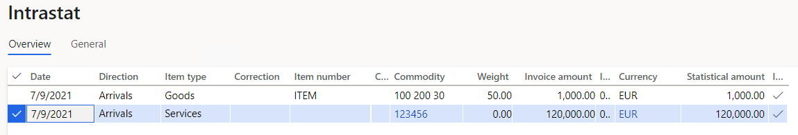

18. Review the **General** tab for the purchase order.

    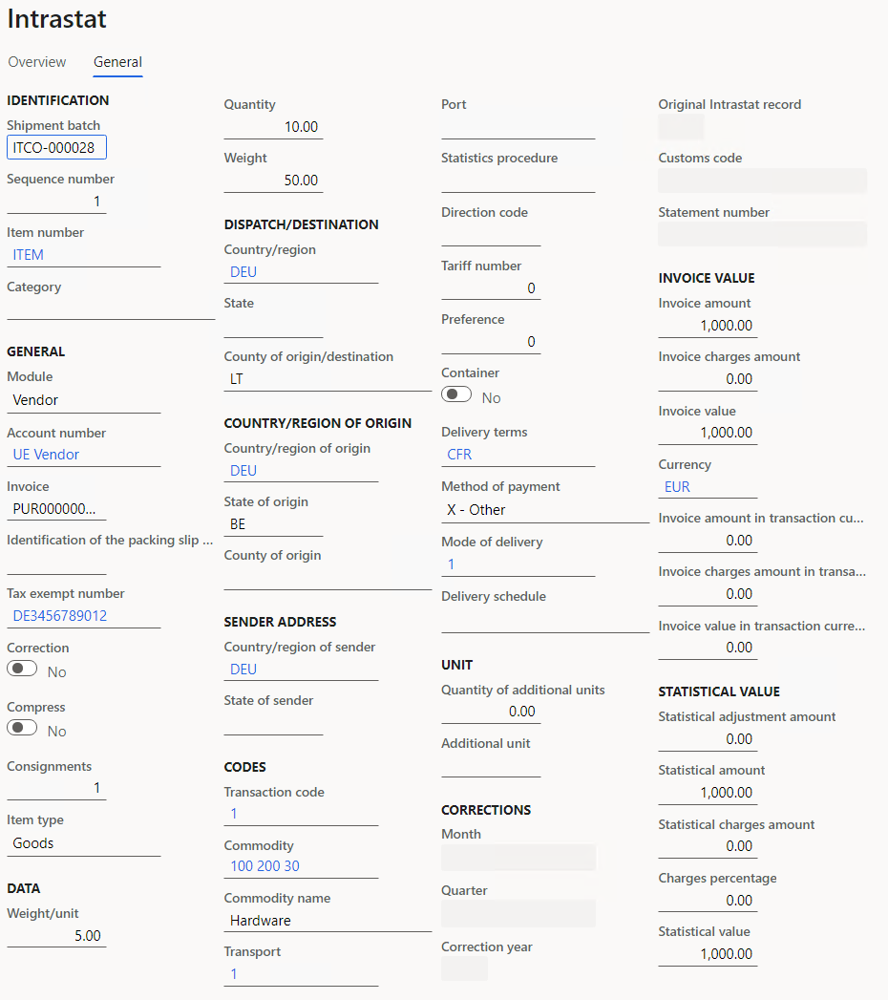

19. Review the **General** tab for the vendor invoice.

    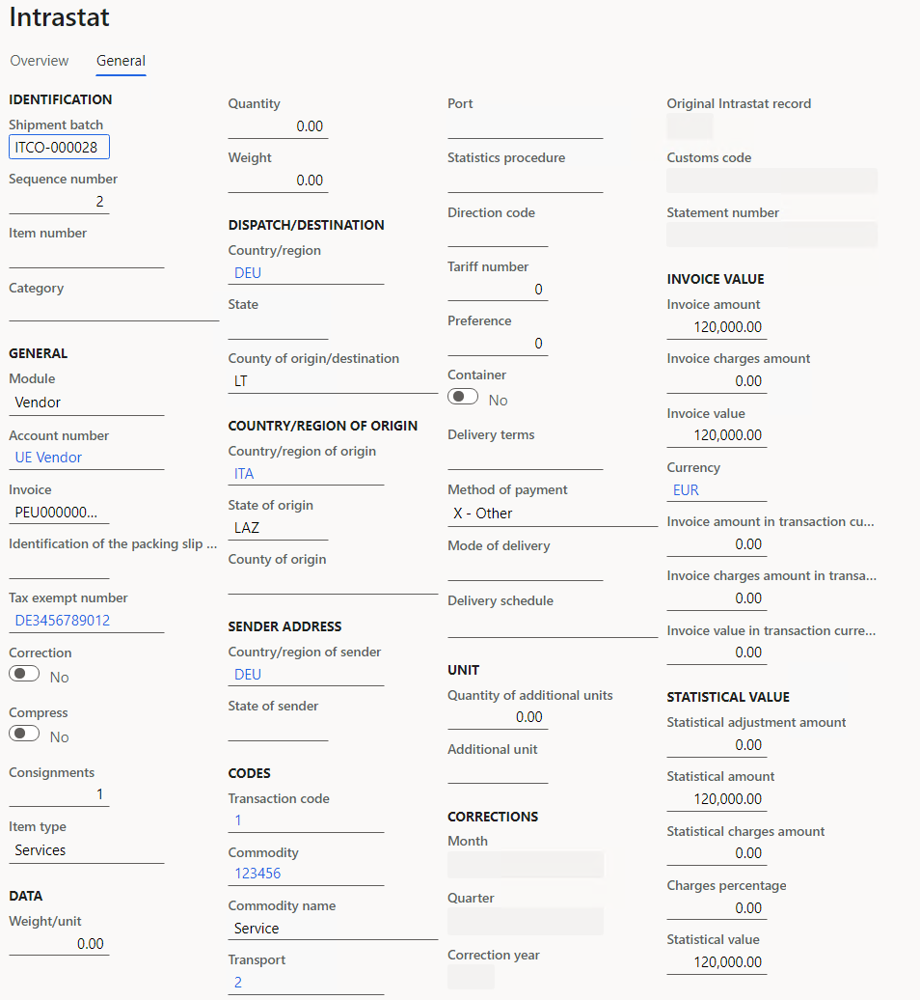

20. Generate the Intrastat report for arrivals.

    1. On the Action Pane, select **Output** > **Report**.
    2. In the **Intrastat Report** dialog box, in the **Date** section, in the **From date** field, select **7/1/2021**.
    3. In the **To date** field, select **7/31/2021**.
    4. In the **Export options** section, set the **Generate file** and **Generate report** options to **Yes**.
    5. In the **File name** field, enter **Arrivals File**.
    6. In the **Report file name** field, enter **Arrivals Report**.
    7. In the **Direction** field, select **Arrivals**.
    8. In the **Reference number** field, enter **123456**.
    9. Select **OK** to generate the Intrastat report and Intrastat file, and review them.

    The following illustration shows an example of an Intrastat report.

    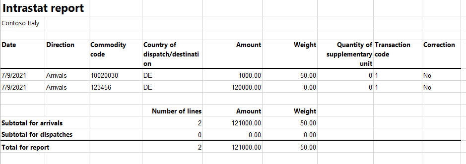

    The following illustration shows an example of an Intrastat file.

    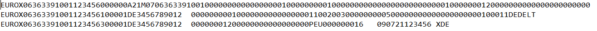

## Post dispatches for Intrastat

### Sell goods by using a sales order

This part of the example shows how to use a sales order to sell goods (items) to European Union (EU) countries.

1. Go to **Accounts receivable** > **Orders** > **All sales orders**.
2. On the Action Pane, select **New**.
3. In the **Create sales order** dialog box, in the **Customer account** field, select **ITCO-000002**.
4. Select **OK**.
5. In the **Header** view, on the **Delivery** FastTab, in the **Misc. delivery info** section, in the **Mode of delivery** field, select **1 Truck**.
6. In the **Delivery terms** field, select **CFR**.
7. In the **Lines** view, on the **Sales order lines** FastTab, in the **Item number** field, select **ITEM**.
8. In the **Quantity** field, enter **50**.
9. In the **Site** field, select **1**.
10. In the **Warehouse** field, select **11**.
11. In the **Unit price** field, enter **250**.
12. On the **Line details** FastTab, on the **Setup** tab, in the **Sales tax** section, in the **Item sales tax group** field, select **22%EU**.
13. On the Action Pane, select **Save**.
14. On the Action Pane, on the **Invoice** tab, in the **Generate** group, select **Invoice** to create the invoice for the order.
15. In the **Posting invoice** dialog box, in the **Parameters** FastTab, in the **Parameter** section, in the **Quantity** field, select **All**.
16. On the **Setup** FastTab, in the **Invoice** **date** field, select **7/9/2021**.
17. Select **OK**.
18. Review the lines in the Intrastat journal.

    1. Go to **Tax** > **Declarations** > **Foreign trade** > **Intrastat**.
    2. On the Action Pane, select **Transfer**.
    3. In the **Intrastat (Transfer)** dialog box, set the **Customer invoice** option to **Yes**.
    4. Select **OK** to transfer the transactions, and review the Intrastat journal. The credit note transaction is marked as a correction and has negative invoice amount.

        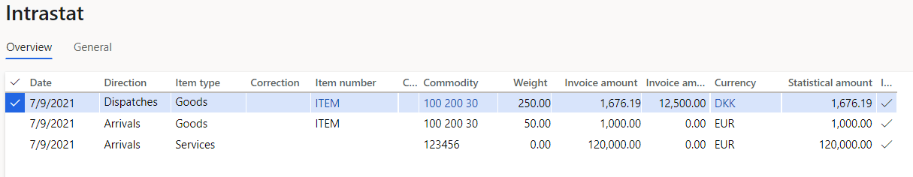

        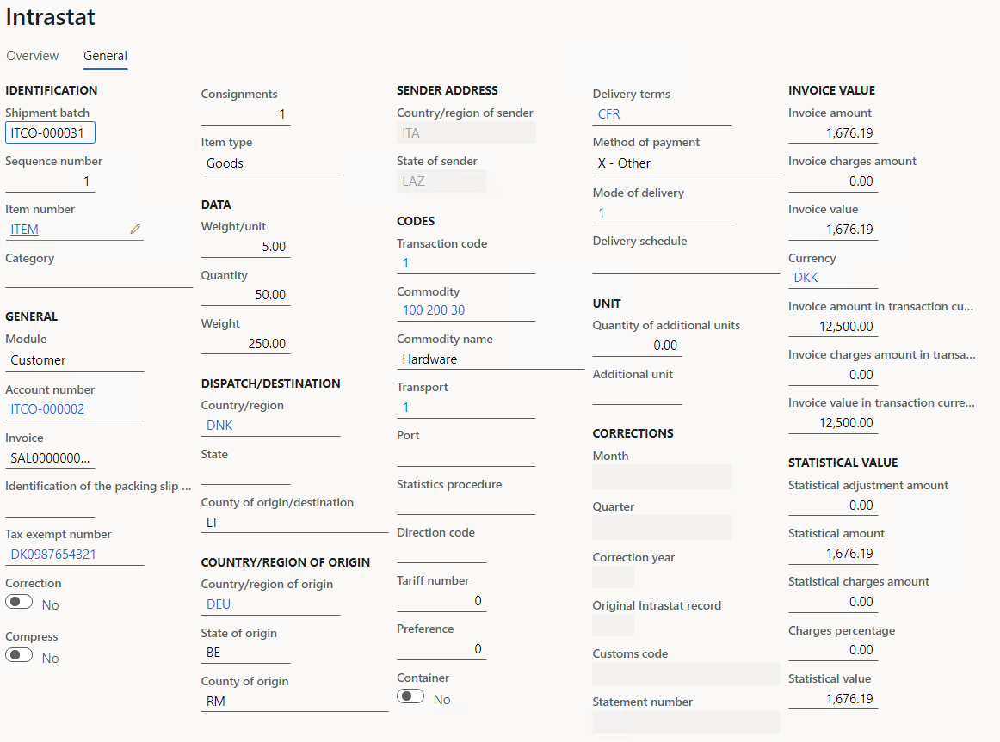

### Return goods by using a credit note

This part of the example shows how to use a credit note to return goods (items) from European Union (EU) countries.

1. Go to **Accounts receivable** > **Orders** > **All sales orders**.
2. On the Action Pane, select **New**.
3. In the **Create sales order** dialog box, in the **Customer account** field, select **ITCO-000002**.
4. Select **OK**.
5. In the **Header** view, on the **Delivery** FastTab, in the **Misc. delivery info** section, in the **Mode of delivery** field, select **1 Truck**.
6. In the **Delivery terms** field, select **CFR**.
7. On the **Foreign trade** FastTab, in the **Transaction code** field, select **2**.
8. On the **Lines** tab, on the **Sales order lines** FastTab, in the **Item number** field, select **ITEM**.
9. In the **Quantity** field, enter **-10**.
10. In the **Site** field, select **1**.
11. In the **Warehouse** field, select **11**.
12. In the **Unit price** field, enter **250**.
13. On the **Line details** FastTab, on the **Setup** tab, in the **Sales tax** section, in the **Item sales tax group** field, select **22%EU**.
14. In the **Returned order** section, in the **Return lot ID** field, select the lot that you created earlier.
15. On the Action Pane, select **Save**.
16. On the Action Pane, on the **Invoice** tab, in the **Generate** group, select **Invoice** to create the invoice for the order.
17. On the **Parameters** FastTab, in the **Parameter** section, in the **Quantity** field, select **All**.
18. In the **Posting invoice** dialog box, on the **Setup** FastTab, in the **Invoice** **date** field, select **7/9/2021**.
19. Select **OK** to post the invoice.
20. Review the lines in the Intrastat journal.

    1. Go to **Tax** > **Declarations** > **Foreign trade** > **Intrastat**.
    2. On the Action Pane, select **Transfer**.
    3. In the **Intrastat (Transfer)** dialog box, set the **Customer invoice** option to **Yes**.
    4. Select **OK** to transfer the transactions, and review the Intrastat journal. The credit note transaction is marked as a correction and has negative invoice amount.

    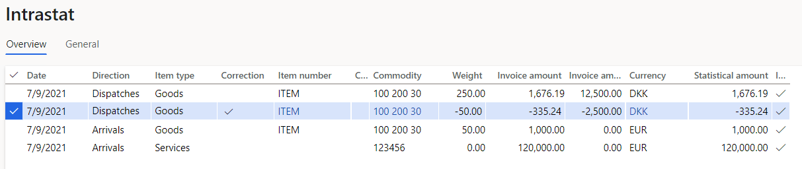

    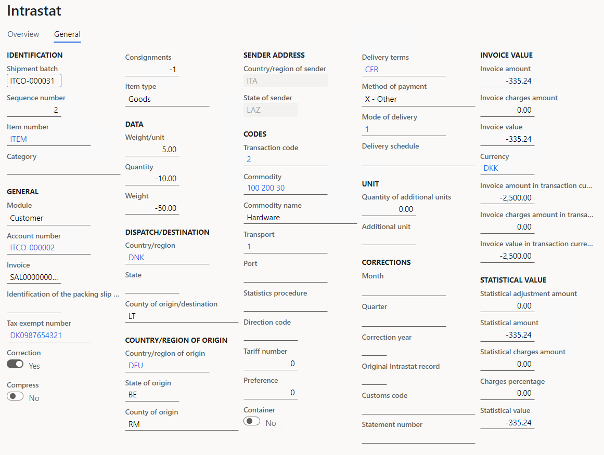

### Sell goods to San Marino by using a sales order

This part of the example shows how to use a sales order to purchase goods (items) to San Marino.

1. Go to **Accounts receivable** > **Orders** > **All sales orders**.
2. On the Action Pane, select **New**.
3. In the **Create sales order** dialog box, in the **Customer account** field, select **ITCO-000001**.
4. Select **OK**.
5. In the **Header** view, on the **Delivery** FastTab, in the **Misc. delivery info** section, in the **Mode of delivery** field, select **1**.
6. In the **Delivery terms** field, select **CFR**.
7. On the **Lines** tab, on the **Sales order lines** FastTab, in the **Item number** field, select **ITEM**.
8. In the **Quantity** field, enter **30**.
9. In the **Site** field, select **1**.
10. In the **Warehouse** field, select **11**.
11. In the **Unit price** field, enter **200**.
12. On the Action Pane, select **Save**.
13. On the Action Pane, on the **Invoice** tab, in the **Generate** group, select **Invoice** to create the invoice for the order.
14. On the **Parameters** FastTab, in the **Parameter** section, in the **Quantity** field, select **All**.
15. In the **Posting invoice** dialog box, on the **Setup** FastTab, in the **Invoice** **date** field, select **7/9/2021**.
16. Select **OK** to post the invoice.
17. Review the lines in the Intrastat journal.

    1. Go to **Tax** > **Declarations** > **Foreign trade** > **Intrastat**.
    2. On the Action Pane, select **Transfer**.
    3. In the **Intrastat (Transfer)** dialog box, set the **Customer invoice** option to **Yes**.
    4. Select **OK** to transfer the transactions, and review the Intrastat journal.

   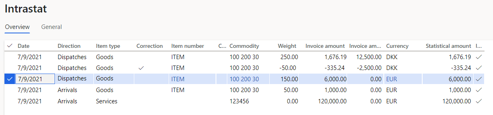

   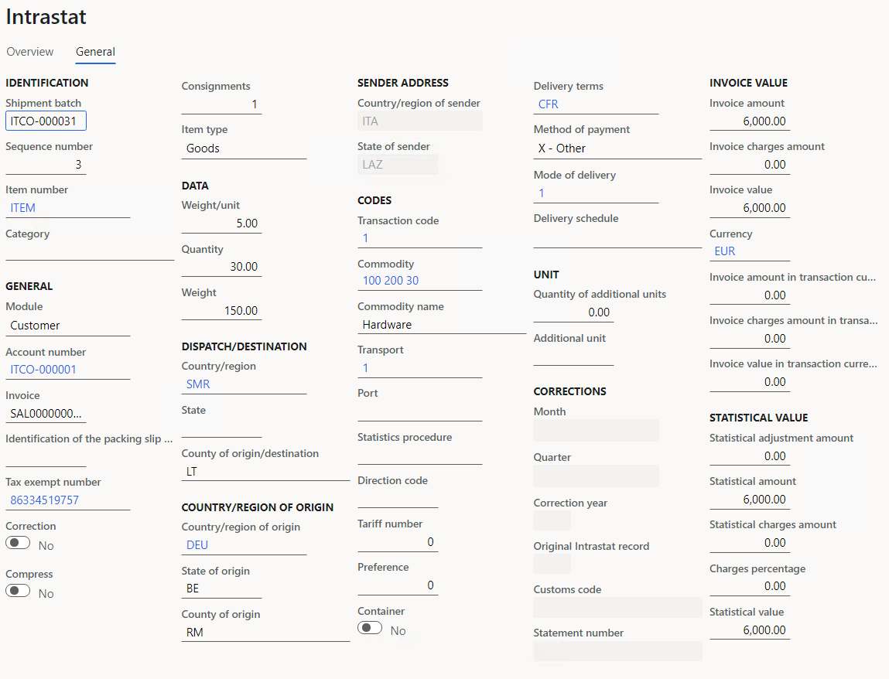

18. Create an Intrastat declaration for dispatches.

    1. Go to **Tax** &gt; **Declarations** &gt; **Foreign trade** &gt; **Intrastat**.
    2. On the Action Pane, select **Output** &gt; **Report**.
    3. In the **Intrastat Report** dialog box, in the **Date** section, in the **From date** field, select **7/1/2021**.
    4. In the **To date** field, select **7/31/2021**.
    5. In the **Export options** section, set the **Generate file** and **Generate report** options to **Yes**.
    6. In the **File name** field, enter **Dispatches File**.
    7. In the **Report file name** field, enter **Dispatches Report**.
    8. In the **Direction** field, select **Dispatches**.
    9. In the **Reference number** field, enter **98754**.
    10. Select **OK** to generate the Intrastat report and Intrastat file.

        The following illustration shows an example of a printed Intrastat report.

        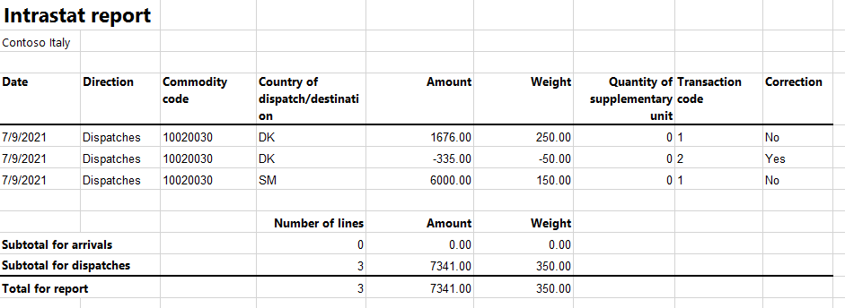

        The following illustration shows an example of a printed Intrastat file.

        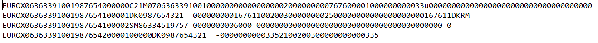
