---
# required metadata

title: Quarterly VAT communication report
description: This topic provides information about Quarterly VAT communication report in Italy.
author: liza-golub
ms.date: 09/15/2021
ms.topic: article
ms.prod: 
ms.technology: 

# optional metadata

audience: Application User
# ms.devlang: 
ms.reviewer: kfend
# ms.tgt_pltfrm: 
# ms.custom: 
ms.search.region: Italy
ms.author: elgolu
# ms.search.industry: 
---

# Quarterly VAT communication report

[!include [banner](../includes/banner.md)]

According to Legislative Decree no. 127/2015, article 1, and Decree Law 78/2010, article 21, **Periodic VAT payment communication** (**Comunicazione IVA periodica con prospetto di liquidazione, LIPE**) information must be transmitted electronically in XML format to the Italian tax authorities.

## Set up the Quarterly VAT communication (LIPE) report

### Prerequisites

Before you set up the **Quarterly VAT communication (LIPE)** report, follow these steps.

1. Go to **Organization administration** \> **Organizations** \> **Legal entities**.
2. On the **Registration numbers** FastTab, in the **Italy** section, in the **Fiscal code** field, enter your organization's fiscal code. (This code has between 11 and 16 digits.)
3. On the **Tax registration** FastTab, in the **Tax exempt number** field, enter your organization's tax exempt number. (This number has 11 digits.)

### Create a number sequence

According to the requirements, the name of the **Quarterly VAT Communication (LIPE)** report must consist of several components:

- An International Organization for Standardization (ISO) 3166-1 alpha-2 country code
- An 11-character or 16-character tax code, followed by an underscore (_)
- A file type (**LI**), followed by an underscore (_)
- A five-character progressive number that consists only of lowercase letters a–z, uppercase letters A–Z, or numbers 0–9

Here are some examples:

- ITAAABBB99T99X999W_LI_00001.xml
- IT99999999999_LI_00002.xml

For the progressive number, a system number sequence is used. Go to **Organization administration** \> **Number sequences** \> **Number sequences**, and create a number sequence. This number sequence must be continuous and five characters long, and it must be alphanumeric (that is, it must consist only of lowercase letters a–z, uppercase letters A–Z, and numbers 0–9).

For example:

   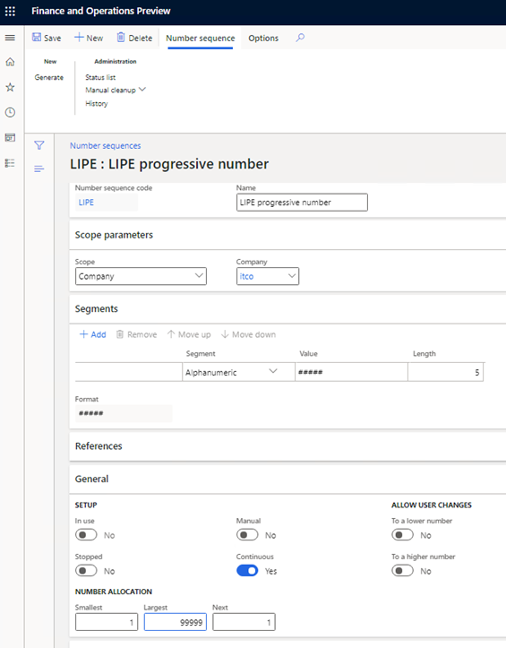

Find more information about how to set up number sequences in [Set up number sequences](/dynamicsax-2012/appuser-itpro/set-up-number-sequences) section.

### Import and update Electronic reporting configurations

1. Import the latest versions of the following Electronic reporting (ER) configurations for the **Quarterly VAT communication** format.

    | Configuration name                        | Type             | Description                                                                                                                             |
    |-------------------------------------------|------------------|-----------------------------------------------------------------------------------------------------------------------------------------|
    | Italian tax reports model                 | Model            | The common data model for Italian tax reports.                                                                                          |
    | Quarterly VAT Communication model mapping | Model mapping    | The model mapping for data collection from Microsoft Dynamics 365 Finance to the Italian **Quarterly VAT Communication (LIPE)** report. |
    | Quarterly VAT Communication               | Exporting format | The ER format for the **Italian Quarterly VAT Communication (LIPE)** report in XML format.                                              |

    For more information, see [Download ER configurations from the Global repository](../../fin-ops-core/dev-itpro/analytics/er-download-configurations-global-repo.md).

    > [!IMPORTANT]
    > Be sure to import the most recent versions of these configurations. The description of each version usually includes the number of the Microsoft Knowledge Base (KB) article that explains the changes that were introduced in that version.

2. After all the ER configurations from the preceding table are imported, set the **Default for model mapping** option to **Yes** for the **Quarterly VAT Communication model mapping** configuration.
3. Go to **Workspaces** \> **Electronic reporting**.
4. Select **Italian tax report model** \> **Quarterly VAT Communication**, and then, on the Action Pane, select **Create configuration**.
5. In the drop-down dialog box, select the **Derive from Name: Quarterly VAT Communication** option, enter a name and description for the new format, and then select **Create configuration**.

    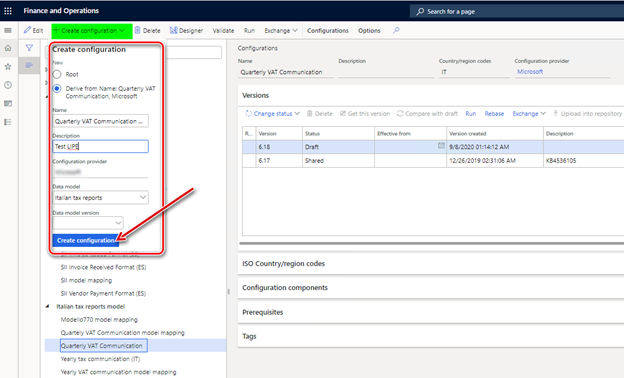

    The new format includes all the fields and mapping from the original. In the new format, you can make changes to meet your company's requirements.

6. Select the new format, and then, on the Action Pane, select **Designer**.

    The **Format designer** page is divided into two parts. The left side shows a format structure (XML scheme), and the right side shows a data model (data).

    For more information about ER, see [Electronic reporting (ER) overview](../../fin-ops-core/dev-itpro/analytics/general-electronic-reporting.md)

    Values for the following tags of the report are collected from tax transactions that are posted in the system. The values consider the specific tax codes that your company uses and the tax directions that are applicable to your company's operations.

    - TotaleOperazioniAttive
    - TotaleOperazioniPassive
    - IvaEsigibile
    - IvaDetratta

    To set up tax codes for the report, on the **Format designer** page, on the **Mapping** tab, expand **Model** \> **AccountingData** \> **MonthlyData**, select the **ActiveVATOperations** node, and then select **Edit**.

    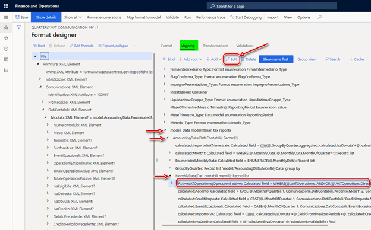

7. In the **'Calculated field' data source properties** dialog box, select **Edit formula**.
8. Update the formula with the tax codes that your company uses and the tax direction that is applicable to your company's operations. Manually define the tax codes as string values. For the tax directions, select values from the **TaxDirection_Type** data source on the left side of the **Formula designer** page.

   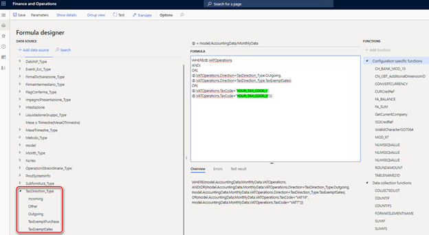

   When the report is generated, the system will use the conditions that are defined for the **ActiveVATOperations** node to calculate values for the **TotaleOperazioniAttive** and **IvaEsigibile** tags of the report.

9. When you've finished editing the formula, save your changes, close the **Formula designer** page, and select **OK** in the **'Calculated field' data source properties** dialog box.
10. On the **Format designer** page, on the **Mapping** tab, expand **Model** \> **AccountingData** \> **MonthlyData**, select the **PassiveVATOperations** node, and then select **Edit**.
11. In the **'Calculated field' data source properties** dialog box, select **Edit formula**.
12. Update the formula with the tax codes that your company uses and the tax directions that are applicable to your company's operations, as you did for the **ActiveVATOperations** node, to define the conditions that the system will use calculate the values for the **TotaleOperazioniPassive** and **IvaDetratta** tags of the report.
13. To specify the number sequence that the system should use for the progressive numbers that are included in the file name for the report file, on the **Format designer** page, on the **Mapping** tab, select **Add root**.
14. In the drop-down dialog box, expand **Dynamics 365 for Operations**, and then select **Number sequence**.

      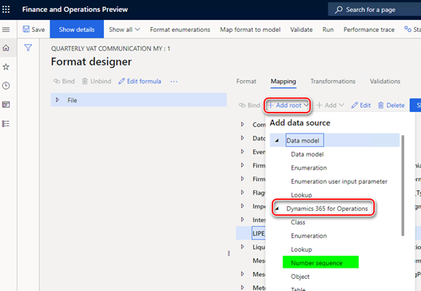

15. Enter a name, select the number sequence that you created earlier, and then select **OK** to create the number sequence.

       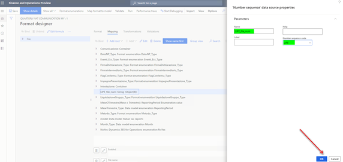

16. On the **Format designer** page, select **File** on the left side, and then, on the **Mapping** tab, select the **Edit** button (pencil symbol) for the **File name** field.

    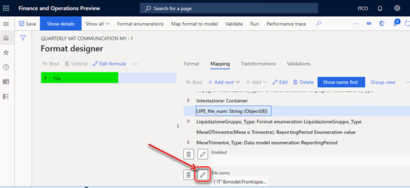

17. Update **"IT"&model.Frontispiece.FiscalCode&"_LI_00000"** with a formula that includes a link to the new number sequence:
    
      - **"IT"&model.Frontispiece.FiscalCode&"_LI_"&LIPE_file_num**. Here, **LIPE_file_num** is the name that you gave to the number sequence. To add **LIPE_file_num** to the formula, click **Add data source**. When you've finished, select **Save**.

      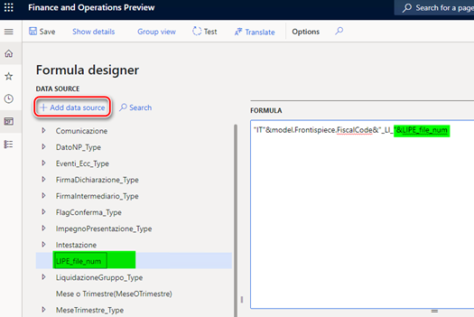

18. Save your changes in the ER format, and complete the configuration.

### Update input parameters

The values of some format tags must be filled in manually. The tags are included in the report dialog box so that you can set the values.

By default, the **Quarterly VAT Communication** format includes all possible parameters. To add, delete, or update parameters in the report dialog box, on the **Format designer** page, on the **Mapping** tab, switch to **Group view**, and then select the **Empty containers** element.

   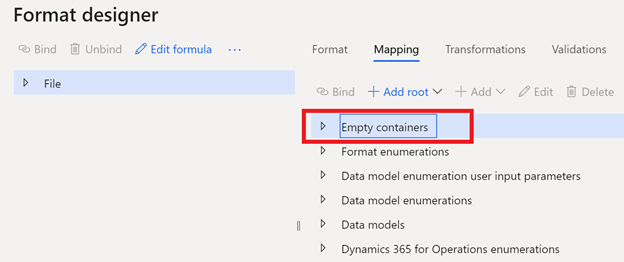

The **Empty containers** element includes all the input parameters for the report. Before you delete an input parameter, you must unbind it or update the mapping for the corresponding field. Expand the format structure tree on the left side of the **Format designer** page, find the corresponding field, and delete or update the binding.

To add an input parameter, add it in the corresponding node in the **Empty containers** element, select a tag in the format structure tree, and then select **Bind**.

   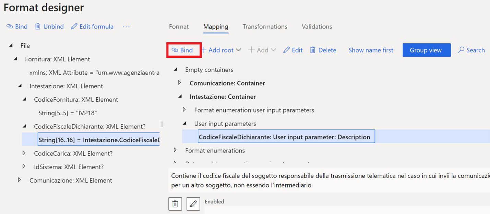

When you've finished updating the format, save, close, and complete it.

### Set up General ledger parameters

A new menu item for the **Quarterly VAT communication (LIPE)** report must be associated with the format that you created and updated for your legal entity.

1. Go to **Tax** > **Setup** > **Parameters** > **General ledger parameters**.
2. On the **Sales tax** tab, on the **Quarterly VAT communication** FastTab, in the **Format mapping** field, select the **Quarterly VAT Communication** format that you created.

    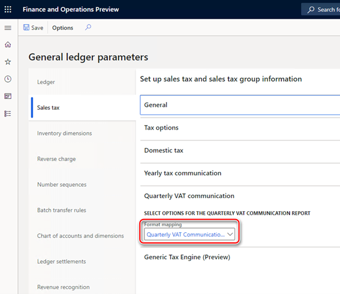

## Generate a Quarterly VAT communication (LIPE) report

1. Go to **Tax** \> **Declarations** \> **Sales tax** \> **Quarterly VAT communication**.
2. In the **Electronic report parameters** dialog box, set the parameters that are described in the following table.

    | Field                    | Description                                                                                                                                                                                                                                                                                                                                       | Example value    |
    |--------------------------|---------------------------------------------------------------------------------------------------------------------------------------------------------------------------------------------------------------------------------------------------------------------------------------------------------------------------------------------------|------------------|
    | Anno                     | Enter the year to generate the report for.                                                                                                                                                                                                                                                                                                        | 2018             |
    | Periodo di liquidazione  | Select the sales tax settlement period to generate the report for.                                                                                                                                                                                                                                                                                | MON              |
    | Trimestre                | Select the quarter to generate the report for.                                                                                                                                                                                                                                                                                                    | IV               |
    | Mese o Trimestre         | Select one of the following options:                                                                                                                                                                                                                                                                                                              | Month            |
    | CodiceFiscaleDichiarante | Enter the fiscal code of the declarant. The fiscal code is a 16-character alphanumeric value. If this field isn't applicable to your company, leave it blank. If you enter a value in this field, you must also select a value in the **CodiceCarica** field.                                                                                     | 1234567891234567 |
    | CodiceCarica             | If you entered a value in the **CodiceFiscaleDichiarante** field, select the position code that corresponds to that fiscal code.                                                                                                                                                                                                                  | 1                |
    | PIVAControllante         | Enter the VAT registration number of the company or authority that performs controls in the event of group payment or settlement. The VAT registration number is an 11-character alphanumeric value. If this field isn't applicable to your company, leave it blank. (Law reference: last clause of article 73)                                   | 12345678912      |
    | UltimoMese               | Enter one of the following values to specify the last month of control in the event of an interruption of group payment: **1**, **2**, **3**, **4**, **5**, **6**, **7**, **8**, **9**, **10**, **11**, **13**, or **99**. If this field isn't applicable to your company, select **Non applicabile**. (Law reference: last clause of article 73) | 1                |
    | LiquidazioneGruppo       | If the communication is related to an interruption of group payment, enter **1**. If it isn't related to an interruption of group payment, enter **0**. If this field isn't applicable to your company, select **Non applicabile**. (Law reference: last clause of article 73)                                                                    | 1                |
    | CFDichiarante            | Enter the fiscal code of the declarant that undertakes the communication. The fiscal code is a 16-character alphanumeric value. If this field isn't applicable to your company, leave it blank.                                                                                                                                                   | 1234567891234567 |
    | CodiceCaricaDichiarante  | Enter the position code of the declaring subject. The position code is a numeric value. If this field isn't applicable to your company, leave it blank.                                                                                                                                                                                           | 1                |
    | CodiceFiscaleSocieta     | Enter the tax code of the declarant company. The tax code is an 11-character alphanumeric value. Although it's usually the same as the VAT number, it can differ in some cases. If this field isn't applicable to your company, leave it blank.                                                                                                   | 12345678901      |
    | FirmaDichiarazione       | If the communication is signed by the taxpayer, select **0**. If it’s signed by the person who has the legal or contractual representative power, select **1**.                                                                                                                                                                                   | 0                |
    | CFIntermediario          | Enter the fiscal code of the intermediary that is in charge of transmission. The fiscal code is a 16-character alphanumeric value. If this field isn't applicable to your company, leave it blank. If you enter a value in this field, you must also enter values in the **DataImpegno** and **FirmaIntermediario** fields.                       | 1234567891234567 |
    | ImpegnoPresentazione     | If the communication is prepared by the contributor, select **1**. If it's prepared by the sender, select **2**. If this field isn't applicable to your company, select **Not applicable**.                                                                                                                                                       | 1                |
    | DataImpegno              | If you entered a value in the **CFIntermediario** field, enter the corresponding date in the format ddMMyyyy.                                                                                                                                                                                                                                     | 31012019         |
    | FirmaIntermediario       | If you entered a value in the **CFIntermediario** field, enter **1** if the intermediary's signature is present. If it isn't present, enter **0**.                                                                                                                                                                                                | 0                |
    | FlagConferma             | If you intend to transmit a communication even if it doesn't pass any compliance check, select **1**. If you don't intend to transmit a communication in this situation, select **0**.                                                                                                                                                            | 0                |

    - **Quarter**: Generate an XML file that contains one **Modulo** block that is related to the selected quarter.
    - **Month**: Generate an XML file that contains three **Modulo** blocks, each of which is related to one month of the selected quarter.

3. For the parameters that are described in the following table, if you selected **Month** in the **Mese o Trimestre** field in the previous step, enter values for **Mese1**, **Mese2**, and **Mese3**, which correspond to the months of the selected quarter. If you selected **Quarter** in the **Mese o Trimestre** field, enter values for **Trimestre**, which corresponds to the selected quarter.

    | Field                                                  | Description                                                                                                                                                       | Example value |
    |--------------------------------------------------------|-------------------------------------------------------------------------------------------------------------------------------------------------------------------|---------------|
    | Subfornitura                                           | If the contributor used the provided benefits, select **1**. If the contributor didn't use them, select **0**. (Law reference: article 74, clause 5)              | 0             |
    | EventiEccezionali                                      | This field is reserved for subjects that used VAT fiscal benefits during the reference period. The possible values are **1** and **9**.                           | 1             |
    | VersamentiAutoUE                                       | Enter the total tax deposit for the first internal vehicle transfer. Enter the value in numeric format, and use a comma (,) as the decimal separator.             | 10000,98      |
    | CreditiImposta                                         | Enter the total specific tax credits that were used during the reference period. Enter the value in numeric format, and use a comma (,) as the decimal separator. | 10000,98      |
    | InteressiDovuti                                        | Enter the total interest for the quarterly payment. Enter the value in numeric format, and use a comma (,) as the decimal separator.                              | 10000,98      |
    | Acconto                                                | Enter the total down payment, even if it wasn't actually deposited. Enter the value in numeric format, and use a comma (,) as the decimal separator.              | 10000,98      |
    | Metodo                                                 | Select the code for the method that is used to determine the down payment:                                                                                        | 1             |
    | Operazioni straordinarie                               | For cases that involve extraordinary operations, enter **1**. Otherwise, enter **0**.                                                                             | 0             |
    | TotaleOperazioniPassive includes non-deductible amount | Select this check box if the taxable amount in the **TotaleOperazioniPassive** field includes a non-deductible amount.                                            | Selected      |

    - **1**: Historical
    - **2**: Forecast
    - **3**: Analytical – effective
    - **4**: Entities that operate in sectors such as telecommunications, water supply, electricity, waste collection, and disposal sectors

4.  Select **OK** to generate the report.

[!INCLUDE[footer-include](../../includes/footer-banner.md)]
