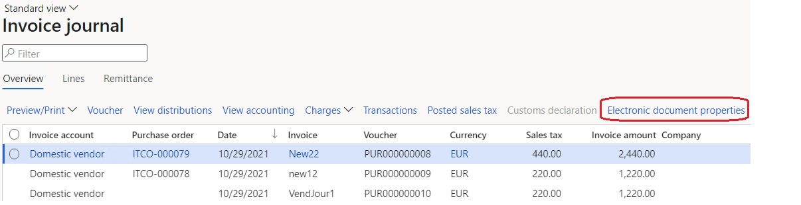

---
# required metadata

title: Vendor electronic invoices
description: This topic explains how to configure and submit vendor electronic invoices in Italy.
author: ikondo
ms.date: 12/01/2021
ms.topic: article
ms.prod: 
ms.technology: 

# optional metadata

ms.search.form: 
# ROBOTS: 
audience: Application User
# ms.devlang: 
ms.reviewer: kfend
ms.search.scope: Core, Operations
# ms.tgt_pltfrm: 
ms.custom: 3984823
ms.search.region: Italy
# ms.search.industry: 
ms.author: ilyako
ms.search.validFrom: 2021-12-01
ms.dyn365.ops.version: 10.0.21

---

# Vendor electronic invoices

[!include [banner](../includes/banner.md)]

According to Italian legislation, invoices that are received from foreign vendors that aren't Italian tax residents must be submitted to the Exchange system (SDI). This topic explains how configure and submit vendor electronic invoices in the **FatturaPA** electronic format.

## Prerequisites

- The primary address of the legal entity must be in Italy.
- The export of vendor electronic invoices must be implemented symmetrically to the export of Italian customer electronic invoices, and it must use the common parameters that are defined on the **Electronic invoice parameters** page in Accounts receivable. Those parameters must be configured in advance. For more information, see [Customer electronic invoices](emea-ita-e-invoices.md).

## Configure Accounts payable parameters 

Follow these steps to set up the electronic invoice configuration in Accounts payable parameters.

1. Go to **Accounts payable** \> **Setup** \> **Accounts payable parameters**.
2. On the **Electronic documents** tab, in the **Vendor invoice (export)** field, select the **Vendor invoice (IT)** configuration. This configuration is used to generate the XML files for the export of vendor electronic invoices.

   

   > [!NOTE]
   > Configurations must be imported before they can be selected. For more information, see [Download ER configurations from the Global repository of Configuration service](../../fin-ops-core/dev-itpro/analytics/er-download-configurations-global-repo.md).
   >
   > The parent model configuration, **Invoice model**, and the related model mapping configuration, **Vendor invoice model mapping (IT)**, will automatically be imported or updated.

## Enable electronic invoice generation

Follow these steps to enable the eInvoice register and the generation of electronic invoice for a vendor.

1. Go to **Accounts payable** \> **All vendors**.
2. Select and open the record of the vendor to enable the eInvoice register for. 
2. On the **Invoice and delivery** FastTab, in the **E-invoice** section, turn on the **eInvoice register** option to enable electronic invoice generation for the selected vendor.

## Configure invoice types 

The invoice type is a mandatory attribute of electronic invoices. It must be assigned to an electronic invoice before that invoice is submitted to the Exchange system.

### Define invoice types 

Follow these steps to define one or more invoice types.

1. Go to **Accounts receivable** \> **Setup** \> **Electronic invoice parameters**. 
2. On the **Invoice types** tab, define codes for one or more required invoice types, and enter a description of each.

   

### Assign invoice types to sales tax codes

You can associate invoice types with specific sales tax codes. 

1. Go to **Tax** \> **Indirect taxes** \> **Sales tax** \> **Sales tax codes**.
2. On the **General** FastTab, in the **Invoice type** field, enter the reference to a specific invoice type.

   

## Invoice types processing

Invoice types that are associated with the sales tax code that is used on an invoice are automatically entered in the **TipoDocumento** tag of the XML file that is generated for the electronic invoice.

If no invoice type is associated with the sales tax code, the following types of vendor invoice documents will automatically be entered:

- **TD16** – For vendors that are located in Italy, if an invoice contains a sales tax code where either **Use tax** or **Reverse charge** is activated.
- **TD17** – For vendors that are located in the European Union (EU), if an invoice is issued for the provision of **services**.
- **TD18** – For vendors that are located in the EU, if an invoice is issued for the sale of **products**.

If a required invoice type isn't entered, you can manually adjust the invoice type in the vendor invoice journal.

### Configure electronic document properties

1. Go to **Accounts receivable** > **Setup** > **Electronic document property types**.
2. Select **New** to add a property type.
2. In the **Type** field, enter **DocumentType**. 
3. Select **Applicability** to add an applicable table. 
4. On the **Electronic document property type applicability setup** page, in **Table name** field, select **Vendor invoice journal**.
5. Save and return to the **Electronic document property types** page.

   

### Register invoice types

Follow these steps to register invoice types.

1. Go to **Accounts payable** \> **Inquiries and reports** \> **Invoice** \> **Invoice journal**.
2. Select an invoice in the list, and then select **Electronic document properties**.

    

3. Enter a required invoice type. The value of the **Value** field for the invoice type overrides any automatically created codes when XML files are generated for electronic invoices.

    

## Process vendor electronic invoices

To view all electronic invoices for vendors and perform various actions, go to **Accounts payable** > **Invoices** > **E-Invoices** > **Electronic invoices**. The functionality resembles the functionality for processing customers electronic invoices. For more information, see [Electronic invoice register](emea-ita-e-invoices.md#einvoiceregister).

[!INCLUDE[footer-include](../../includes/footer-banner.md)]
