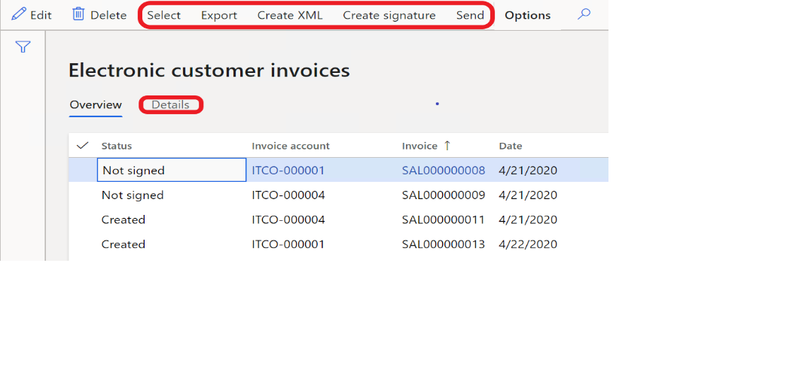

---
# required metadata

title: Vendor electronic invoices in Italy
description: This topic explains how to configure and submit vendor electronic invoices in Italy.
author: ikondo
ms.date: 10/27/2021
ms.topic: article
ms.prod: 
ms.technology: 

# optional metadata

ms.search.form:  
# ROBOTS: 
audience: Application User
# ms.devlang: 
ms.reviewer: kfend
ms.search.scope: Core, Operations
# ms.tgt_pltfrm: 
ms.custom: 3984823
ms.search.region: Italy
# ms.search.industry: 
ms.author: ilyako
ms.search.validFrom: 2021-12-01
ms.dyn365.ops.version: 10.0.21

---

# Vendors electronic invoices export

[!include [banner](../includes/banner.md)]

This topic describes how to set up and work with the functionality for creating and sending sales invoices and project invoices in an electronic format (FatturaPA).

As of version 1.2 of the FatturaPA format, electronic invoices can be used for all types of businesses. These types include public administrations, private companies, and professionals.

## Prerequisites

The primary address of the legal entity must be in Italy.

This topic contains the following information:

- [Setup information](#setup)
- [Maintaining related base documents](#relateddoc)
- [Overview of the Electronic invoice register](#einvoiceregister)
- [Additional functionality that affects the XML file](#additionalfunctionality)

## Setup

> [!NOTE]
> The **Electronic invoices** page (**Project management and accounting** \> **Project invoices** \> **E-invoices** \> **Electronic invoices**) resembles the **Electronic customer invoices** page and has the same functions.

[!INCLUDE[footer-include](../../includes/footer-banner.md)]

