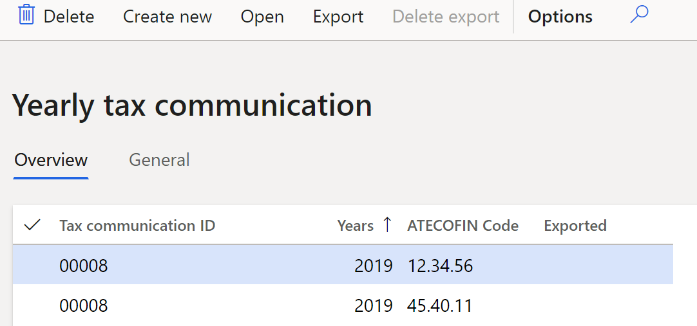

# Yearly tax communication

[!include [banner](../includes/banner.md)]

The **Yearly tax communication** report contains annual tax information for Italy that will be submitted to the tax authority.

## Prerequisites

Set up Italian sales tax books by following the instructions in [Italian sales tax books](emea-ita-fiscal-books.md#set-up-sales-tax-books).

## Set up the Yearly tax communication report

1. In Dynamics 365 Finance, go to **Organization administration** \> **Organizations** \> **Legal entities**.
2. On the **Registration numbers** FastTab, in the **Tax registration number** field, enter the tax registration number of your company.
3. On the **Tax registration** FastTab, in the **Fiscal code** field, enter the fiscal code of your company.
4. In [Microsoft Dynamics Lifecycle Services (LCS)](https://lcs.dynamics.com/V2), in the Shared asset library, download the latest versions of the Electronic reporting (ER) configurations for the following value-added tax (VAT) declaration formats:

    - **Italian tax reports model**
    - **Yearly tax communication (IT)**
    - **Yearly VAT communication model mapping**

For more information, see [Download Electronic reporting configurations from Lifecycle Services](../../fin-ops-core/dev-itpro/analytics/download-electronic-reporting-configuration-lcs.md).

5. In Finance, go to **Tax \> Setup \> Parameters \> General ledger parameters**.
6. On the **Number sequences** tab, select a number sequence for the **Tax communication ID** reference.
7. On the **Sales tax** tab, on the **Yearly tax communication** FastTab, in the **Format mapping** field, select the **Yearly tax communication (IT)** format that you downloaded earlier.
8. Go to **Tax \> Setup \> Sales tax \> Yearly tax communication setup**.

> [!NOTE]
> To view the "Yearly VAT communication" form for the year 2020, and instructions for it, see [Model and instructions - VAT 2020](https://www.agenziaentrate.gov.it/portale/web/guest/iva-2020/modello-e-istruzioni).

9. On the **Field setup** tab, create lines, and set the following fields on them.

    | Field     | Description                             |
    |-----------|-----------------------------------------|
    | Field ID                | Enter the identification number   of the field.   |
    | Description             | Enter   a description of the field. |
    | Format                  | Select   the required format of the field. For more information about the available   formats, see the [Formats of the fields](#formats) section later in this   article. |
    | Calculation             | Select a calculation method:    - **Manual** - The value is manually entered.  - **Tax   transaction** - The value is collected from the tax transactions.  -   **Total** - The value is calculated by using a formula that consists fo the   values of other fields (but only fields where the **Calculation** field isn't   selected). |
    | Value                   | Enter   a value for the field. You can edit this value only when   the **Calculation** field is set to **Manual**.    |
    | Tax                     | Select one of the following   values:  - **Tax base** - The field should represent a tax base.    - **Tax amount** - The field should represent a tax amount.   You can edit this value only when the **Calculation** field is set   to **Tax transactions**.  |
    | Sign                    | Enter **1** if the value should   be represented as is. Enter **-1** if the value should be inverted.     You can edit this value only when the **Calculation** field is set   to **Tax transactions** or **Total**.  |
    | Nondeductible sales tax | If   the **Calculation** field is set to **Tax transaction**, and   the **Tax** field is set to **Tax amount**, select this checkbox to   reduce the calculated tax amount on the non-deductible tax amount.    |

> [!NOTE]
> If any changes are made in the declaration, you must change the field settings.

10. For fields where the **Calculation** field is set to **Tax transactions**, on the **Selected tax codes** tab, select **New** to a add a line for each sales tax code that should be available as a field value.

    

11. Select **Exceptions** to set up main accounts that should be excluded from the query.

    Create enough unique sales tax codes so that each is linked to a single field in the yearly declaration. This approach helps simplify the setup of the yearly declaration.

    However, if the same sales tax code can be linked to multiple fields, you should set up additional filters for the tax transaction.

12. Select **Query**, and specify additional filtering rules for posted sales tax. For example, you can specify additional filters for the sales tax direction or sales tax book section.

You can do the following additional setup for fields where the **Calculation** field is set to **Total**. The system can then automatically calculate values for tags that should represent a result that is calculated by using a formula that consists of the values of other fields (but only fields where the **Calculation** field isn't set to **Total**).

13. Select the line where the **Calculation** field is set to **Total**.
14. On the **Total amount** tab, select **New** to add lines for all fields that should be totaled.

    

15. Set the following fields.

    | Field name | Description                                                                                                                 |
    |------------|-----------------------------------------------------------------------------------------------------------------------------|
    | Sign       | Enter **1** if the value from the field should be taken as is. Enter **-1** if the value from the field should be inverted. |
    | Field ID   | Select the field that should be totaled. Fields where the **Calculation** field is set to **Total** can't be selected here. |

###  Formats of the fields

Usually, fields values can be either numeric (**NU** format) or alphanumeric (**AN** format).

- **Numeric (NU)** – These values are amounts. They are right-aligned and have a fixed length of 16 characters. Space characters are used for padding,
- **Alphanumeric (AN)** – These values are strings. They are left-aligned and have a fixed length of 16 characters. Space characters are used for padding.

In the **Format** column, you can specify a field format. In addition to **NU**and **AN**, the following formats are available for selection.

| Format | Description                                                                                                                                               | Padding character | Example                                    |
|--------|-----------------------------------------------------------------------------------------------------------------------------------------------------------|-------------------|--------------------------------------------|
| CF     | Fiscal code (16 characters)                                                                                                                               | Space             | "XXXXXX11X11X111X"                         |
| PI     | Tax-exempt number (11 characters)                                                                                                                         | Space             | "11111111111"                              |
| CN     | Numeric fiscal code (11 characters)                                                                                                                       | Space             | "11111111111"                              |
| PN     | Automotive abbreviation for the Italian province (for example, the province of birth), a space symbol and the value "EE" for foreign countries or regions | Space             | "BO   "                                    |
| Nx     | Like **NU**, but represents formats such as **N1**, **N2**, and **N3** in official guidelines                                                             | Space             | "            1234"                         |
| CB     | Check box, where the values are **1** for a selected state and **0** for a cleared state                                                                  | Not applicable    | "1"                                        |
| NN     | Positive amount (11 characters) or negative amount (11 characters)                                                                                        | Space             | "       1234" "      -1234"                |
| DT     | Date in DDMMYYYY format                                                                                                                                   | Not applicable    | "01012020"                                 |
| DA     | Date in YYYY format                                                                                                                                       | Not applicable    | "2020"                                     |
| NP     | Positive numeric field                                                                                                                                    | Space             | "            1234"                         |
| PC     | Percentage and rate that have a maximum of three decimal places                                                                                           | Space             | "   100" "   33,333"                       |
| PR     | Automotive abbreviation for the Italian province (for example, the province of residence)                                                                 | Space             | "BO   "                                    |
| QU     | Numeric field that has a maximum of five decimal places                                                                                                   | Space             | "    1000,16234" "   0,99" "   3000000,50" |

## Create a yearly tax declaration

1. Go to **Tax \> Declarations \> Sales tax \> Yearly tax communication**.
2. Select **Create new** to create header information for the **Yearly tax communication** report for the previous year. The number of lines that are created matches the number of Italian sales tax books.

3. On the **General** tab, review the following information.

    | Field                | Description                                                                                                                                                                                                                                                                                                                |
    |----------------------|----------------------------------------------------------------------------------------------------------------------------------------------------------------------------------------------------------------------------------------------------------------------------------------------------------------------------|
    | Tax communication ID | The identification number of the **Yearly tax communication** report.                                                                                                                                                                                                                                                      |
    | Years                | The year of the tax communication. This field is automatically set to the previous year. For example, if you're creating the report in 2020, this field is set to **2019**.                                                                                                                                                |
    | ATECOFIN Code        | The tax code that is associated with the classification of possible company activities. This field is filled in from the **Italian sales tax books** page. For more information, see [Italian sales tax books](/dynamics365/finance/localizations/emea-ita-fiscal-books#set-up-sales-tax-books). |
    | Exported             | A value that indicates whether the .ivc file has been exported. This field and the next two fields are automatically set when you select **Export and generate file**.                                                                                                                                                     |
    | Date of export       | The date when the .ivc file was exported.                                                                                                                                                                                                                                                                                  |
    | Export file name     | The name of the .ivc file that was exported.                                                                                                                                                                                                                                                                               |

4. Select the required line, and then select **Open** to open the **Yearly tax communication** page, which has the information about the selected declaration.
5. On the **Header** tab, review the following information.

<table>
<tbody>
<tr>
<td>

<strong>Field</strong>

</td>
<td>

<strong>Description</strong>

</td>
</tr>
<tr>
<td>

<strong>Tax communication ID</strong>, <strong>ATECOFIN Code</strong>, and <strong>Years</strong>

</td>
<td>

These fields are set as described in the previous table.

</td>
</tr>
<tr>
<td>

<strong>Company information</strong> section

</td>
<td>

Review the information about the company.

</td>
</tr>
<tr>
<td>

<strong>Company name</strong>

</td>
<td>

The name of the company that the <strong>Yearly tax communication</strong> report is created for.

</td>
</tr>
<tr>
<td>

<strong>Fiscal code</strong>

</td>
<td>

The fiscal code of the company.

</td>
</tr>
<tr>
<td>

<strong>Company tax registration number</strong>

</td>
<td>

The tax registration number of the company.

</td>
</tr>
<tr>
<td>

<strong>Declarer</strong> section

</td>
<td>

Enter information about declarer.

</td>
</tr>
<tr>
<td>

<strong>Type of declarer</strong>

</td>
<td>

Select the type of declarer:

&middot;&nbsp;&nbsp;&nbsp;&nbsp;&nbsp;&nbsp; <strong>Filing for same legal entity</strong>

&middot;&nbsp;&nbsp;&nbsp;&nbsp;&nbsp;&nbsp; <strong>Filing through fiscal assistance center (CAF)</strong>

</td>
</tr>
<tr>
<td>

<strong>CAF fiscal code</strong>

</td>
<td>

If you selected <strong>Filing through fiscal assistance center (CAF)</strong> in the <strong>Type of declarer</strong> field, enter the fiscal code of the fiscal assistance center.

</td>
</tr>
<tr>
<td>

<strong>CAF obligation</strong>

</td>
<td>

If you selected <strong>Filing through fiscal assistance center (CAF)</strong> in the <strong>Type of declarer</strong> field, select one of the following values:

&middot;&nbsp;&nbsp;&nbsp;&nbsp;&nbsp;&nbsp; <strong>Declaration prepared by legal entity</strong>

&middot;&nbsp;&nbsp;&nbsp;&nbsp;&nbsp;&nbsp; <strong>Declaration prepared by declarer</strong>

</td>
</tr>
<tr>
<td>

<strong>CAF inscription number</strong>

</td>
<td>

If you selected <strong>Filing through fiscal assistance center (CAF)</strong> in the <strong>Type of declarer</strong> field, enter the inscription number of the fiscal assistance center.

</td>
</tr>
<tr>
<td>

<strong>CAF transmission date</strong>

</td>
<td>

If you selected <strong>Filing through fiscal assistance center (CAF)</strong> in the <strong>Type of declarer</strong> field, enter transmission date.

</td>
</tr>
<tr>
<td>

<strong>Writer</strong> section

</td>
<td>

Specify information about the declarer, if the declarer differs from the taxpayer.

</td>
</tr>
<tr>
<td>

<strong>Writer</strong>

</td>
<td>

Select the employee's name.

</td>
</tr>
<tr>
<td>

<strong>Writer fiscal code</strong>

</td>
<td>

Enter the fiscal code of the declarer.

</td>
</tr>
<tr>
<td>

<strong>Writer role</strong>

</td>
<td>

Select the declarer's role:

&middot;&nbsp;&nbsp;&nbsp;&nbsp;&nbsp;&nbsp;&nbsp; <strong>Legal representative</strong> &ndash; The declarer is a managing partner.

&middot;&nbsp;&nbsp;&nbsp;&nbsp;&nbsp;&nbsp;&nbsp; <strong>Administrator of underaged</strong> &ndash; The declarer is an administrator for minors or for people who have disabilities.

&middot;&nbsp;&nbsp;&nbsp;&nbsp;&nbsp;&nbsp;&nbsp; <strong>Controller of sequestered goods</strong> &ndash; The declarer is an administrator for seized goods.

&middot;&nbsp;&nbsp;&nbsp;&nbsp;&nbsp;&nbsp;&nbsp; <strong>Fiscal representative</strong> &ndash; The declarer is a tax representative for non-residents.

&middot;&nbsp;&nbsp;&nbsp;&nbsp;&nbsp;&nbsp;&nbsp; <strong>General legatee</strong> &ndash; The declarer is an heir to the company.

&middot;&nbsp;&nbsp;&nbsp;&nbsp;&nbsp;&nbsp;&nbsp; <strong>Liquidator</strong> &ndash; The declarer is an administrator for voluntary liquidation.

&middot;&nbsp;&nbsp;&nbsp;&nbsp;&nbsp;&nbsp;&nbsp; <strong>Extraordinary operator</strong> &ndash; The declarer is a representative who submits tax declarations on behalf of a company that no longer exists because of a merger, acquisition, or other extraordinary transaction.

&middot;&nbsp;&nbsp;&nbsp;&nbsp;&nbsp;&nbsp;&nbsp; <strong>Bankruptcy curator</strong> &ndash; The declarer is an administrator for bankruptcy.

&middot;&nbsp;&nbsp;&nbsp;&nbsp;&nbsp;&nbsp;&nbsp; <strong>Commissioned liquidator</strong> &ndash; The declarer is an administrator for liquidation.

&middot;&nbsp;&nbsp;&nbsp;&nbsp;&nbsp;&nbsp;&nbsp; <strong>Non-resident</strong> &ndash; The declarer is a tax representative for non-residents. The tax representative transfers items on behalf of a non-resident and doesn't pay VAT. The company or individual who accepts the items is required to pay VAT. For more information, see article 44, paragraph 3, of D.L. No 331/1993.

&middot;&nbsp;&nbsp;&nbsp;&nbsp;&nbsp;&nbsp;&nbsp; <strong>Legal guardian</strong> &ndash; The declarer is a guardian for a minor who is an heir to the company.

&middot;&nbsp;&nbsp;&nbsp;&nbsp;&nbsp;&nbsp;&nbsp; <strong>Sole proprietor liquidator</strong> &ndash; The declarer is an administrator who is responsible for disposing of company equipment during a voluntary liquidation.

&middot;&nbsp;&nbsp;&nbsp;&nbsp;&nbsp;&nbsp;&nbsp; <strong>Property manager</strong> &ndash; The declarer is a manager of the property.

&middot;&nbsp;&nbsp;&nbsp;&nbsp;&nbsp;&nbsp;&nbsp; <strong>Public representative</strong> &ndash; The declarer is a representative who signs the declarations on behalf of the government.

&middot;&nbsp;&nbsp;&nbsp;&nbsp;&nbsp;&nbsp;&nbsp; <strong>Public liquidator</strong> &ndash; The declarer is a liquidator who works on behalf of the government.

</td>
</tr>
<tr>
<td>

<strong>Appointment date</strong>

</td>
<td>

Enter the date of the declarer's nomination.

</td>
</tr>
<tr>
<td>

<strong>Fiscal code</strong>

</td>
<td>

Enter the fiscal code of the declaring company.

</td>
</tr>
<tr>
<td>

<strong>Birth city or foreign country/region</strong>, <strong>Birth county</strong>, <strong>Birth date</strong>, <strong>Gender</strong>, <strong>First name</strong>, <strong>Last name</strong>, and <strong>Telephone</strong>

</td>
<td>

Enter additional information about declarer.

</td>
</tr>
<tr>
<td>

<strong>Dates</strong>

</td>
<td>

Specify information about procedure start and end dates.

</td>
</tr>
<tr>
<td>

<strong>Procedure start date</strong>

</td>
<td>

Enter the start date of the procedure.

</td>
</tr>
<tr>
<td>

<strong>Procedure end date</strong>

</td>
<td>

Enter the end date of the procedure.

</td>
</tr>
<tr>
<td>

<strong>Correction</strong>

</td>
<td>

Select the type of correction:

&middot;&nbsp;&nbsp;&nbsp;&nbsp;&nbsp;&nbsp; <strong>Correction</strong>

&middot;&nbsp;&nbsp;&nbsp;&nbsp;&nbsp;&nbsp; <strong>Supplementary declaration</strong>

&middot;&nbsp;&nbsp;&nbsp;&nbsp;&nbsp;&nbsp; <strong>Additional declarations</strong>

&middot;&nbsp;&nbsp;&nbsp;&nbsp;&nbsp;&nbsp; <strong>Additional declarations (2)</strong>

</td>
</tr>
</tbody>
</table>

&nbsp;

&nbsp;

6. On the **Report lines** tab, review or edit the lines and amounts that you previously set up for the **Yearly tax communication** report on the **Yearly tax communication setup** page. For lines where the **Calculation** field is set to **Manual**, manually enter the amounts.
7. On the **Details** tab, review or edit the details of each line on the **Yearly tax communication** report.
8. Close the **Yearly tax communication** page that has the information about the selected declaration.
9. On the **Yearly tax communication** page that has the list of declarations, select **Export**.
10. In the **Create export file** dialog box, in the **File name** field, enter a value. Then select **OK** to create and export the .ivc file.
11. Select **Delete export** to delete the .ivc file that has been created and exported.

## Appendix 1. Structure of the yearly VAT declaration

The following table provides an example of the structure of the yearly VAT declaration. This example is based on the 2020 declaration. Sections that aren't included in the setup example are *italicized*.

<table>
<tbody>
<tr>
<td>

<strong>Section (EN)</strong>

</td>
<td>

<strong>Fields</strong>

</td>
</tr>
<tr>
<td colspan="2">

<em>PART VA</em>

<em>INFORMATION AND DATA RELATING TO THE ACTIVITY</em>

</td>
</tr>
<tr>
<td>

<em>Section 1 - General analytical data</em>

</td>
<td>

<em>VA001001-VA005004</em>

</td>
</tr>
<tr>
<td>

<em>Section 2 - Data summary relating to all activities carried out</em>

</td>
<td>

<em>VA010001-VA015001</em>

</td>
</tr>
<tr>
<td colspan="2">

<em>PART VB</em>

<em>DATA RELATING TO IDENTIFICATION DETAILS OF FINANCIAL RELATIONS</em>

</td>
</tr>
<tr>
<td>

<em>&nbsp;</em>

</td>
<td>

<em>VB001001-VB007004</em>

</td>
</tr>
<tr>
<td colspan="2">

PART VC

EXPORTERS AND ASSOCIATED OPERATORS

</td>
</tr>
<tr>
<td>

Purchases and imports without the application of value added tax relating to all activities carried out.

</td>
<td>

VC001001-VC014003

</td>
</tr>
<tr>
<td colspan="2">

<em>PART VD</em>

<em>TRANSFER OF VAT CREDIT BY ASSET MANAGEMENT COMPANIES</em>

</td>
</tr>
<tr>
<td>

<em>Section 1 - Transferring company - List of transferee companies or body</em>

</td>
<td>

<em>VD001001-VD021002</em>

</td>
</tr>
<tr>
<td>

<em>Section 2 - Company or transferring body - List of ceding companies</em>

</td>
<td>

<em>VD031001-VD056001</em>

</td>
</tr>
<tr>
<td colspan="2">

PART VE

CALCULATION OF BUSINESS TURNOVER AND THE TAX RELATIVE TO TAXABLE OPERATIONS

(Comment: Sales and output VAT on sales)

</td>
</tr>
<tr>
<td>

<em>Section 1 - Conferring of agricultural products and transfers by exempt agriculturalists (in the case of the limit being exceeded by more than a third)</em>

</td>
<td>

<em>VE001001-VE012002</em>

</td>
</tr>
<tr>
<td>

Section 2 - Taxable agricultural operations and taxable commercial or professional operations

</td>
<td>

VE020001-VE023002

</td>
</tr>
<tr>
<td>

Section 3 - Total taxable amount and tax

</td>
<td>

VE024001-VE026002

</td>
</tr>
<tr>
<td>

Section 4 - Other operations

</td>
<td>

VE030001-VE040001

</td>
</tr>
<tr>
<td>

Section 5 - Business turnover

</td>
<td>

VE050001

</td>
</tr>
<tr>
<td colspan="2">

PART VF

LIABILITY OPERATIONS AND ADMISSIBLE DEDUCTIBLE VAT

(Comment: Purchases and input VAT on purchases)

</td>
</tr>
<tr>
<td>

Section 1 - Total amount of purchases carried out in the national territory of intracommunity purchases and imports

</td>
<td>

VF001001-VF022001

</td>
</tr>
<tr>
<td>

Section 2 - Total purchases and imports, total tax, intra-community purchases, imports, and purchases from San Marino

</td>
<td>

VF023001-VF027004

</td>
</tr>
<tr>
<td>

Section 3 - Calculation of admissible deductible VAT

</td>
<td>

VF030001-VF030009

</td>
</tr>
<tr>
<td>

Section 3-A - Exempt operations

</td>
<td>

<em>VF031001-VF033001</em>, VF034001-VF037001

</td>
</tr>
<tr>
<td>

<em>Section 3-B - Agricultural business (art.34)</em>

</td>
<td>

<em>VF038001-VF055001</em>

</td>
</tr>
<tr>
<td>

<em>Section 3-C - Special cases</em>

</td>
<td>

<em>VF060001-VF062002</em>

</td>
</tr>
<tr>
<td>

Section 4 - Admissible deductible VAT

</td>
<td>

VF070001-VF071001

</td>
</tr>
<tr>
<td colspan="2">

PART VJ

CALCULATION OF TAX ON CERTAIN TYPES OF OPERATIONS

(Comment: Output VAT on purchase reverse charge)

</td>
</tr>
<tr>
<td>

&nbsp;

</td>
<td>

VJ001001-VJ019002

</td>
</tr>
<tr>
<td colspan="2">

<em>PART VI</em>

<em>DECLARATIONS OF INTENT RECEIVED</em>

</td>
</tr>
<tr>
<td>

<em>&nbsp;</em>

</td>
<td>

<em>VI001001-VI006002</em>

</td>
</tr>
<tr>
<td colspan="2">

<em>PART VH</em>

<em>CHANGES OF PERIODIC COMMUNICATIONS</em>

</td>
</tr>
<tr>
<td>

<em>&nbsp;</em>

</td>
<td>

<em>VH001001-VH017001</em>

</td>
</tr>
<tr>
<td colspan="2">

<em>PART VM</em>

<em>PAYMENT FOR EU AUTOMOBILE REGISTRATIONS</em>

</td>
</tr>
<tr>
<td>

<em>&nbsp;</em>

</td>
<td>

<em>VM001001-VM012001</em>

</td>
</tr>
<tr>
<td colspan="2">

<em>PART VK</em>

<em>CONTROLLING AND CONTROLLED COMPANY</em>

</td>
</tr>
<tr>
<td>

<em>Section 1 &ndash; General data</em>

</td>
<td>

<em>VK001001-VK001004</em>

</td>
</tr>
<tr>
<td>

<em>Section 2 - Calculation of tax surplus</em>

</td>
<td>

<em>VK020001-VK028001</em>

</td>
</tr>
<tr>
<td>

<em>Section 3 - Termination of control during the year Data relating to the period of control</em>

</td>
<td>

<em>VK030001-VK036001</em>

</td>
</tr>
<tr>
<td colspan="2">

<em>PART VN</em>

<em>SUPPLEMENTAL DECLARATIONS IN FAVOUR</em>

</td>
</tr>
<tr>
<td>

<em>&nbsp;</em>

</td>
<td>

<em>VN001001-VN004005</em>

</td>
</tr>
<tr>
<td colspan="2">

<em>PART VQ</em>

<em>OMITTED PERIODICAL PAYMENTS</em>

</td>
</tr>
<tr>
<td>

<em>&nbsp;</em>

</td>
<td>

<em>VQ001001-VQ005010</em>

</td>
</tr>
<tr>
<td colspan="2">

PART VL

PAYMENT OF ANNUAL TAX

</td>
</tr>
<tr>
<td>

Section 1 - Calculation of VAT due or input VAT for the tax period

</td>
<td>

VL001001-VL004001

</td>
</tr>
<tr>
<td>

Section 2 - Credit from previous year

</td>
<td>

VL008001-VL012002

</td>
</tr>
<tr>
<td>

Section 3 - Calculation of output or input VAT relating to all the activities carried out

</td>
<td>

VL020001-VL040001

</td>
</tr>
<tr>
<td colspan="2">

<em>PART VP</em>

<em>TAX PAYMENT</em>

</td>
</tr>
<tr>
<td>

<em>&nbsp;</em>

</td>
<td>

<em>VP001001-VP014002</em>

</td>
</tr>
<tr>
<td colspan="2">

<em>PART VT</em>

<em>SEPARATE INDICATION OF OPERATIONS CARRIED OUT REGARDING END CONSUMERS AND HOLDERS OF VAT NUMBERS</em>

</td>
</tr>
<tr>
<td>

<em>&nbsp;</em>

</td>
<td>

<em>VT001001-VT022002</em>

</td>
</tr>
<tr>
<td colspan="2">

<em>PART VX</em>

<em>CALCULATION OF VAT TO BE PAID OR OF TAX CREDIT</em>

</td>
</tr>
<tr>
<td>

<em>For persons presenting the return with several forms only fill in form no. 01</em>

</td>
<td>

<em>VX001001-VX006002</em>

</td>
</tr>
<tr>
<td>

<em>RESERVED FOR THE COMPANIES PARTICIPATING IN THE VAT GROUP PAYMENT V</em>

</td>
<td>

<em>VX007001-VX008001</em>

</td>
</tr>
<tr>
<td colspan="2">

<em>PART VO</em>

<em>COMMUNICATION OF OPTIONS AND REVOCATIONS</em>

</td>
</tr>
<tr>
<td>

<em>Section 1 - Options, waivers, and revocations for the purpose of VAT</em>

</td>
<td>

<em>VO001001-VO015002</em>

</td>
</tr>
<tr>
<td>

<em>Section 2 - Options, and revocations for the purpose of VAT</em>

</td>
<td>

<em>VO020001-VO026001</em>

</td>
</tr>
<tr>
<td>

<em>Section 3 - Options and revocations for both VAT and income tax purposes</em>

</td>
<td>

<em>VO030001-VO035001</em>

</td>
</tr>
<tr>
<td>

<em>Section 4 - Options and revocation regarding tax on entertainment</em>

</td>
<td>

<em>VO040001-VO040002</em>

</td>
</tr>
<tr>
<td>

<em>Section 5 - Options and revocation regarding IRAP</em>

</td>
<td>

<em>VO050001-VO050002</em>

</td>
</tr>
<tr>
<td colspan="2">

<em>PART VG</em>

</td>
</tr>
<tr>
<td>

<em>Section 1 - Companies participating in VAT compensation</em>

</td>
<td>

<em>VG001001-VG004007</em>

</td>
</tr>
<tr>
<td>

<em>Section 2 - Companies participating in the control chain but not in VAT compensation</em>

</td>
<td>

<em>VG005001-VG007006</em>

</td>
</tr>
<tr>
<td>

<em>Section 3 - Revocation</em>

</td>
<td>

<em>VG008001</em>

</td>
</tr>
<tr>
<td colspan="2">

<em>PART VS</em>

</td>
</tr>
<tr>
<td>

<em>Section 1 - List of companies in the group</em>

</td>
<td>

<em>VS001001-VS012012</em>

</td>
</tr>
<tr>
<td>

<em>Section 2 - Summary data</em>

</td>
<td>

<em>VS020001-VS022002</em>

</td>
</tr>
<tr>
<td>

<em>Section 3 - Guarantees of the controlling company</em>

</td>
<td>

<em>VS030001</em>

</td>
</tr>
<tr>
<td colspan="2">

<em>PART VV</em>

<em>PERIODICAL TAX PAYMENTS OF GROUP</em>

</td>
</tr>
<tr>
<td>

<em>&nbsp;</em>

</td>
<td>

<em>VV001001-VV017003</em>

</td>
</tr>
<tr>
<td colspan="2">

<em>PART VW</em>

<em>PAYMENT OF ANNUAL TAX OF GROUP</em>

</td>
</tr>
<tr>
<td>

<em>Section 1 - Calculation of VAT due or input VAT for the tax period</em>

</td>
<td>

<em>VW001001-VW004001</em>

</td>
</tr>
<tr>
<td>

<em>Section 2 - Calculation of output or input VAT</em>

</td>
<td>

<em>VW020001-VW040001</em>

</td>
</tr>
<tr>
<td colspan="2">

<em>PART VY</em>

<em>CALCULATION OF VAT PAYABLE OR GROUP TAX CREDIT</em>

</td>
</tr>
<tr>
<td>

<em>&nbsp;</em>

</td>
<td>

<em>VY001001-VY006002</em>

</td>
</tr>
<tr>
<td colspan="2">

<em>PART VZ</em>

<em>DEDUCTIBLE GROUP SURPLUSES (PREVIOUS YEARS)</em>

</td>
</tr>
<tr>
<td>

<em>&nbsp;</em>

</td>
<td>

<em>VZ001001-VZ002001</em>

</td>
</tr>
</tbody>
</table>

### Example

Here is an example for the **ITCO** legal entity.

1. Go to **Tax** \> **Indirect taxes** \> **Sales tax** \> **Sales tax codes**, and set up the following sales tax codes.

    | Sales tax code | Percentage | Description                                                                              |
    |----------------|------------|------------------------------------------------------------------------------------------|
    | DOMP22         | 22         | Domestic purchases at a rate of 22 percent.                                              |
    | DOMS22         | 22         | Domestic sales at a rate of 22 percent.                                                  |
    | EUP22          | 22         | EU purchases at a rate of 22 percent, where the **Use tax** option is set to **Yes**.    |
    | RC             | 22         | Domestic sales reverse charge where the **Exempt** option is set to **Yes**.             |
    | EUS            | 22         | EU sales where the **Exempt** option is set to **Yes** on the **Sales tax groups** page. |

2. Go to **Tax** \> **Setup** \> **Parameters** \> **General ledger parameters**.
3. On the **Number sequences** tab, select a number sequence for the **Tax communication ID** reference.
4. On the **Sales tax** tab, on the **Yearly tax communication** FastTab, in the **Format mapping** field, select **Yearly tax communication (IT)**.
5. Go to **Tax** \> **Setup** \> **Sales tax** \> **Yearly tax communication setup**, and add the following lines.

    | Field ID | Description                                                                                                                                              | Format | Calculation      | Tax        | Sign | Selected sales tax code tab | Totals tab                   |
    |----------|----------------------------------------------------------------------------------------------------------------------------------------------------------|--------|------------------|------------|------|-----------------------------|------------------------------|
    | VE023001 | 22% tax base of agricultural tax transactions (art.34, c.1) and professional operations                                                                  | NU     | Tax transactions | Tax base   | 1    | DOMS22                      |                              |
    | VE023002 | 22% tax on agricultural tax transactions (art.34, c.1) and professional operations                                                                       | NU     | Tax transactions | Tax amount | 1    | DOMS22                      |                              |
    | VE030003 | Intra-community sales                                                                                                                                    | NU     | Tax transactions | Tax base   | 1    | EUS                         |                              |
    | VE030001 | Total operations which contribute to formation of ceiling (plafond)                                                                                      | NU     | Total            |            | 1    |                             | VE030003                     |
    | VE035007 | Sales of electronic products                                                                                                                             | NU     | Tax transactions | Tax base   | 1    | RC                          |                              |
    | VE035001 | Operations with application of reverse charge                                                                                                            | NU     | Total            |            | 1    |                             | VE035007                     |
    | VE050001 | Business turnover                                                                                                                                        | NU     | Total            |            | 1    |                             | VE023001, VE030003, VE035007 |
    | VF014001 | Taxable purchases and imports (22%)                                                                                                                      | NU     | Tax transactions | Tax base   | 1    | DOMP22, EUP22               |                              |
    | VF014002 | Tax on purchases and imports (22%)                                                                                                                       | NU     | Tax transactions | Tax amount | 1    | DOMP22, EUP22               |                              |
    | VF023001 | Total PURCHASES AND IMPORTS                                                                                                                              | NU     | Total            |            | 1    |                             | VF014001                     |
    | VF023002 | Total PURCHASES AND IMPORTS - TAX                                                                                                                        | NU     | Total            |            | 1    |                             | VF014002                     |
    | VF025002 | Total TAX ON TAXABLE PURCHASES AND IMPORTS                                                                                                               | NU     | Total            |            | 1    |                             | VF014002                     |
    | VF026001 | Intra-Community purchases – tax base                                                                                                                     | NU     | Tax transactions | Tax base   | 1    | EUP22                       |                              |
    | VF026002 | Intra-Community purchases - tax                                                                                                                          | NU     | Tax transactions | Tax amount | 1    | EUP22                       |                              |
    | VJ009001 | Intra-community purchases of goods (including purchases of industrial gold, pure silver, and goods as referred to in art. 74, paragraphs 7 and 8)        | NU     | Tax transactions | Tax base   | 1    | EUP22                       |                              |
    | VJ009002 | Tax on Intra-community purchases of goods (including purchases of industrial gold, pure silver, and goods as referred to in art. 74, paragraphs 7 and 8) | NU     | Tax transactions | Tax amount | 1    | EUP22                       |                              |
    | VJ019002 | Total tax                                                                                                                                                | NU     | Total            |            | 1    |                             | VJ009002                     |
    | VE024001 | Total TAX BASE of active operations                                                                                                                      | NU     | Total            |            | 1    |                             | VE023001                     |
    | VE024002 | Total TAX on active operations                                                                                                                           | NU     | Total            |            | 1    |                             | VE023002                     |
    | VE026002 | Total tax (VE24 +/- VE25)                                                                                                                                | NU     | Total            |            | 1    |                             | VE023002                     |
    | VF037001 | Admissible deductible VAT (Section 3-A)                                                                                                                  | NU     | Total            |            | 1    |                             | VF014002                     |
    | VF071002 | Admissible deductible VAT (Section 4)                                                                                                                    | NU     | Total            |            | 1    |                             | VF014002                     |
    | VL001001 | Output VAT                                                                                                                                               | NU     | Total            |            | 1    |                             | VJ009002, VE023002           |
    | VL002001 | Deductible VAT                                                                                                                                           | NU     | Total            |            | 1    |                             | VF014002                     |

> [!NOTE]
> To view the "Yearly VAT communication" form for the year 2020, and instructions for it, see [Model and instructions - VAT 2020](https://www.agenziaentrate.gov.it/portale/web/guest/iva-2020/modello-e-istruzioni-imprese).

6. Refresh the page.
7. Post the following transactions. For example, for customer invoices, go to **Accounts receivable \> Invoices \> All free text invoices**. For vendor invoices, go to **Accounts payable \> Invoices \> Invoice journal**.

    | Date              | Transaction type | Amount net | VAT amount | Sales tax code | Expected field                                        | Expected sum            |
    |-------------------|------------------|------------|------------|----------------|-------------------------------------------------------|-------------------------|
    | February 1, 2019  | Vendor invoice   | 1000       | 220        | DOMP22         | VF014001 VF014002                                     | 1000 220                |
    | February 10, 2019 | Vendor invoice   | 800        | 176        | EUP22          | VF014001 VF014002 VF026001 VF026002 VJ009001 VJ009002 | 800 176 800 176 800 176 |
    | February 2, 2019  | Customer invoice | 1000       | 220        | DOMS22         | VE023001 VE023002                                     | 1000 220                |
    | February 5, 2019  | Customer invoice | 1500       | 0          | EUS            | VE030003                                              | 1500                    |
    | March 1, 2019     | Customer invoice | 500        | 0          | RC             | VE035007                                              | 500                     |

8. Go to **Tax \> Declarations \> Sales tax \> Yearly tax communication**.
9. Select **Create new** to create a yearly tax communication record for the previous year (2019).
10. Select the new line, select **Open**, and review the data that is generated for the declaration.

Fields with **Total** selected in the **Calculation** field are marked in bold.

| Field ID     | Value                      | Description (EN)                                                                                                                                         |
|--------------|----------------------------|----------------------------------------------------------------------------------------------------------------------------------------------------------|
| VE023001     | 1000                       | 22% tax base of agricultural tax transactions (art.34, c.1) and professional operations.                                                                 |
| VE023002     | 220                        | 22% tax on agricultural tax transactions (art.34, c.1) and professional operations.                                                                      |
| **VE024001** | 1000                       | Total TAX BASE of active operations.                                                                                                                     |
| **VE024002** | 220                        | Total TAX on active operations.                                                                                                                          |
| **VE026002** | 220                        | Total tax (VE24 +/- VE25).                                                                                                                               |
| VE030003     | 1500                       | Intra-community sales.                                                                                                                                   |
| **VE030001** | 1500                       | Total operations which contribute to formation of ceiling (plafond).                                                                                     |
| VE035007     | 500                        | Sales of electronic products.                                                                                                                            |
| **VE035001** | 500                        | Operations with application of reverse charge.                                                                                                           |
| **VE050001** | 3000 (= 1000 + 1500 + 500) | Business turnover.                                                                                                                                       |
| VF014001     | 1800                       | Taxable purchases and imports (22%).                                                                                                                     |
| VF014002     | 396                        | Tax on purchases and imports (22%).                                                                                                                      |
| **VF023001** | 1800                       | Total PURCHASES AND IMPORTS.                                                                                                                             |
| **VF023002** | 396                        | Total PURCHASES AND IMPORTS – TAX.                                                                                                                       |
| **VF025002** | 396                        | Total TAX ON TAXABLE PURCHASES AND IMPORTS.                                                                                                              |
| VF026001     | 800                        | Intra-Community purchases – tax base.                                                                                                                    |
| VF026002     | 176                        | Intra-Community purchases – tax.                                                                                                                         |
| **VF037001** | 396 (= 220 + 176)          | Admissible deductible VAT.                                                                                                                               |
| **VF071002** | 396                        | Admissible deductible VAT.                                                                                                                               |
| VJ009001     | 800                        | Intra-community purchases of goods (including purchases of industrial gold, pure silver and goods as referred to in art. 74, paragraphs 7 and 8).        |
| VJ009002     | 176                        | Tax on Intra-community purchases of goods (including purchases of industrial gold, pure silver and goods as referred to in art. 74, paragraphs 7 and 8). |
| **VJ019002** | 176                        | Total tax.                                                                                                                                               |
| **VL001001** | 396                        | Output VAT.                                                                                                                                              |
| **VL002001** | 396                        | Deductible VAT.                                                                                                                                          |

## Appendix 2. Example of the Yearly tax communication setup for 2020

To download example setup for the 2020 declaration, see [IVA example setup 2020](/dynamics/s-e/ax/ItalianAnnualVATdeclaration_delta). To access the link, you need to have access to CustomerSource.

1. Go to **Tax \> Setup \> Sales tax \> Yearly tax communication setup**.
2. Select the **Open in Microsoft Office** button, and then, under **Open in Excel**, select **Yearly tax communication setup (DEMF)**.

    

3. Select **Download**.
4. Open the downloaded file, and enable editing.
5. Copy the data from the file downloaded above and paste the data to the file that is opened, and then select **Publish**.

    

6. Review settings and make necessary updates. For example, set up sales tax codes that exist in the application.
7. Consider the following information. Some totals are not configured in the example and should be calculated manually using the formula specified in official guidance. These are the following totals:

   - VF037001 VAT admissible for deduction (IVA ammessa in detrazione)
   - VF071002 VAT admissible for deduction (IVA ammessa in detrazione)
   - VL032001 VAT payable (IVA a debito)
   - VL033001 VAT credit (IVA a credito)
   

[!INCLUDE[footer-include](../../includes/footer-banner.md)]
