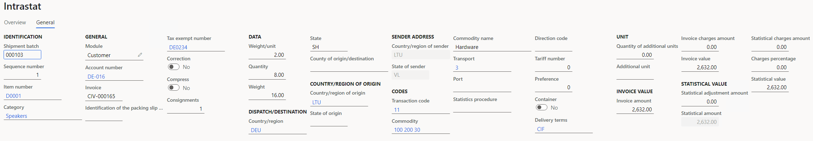

# Lithuanian Intrastat

[!include [banner](../includes/banner.md)]

The **Intrastat** page is used to generate and report information about trade among European Union (EU) countries/regions. The Lithuanian Intrastat declaration contains information about the trade of goods for reporting.

The following fields are included in the Lithuanian Intrastat declaration. All the fields except **VAT number of trading partner** are included on both arrivals and dispatches. The **VAT number of trading partner** field is included only on dispatches.

#### Report header

| Field name | Description |
|------------|-------------|
| Reference period | The period (year and month) that the declaration applies to. |
| Completion date and time | The date and time when the Intrastat report was created. |
| Information about the declaration's receiver | The following information about the authorities is presented: - Identification number  - Name  - Legal address  - Email address  - Fax number  - Web address (URL) |
| Information about the declaration's sender | The following information about the company is presented: - Value-added tax (VAT) code  - Legal address  - Phone number  - Email address  - Fax number   - URL |
| Information about the contact person | The following information about the person who is submitting the declaration is presented:  - Name  - Phone number  - Fax number  - Email address |
| Software used | Information about the software that was used to fill in the declaration. |
| Declaration identifier | The number that a respondent gave to the Intrastat report. |
| VAT registration number | The VAT ID of the company that is providing the statistical declaration. |
| Function code | For an original Intrastat declaration, **O** is printed.   For a correction Intrastat declaration, **M** is printed. |
| Report direction | For arrivals, **A** is printed.   For dispatches, **D** is printed. |
| Currency | The company's accounting currency. |
| Registration number of previous declaration | In the case of a correction Intrastat declaration, the Intrastat report's 11-symbol registration number at the Customs Department and the correction number. | 
| Total invoiced amount | The sum of all items. |

#### Report lines

| Field name | Description | 
|------------|-------------|
| Commodity code | The commodity code according to the Combined Nomenclature (CN) classification. This code is set on the product page. |
| Description of goods | The trade name of the commodity. |
| Country of consignment (arrivals) / Country of destination (dispatches) | The International Organization for Standardization (ISO) code of the country or region of the counterparty. |
| Country/region of origin | The ISO code of the country or region where the goods were produced. |
| Net mass | The quantity of goods in net mass. The last three symbols are the digits after the decimal point. |
| Quantity of supplementary goods | For some commodities, you must report the supplementary unit. The unit itself (for example, **pairs** or **dozens**) isn't reported. | 
| Invoice amount | The invoice value. You can view the invoice value in the Invoice amount field in the Intrastat journal. |
| Statistical amount | The statistical value. You can view the statistical value in the Statistical value field in the Intrastat journal. |
| VAT number of trading partner | The customer's foreign VAT number in an EU member state. |
| Nature of transaction | The transaction code. |
| Mode of transport | The code for the mode of transport. |
| Delivery terms | The code for the terms of delivery of goods. |
| Region | The Intrastat code for the company's region. |

#### Report footer

| Field name | Description | 
|------------|-------------|
| Total number of detailed lines | The total number of detailed lines in the Intrastat declaration. |

## Set up Intrastat

From the Global repository, import the latest version of the following Electronic reporting (ER) configurations:

- Intrastat model
- Intrastat report
- INSTAT XML(LT)

For more information, see [Download ER configurations from the Global repository of Configuration service](../../fin-ops-core/dev-itpro/analytics/er-download-configurations-global-repo.md).

## Set up region codes

The Intrastat declaration requires that a county code be reported. To set up the county code, follow these steps.

1. In Microsoft Dynamics 365 Finance, go to **Organization administration** > **Global address book** > **Addresses** > **Address setup**.
2. On the **State/province** tab, select **New**.
3. In the **Country/region** field, select **LTU**.
4. In the **State** field, enter the name of the state.
5. In the **Intrastat code** field, enter the code according to the authority requirements.

## Set up an address for a legal entity

1. Go to **Organization administration** > **Organizations** > **Legal entities.**
2. In the grid, select your company.
3. On the **Addresses** FastTab, select **Edit**.
4. In the **Edit address** dialog box, in the **Country/region** field, select **LTU**.
5. In the **ZIP/postal code** field, select your company's ZIP/postal code.
6. In the **Street** field, enter your address.
7. In the **City** field, select your city.
8. In the **State** field, select your company's state.

## Set up contact information

You must set up your company's telephone number, email address, URL, and fax number.

1. Go to **Organization administration** > **Organizations** > **Legal entities**.
2. In the grid, select your company.
3. On the **Contact information** FastTab, select **Add** to create a contact.
4. In the **Type** field, select the type of communication.
5. In the **Contact number/address** field, enter your company's contact information.
6. Select the **Primary** option to print this contact information on the report.

## Set up VAT IDs

### Set up the VAT ID of your company

1. Go to **Organization administration** > **Organizations** > **Legal entities**.
2. In the grid, select your company.
3. On the **Tax registration** FastTab, in the **Tax registration number** field, enter the VAT ID of your company.

### Set up the VAT number of a trading partner

#### Create a registration type for the company code

You must create VAT ID registration types for all the countries or regions that your company does business with.

1. Go to **Organization administration** > **Global address book** > **Registration types** > **Registration types**.
2. On the Action Pane, select **New** to create a registration type for the VAT ID.
3. In the **Enter registration type details** dialog box, in the **Name** field, enter a name for the new registration type. For example, enter **VAT ID**.
4. In the **Country/region** field, select **the country** or region that your company does business with.
5. Select **Create**.

#### Match the registration type with a registration category

1. Go to **Organization administration** > **Global address book** > **Registration types** > **Registration categories**.
2. On the Action Pane, select **New** to create a link between a registration type and a registration category.
3. For the registration type for the VAT ID, select the **VAT ID** registration category.
4. Repeat steps 2 and 3 for the other registration types that you created for the countries or regions that your company does business with.

#### Create a customer's VAT registration number

1. Go to **Accounts receivable** > **Customers** > **All customers.**
2. In the grid, select a customer.
3. On the Action Pane, on the **Customer** tab, in the **Registration** group, select **Registration IDs**.
4. On the **Registration ID** FastTab, select **Add** to create a registration ID.
5. In the **Registration type** field, select the registration type that you previously created for the company code.
6. In the **Registration number** field, enter the company's VAT number.
7. On the Action Pane, select **Save**. Then close the page.

   For more information, see [Registration IDs](emea-registration-ids.md).

Alternatively, you can create a customer's VAT registration number by using the **Tax exempt number** page.

1. Go to **Tax** > **Setup** > **Sales tax** > **Tax exempt numbers**.
2. For each tax-exempt number, create a record that includes the following information:
    - In the **Country/region** field, select the tax registration of the counterparty.
    - In the **Tax exempt number** field, enter the tax-exempt number of the counterparty.
    - In the **Company name** field, enter the name of the counterparty.
3. Go to **Accounts receivable** \> **Customers** \> **All customers.**
4. In the grid, select a customer.
5. On the **Invoice and delivery** FastTab, in the **Sales tax** section, in the **Tax exempt number** field, select the registration number that you just created.

## Set up product parameters for the Intrastat declaration

1. Go to **Product information management** > **Products** > **Released products**.
2. In the grid, select a product.
3. On the **Foreign trade** FastTab, in the **Intrastat** section, in the **Commodity** field, select the commodity code. The name of the commodity will be printed in the **Description of goods** field in the Intrastat declaration.
4. In the **Statistics procedure** field, select the statistical sign if it's required. The values that are available for selection depend on the commodity code that you selected.
5. In the **Origin** section, in the **Country/region** field, select the product's country or region of origin.
6. On the **Manage inventory** FastTab, in the **Net weight** field, enter the product's weight in kilograms.

## Set up the transport method and delivery terms

1. Set up transport codes.
    1. Go to **Tax** > **Setup** > **Foreign trade** > **Transport method**.
    2. On the Action Pane, select **New**.
    3. In the **Transport** field, enter a unique code. Lithuanian companies use one-digit transport codes.
2. Set up mode of delivery Intrastat codes.
    1. Go to **Procurement and sourcing** > **Setup** > **Distribution** > **Terms of delivery**.
    2. In the grid, select a set of delivery terms.
    3. On the **General** FastTab, in the **Intrastat code** field, enter the unique code.

## Set up the Intrastat authority

- Go to **Tax** > **Indirect taxes** > **Sales tax** > **Sales tax authorities**, and enter the following information for the Intrastat authority:

    - Authority identification
    - Address
    - Contact information

   For more information, see [Set up sales tax authorities](../general-ledger/tasks/set-up-sales-tax-authorities.md).

## Set up foreign trade parameters

1. Go to **Tax** > **Setup** > **Foreign trade parameters**.
2. On the **Intrastat** tab, on the **Electronic reporting** FastTab, in the **File format mapping** field, select **INSTAT XML (LT)**.
3. In the **Report format mapping** field, select **Intrastat report**.
4. On the **Commodity code hierarchy** FastTab, in the **Category hierarchy** field, select **Intrastat**.
5. In the **Transaction code** field, select the transaction code for property transfers.
6. In the **Credit note** field, select the transaction code for the return of goods.
7. In the **Authority** field, select the authority that receives the Intrastat declaration.
8. On the **Contact** tab, enter the name, telephone number, fax number, and email address of the person who is submitting the declaration.
9. On the **Country/region properties** tab, in the **Country/region** field, list all the countries or regions that your company does business with. For each country that is part of the EU, select **EU** in the **Country/region type** field, so that the country appears on your Intrastat report. For Lithuania, select **Domestic** in the **Country/region type** field.

## Set up compression of Intrastat

- Go to **Tax** > **Setup** > **Foreign trade** > **Compression of Intrastat**, and select the fields that should be compared when Intrastat information is summarized. For Lithuanian Intrastat, select the following fields:
   
    - Commodity
    - Transaction code
    - Country/region of origin
    - State
    - Country/region of sender
    - State of sender
    - Correction
    - Country/region
    - Tax exempt number
    - Direction
    - Delivery terms
    - Transport

## Intrastat transfer

On the **Intrastat** page, on the Action Pane, you can select **Transfer** to automatically transfer the information about intracommunity trade from your sales orders, free text invoices, purchase orders, vendor invoices, vendor product receipts, project invoices, and transfer orders. Only documents that have an EU country as the country or region of destination or consignment will be transferred.

You can also manually enter transactions by selecting **New** on the Action Pane.

### Generate an Intrastat report

1. Go to **Tax** > **Declarations** > **Foreign trade** > **Intrastat**.
2. On the Action Pane, select **Output** > **Report**.
3. In the **Intrastat Report** dialog box, enter the start date for the report.
4. Set the **Generate file** option to **Yes** to generate a .xml file.
5. Set the **Generate report** option to **Yes** to generate an .xlsx file, and then enter a name for the file.
6. In the **Direction** field, select **Arrivals** if the report is about intracommunity arrivals or **Dispatches** if the report is about intracommunity dispatches.
7. In the **File format mapping** section, in the **Declaration identifier** field, enter the Intrastat report number.
8. If you're submitting a correction Intrastat declaration, in the **Registration number of previous declaration** field, enter the registration number of the previous declaration.
9. Select **OK**, and review the generated reports.

## Example

This example shows how to post arrivals and dispatches for Intrastat by using the **DEMF** legal entity.

### Preliminary setup

1. Go to **Organization administration** > **Organization** > **Legal entities**.
2. In the grid, select the **DEMF** legal entity.
3. On the **Addresses** FastTab, select **Edit**, and then, in the **Country/region** field, select **LTU (Lithuania)**.
4. Import the latest version of the following ER configurations:
    
    - Intrastat model
    - Intrastat report
    - INSTAT XML(LT)

### Set up a company address

1. Go to **Organization administration** > **Global address book** > **Addresses** > **Address setup**.
2. On the **State/province** tab, select **New** and enter the following information:

    - In the **Country/region** field, select **LTU**.
    - In the **State** field, enter the **VL**.
    - In the **Intrastat code** field, enter **LT-VL**.

3. On the **City** tab, select **New** and enter the following information:

     - In the **Country/region** field, select **LTU**.
     - In the **City** field, enter **Vilnius**.
     - In the **State** field, select **VL**.

4. On the **ZIP/postal code** tab, select **New** and enter the following information:
 
     - In the **Country/region** field, select **LTU**.
     - In the **State** field, select **VL**.
     - In the **City** field, select **Vilnius**.
     - In the **ZIP/postal code** field, enter **LT-00001**.

5. Go to **Organization administration** > **Organization** > **Legal entities.**
6. In the grid, select the **DEMF** legal entity.
7. On the **Addresses** FastTab, select **Edit** and enter the following information:

    - In the **Country/region** field, select **LTU**.
    - In the **ZIP/postal code** field, select **LT-00001**.
    - In the **Street** field, enter **Ukmerges Street 120**.
    - In the **City** field, select **Vilnius**.
    - In the **State** field, select **VL**.

8. Select **OK**.

### Set up contact information

1. Go to **Organization administration** > **Organization** > **Legal entities.**
2. In the grid, select the **DEMF** legal entity.
3. On the **Contact information** FastTab, select **Add** to create a contact.
4. In the **Type** field, select **Phone**.
5. In the **Contact number/address** field, enter **+49 123 456 789** and then select the **Primary** option.
6. In the **Type** field, select **Fax**.
7. In the **Contact number/address** field, enter **425-555-5013** and then select the **Primary** option.
8. In the **Type** field, select **Email address**.
9. In the **Contact number/address** field, enter jodi@contoso.com.
10. Select the **Primary** option.
11. In the **Type** field, select **URL**.
12. In the **Contact number/address** field, enter the URL and then select the **Primary** option.

### Set up VAT IDs

#### Set up the VAT ID of your company

1. Go to **Organization administration** > **Organizations** > **Legal entities**.
2. In the grid, select the **DEMF** legal entity.
3. On the **Tax registration** FastTab, in the **Tax registration number** field, enter **1234567890**.

#### Create registration types for company codes

1. Go to **Organization administration** > **Global address book** > **Registration types** > **Registration types**.
2. On the Action Pane, select **New** to create a registration type for the VAT ID.
3. In the **Enter registration type details** dialog box, in the **Name** field, enter **VAT ID**.
4. In the **Country/region** field, select **DEU**.
5. In the **Restricted to** field, select **Organization**.
6. Select **Create**.

#### Match the registration type with a registration category

1. Go to **Organization administration** > **Global address book** > **Registration types** > **Registration categories**.
2. On the Action Pane, select **New** to create a link between the registration type and the registration category.
3. For the **VAT ID** registration type, select the **VAT ID** registration category.

#### Set up the customer's VAT registration number

1. Go to **Accounts receivable** > **Customers** > **All customers**.
2. In the grid, select **DE-016**.
3. On the Action Pane, on the **Customer** tab, in the **Registration** group, select **Registration IDs**.
4. On the **Registration ID** FastTab, select **Add** to create a registration ID.
5. In the **Registration type** field, select **VATID**.
6. In the **Registration number** field, enter **DE0234**.
7. On the Action Pane, select **Save** and then close the page.

### Set up product information

1. Go to **Product information management** > **Products** > **Released products**.
2. In the grid, select **D0001**.
3. On the **Foreign trade** FastTab, in the **Intrastat** section, in the **Commodity** field, select **100 200 30**.
4. In the **Origin** section, in the **Country/region** field, select **LTU**.
5. On the **Manage inventory** FastTab, in the **Weight measurements** section, in the **Net weight** field, enter **2**.
6. On the Action Pane, select **Save**.
7. In the grid, select **D0003**.
8. On the **Foreign trade** FastTab, in the **Intrastat** section, in the **Commodity** field, select **100 200 30**.
9. In the **Origin** section, in the **Country/region** field, select **DEU**.
10. On the **Manage inventory** FastTab, in the **Weight measurements** section, in the **Net weight** field, enter **5**.
11. On the Action Pane, select **Save**.

### Set up a transport method

1. Create a transport method.
    1. Go to **Tax** > **Setup** > **Foreign trade** > **Transport method**.
    2. On the Action Pane, select **New**.
    3. In the **Transport** field, enter **3**.
    4. In the **Description** field, enter **Road transport**.
2. Assign the new transport method to a mode of delivery. In this way, you set up the default values that are used for the transport method when the corresponding mode of delivery is selected.
    1. Go to **Procurement and sourcing** > **Setup** > **Distribution** > **Modes of delivery**.
    2. In the grid, select **10**.
    3. On the **Foreign trade** FastTab, in the **Transport** field, select **3**.
3. Select the default mode of delivery for a customer.
    1. Go to **Accounts receivable** > **Customers** > **All customers**.
    2. In the grid, select **DE-016**.
    3. On the **Invoice and delivery** FastTab, in the **Mode of delivery** field, select **10**.
4. Select the default mode of delivery for a vendor.
    1. Go to **Accounts payable** > **Vendors** > **All vendors**.
    2. In the grid, select **DE-001**.
    3. On the **Invoice and delivery** FastTab, in the **Mode of delivery** field, select **10**.

### Set up codes for terms of delivery

1. Set up an Intrastat code for the terms of delivery.
    1. Go to **Procurement and sourcing** > **Setup** > **Distribution** > **Terms of delivery**.
    2. In the grid, select **CIF**.
    3. On the **General** FastTab, in the **Intrastat code** field, enter **L**.
2. Select the default delivery terms for a customer.
    1. Go to **Accounts receivable** > **Customers** > **All customers**.
    2. In the grid, select **DE-016**.
    3. On the **Invoice and delivery** FastTab, in the **Delivery terms** field, select **CIF**.
3. Select the default delivery terms for a vendor.
    1. Go to **Accounts payable** > **Vendors** > **All vendors**.
    2. In the grid, select **DE-001**.
    3. On the **Invoice and delivery** FastTab, in the **Delivery terms** field, select **CIF**.

### Set up the authority identification number

1. Go to **Tax** > **Indirect taxes** > **Sales tax** > **Sales tax authorities**.
2. In the list, select **TA**.
3. In the **Authority identification** field, enter **123**.
4. In the **Name** field, enter **Tax authority**.
5. On the **Addresses** FastTab, select **Edit**.
6. In the **Country/region** field, select **LTU**.
7. In the **Street** field, enter Arsenalo gatvė 5.
8. In the **City** field, select **Vilnius**.
9. In the **State** field, select **VL** and then select **OK**.
10. On the **Contact information** FastTab, in the **Telephone** field, enter **425-555-5068.**
11. In the **Fax** field, enter **425-555-5068.**
12. In the **Email** field, enter authority@email.com.
13. In the **Internet address** field, enter the URL.

### Set up foreign trade parameters

1. Go to **Tax** > **Setup** > **Foreign trade** > **Foreign trade parameters**.
2. On the **Intrastat** tab, on the **General** FastTab, in the **Transaction** **code** field, select **11**.
3. In the **Authority** field, select **TA**.
4. On the **Electronic reporting** FastTab, in the **File format mapping** field, select **INSTAT XML (LT)**.
5. In the **Report format mapping** field, select **Intrastat Report**.
6. On the **Commodity code hierarchy** FastTab, verify that the **Category hierarchy** field is set to **Intrastat**.
7. On the **Country/region properties** tab, select **New**.
8. In the **Party country/region** field, select **LTU**. Then, in the **Country/region type** field, select **Domestic**.
9. In the **Party country/region** field, select **DEU**. Then, in the **Country/region type** field, select **EU**.
10. On the **Contact** tab, in the **Name** field, enter **Manish Chopra**.
11. In the **Telephone** field, enter **425-555-5049**.
12. In the **Fax number** field, enter **425-555-5049**.
13. In the **Email** field, enter manishc@contoso.com.

### Change the site address

1. Go to **Warehouse management** > **Setup** > **Warehouse** > **Sites**.
2. In the grid, select **1**.
3. On the **Addresses** FastTab, select **Edit**.
4. In the **Edit address** dialog box, in the **Country/region** field, select **LTU**.
5. Select **OK**.

### Create a sales order with an EU customer

1. Go to **Accounts receivable** > **Orders** > **All sales orders**.
2. On the Action Pane, select **New**.
3. In the **Create sales order** dialog box, on the **Customer** FastTab, in the **Customer** section, in the **Customer account** field, select **DE-016**.
4. On the **General** FastTab, in the **Storage dimensions** section, in the **Site** field, select **1**.
5. In the **Warehouse** field, select **11**.
6. On the **Address** tab, verify that the **Address** field is set to **Teichgasse 12, Kiel, 24103, DEU**, because the customer is from Germany.
7. Select **OK**.
8. On the **Header** tab, on the **Delivery** FastTab, verify that the **Delivery terms** field is set to **CIF**, and the **Mode of delivery** field is set to **10**.
9. On the **Lines** tab, on the **Sales order lines** FastTab, in the **Item number** field, select **D0001**. Then, in the **Quantity** field, enter **8**.
10. On the **Line details** FastTab, on the **Foreign trade** tab, verify that the fields are set to the following values:
    - **Transaction code:** 11
    - **Transport:** 3
    - **Commodity:** 100 200 30
    - **Country/region of origin:** LTU
11. On the Action Pane, select **Save**.
12. On the Action Pane, on the **Invoice** tab, in the **Generate** group, select **Invoice**.
13. In the **Posting invoice** dialog box, on the **Parameters** FastTab, in the **Parameter** section, in the **Quantity** field, select **All**.
14. Select **OK** to post the invoice.

### Transfer the transaction to the Intrastat journal and review the result

1. Go to **Tax** > **Declarations** > **Foreign trade** > **Intrastat**.
2. On the Action Pane, select **Transfer**.
3. In the **Intrastat (Transfer)** dialog box, in the **Parameters** section, set the **Customer invoice** option to **Yes**.
4. Select **Filter**.
5. In the **Intrastat Filter** dialog box, on the **Range** tab, select the first line, and verify that the **Field** field is set to **Date**.
6. In the **Criteria** field, select the current date.
7. Select **OK** to close the **Intrastat Filter** dialog box.
8. Select **OK** to close the **Intrastat (Transfer)** dialog box, and review the result. The line represents the sales order that you created earlier.

    

9.  Select the transaction line, and then select the **General** tab to view more details.

    

10. On the Action Pane, select **Output** > **Report**.
11. In the **Intrastat Report** dialog box, on the **Parameters** FastTab, in the **Date** section, in the **From date** field, select the first day of the current month.
12. In the **Export** **options** section, set the **Generate file** option to **Yes**.
13. Set the **Generate report** option to **Yes**. Then, in the **Report file name** field, enter the required name.
14. In the **Direction** field, select **Dispatches**.
15. In the **File format mapping** section, in the **Declaration identifier** field, enter **123456**.
16. Select **OK**, and review the report in text format that is generated. The following table shows the values in the example report.

    | Field                                                                   | Value                                             |
    |-------------------------------------------------------------------------|---------------------------------------------------|
    | Reference period                                                        | 2022-02                                           |
    | Completion date and time                                                | 2022-02-01 03:31:48                               |
    | The receiver's ID                                                       | 123                                               |
    | The receiver's name                                                     | Tax authority                                     |
    | The receiver's address                                                  | Arsenalo gatvė 5 Vilnius VL                       |
    | The receiver's phone                                                    | 425-555-5068                                      |
    | The receiver's email                                                    | authority@email.com                               |
    | The receiver's fax                                                      | 425-555-5068                                      |
    | The receiver's URL                                                      | URL                           |
    | Sender's VAT code                                                       | 1234567890                                        |
    | Sender's address                                                        | Ukmerges Street 120 Vilnius, VL LT-00001 LTU      |
    | Sender's phone                                                          | +49 123 456 789                                   |
    | Sender's email                                                          | jodi@contoso.com                                  |
    | Sender's fax                                                            | 425-555-5013                                      |
    | Sender's URL                                                            | URL                           |
    | Contact person's name                                                   | Manish Chopra                                     |
    | Contact person's phone                                                  | 425-555-5049                                      |
    | Contact person's fax                                                    | 425-555-5049                                      |
    | Contact person's email                                                  | manishc@contoso.com                               |
    | Software used                                                           | Microsoft Dynamics 365 Finance |
    | Declaration identifier                                                  | 123456                                            |
    | VAT registration number                                                 | 1234567890                                        |
    | Function code                                                           | O                                                 |
    | The report direction                                                    | D                                                 |
    | Currency                                                                | EUR                                               |
    | Total Invoiced amount                                                   | 2632                                              |
    | Commodity code                                                          | 10020030                                          |
    | Description of goods                                                    | Hardware                                          |
    | Country of consignment (arrivals) / Country of destination (dispatches) | DE                                                |
    | Country of origin                                                       | LT                                                |
    | Net mass                                                                | 16000                                             |
    | Invoice amount                                                          | 2632                                              |
    | Statistical amount                                                      | 2632                                              |
    | VAT number of trading partner                                           | DE0234                                            |
    | Nature of transaction                                                   | 11                                                |
    | Mode of transport                                                       | 3                                                 |
    | Delivery terms                                                          | L                                                 |
    | Region                                                                  | LT-VL                                             |
    | Total number of detailed lines                                          | 1                                                 |

17.  Review the report in Excel format that is generated.

   

### Create a purchase order

1. Go to **Accounts payable** > **Purchase orders** > **All purchase orders**.
2. On the Action Pane, select **New**.
3. In the **Create purchase order** dialog box, in the **Vendor account** field, select **DE-001**.
4. In the **Site** field, select **1**.
5. In the **Warehouse** field, select **11**.
6. Select **OK**.
7. On the **Header** tab, on the **Delivery** FastTab, verify that the **Mode of delivery** field is set to **10**, and the **Delivery terms** field is set to **CIF**.
8. On the **Lines** tab, on the **Purchase order lines** FastTab, in the **Item number** field, select **D0003**. Then, in the **Quantity** field, enter **6**.
9. On the **Line details** FastTab, on the **Foreign trade** tab, verify that the fields are set to the following values:
    - **Transaction code:** 11
    - **Transport:** 3
    - **Commodity:** 100 200 30
    - **Country/region of origin:** DEU
10. On the Action Pane, on the **Purchase** tab, in the **Actions** group, select **Confirm**.
11. On the Action Pane, on the **Invoice** tab, in the **Generate** group, select **Invoice**.
12. On the Action Pane, select **Default from**, and then, in the **Default quantity for lines** field, select **Ordered quantity**. Then select **OK**.
13. On the **Vendor Invoice header** FastTab, in the **Invoice identification** section, in the **Number** field, enter **0010**.
14. In the **Invoice dates** section, in the **Invoice date** field, select the current date. This date will be used for Intrastat transfer.
15. On the Action Pane, select **Post** to post the invoice.

### Create an Intrastat declaration for arrivals

1. Go to **Tax** > **Declarations** > **Foreign trade** > **Intrastat**.
2. On the Action Pane, select **Transfer**.
3. In the **Intrastat (Transfer)** dialog box, set the **Vendor invoice** option to **Yes**.
4. Select **Filter**.
5. In the **Intrastat Filter** dialog box, on the **Range** tab, select the **Vendor invoice journal** line, and verify that the **Field** field is set to **Date**.
6. In the **Criteria** field, select the current date.
7. Select **OK** to close the **Intrastat Filter** dialog box.
8. Select **OK** to transfer the transactions, and review the Intrastat journal.

    

9. Review the information on the **General** tab for the purchase order.

    

10. On the Action Pane, select **Output** > **Report**.
11. In the **Intrastat Report** dialog box, on the **Parameters** FastTab, in the **Date** section, in the **From date** field, select the first day of the current month.
12. In the **Export** **options** section, set the **Generate file** option to **Yes**.
13. Set the **Generate report** option to **Yes**. Then, in the **Report file name** field, enter the required name.
14. In the **Direction** field, select **Arrivals**.
15. In the **File format mapping** section, in the **Declaration identifier** field, enter **654321**.
16. Select **OK**, and review the report in text format that is generated. The following table shows the values in the example report.

    | Field                                                                   | Value                                             |
    |-------------------------------------------------------------------------|---------------------------------------------------|
    | Reference period                                                        | 2022-02                                           |
    | Completion date and time                                                | 2022-02-01 03:31:48                               |
    | The receiver's ID                                                       | 123                                               |
    | The receiver's name                                                     | Tax authority                                     |
    | The receiver's address                                                  | Arsenalo gatvė 5 Vilnius VL                       |
    | The receiver's phone                                                    | 425-555-5068                                      |
    | The receiver's email                                                    | authority@email.com                               |
    | The receiver's fax                                                      | 425-555-5068                                      |
    | The receiver's URL                                                      | URL                           |
    | Sender's VAT code                                                       | 1234567890                                        |
    | Sender's address                                                        | Ukmerges Street 120 Vilnius, VL LT-00001 LTU      |
    | Sender's phone                                                          | +49 123 456 789                                   |
    | Sender's email                                                          | jodi@contoso.com                                  |
    | Sender's fax                                                            | 425-555-5013                                      |
    | Sender's URL                                                            | URL                             |
    | Contact person's name                                                   | Manish Chopra                                     |
    | Contact person's phone                                                  | 425-555-5049                                      |
    | Contact person's fax                                                    | 425-555-5049                                      |
    | Contact person's email                                                  | manishc@contoso.com                               |
    | Software used                                                           | Microsoft Dynamics 365 Finance |
    | Declaration identifier                                                  | 654321                                            |
    | VAT registration number                                                 | 1234567890                                        |
    | Function code                                                           | O                                                 |
    | The report direction                                                    | A                                                 |
    | Currency                                                                | EUR                                               |
    | Total Invoiced amount                                                   | 965                                               |
    | Commodity code                                                          | 10020030                                          |
    | Description of goods                                                    | Hardware                                          |
    | Country of consignment (arrivals) / Country of destination (dispatches) | DE                                                |
    | Country of origin                                                       | DE                                                |
    | Net mass                                                                | 30000                                             |
    | Invoice amount                                                          | 965                                               |
    | Statistical amount                                                      | 965                                               |
    | Nature of transaction                                                   | 11                                                |
    | Mode of transport                                                       | 3                                                 |
    | Delivery terms                                                          | L                                                 |
    | Region                                                                  | LT-VL                                             |
    | Total number of detailed lines                                          | 1                                                 |

17.  Review the report in Excel format that is generated.

   

[!INCLUDE[footer-include](../../includes/footer-banner.md)]

