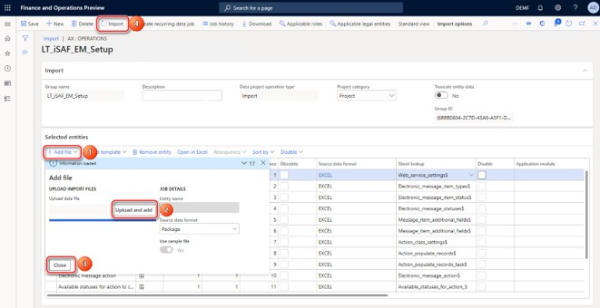
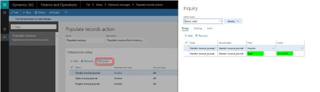
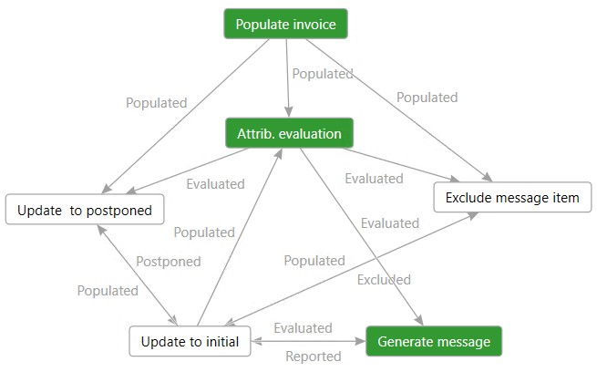
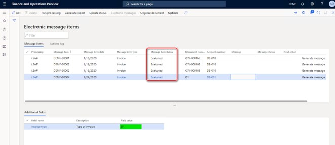
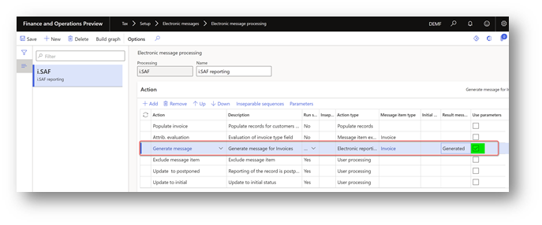
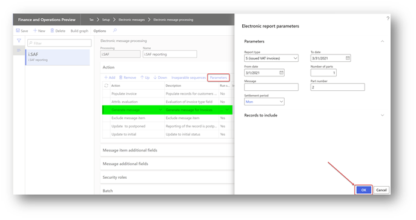
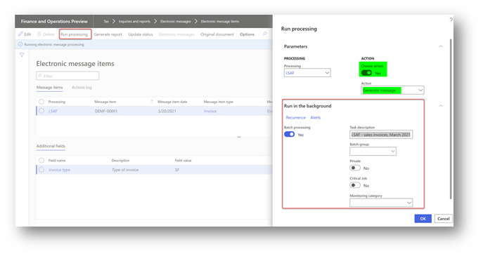
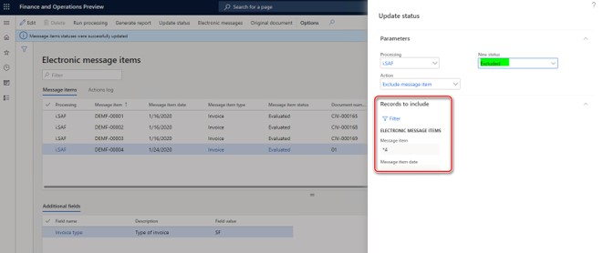

# i.SAF reporting for Lithuania

[!include [banner](../includes/banner.md)]

According to Order No VA-55, "On the Approval of Rules for the Processing and Submitting of the Data Taxes Invoice Registers", which was approved by the Head of the State Tax Inspectorate under the Ministry of Finance of the Republic of Lithuania in 2004 April 21, the processing and submission of data about value added tax invoice registers is updated to create conditions for the taxable persons to present the data of issued and received invoices for the Tax Authority using standardized format for the i.SAF application. The i.SAF format must match the current standard of accounting data files technical specifications and technical requirements (FileVersion iSAF1.2).

## Overview

This article describes how to set up Electronic Reporting (ER) configurations for the i.SAF report and how to set up and use Electronic Messages (EM) functionality in Dynamics 365 Finance.

The article includes information about:

- Import and set up ER configurations and application-specific parameters
- Set up EM functionality
- Work with EM functionality to prepare the i.SAF report.

## Import and set up Electronic Reporting configurations

To prepare Finance for i.SAF reporting, you must import the following ER configurations.

| Configuration name	| Configuration type |
|---------------------|--------------------|
| Invoices Communication Model	| Data model |
| i.SAF model mapping	| Model mapping |
| i.SAF format (LT) |	Format	|

Import the latest versions of these configurations. The version description usually includes the number of the Microsoft Knowledge Base (KB) article that explains the changes that were introduced in the configuration version.

> [!NOTE]
> After all the ER configurations from the preceding table are imported, set the **Default for model mapping** option to **Yes** for  **i.SAF model mapping** ER configuration.

For more information about how to download ER configurations from the Microsoft global repository, see [Download ER configurations from the Global repository](../../fin-ops-core/dev-itpro/analytics/er-download-configurations-global-repo.md).

## Standard VAT codes and application-specific parameters setup

Table 1 “VAT table” of the **“Tables of the Technical Specification of the Standard Accounting Data File”** (here and further “Standard VAT codes”) defines the following standard VAT codes used by companies in Lithuania for i.SAF reporting:

| **Standard VAT code** | **Description**                                                                                                                                                                                                                                                                                                                                                                                    |
|-----------------------|----------------------------------------------------------------------------------------------------------------------------------------------------------------------------------------------------------------------------------------------------------------------------------------------------------------------------------------------------------------------------------------------------|
| PVM1                  | Goods and services supplied within the territory of the country/region (Article 19(1) of the Law of the Republic of Lithuania on Value Added Tax (LVAT))                                                                                                                                                                                                                                 |
| PVM2                  | Goods and services supplied within the territory of the country/region (Article 19(3) of the LVAT)                                                                                                                                                                                                                                                                                                     |
| PVM3                  | Goods and services supplied within the territory of the country/region (Article 19(4) of the VAT Law)                                                                                                                                                                                                                                                                                                |
| PVM4                  | When the buyer must withhold and pay VAT on goods and services supplied to them (Article 96 of the LVAT) expired 2016-03-31                                                                                                                                                                                                                                                                  |
| PVM25                 | When the buyer must withhold and pay VAT on goods and services supplied to them (Article 96 of the LVAT) Rate 21%                                                                                                                                                                                                                                                                            |
| PVM26                 | When the buyer must withhold and pay VAT on goods and services supplied to them (Article 96 of the LVAT) Rate 9%                                                                                                                                                                                                                                                                             |
| PVM27                 | When the buyer must withhold and pay VAT on goods and services supplied to them (Article 96 of the LVAT) Rate 5%                                                                                                                                                                                                                                                                             |
| PVM5                  | When the supply of goods and services is exempt from VAT (Articles 20–33 and 112 of the LVAT)                                                                                                                                                                                                                                                                                                       |
| PVM51                | Transactions subject to the application of Article 19(5)(2) and (3) of the VAT Law (all cases, including, for example, Article 5 of the VAT Amount)                                                                                                                                                                                                                                                                                                       |
| PVM52                | Cases where transactions are subject to a special taxation scheme (margin) (Sections II, III of the VAT Rate)                                                                                                                                                                                                                                                                                                      |
| PVM53                | Cases where transactions are subject to a special taxation scheme (margin) (Sections II, III of the VAT Rate)                                                                                                                                                                                                                                                                                                      |
| PVM6                  | When the supply of goods and services are for the private use of a VAT payer (Articles 5 and 6 of the LVAT) Rate 21%                                                                                                                                                                                                                                                                                       |
| PVM7                  | When the supply of goods and services are for the private use of a VAT payer (Articles 5 and 6 of the LVAT) Rate 9%                                                                                                                                                                                                                                                                                        |
| PVM8                  | When the supply of goods and services are for the private use of a VAT payer (Articles 5 and 6 of the LVAT) Rate 5%                                                                                                                                                                                                                                                                                        |
| PVM28                 | When the supply of goods and services are for the private use of a VAT payer (Articles 5 and 6 of the LVAT) Rate 0%                                                                                                                                                                                                                                                                                        |
| PVM29                 | When the supply of goods and services are for the private use of a VAT payer (Articles 5 and 6 of the LVAT) Rate -                                                                                                                                                                                                                                                                                         |
| PVM9                  | The manufacture of tangible fixed assets by a VAT payer themself and the material improvement of the building (structure) owned or not owned by a VAT payer (Article 6 of the LVAT) Rate 21%                                                                                                                                                                                                                |
| PVM30                 | The manufacture of tangible fixed assets by a VAT payer themself and the material improvement of the building (structure) owned or not owned by a VAT payer (Article 6 of the LVAT) Rate 9%                                                                                                                                                                                                                 |
| PVM31                 | The manufacture of tangible fixed assets by a VAT payer themself and the material improvement of the building (structure) owned or not owned by a VAT payer (Article 6 of the LVAT) Rate 5%                                                                                                                                                                                                                 |
| PVM10                 | When the taxation of transactions is subject to a special taxation scheme (margin) (Articles 101–105, 106–110 of the LVAT) Exp.on 31-03-2016 Rate 21, 9, 5, 0                                                                                                                                                                                                                                    |
| PVM32                 | When transactions are subject to a special taxation scheme (margin) (Sections II, III of the LVAT) Rate 21%                                                                                                                                                                                                                                                                 |
| PVM33                 | The application of special taxation scheme (margin) to transactions (Sections II, III of the LVAT) Rate 0%                                                                                                                                                                                                                                                                                    |
| PVM12                 | The export of goods (Article 41 of the LVAT) Rate 0%                                                                                                                                                                                                                                                                                                                                                   |
| PVM13                 | Goods are supplied to the EU VAT payers (Article 49(1), (4) of the LVAT) Rate 0%                                                                                                                                                                                                                                                                                                                       |
| PVM14                 | Other transactions (Articles 42, 43, 44, 45, 46, 47, 48, 49(2) and (3), 51, 52, 53(1), (5), (6) and (10) of the LVAT) Rate 0%                                                                                                                                                                                                                                                                      |
| PVM15                 | Goods and services supplied outside Lithuania. Where VAT is not chargeable because the supply of goods and services is considered to have taken place outside Lithuania and therefore not subject to VAT in Lithuania, but VAT can be deducted according to the provisions of Article 58(1)(2) of the LVAT rate.                                                                            |
| PVM34                 | Goods and services supplied outside Lithuania. Where VAT is not chargeable because the supply of goods and services is considered to have taken place outside Lithuania and VAT can't be deducted according to the provisions of Article 58 of the LVAT rate.                                                                                                                       |
| PVM16                 | Where the acquisition of goods from other Member States is considered to have taken place within the territory of the country/region (Articles 41 and 122 of the LVAT) Rate 21%                                                                                                                                                                                                                         |
| PVM17                 | Where the acquisition of goods from other Member States is considered to have taken place within the territory of the country/region (Articles 41 and 122 of the LVAT) Rate 9%                                                                                                                                                                                                                          |
| PVM18                 | Where the acquisition of goods from other Member States is considered to have taken place within the territory of the country/region (Articles 41 and 122 of the LVAT) Rate 5%                                                                                                                                                                                                                          |
| PVM35                 | Where the acquisition of goods from other Member States is considered to have taken place within the territory of the country/region (Articles 41 and 122 of the LVAT) Rate 0%                                                                                                                                                                                                                          |
| PVM36                 | Where the acquisition of goods from other Member States is considered to have taken place within the territory of the country/region (Articles 41 and 122 of the LVAT)                                                                                                                                                                                                                            |
| PVM19                 | Where the goods acquired by a VAT payer of the Republic of Lithuania, who is an intermediary (second party) in three-way trading were directly exported from one Member State to other Member State and supplied to a VAT payer of such other Member State (Article 122(3) of the LVAT)                                                                                                          |
| PVM20                 | When services are acquired from foreign countries (excluding the EU VAT payers) and the output VAT is calculated by the buyer (Article 95(2) of the LVAT) Rate 21%                                                                                                                                                                                                                                     |
| PVM37                 | When services are acquired from foreign countries (excluding the EU VAT payers) and the output VAT is calculated by the buyer (Article 95(2) of the LVAT) Rate 5%                                                                                                                                                                                                                                      |
| PVM38                 | When services are acquired from foreign countries (excluding the EU VAT payers) and the output VAT is not calculated by the buyer (Article 95(1)(3) of the LVAT) Rate 0%                                                                                                                                                                                                                               |
| PVM39                 | When services are acquired from foreign countries (excluding the EU VAT payers) and the output VAT is not calculated by the buyer (Article 95(1)(2) of the LVAT)                                                                                                                                                                                                                                 |
| PVM21                 | When services are acquired from the EU VAT payers, the output VAT is calculated by the buyer (Article 95(2) of the LVAT) Rate 21%                                                                                                                                                                                                                                                                   |
| PVM40                 | When services are acquired from foreign countries (excluding the EU VAT payers) and the output VAT is calculated by the buyer (Article 95(2) of the LVAT) Rate 5%                                                                                                                                                                                                                                      |
| PVM41                 | When services are acquired from foreign countries (excluding the EU VAT payers) and the output VAT is calculated by the buyer (Article 95(2) of the LVAT) Rate 0%                                                                                                                                                                                                                                      |
| PVM42                 | When services are acquired from foreign countries (excluding the EU VAT payers) and the output VAT is calculated by the buyer (Article 95(2) of the LVAT) Rate -                                                                                                                                                                                                                                       |
| PVM22                 | Where VAT on goods and services supplied by a foreign taxable person not established within the territory of the country/region (excluding the cases of PVM18, PVM19) is calculated and paid by the buyer (Article 95(3), (4) and (5) of the LVAT) Exp. on 31-03-2016 Rate 21, 9, 5                                                                                                              |
| PVM43                 | Where VAT on goods and services supplied by a foreign taxable person not established within the territory of the country (excluding the cases of PVM18, PVM19) is calculated and paid by the buyer (Article 95(3), (4) and (5) of the LVAT) Rate 21%                                                                                                                                      |
| PVM44                 | Where VAT on goods and services supplied by a foreign taxable person not established within the territory of the country (excluding the cases of PVM18, PVM19) is calculated and paid by the buyer (Article 95(3), (4) and (5) of the LVAT) Rate 9%                                                                                                                                       |
| PVM45                 | Where VAT on goods and services supplied by a foreign taxable person not established within the territory of the country (excluding the cases of PVM18, PVM19) is calculated and paid by the buyer (Article 95(3), (4) and (5) of the LVAT) Rate 5%                                                                                                                                       |
| PVM46                 | Where VAT on goods and services supplied by a foreign taxable person not established within the territory of the country (excluding the cases of PVM18, PVM19) is calculated and paid by the buyer (Article 95(3), (4) and (5) of the LVAT) Rate 0%                                                                                                                                       |
| PVM47                 | Where VAT on goods and services supplied by a foreign taxable person not established within the territory of the country (excluding the cases of PVM18, PVM19) is calculated and paid by the buyer (Article 95(3), (4) and (5) of the LVAT) Rate -                                                                                                                                        |
| PVM23                 | The calculated import VAT. Rate 21, 9, 5                                                                                                                                                                                                                                                                                                                                                               |
| PVM24                 | The Import VAT where the offsetting is controlled by the STI. Rate 21, 9, 5                                                                                                                                                                                                                                                                                                                         |
| PVM48                 | Goods and services acquired outside Lithuania (including the cases of charging VAT of a foreign country/region and of the import of goods for domestic consumption) where the acquisition of goods and services is considered to have taken place outside the Republic of Lithuania and the output VAT is not chargeable because the acquisition is not subject to VAT in Lithuania.  |
| PVM49                 | Where agricultural products and services are purchased from farmers who are subject to the compensatory VAT rate scheme Rate 6%                                                                                                                                                                                                                                                              |
| PVM51                 | Transactions subject to the application of Article 19(5)(2) and (3) of the VAT Law (all cases, including for example, Article 5 of the VAT Amount).                                                                                                                                                                                                                                                                                                      |
| PVM52                 | Cases where transactions are subject to a special taxation scheme (margin) (Sections II, III of the VAT Rate) Rate 9%.                                                                                                                                                                                                                                                                                                       |
| PVM53                 | Cases where transactions are subject to a special taxation scheme (margin) (Sections II, III of the VAT Rate) Rate 5%.                                                                                                                                                                                                                                                                                                       |
| PVM100                | Other cases                                                                                                                                                                                                                                                                                                                                                                                        |

Starting from version **52.4** of the **i.SAF format (LT)** ER configuration, the format includes application-specific parameters where a user must define which **Sales tax codes** in the system correspond to which values from the enumerated list of VAT codes prescript as "Standard VAT codes".

1. To setup application-specific parameters, go to the **Electronic Reporting** workspace, select the **i.SAF format (LT)** format, and then select **Configurations** > **Application specific parameters** > **Setup**.
2. On the Action Pane, on the **Lookups** tab, select **ReportTaxCodesLookup** to view the latest version of the format.
3. On the **Conditions** FastTab, define which **Standard VAT codes** must correspond to which **System Sales tax codes**.

For example, if you have in the system two **System Sales tax codes**, VAT1 and VAT2 which must be reported in one **Standard VAT codes PVM1**, you would need to add the following lines on the **Conditions** FastTab:

| Lookup result | Line | Tax Code |
|---------------|------|----------|
| **PVM1** (the value must be selected from the predefined enumerated list) | 1 | **VAT1** (the value must be selected from the list of values which are entries in the **Sales tax codes** table) |
| **PVM1** (the value must be selected from the predefined enumerated list) | 2 | **VAT2** (the value must be selected from the list of values which are entries in the **Sales tax codes** table) |

The **Line** column is used for the counter which controls the order of execution of the conditions of the lookup field.

4. Add all of the conditions for those “Standard VAT codes” that must be reported for your Legal entity. According to documentation, the list of “Standard VAT codes” is the following:

| **Lookup result** | **Line**              | **Tax Code**      |
|-------------------|-----------------------|-------------------|
| **PVM100**        | The last in your list | **\*Not blank\*** |

> [!NOTE]
> It is important to add “PVM100” which must collect data by “other cases” as the last in the list. The **Line** value must be the last in your table. 

This setup means that all the tax transactions for **Sales tax code**, of which there is no specific setup as no “Standard VAT code” is specifically defined for it, will be considered for **PVM100.** It is mandatory to define this lookup result field at the end of the list of your conditions.

You can easily export the setup of application-specific parameters from one version of a report and import it into another version. You can also export the setup from one report and import it into another report, provided that both reports have the same structure of lookup fields.

When you've finished setting up conditions, change the value of the **State** field to **Completed**, save your changes, and close the page.

## Import a package of data entities that include a predefined electronic messaging setup

**Electronic Messages** functionality is provided to maintain different processes of electronic reporting of different document types. For more information about Electronic messages, see [Electronic messaging](../general-ledger/electronic-messaging.md).

The process of setting up the Electronic messages functionality for i.SAF has many steps. Because the names of some predefined entities are used in the ER configurations, it's important that you use a set of predefined values that are delivered in a package of data entities for the related tables.

> [!NOTE]
> Before you import setup data from the package of data entities, complete the  to make sure that the data entities in your application are refreshed and synced.

1. In [LCS](https://lcs.dynamics.com/v2), go to the Shared asset library, and select the **Data package** asset type. 
2. Find **LT i.SAF setup for Electronic messages.zip** in the list of data package files, and download it to your computer.
3. After the **LT i.SAF setup for Electronic messages.zip** file is downloaded, open Finance, select the company that you will interoperate with HMRC from, and then go to **Workspaces** \> **Data management**.
4. In the **Data management** workspace, go to **Framework parameters** \> **Entity settings**, and then select **Refresh entity list**. Wait for confirmation that the refresh has been completed. For more information about how to refresh the entity list, see [Entity list refresh](../../fin-ops-core/dev-itpro/data-entities/data-entities.md#entity-list-refresh).
5. Validate that the source data and target data are correctly mapped. For more information, see the section about validation in [Data import and export jobs](../../fin-ops-core/dev-itpro/data-entities/data-import-export-job.md#validate-that-the-source-data-and-target-data-are-mapped-correctly).
6. Before the data entities are used for the first time to import the data from the package, sync the mapping of source data and target data. In the list for the package, select a data entity, and then, on the Action Pane, select **Modify target mapping**. 
7. Above the grid for the package, select **Generate mapping** to create a mapping from scratch and then save the mapping.
8. Repeat steps 6 and 7 for each data entity in the package before you start the import.

For more information about data management, see [Data management](../../fin-ops-core/dev-itpro/data-entities/data-entities-data-packages.md). 

9. You must now import data from the **LT i.SAF setup for Electronic messages.zip** file into the selected company. In the **Data management** workspace, select **Import**, and set the **Source data format** field to **Package**. 
10. Select **Upload and add**, select the **LT i.SAF setup for Electronic messages.zip** file on your computer, and upload it.

You will get a notification in **Messages**, or you can manually refresh the page to see data import progress. When the importing process is complete, you will see the results on **Execution summary** page.

The **LT i.SAF setup for Electronic messages.zip** package provides a setup for **"i.SAF"** processing that supports the process of i.SAF reporting composed generally of three elements:

- **Populate invoices** – Invoices are added to the **Message items** table.
- **Attributes evaluation** – The **Document type** field values are evaluated for all of the invoices added to the **Message items** table.
- **Generate message** – **Electronic message** will be created, and related **Message items** according to their status and criteria setup will be linked to the generated **Electronic message**. The i.SAF report will be generated and attached to the **Electronic message**.

## Set up data sources to collect documents to be reported

**i.SAF** processing lets you collect invoices to be reported in the legal entity. You can then generate an i.SAF report. The collection of invoices is implemented by using the **Populate invoices** action of the **Populate record** type. To correctly collect invoices, you must define a period for the **Populate invoices** action.

1. Go to **Tax** > **Setup** > **Electronic messages** > **Populate records actions**, and select **Populate invoices**. 

For **i.SAF** processing, default data sources setup includes following three data sources:

 - **VendInvoiceJour:** Go to **Accounts payable** \> **Inquiries and reports** \> **Invoice** \> **Invoice journal**
 - **CustInvoiceJour:** Go to **Accounts receivable** \> **Inquiries and reports** \> **Invoice** \> **Invoice journal**
 - **ProjInvoiceJour:** Go to **Project management and accounting** \> **Project invoices** \> **Project invoices**

By default, all records from these data sources will be populated to the **Message items** table when you select **Populate records**.

2. On the **Datasource setup** FastTab, select the **Vendor invoice journal** record, and then select **Edit query**. 
3. For the **Date** field of the **Vendor invoice journal** table, define the period from which vendor invoices from the selected legal entity must be reported in i.SAF format. You can specify other selection criteria here to reflect specific requirements of your company to the i.SAF report. 
4. Repeat the same setup for other data sources of the report (Sales invoice journal, Project invoice journal) or delete unnecessary data sources from the list.

## Set up Electronic messaging parameters for i.SAF

After the data entities are imported into the database, complete the following steps and the Electronic Messages functionality will be ready for use.

1. Go to **Tax** \> **Setup** \> **Electronic messages** \> **Executable class settings**, select the **EvaluateInvoiceType_LT** executable class, and on the Action Pane, select **Parameters**. 
2. In the **Invoice type** field, select **InvoiceType** and then click **OK.**
3. Go to **Tax** \> **Setup** \> **Electronic messages** \> **Message processing actions** and set up related GER configurations in the **Format mapping** field for the following actions:

| **Message processing actions name** | **GER configuration** |
|-------------------------------------|-----------------------|
| Generate message                     | i.SAF format (LT)     |

4. Go to **General ledger** \> **Setup** \> **Parameters** to set up **Number sequences**:

| **Number sequences reference** | **Number sequences description**                                                                                                                                                                                                                         |
|--------------------------------|----------------------------------------------------------------------------------------------------------------------------------------------------------------------------------------------------------------------------------------------------------|
| Message                        | The unique key for a message. Set up a non-continuous number sequence for this Reference. This number sequence will be used for numbering messages when they are generated. |
| Message item                   | The unique key for a message item. Set up a non-continuous number sequence for this Reference. This number sequence will be used for numbering message items when they are generated from the source tables. |

## Set up security roles for electronic message processing

Different groups of users might require access to **i.SAF** processing. You can limit access to the processing, based on security groups that are defined in the system.

Complete the following steps to limit access to the **i.SAF** processing.

1. Go to **Tax** \> **Setup** \> **Electronic messages** \> **Electronic message processing**. 
2. Select the **i.SAF** processing, and add the security groups that must work with this processing. If no security group is defined for the processing, only a system admin can see the processing on the **Electronic messages** page.

## Set up the VAT registration number for the company that is reporting i.SAF

The system retrieves the VAT registration number of the company that is reporting i.SAF from the registration ID that is defined in the properties of the legal entity. For more information, see [Registration type](emea-registration-ids.md#registration-type-creation) and [Registration category](emea-registration-ids.md#supported-registration-categories). The tax registration type must be assigned to the **VAT ID** tax registration category. For a more detailed walkthrough of the prerequisites for VAT ID registration, see [Set up VAT ID](tasks/eur-00015-vat-id.md).

## Collect data for the i.SAF report

The setup of **i.SAF** processing that is provided by using a package of data entities is shown in the following schema.

The green boxes on the schema show the general process of i.SAF report generation.

1. Got to **Tax** > **Inquiries and reports** > **Electronic messages** > **Electronic message items**, and on the Action Pane, select **Run processing**. 
2. In the **Processing** field, select **i.SAF**. 
3. To start collecting data for the i.SAF report, mark the **Choose action** check box and select **"Populate invoice"**. If you don't mark the **Choose action** check box, when you select **"Populate invoice"** the action will run automatically as the first from the selected processing. By selecting **"Populate invoice"**, all the invoices from the data sources defined in the procedure, *Set up data sources to collect documents to be reported* will be generated in **Message items** table according to the criteria defined for these data sources. All of the invoices will be of the same, "Invoice" **Message item type**.
4. On the Action Pane, select **Original document** to review original document of the selected **Message item**.

## Define invoice types for i.SAF reporting

When invoices are successfully populated from data sources to the **Message items** table, the invoice type must be defined for each invoice. **Invoice type** is stored in the **Additional field** group for each invoice. 

1. To define the invoice type, on the Action Pane, select **Run processing**. 
2. In the **Processing** field, select **i.SAF**. 
3. Select the **Choose action** check box and select **"Attrib. evaluation"** to start defining the invoice type, or leave the **Choose action** check box cleared and **"Attrib. evaluation"** action will run automatically as the next action from the selected processing. As a result of **"Attrib. evaluation"** action, for all the invoices which have a status of **Populated**, the invoice type will be defined and shown in **Invoice type** field in the **Additional field** group for each invoice.

## Generate the i.SAF report in XML

The i.SAF report must be generated and provided to the Tax Authority in XML format.

The i.SAF report has the following parameters:

| **Parameter name** | **Description** |
|----------------|-------------|
| **Report type** | Select one of the allowed reporting types:<ul><li> - **F**: The report will include received and issued invoices</li><li> - **S**: The report will include only issued invoices</li><li> - **P**: The report will include only received invoices </li></ul> |
| **From date** | Select the start date of the period for which the i.SAF report must be generated. |
| **To date** | Select the end date of the period for which the i.SAF report must be generated. |
| **Settlement period** | Select the **Settlement period** to define tax transactions posted, where the **Settlement period** must be included in the report. |
| **Part number** | Enter the number of the part of the report. |
| **Number of parts** | Enter the number of the parts. |

These parameters must be defined before you start generating the i.SAF report.

If you plan to generate the i.SAF report in batch mode, verify that the **Use parameters** check box is selected with the **Generate message** action for **i.SAF** electronic messages processing.

To set up the parameters for the **Generate message** action of **i.SAF** electronic message processing, complete the following steps:

1. Go to **Tax** \> **Setup** \> **Electronic messages** \> **Electronic message processing**.
2. Select **i.SAF** electronic message processing, and on the **Action** FastTab, select **Generate message**.
3. Verify that the **Use parameters** check box is selected.
4. On the **Action** FastTab, on the Action Pane, select **Parameters**.
5. Define parameters for the i.SAF report that will be used by the system during i.SAF generation. The **Message** parameter field is optional.

6.Select **OK**.

### Generate the i.SAF report in batch mode

To generate the i.SAF report in batch mode, complete the following steps.

1. Go to **Tax** \> **Inquiries and reports** \> **Electronic messages** \> **Message items**. 
2. On the **Message items** page, on the Action Pane, select **Run processing** 
3. In the **Processing** field, select **i.SAF**.
4. Enable the **Choose action** parameter, and in the **Action** field to generate the i.SAF report. 
5. On the **Run in the background** FastTab, specify the parameters of the batch and then select **OK** to generate the i.SAF report.

  As a result of the **Generate message** action, for each electronic message item with a status of **Evaluated** and that fits in the parameters specified for the report, an electronic message will be created and shown in the **Message** column in relation to each invoice. The **Status** of the message items included in the report will be changed to **Reported**.
6. To view the file, select the electronic message item, and then select **Attachments** (paperclip icon). 
7. On the **Attachments** page for the selected message, select the last attachment, and then, on the Action Pane, select **Open**.

### Generate i.SAF report in non-batch mode

To generate i.SAF report in non-batch mode, complete the following steps.

1. Open **Tax** \> **Inquiries and reports** \> **Electronic messages** \> **Message items** page, and on the Action Pane, select **Generate report** 
2. Select **i.SAF** in the **Processing** field and then select **Generate message** in the **Action** field to generate the i.SAF report. 
3. In the **Electronic report parameters** dialog page you can adjust parameters which were specified for the **Generate message** action before and start report generation. Report will be generated in non-batch mode. If you want to generate the i.SAF report in batch, follow the previous procedure, describing how to generate the i.SAF report in batch.
4. As a result of the **Generate message** action, for all of the EM items with a status of **Evaluated** and fitting in the parameters specified for the report, an electronic message will be created and shown in **Message** column in relation with each invoice. The **Status** of the messages items included to the report will be changed to **Reported**.
5. To view the file, select the electronic message item, and then select **Attachments** (paperclip icon) in the upper-right corner of the page. 
6. On the **Attachments** page for the selected message, select the last attachment, and then, on the Action Pane, select **Open**.

## Regenerate the i.SAF report 

If you must regenerate the i.SAF report for some message items, select **Update status** on the Action Pane to update the status of the message items to initial status. On the **Update status** dialog page, select **i.SAF** processing and then **Update to initial status**. To reverse an invoice status to the initial status, select one of allowed values, **Populated** or **Evaluated**.

## Exclude or postpone invoice reporting in i.SAF

If you want to exclude an invoice from the i.SAF report, select **Update status** on the Action Pane to update the status of the message items to **Excluded**. Invoices with a status of **Excluded** won't be the included in the report. On the **Update status** page, select **i.SAF** processing, select **Exclude message item** in the **Action** field,  and then select **Excluded** in the **New status** field. You can define additional criteria using the **Filter** function, and specify which invoice must be excluded from further processing.

If you want to postpone reporting of an invoice in the i.SAF report, select **Update status** on the Action Pane to update the status of the message items to **Postponed**. Invoices with a status of **Postponed** won't be included into the report. On the **Update status** page, select **i.SAF** processing, select **Update to Postponed** in the **Action** field,  and then select **Postponed** in the **New status** field. You can define additional criteria by using the **Filter** function, to specify reporting of which invoice(s) must be postponed by criteria.

You can always reverse the status of the **Excluded** or **Postponed** message items by using the **Update to initial status** action.

[!INCLUDE[footer-include](../../includes/footer-banner.md)]
