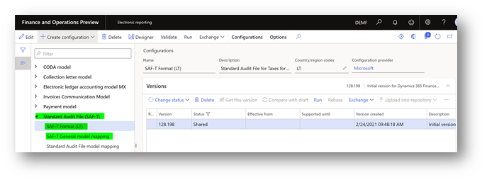
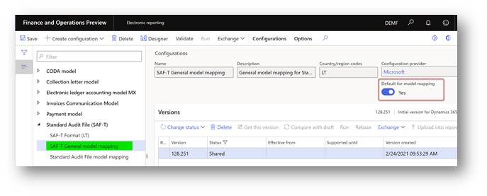
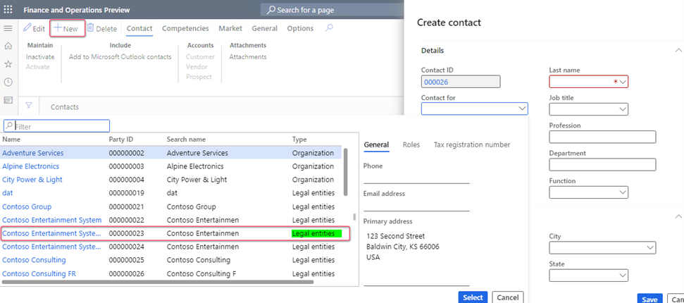

# Standard Audit File for Tax (SAF-T) for Lithuania

[!include [banner](../includes/banner.md)]

[!include [banner](../includes/preview-banner.md)]

According to Article 16 of the Law on Accounting of the Republic of Lithuania, companies in Lithuania are legally required to provide a report in Standard Audit File for Tax (SAF-T) format. This article describes how Microsoft Dynamics 365 Finance supports the SAF-T requirements and explains how to prepare Finance to work with the SAF-T report for Lithuania.

For more information, see [SAF-T - VMI](https://www.vmi.lt/evmi/en/home).

> [!NOTE]
> The [One voucher](../general-ledger/one-voucher.md) functionality introduces a limitation on further SAF-T reporting for some scenarios that are subject to SAF-T. Specifically, a bank statement scenario must be posted by using different vouchers for transactions that have different counteragent accounts. For more information about how to use the One voucher functionality and SAF-T, see the [SAF-T report and One voucher](#one-voucher) section later in this article.

## Setup

To start to work with the **Lithuania SAF-T** report, complete the following steps:

1. [Turn on features in Feature management.](#features)
2. [Import Electronic reporting configurations.](#import)
3. [Set up application-specific parameters for the **SAF-T Format (LT)** configuration.](#application)
4. [Select the SAT-T format in General ledger parameters.](#satt)
5. [Create a contact person for your company.](#contact)
6. [Configure Registration number of the legal entity.](#registration-id)

### Turn on features in Feature management

1. In the **Feature management** workspace, on the **All** tab, find and select the following features in the feature list:

    - [Standard Audit File for Tax (SAF-T) electronic report](../general-ledger/standard-audit-file.md)
    - Optimize datasets memory consumption at ER reports runtime

2. Select **Enable now**.

### Import Electronic reporting configurations

In Finance, import the following versions or later of these Electronic reporting (ER) configurations from the Global repository.

For more information about how to download ER configurations, see [Download ER configurations from the Global repository](../../fin-ops-core/dev-itpro/analytics/er-download-configurations-global-repo.md).

| ER configuration name       | Type          | Version | Description |
|-----------------------------|---------------|---------|-------------|
| Standard Audit File (SAF-T) | Model         | 128     | The common data model for different audit reports. |
| SAF-T General model mapping | Model mapping | 128.251 | The model mapping that provides general data source mapping. |
| SAF-T Format (LT)           | Format        | 128.198 | The XML format that represents the SAF-T report in accordance with the requirements for Lithuania. |

The **SAF-T General model mapping** configuration provides general data source mapping for the following master data:

- **GeneralLedgerAccounts** – General ledger.
- **Customers** – Purchasers and other debtors.
- **Suppliers** – Suppliers and other creditors.
- **TaxTable** – Tax type tables that are used in the legal entity's accounting system. Examples include value-added tax (VAT), corporate income tax, and excise taxes.
- **UOMTable** – Table for units of measurement.
- **AnalysisTypeTable** – Data tables for analytical accounting. This data is used to provide details of transaction data. Examples include unit costs, additional costs, a cost center, or a project.
- **MovementTypeTable** – Stock movement types.
- **Products** – Products and services.
- **PhysicalStock** – Data about the stock that is contained in the file.

The **SAF-T General model mapping** configuration also provides general data source mapping for the following transactional data:

- **GeneralLedgerEntries** – General ledger entries.
- **Sales invoices** – Initial sales documents.
- **PurchaseInvoices** – Accounting documents for purchases and acquisitions.
- **Payments** – Payments.
- **MovementOfGoods** – Information about the movement of goods. For example, movement occurs when goods are recorded, when goods are written off after they are sold or used in production, and when finished products, determined loss, and defective goods are recorded.
- **AssetTransactions** – Economic transactions or events for tangible or intangible economic assets, and for financial assets.

Import the most recent versions of the configurations. The version description usually includes the number of the Microsoft Knowledge Base (KB) article that explains the changes that were introduced in the configuration version.

> [!IMPORTANT]
> After all the ER configurations from the previous table are imported, set the **Default for model mapping** option to **Yes** for the **SAF-T General model mapping** configuration.
>
> 

### Set up application-specific parameters for the SAF-T Format (LT) configuration

We recommend that you enable the **Use application specific parameters from previous versions of ER formats** feature in the **Feature management** workspace. When this feature is enabled, parameters that are configured for the earlier version of an ER format automatically become applicable for the later version of the same format. If this feature isn't enabled, explicitly configure the application-specific parameters for each format version. The **Use application specific parameters from previous versions of ER formats** feature is available in the **Feature management** workspace starting in Finance version 10.0.23. For more information about how to set up the parameters of an ER format for each legal entity, see [Set up the parameters of an ER format per legal entity](../../fin-ops-core/dev-itpro/analytics/er-app-specific-parameters-set-up.md).

We recommend that you also enable the **Accelerate the ER labels storage** feature in the **Feature management** workspace. This feature helps improve network bandwidth utilization and overall system performance because, in most cases, ER labels of a single language are used when you work with a single ER configuration. The **Accelerate the ER labels storage** feature is available in the **Feature management** workspace as of Finance version 10.0.25. For more information about how to set up the parameters of an ER format for each legal entity, see [Performance](../../fin-ops-core/dev-itpro/analytics/er-design-multilingual-reports.md#performance).

1. In Electronic reporting, open the **Configurations** page. 
2. In the configuration tree, under **Standard Audit File (SAF-T)**, select **SAF-T Format (LT)**.
3. Make sure that you're working in the company that you want to set up the application-specific parameters for.
4. Select **Configurations** \> **Application-specific parameters**, and then, on the Action Pane, select **Setup**.
5. In the list on the left, select the last version of the configuration.
6. Provide the mapping for all the lookup fields:

    - **StandardAnalysisType_LOOKUP** – Define the mapping between the dimensions that are used by the company and the standard analysis types of Lithuania. Select the value **APA-100** as the last condition in the list. The **Analysis ID** column must be set to **\*Not blank\***. In the **Line** column, verify that **APA-100** is the last condition in the table. At least one line that has **\*Not blank\*** values must be set up.
    - **ReportTaxCodes_LOOKUP** – Define the mapping between the sales tax codes that are used by the company and the standard tax codes of Lithuania. Select the value **PVM100** as the last condition in the list. The **Tax Code** column must be set to **\*Not blank\***. In the **Line** column, verify that **PVM100** is the last condition in the table. At least one line that has **\*Not blank\*** values must be set up.
    - **AddressType_LOOKUP** – Define the mapping between the address types that are used by the company and the address types that are used in the SAF-T report for Lithuania. Select the value **KT** as the last condition in the list. The **Purpose Name** column must be set to **\*Not blank\***. In the **Line** column, verify that **KT** is the last condition in the table. At least one line that has **\*Not blank\*** values must be set up.
    - **StandardMainAccount_Lookup** – Define the mapping between the main accounts that are used by the company and the standard main accounts of Lithuania. Select the value **7** as the last condition in the list. The **Analysis ID** column must be set to **\*Not blank\***. In the **Line** column, verify that **7** is the last condition in the table. At least one line that has **\*Not blank\*** values must be set up.

7. When you've finished setting up the lookup fields, in the **State** field select **Completed**, and then save the configuration.

### Select the SAT-T format in General ledger parameters

1. Go to **General ledger** \> **Setup** \> **General ledger parameters**.
2. On the **Standard Audit File for Tax** FastTab, in the **Standard Audit File for Tax (SAF-T)** field, select **SAF-T Format (LT)**.

### Create a contact person for your company

The **Company** node of the SAF-T report must include information for a contact. This node is located under the **Header** node. To set up contact information that will be reported to SAF-T, follow these steps.

1. Go to **Sales and marketing** \> **Relationships** \> **Contacts** \> **All contacts**.
2. Select **New** to create a new contact for your legal entity. Be sure to select **Legal entity** in the **Contact for** field. 
3. Check by **Party ID** value to make sure that you select the legal entity that SAF-T will be reported from.

### Configure the registration number of the legal entity

To generate a SAF-T, you must configure the registration number.

1. Go to **Organization administration** > **Organizations** > **Legal entities**.
2. Select the legal entity, and then select **Registration IDs**.
3. Select or create the address in Lithuania, and then, on the **Registration ID** FastTab, select **Add**.
4. In the **Registration type** field, select the registration type that is dedicated to Lithuania, and that uses the **VAT Id** registration category.
5. In the **Registration number** field, enter the tax number.
6. On the **General** tab, in the **Effective** field, enter the date when the number becomes effective.

For more information about how to set up registration categories and registration types, see [Registration IDs](emea-registration-ids.md).

## Generate the SAF-T report

To generate the SAF-T report, go to **General ledger** > **Inquiries and reports** > **Standard Audit File for Tax (SAF-T)** > **Standard Audit File for Tax (SAF-T)**.

The following table describes the fields in the report dialog box.

| Field name | Description |
|------------|-------------|
| **SAF-T File type** | 
The SAF-T supports the following file types:
<ul><li>**F** – A full SAF-T file. This type of SAF-T file can be split by period.</li><li>**GL** – General ledger records. This part of the SAF-T file can be split by entities, periods, or parts. </li><li>**PI** – Purchase data. This part of the SAF-T file can be split by entities, periods, or parts.</li><li>**PA** – Payment data. This part of the SAF-T file can be split by entities, periods, or parts.</li><li>**SI** – Sales data. This part of the SAF-T file can be split by entities, periods, or parts.</li><li>**MG** – The movement of goods. This part of the SAF-T file can be split by entities, periods, or parts.</li><li>**AS** – The movement of fixed assets. This part of the SAF-T file can be split by entities, periods, or parts.</li><ul> |
| **Reporting period from** and **Reporting period to** | Define the start and end dates of the period that the SAF-T is requested for. The start date is reflected in the **Header** \> **SelectionCriteria** \> **SelectionStartDate** node of the SAF-T, and the end date is reflected in the **Header** \> **SelectionCriteria** \> **SelectionEndDate** node. |
| **From date** and **To date** | Specify the start and end dates of the period that the report should include data for. The start date is reflected in the **Header** \> **SelectionCriteria** \> **PeriodStart** node of the SAF-T. The end date is reflected in the **Header** \> **SelectionCriteria** \> **PeriodEnd** node. The period for one file or one part of a file can't be shorter than one month and longer than a reporting period. |
| **Number of parts** | Specify the number of parts to generate the SAF-T in. This value is reflected in the **Header** \> **NumberOfParts** node of the SAF-T. |
| **Part number** | Specify the number of the part to generate in the current SAF-T. This value is reflected in the **Header** \> **PartNumber** node of the SAF-T. |
| **Print zero balance** | This check box affects the data that is reported in the **MasterFiles** \> **GeneralLedgerAccounts** node of the SAF-T. Select this check box to include all the main accounts of your company, even main accounts that have a zero balance during the specified period. Clear the check box to include only main accounts that have a non-zero balance or transactions during the specified period. |
| **Export all Customers** | This check box affects the data that is reported in the **MasterFiles** \> **Customers** node of the SAF-T. Select this check box to include all the customers of your company, even customers that have a zero balance during the specified period. Clear the check box to include only customers that have a non-zero balance or transactions during the specified period. |
| **Export all Suppliers** | This check box affects the data that is reported in the **MasterFiles** \> **Suppliers** node of the SAF-T. Select this check box to include all the suppliers of your company, even suppliers that have a zero balance during the specified period. Clear the check box to include only suppliers that have a non-zero balance or transactions during the specified period. |
| **Export all Analysis types** | This check box affects the data that is reported in the **MasterFiles** \> **AnalysisTypeTable** node of the SAF-T. Select this check box to include all the dimensions of your company. Clear the check box to include only dimensions that are used in transactions that are reported during the specified period. |
| **Export all Products** | This check box affects the data that is reported in the **MasterFiles** \> **Products** node of the SAF-T. Select this check box to include all the products of your company, even products that have zero physical stock during the specified period. Clear the check box to include only products that have non-zero physical stock or transactions during the specified period. |
| **Export all Sales tax codes** | This check box affects the data that is reported in the  **MasterFiles** \> **TaxTable** node of the SAF-T. Select this check box to include all the sales tax codes of your company. Clear the check box to include only sales tax codes that are used in transactions that are reported during the specified period. |

## SAF-T content

According to the SAFT-T technical documentation, different types of SAF-T include different content, as shown in the following table.

| SAF-T file part        | Group of elements     | F | GL | MG | SI | PI | PA | AS |
|------------------------|-----------------------|---|----|----|----|----|----|----|
| Header                 |                       |   |    |    |    |    |    |    |
|                        | Header                | X | X  | X  | X  | X  | X  | X  |
| Master files           |                       |   |    |    |    |    |    |    |
|                        | GeneralLedgerAccounts | X | X  |    |    |    |    |    |
|                        | Customers             | X | X  | X  | X  | X  | X  |    |
|                        | Suppliers             | X | X  | X  | X  | X  | X  | X  |
|                        | TaxTable              | X | X  | X  | X  | X  |    |    |
|                        | UOMTable              | X |    | X  | X  | X  |    |    |
|                        | AnalysisTypeTable     | X | X  |    | X  | X  | X  |    |
|                        | MovementTypeTable     | X |    | X  |    |    |    |    |
|                        | Products              | X |    | X  | X  | X  |    |    |
|                        | PhysicalStock         | X |    | X  | X  | X  |    |    |
|                        | Assets                | X |    |    |    |    |    | X  |
| General ledger entries |                       |   |    |    |    |    |    |    |
|                        | GeneralLedgerEntries  | X | X  |    |    |    |    |    |
| Source documents       |                       |   |    |    |    |    |    |    |
|                        | Sales invoices        | X |    |    | X  |    |    |    |
|                        | PurchaseInvoices      | X |    |    |    | X  |    |    |
|                        | Payments              | X |    |    |    |    | X  |    |
|                        | MovementOfGoods       | X |    | X  |    |    |    |    |
|                        | AssetTransactions     | X |    |    |    |    |    | X  |
