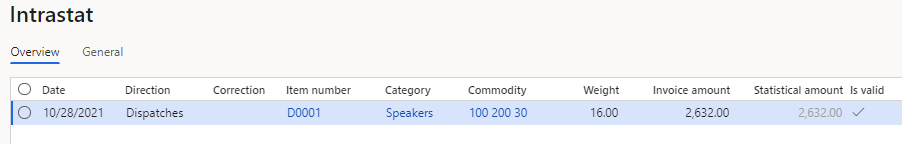
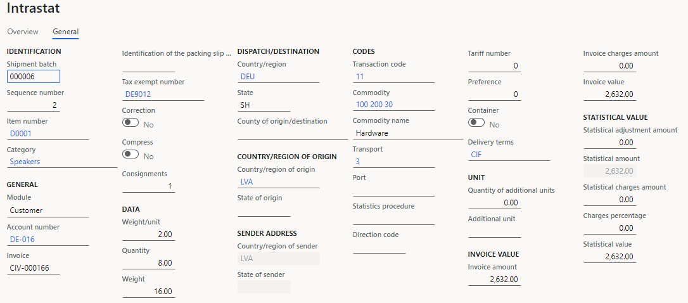
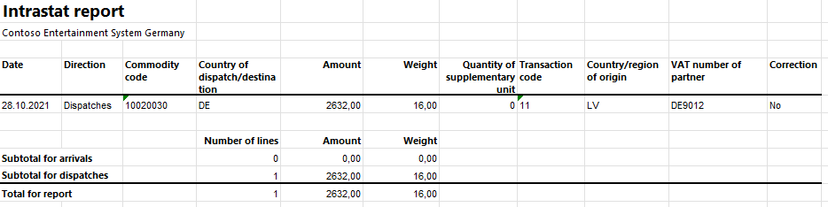
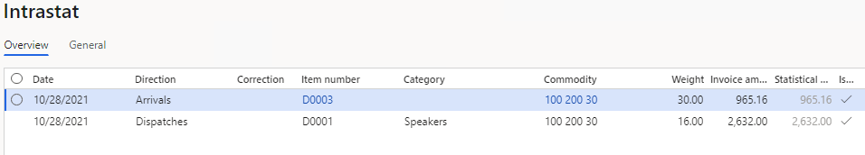
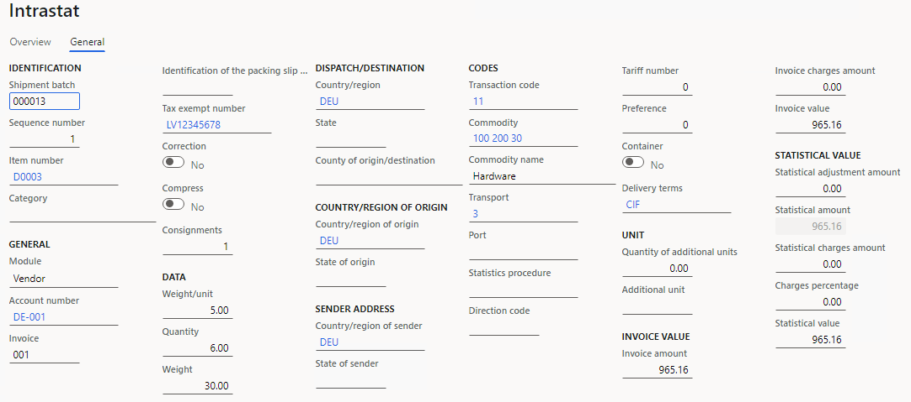
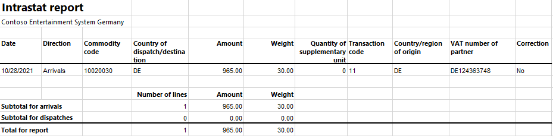

# Latvian Intrastat

[!include [banner](../includes/banner.md)]

You can use the **Intrastat** page to generate and report information about trade among European Union (EU) countries/regions. The Latvian Intrastat declaration contains information about the trade of goods for reporting.

The Latvian Intrastat declaration consists of two parts:

- **Header**: The header contains information about the company, the person who is employed by the company to fill in the declaration, and the trading items.
- **Intrastat formats**: The second part of the declaration has two formats: Intrastat format A for a simplified report and Intrastat format B for a full report.

The following table shows the fields that are included on the header. The header is the same in Intrastat format A and Intrastat format B.

| Field on the Intrastat declaration | Description |
|-------------------------|-------------------------|
| VAT registration number | The value-added tax (VAT) ID of the company. This ID is set in the **Tax registration number** field on the **Tax registration** FastTab of the **Legal entity** page. |
| Legal address | The full address of the legal entity. This address is set on the **Addresses** FastTab of the **Legal entity** page. |
| Contact address | The address of the legal entity for communication. This address is the same as the legal address. |
| Company's phone | The company's primary telephone number. This number is set on the **Contact information** FastTab of the **Legal entity** page. |
| Company's fax | The company's primary fax number. This number is set on the **Contact information** FastTab of the **Legal entity** page. |
| Company's email | The company's primary email address. This address is set on the **Contact information** FastTab of the **Legal entity** page. |
| Contact person name | The name of the employee who is filling in the declaration. This name is set on the **Agent** tab of the **Foreign trade parameters** page. |
| Contact person phone | The contact telephone number of the employee who is filling in the declaration. This number is set on the **Agent** tab of the **Foreign trade parameters** page. |
| Declaration type | This field contains information about the direction of the Intrastat report and the format of the declaration.<ul><li>For a full Intrastat report about arrivals, "Ievedums-1B" is printed.</li><li>For a full Intrastat report about dispatches, "Izvedums-2B" is printed.</li><li>For a simplified Intrastat report about arrivals, "Ievedums-1A" is printed.</li><li>For a simplified Intrastat report about dispatches, "Izvedums-2A" is printed.</li></ul> |
| Reporting year | The reference year of the declaration. |
| Reporting month | The reference month of the declaration. |
| Total number of records | The total number of records for the declaration. |
| Hours required for completion the report | The number of hours that the employee spent filling in the report. This number is specified in the **Intrastat report** dialog box. |
| Minutes required for completion the report | The number of minutes that the employee spent filling in the report. This number is specified in the **Intrastat report** dialog box. |

For full declarations (Intrastat format B), the following fields are included in the second part of the report, which describes the intracommunity trade. All the fields except **Statistical value** and **Partner ID** are included on both arrivals and dispatches. The **Statistical value** and **Partner ID** fields are included only on dispatches.

| Field on the Intrastat declaration | Description                                                                                                                                    |
|------------------------------------|------------------------------------------------------------------------------------------------------------------------------------------------|
| Commodity code                     | The commodity code according to the Combined Nomenclature (CN) classification. This code is set on the product page.                           |
| Invoice value                      | The invoice value. You can view the invoice value in the **Invoice amount** field in the Intrastat journal.                                    |
| Net mass                           | The net mass of the goods item in kilograms. The unit itself ("kg") isn't printed.                                                             |
| Supplementary units                | For some commodities, you must report the supplementary unit. The unit itself (for example, "pairs" or "dozens") isn't reported.               |
| Partner country                    | The International Organization for Standardization (ISO) code for the country or region of the partner (counterparty).                         |
| Country of origin                  | The ISO code for the country or region where the goods were produced. This code is set in the **Country of origin** field on the product page. |
| Nature of transaction              | The code that indicates the nature of the transaction.                                                                                         |
| Mode of transport                  | The code for the mode of transport.                                                                                                            |
| Delivery terms                     | The code that indicates the way that the commodities are transported to or from Latvia.                                                        |
| Statistical value                  | The statistical value. You can view the statistical value in the **Statistical value** field in the Intrastat journal.                         |
| Partner ID                         | The tax-exempt number of the counterparty.                                                                                                     |

For simplified declarations (Intrastat format A), only the following fields are included in the second part of the report:

   - Commodity code
   - Invoice value
   - Net mass
   - Supplementary units
   - Partner country
   - Country of origin
   - Nature of transaction

All the fields except **Country of origin** are included on both arrivals and dispatches. The **Country of origin** field is included only on arrivals.

For more information, go to [https://e.csb.gov.lv](https://e.csb.gov.lv/HelpDesk/UI/Page.aspx?pid=41).

## Set up Intrastat

### Import Electronic reporting configurations

To set up Intrastat, import the latest version of the following Electronic reporting (ER) configurations:

   - Intrastat model
   - Intrastat report
   - Intrastat A (LV)
   - Intrastat B (LV)

For more information, see [Download ER configurations from the Global repository of Configuration service](../../fin-ops-core/dev-itpro/analytics/er-download-configurations-global-repo.md).

### Set up contact information

You must set up your company's telephone number, email address, and fax number.

1. In Microsoft Dynamics 365 Finance, go to **Organization administration** > **Organizations** > **Legal entities**.
2. In the grid, select your company.
3. On the **Contact information** FastTab, select **Add** to create a contact.
4. In the **Type** field, select the type of communication.
5. In the **Contact number/address** field, enter your company's contact information.
6. Select the **Primary** option to print this contact information on the report.

### Set up VAT IDs

#### Set up the VAT ID of your company

1. Go to **Organization administration** > **Organizations** > **Legal entities**.
2. In the grid, select your company.
3. On the **Tax registration** FastTab, in the **Tax registration number** field, enter the VAT ID of your company.

#### Set up the VAT number of a trading partner

##### Create a registration type for the company code

You must create VAT ID registration types for all the countries or regions that your company does business with.

1. Go to **Organization administration** > **Global address book** > **Registration types** > **Registration types**.
2. On the Action Pane, select **New** to create a registration type for the VAT ID.
3. In the **Enter registration type details** dialog box, in the **Name** field, enter a name for the new registration type. For example, enter **VAT ID**.
4. In the **Country/region** field, select the country or region that your company does business with.
5. Select **Create**.

##### Match the registration type with a registration category

1. Go to **Organization administration** > **Global address book** > **Registration types** > **Registration categories**.
2. On the Action Pane, select **New** to create a link between a registration type and a registration category.
3. For the registration type for the VAT ID, select the **VAT ID** registration category.
4. Repeat steps 2 through 3 for the other registration types that you created for the countries or regions that your company does business with.

##### Create a customer's VAT registration number

1. Go to **Accounts receivable** > **Customers** > **All customers**.
2. In the grid, select a customer.
3. On the Action Pane, on the **Customer** tab, in the **Registration** group, select **Registration IDs**.
4. On the **Registration ID** FastTab, select **Add** to create a registration ID.
5. In the **Registration type** field, select the registration type that you previously created for the company code.
6. In the **Registration number** field, enter the company's VAT number.
7. On the Action Pane, select **Save**. Then close the page.

For more information, see [Registration IDs](emea-registration-ids.md).

Alternatively, you can create a customer's VAT registration number by using the **Tax exempt number** page.

1. Go to **Tax** > **Setup** > **Sales tax** > **Tax exempt numbers**.
2. For each tax-exempt number, create a record that includes the following information:
    - **Country/region**: Select the tax registration of the counterparty.
    - **Tax exempt number**: Enter the tax-exempt number of the counterparty.
    - **Company name**: Enter the name of the counterparty.
3. Go to **Accounts receivable** > **Customers** > **All customers**.
4. In the grid, select a customer.
5. On the **Invoice and delivery** FastTab, in the **Sales tax** section, in the **Tax exempt number** field, select the registration number that you just created.

### Set up foreign trade parameters

1. Go to **Tax** > **Setup** > **Foreign trade** > **Foreign trade parameters**.
2. On the **Intrastat** tab, on the **Electronic reporting** FastTab, in the **File format mapping** field, select **Intrastat A (LV)** or **Intrastat B (LV)**.
3. In the **Report format mapping** field, select **Intrastat report**.
4. On the **Commodity code hierarchy** FastTab, in the **Category hierarchy** field, select **Intrastat**.
5. In the **Transaction code** field, select the transaction code for property transfers. You use this code for transactions that produce actual or planned transfers of property against compensation (financial or otherwise). You also use it for corrections.
6. In the **Credit note** field, select the transaction code for the return of goods.
7. On the **Agent** tab, add information about the person who is employed by the enterprise to fill in the report.
    1. In the **Agent** section, in the **Name** field, enter the first and last names of the agent.
    2. In the **Contact information** section, in the **Telephone** field, enter the telephone number of the agent.
8. On the **Country/region properties** tab, in the **Country/region** field, list all the countries or regions that your company does business with. For each country that is part of the EU, select **EU** in the **Country/region type** field, so that the country appears on your Intrastat report.

### Set up the product parameters for the Intrastat declaration

1. Go to **Product information management** > **Products** > **Released products**.
2. In the grid, select a product.
3. On the **Foreign trade** FastTab, in the **Intrastat** section, in the **Commodity** field, select a commodity code.
4. In the **Origin** section, in the **Country/region** field, select the product's country or region of origin.
5. On the **Manage inventory** FastTab, in the **Net weight** field, enter the product's weight in kilograms.

### Set up the transport method and mode of delivery

1. Set up transport codes.
    1. Go to **Tax** > **Setup** > **Foreign trade** > **Transport method**.
    2. On the Action Pane, select **New**.
    3. In the **Transport** field, enter a unique code. Latvian companies use one-digit transport codes.
2. Set up mode of delivery Intrastat codes.
    1. Go to **Procurement and sourcing** > **Setup** > **Distribution** > **Terms of delivery**.
    2. In the grid, select a set of terms of delivery.
    3. On the **General** FastTab, in the **Intrastat code** field, enter a unique code.

### Set up compression of Intrastat

Go to **Tax** > **Setup** > **Foreign trade** > **Compression of Intrastat**, and select the fields that should be compared when Intrastat information is summarized. For Latvian Intrastat, select the following fields:

   - Commodity
   - Transaction code
   - Country/region of origin
   - Country/region of sender
   - Country/region
   - Correction
   - Tax exempt number
   - Direction
   - Invoice
   - Delivery terms
   - Transport

### Intrastat transfer

On the **Intrastat** page, on the Action Pane, you can select **Transfer** to automatically transfer the information about intracommunity trade from your sales orders, free text invoices, purchase orders, vendor invoices, vendor product receipts, project invoices, and transfer orders. Only documents that have an EU country as the country or region of destination (for dispatches) or consignment (for arrivals) will be transferred.

Alternatively, you can manually enter transactions by selecting **New** on the Action Pane.

### Generate an Intrastat report

1. Go to **Tax** > **Declarations** > **Foreign trade** > **Intrastat**.
2. On the Action Pane, select **Output** &gt; **Report**.
3. In the **Intrastat Report** dialog box, enter the start and end dates for the report.
4. Set the **Generate file** option to **Yes** to generate a .xml file, and then enter the name of the .xml file for the Intrastat report.
5. Set the **Generate report** option to **Yes** to generate an .xlsx file, and then enter a name for the file.
6. In the **Direction** field, select **Arrivals** if the report is about intracommunity arrivals or **Dispatches** if the report is about intracommunity dispatches.
7. In the **File format mapping** section, in the **Hours required for completion** and **Minutes required for completion** fields, specify the amount of time that you spent filling in the report.
8. Select **OK**, and review the generated reports.

## Example

The following example shows how to set up Latvian Intrastat and create the Intrastat report. It uses the **DEMF** legal entity.

1. Go to **Organization administration** > **Organization** > **Legal entities**, and select the **DEMF** legal entity.
2. On the **Addresses** FastTab, select **Edit**.
3. In the **Country/region** field, select **LVA** (Latvia).
4. Import the latest version of the following ER configurations:

    - Intrastat model
    - Intrastat report
    - Intrastat B (LV)

### Set up an address format

1. Go to **Organization administration** > **Organization** > **Legal entities**, and select the **DEMF** legal entity.
2. On the **Addresses** FastTab, select **Edit**.
3. In the **Street** field, enter **454 1st Street**.

### Set up contact information

1. Go to **Organization administration** > **Organization** > **Legal entities**, and select the **DEMF** legal entity.
2. On the **Contact information** FastTab, select **Add** to create a contact.
3. In the **Type** field, select **Phone**.
4. In the **Contact number/address** field, enter **+49 123 456 789**.
5. Select the **Primary** option.
6. In the **Type** field, select **Fax**.
7. In the **Contact number/address** field, enter **425-555-5013**.
8. Select the **Primary** option.
9. In the **Type** field, select **Email address**.
10. In the **Contact number/address** field, enter **jodi@contoso.com**.
11. Select the **Primary** option.

### Set up VAT IDs

#### Set up the VAT ID of your company

1. Go to **Organization administration** > **Organizations** > **Legal entities**.
2. In the grid, select **DEMF**.
3. On the **Tax registration** FastTab, in the **Tax registration number** field, enter **LV12345678**.

#### Create registration types for company codes

1. Go to **Organization administration** > **Global address book** > **Registration types** > **Registration types**.
2. On the Action Pane, select **New** to create a registration type for the VAT ID.
3. In the **Enter registration type details** dialog box, in the **Name** field, enter **VATID**.
4. In the **Country/region** field, select **DEU**.
5. In the **Restricted to** field, select **Organization**.
6. Select **Create**.

#### Match the registration type with a registration category

1. Go to **Organization administration** > **Global address book** > **Registration types** > **Registration categories**.
2. On the Action Pane, select **New** to create a link between the registration type and the registration category.
3. For the **VATID** registration type, select the **VAT ID** registration category.

#### Set up the customer's VAT registration number

1. Go to **Accounts receivable** > **Customers** > **All customers**.
2. In the grid, select **DE-016**.
3. On the Action Pane, on the **Customer** tab, in the **Registration** group, select **Registration IDs**.
4. On the **Registration ID** FastTab, select **Add** to create a registration ID.
5. In the **Registration type** field, select **VATID**.
6. In the **Registration number** field, enter **DE9012**.
7. On the Action Pane, select **Save**. Then close the page.

### Set up foreign trade parameters

1. Go to **Tax** > **Setup** > **Foreign trade** > **Foreign trade parameters**.
2. On the **Intrastat** tab, on the **General** FastTab, in the **Transaction** **code** field, select **11**.
3. On the **Electronic reporting** FastTab, in the **File format mapping** field, select **Intrastat B (LV)**.
4. In the **Report format mapping** field, select **Intrastat Report**.
5. On the **Commodity code hierarchy** FastTab, verify that the **Category hierarchy** field is set to **Intrastat**.
6. On the **Country/region properties** tab, select **New**.
7. In the **Party country/region** field, select **LVA**. Then, in the **Country/region type** field, select **Domestic**.
8. In the **Party country/region** field, select **DEU** (Germany). Then, in the **Country/region type** field, select **EU**.
9. On the **Agent** tab, in the **Name** field, enter **Manish Chopra**.
10. In the **Telephone** field, enter **425-555-5068**.

### Set up product information

1. Go to **Product information management** > **Products** > **Released products**.
2. In the grid, select **D0001**.
3. On the **Foreign trade** FastTab, in the **Intrastat** section, in the **Commodity** field, select **100 200 30**.
4. In the **Origin** section, in the **Country/region** field, select **LVA**.
5. On the **Manage inventory** FastTab, in the **Weight measurements** section, in the **Net weight** field, enter **2**.
6. On the Action Pane, select **Save**.
7. In the grid, select **D0003**.
8. On the **Foreign trade** FastTab, in the **Intrastat** section, in the **Commodity** field, select **100 200 30**.
9. In the **Origin** section, in the **Country/region** field, select **DEU**.
10. On the **Manage inventory** FastTab, in the **Weight measurements** section, in the **Net weight** field, enter **5**.
11. On the Action Pane, select **Save**.

### Change the site address

1. Go to **Warehouse management** > **Setup** > **Warehouse** > **Sites**.
2. In the grid, select **1**.
3. On the **Addresses** FastTab, select **Edit**.
4. In the **Edit address** dialog box, in the **Country/region** field, select **LVA**.
5. Select **OK** to close the **Edit address** dialog box.

### Set up a transport method

1. Create a transport method.

    1. Go to **Tax** > **Setup** > **Foreign trade** > **Transport method**.
    2. On the Action Pane, select **New**.
    3. In the **Transport** field, enter **3**.
    4. In the **Description** field, enter **Road transport**.
2. Assign the transport method to the mode of delivery. In this way, you set up the default values that are used for the transport method when the corresponding mode of delivery is selected.

    1. Go to **Procurement and sourcing** > **Setup** > **Distribution** > **Modes of delivery**.
    2. In the grid, select **10**.
    3. On the **Foreign trade** FastTab, in the **Transport** field, select **3**.
3. Select the default mode of delivery for a customer.

    1. Go to **Accounts receivable** > **Customers** > **All customers**.
    2. In the grid, select **DE-016**.
    3. On the **Invoice and delivery** FastTab, in the **Mode of delivery** field, select **10**.
4. Select the default mode of delivery for a vendor.

    1. Go to **Accounts payable** > **Vendors** > **All vendors**.
    2. In the grid, select **DE-001**.
    3. On the **Invoice and delivery** FastTab, in the **Mode of delivery** field, select **10**.

### Set up codes for terms of delivery

1. Set up the Intrastat code for the terms of delivery.

    1. Go to **Procurement and sourcing** > **Setup** > **Distribution** > **Terms of delivery**.
    2. In the grid, select **CIF**.
    3. On the **General** FastTab, in the **Intrastat code** field, enter **CIF**.
2. Select the default delivery terms for a customer.

    1. Go to **Accounts receivable** > **Customers** > **All customers**.
    2. In the grid, select **DE-016**.
    3. On the **Invoice and delivery** FastTab, in the **Delivery terms** field, select **CIF**.
3. Select the default delivery terms for a vendor.

    1. Go to **Accounts payable** > **Vendors** > **All vendors**.
    2. In the grid, select **DE-001**.
    3. On the **Invoice and delivery** FastTab, in the **Delivery terms** field, select **CIF**.

### Create a sales order with an EU customer

1. Go to **Accounts receivable** > **Orders** > **All sales orders**.
2. On the Action Pane, select **New**.
3. In the **Create sales order** dialog box, on the **Customer** FastTab, in the **Customer** section, in the **Customer account** field, select **DE-016**.
4. On the **General** FastTab, in the **Storage dimensions** section, in the **Site** field, select **1**.
5. In the **Warehouse** field, select **11**.
6. On the **Address** tab, verify that the **Address** field is set to **Teichgasse 12, Kiel, 24103, DEU**, because the vendor is from Germany.
7. Select **OK**.
8. On the **Header** tab, on the **Delivery** FastTab, verify that the **Delivery terms** field is set to **CIF**.
9. On the **Lines** tab, on the **Sales order lines** FastTab, in the **Item number** field, select **D0001**. Then, in the **Quantity** field, enter **8**.
10. On the **Line details** FastTab, on the **Foreign trade** tab, verify that the **Transaction code** field is set to **11**, the **Transport** field is set to **3**, the **Commodity** field is set to **100 200 30**, and the **Country/region of origin** field is set to **LVA**.
11. On the Action Pane, select **Save**.
12. On the Action Pane, on the **Invoice** tab, in the **Generate** group, select **Invoice**.
13. In the **Posting invoice** dialog box, on the **Parameters** FastTab, in the **Parameter** section, in the **Quantity** field, select **All**.
14. Select **OK** to post the invoice.

### Transfer the transaction to the Intrastat journal and review the result

1. Go to **Tax** > **Declarations** > **Foreign trade** > **Intrastat**.
2. On the Action Pane, select **Transfer**.
3. In the **Intrastat (Transfer)** dialog box, in the **Parameters** section, set the **Customer invoice** option to **Yes**.
4. Select **Filter**.
5. In the **Intrastat Filter** dialog box, on the **Range** tab, select the first line, and verify that the **Field** field is set to **Date**.
6. In the **Criteria** field, select the current date.
7. Select **OK** to close the **Intrastat Filter** dialog box.
8. Select **OK** to close the **Intrastat (Transfer)** dialog box, and review the result. The line represents the sales order that you created earlier.

    

9. Select the transaction line, and then select the **General** tab to view more details.

    

10. On the Action Pane, select **Output** > **Report**.
11. In the **Intrastat Report** dialog box, on the **Parameters** FastTab, in the **Date** section, select the month of the sales order that you created.
12. In the **Export** **options** section, set the **Generate file** option to **Yes**. Then, in the **File name** field, enter the required name.
13. Set the **Generate report** option to **Yes**. Then, in the **Report file name** field, enter the required name.
14. In the **Direction** field, select **Dispatches**.
15. In the **File format mapping** section, in the **Hours required for completion** field, enter **11**.
16. In the **Minutes required for completion** field, enter **22**.
17. Select **OK**, and review the report in XML format that is generated. The following table shows the values in the example report.

      | Field on the Intrastat declaration         | Value              |
      |--------------------------------------------|--------------------|
      | VAT registration number                    | LV12345678         |
      | Legal address                              | 454 1st Street LVA |
      | Contact address                            | 454 1st Street LVA |
      | Phone                                      | +49 123 456 789    |
      | Fax                                        | 425-555-5013       |
      | Email                                      | jodi@contoso.com   |
      | Contact person name                        | Manish Chopra      |
      | Contact person phone                       | 425-555-5068       |
      | Direction                                  | Izvedums-2B        |
      | Reporting year                             | 2021               |
      | Reporting month                            | M10                |
      | Total number of records                    | 1                  |
      | Hours required for completion the report   | 11                 |
      | Minutes required for completion the report | 22                 |
      | Commodity code                             | 10020030           |
      | Invoice value                              | 2632               |
      | Net mass                                   | 16                 |
      | Supplementary units                        | 0                  |
      | Partner country                            | DE                 |
      | Nature of transaction                      | 11                 |
      | Mode of transport                          | 3                  |
      | Delivery terms                             | CIF                |
      | Statistical value                          | 2632               |
      | Country of origin                          | LV                 |
      | Partner ID                                 | DE9012             |

18. Review the generated report file.

    

### Create a purchase order

1. Go to **Accounts payable** > **Purchase orders** > **All purchase orders**.
2. On the Action Pane, select **New**.
3. In the **Create purchase order** dialog box, in the **Vendor account** field, select **DE-001**.
4. In the **Site** field, select **1**.
5. In the **Warehouse** field, select **11**.
6. Select **OK**.
7. On the **Header** tab, on the **Delivery** FastTab, verify that the **Mode of delivery** field is set to **10**, and the **Delivery terms** field is set to **CIF**.
8. On the **Lines** tab, on the **Purchase order lines** FastTab, in the **Item number** field, select **D0003**. Then, in the **Quantity** field, enter **6**.
9. On the **Line details** FastTab, on the **Foreign trade** tab, verify that the **Transaction code** field is set to **11**, the **Transport** field is set to **3**, the **Commodity** field is set to **100 200 30**, and the **Country/region of origin** field is set to **DEU**.
10. On the Action Pane, on the **Purchase** tab, in the **Actions** group, select **Confirm**.
11. On the Action Pane, on the **Invoice** tab, in the **Generate** group, select **Invoice**.
12. On the Action Pane, select **Default from**. In the **Default quantity for lines** field, select **Ordered quantity**. Then select **OK**.
13. On the **Vendor Invoice header** FastTab, in the **Invoice identification** section, in the **Number** field, enter **001**.
14. On the Action Pane, select **Post** to post the invoice.

### Create an Intrastat declaration for arrivals

1. Go to **Tax** > **Declarations** > **Foreign trade** > **Intrastat**.
2. On the Action Pane, select **Transfer**.
3. In the **Intrastat (Transfer)** dialog box, set the **Vendor invoice** option to **Yes**.
4. Select **Filter**.
5. In the **Intrastat Filter** dialog box, on the **Range** tab, select the **Vendor invoice journal** line, and verify that the **Field** field is set to **Date**.
6. In the **Criteria** field, select the current date.
7. Select **OK** to close the **Intrastat Filter** dialog box.
8. Select **OK** to transfer the transactions, and review the Intrastat journal.

    

9. Review the **General** tab for the purchase order.

    

10. On the Action Pane, select **Output** > **Report**.
11. In the **Intrastat Report** dialog box, on the **Parameters** FastTab, in the **Date** section, select the month of the purchase order that you created.
12. In the **Export** **options** section, set the **Generate file** option to **Yes**. Then, in the **File name** field, enter the required name.
13. Set the **Generate report** option to **Yes**. Then, in the **Report file name** field, enter the required name.
14. In the **Direction** field, select **Arrivals**.
15. In the **File format mapping** section, in the **Hours required for completion** field, enter **11**.
16. In the **Minutes required for completion** field, enter **22**.
17. Select **OK**, and review the report in XML format that is generated. The following table shows the values in the example report.

      | Field on the Intrastat declaration         | Value              |
      |--------------------------------------------|--------------------|
      | VAT registration number                    | LV12345678         |
      | Legal address                              | 454 1st Street LVA |
      | Contact address                            | 454 1st Street LVA |
      | Phone                                      | +49 123 456 789    |
      | Fax                                        | 425-555-5013       |
      | Email                                      | jodi@contoso.com   |
      | Contact person name                        | Manish Chopra      |
      | Contact person phone                       | 425-555-5068       |
      | Direction                                  | Izvedums-1B        |
      | Reporting year                             | 2021               |
      | Reporting month                            | M10                |
      | Total number of records                    | 1                  |
      | Hours required for completion the report   | 11                 |
      | Minutes required for completion the report | 22                 |
      | Commodity code                             | 10020030           |
      | Invoice value                              | 965                |
      | Net mass                                   | 30                 |
      | Supplementary units                        | 0                  |
      | Partner country                            | DE                 |
      | Country of origin                          | DE                 |
      | Nature of transaction                      | 11                 |
      | Transport mode                             | 3                  |
      | Delivery terms                             | CIF                |
      | Invoice value in euro                      | 965                |

18. Review the generated Excel report.

    

[!INCLUDE[footer-include](../../includes/footer-banner.md)]
