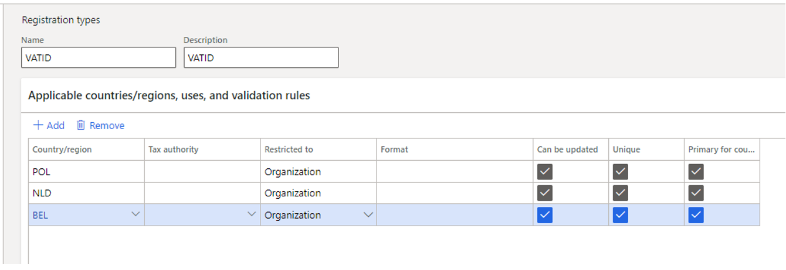
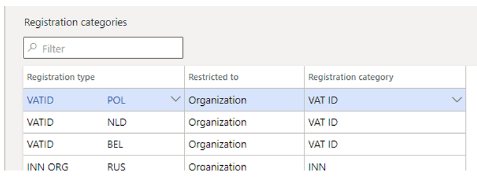
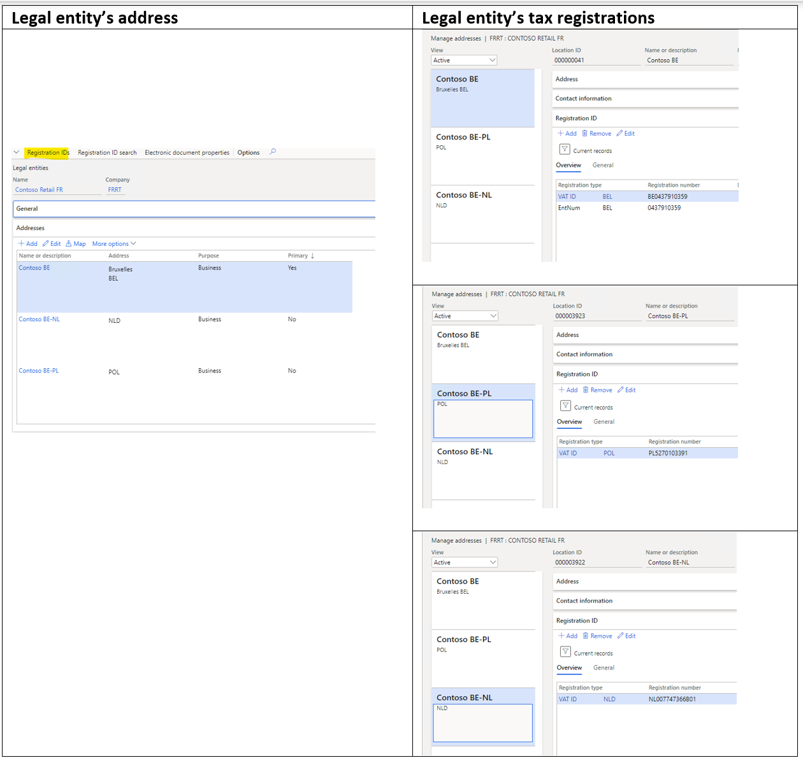
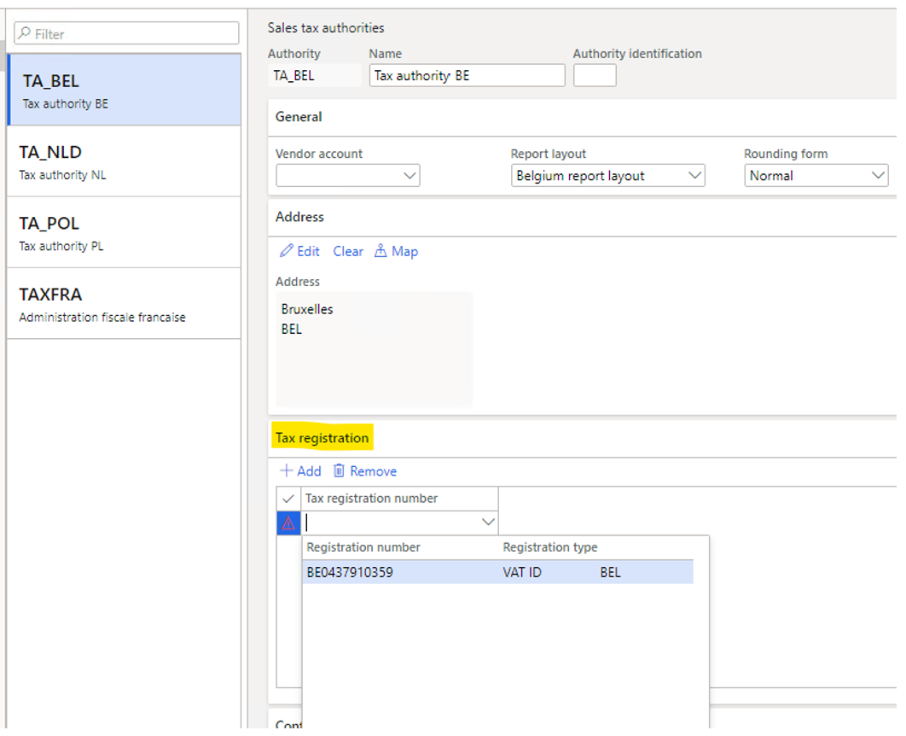
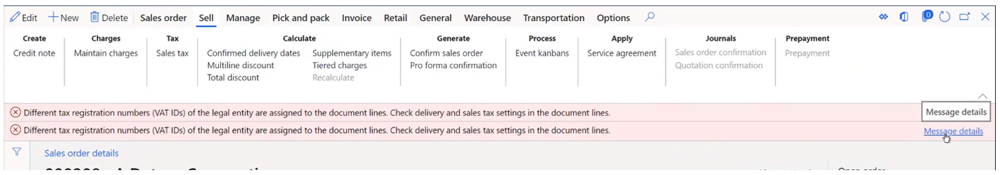

---
# required metadata

title: Multiple VAT registration numbers - Preview
description: This topic provides information about the functionality of Multiple VAT registration numbers.
author: epodkolz
manager: AnnBe
ms.date: 03/04/2021
ms.topic: article
ms.prod: 
ms.service: dynamics-ax-applications
ms.technology: 

# optional metadata

# ms.search.form: 
# ROBOTS: 
audience: Application User
# ms.devlang: 
ms.reviewer: kfend
ms.search.scope: Core, Operations
# ms.tgt_pltfrm: 
# ms.custom: 
ms.search.region:
# ms.search.industry: 
ms.author: epodkolz
ms.search.validFrom:
ms.dyn365.ops.version: AX 10.0.18
---

# Multiple VAT registration numbers

[!include [banner](../includes/banner.md)]

[!include [banner](../includes/preview-banner.md)]

This topic provides information about the functionality of multiple VAT registration numbers. This functionality allows users to set up the tax registration numbers of a legal entity and its customers and vendors in different EU Member States, and then post and settle taxes per registration in the country.

The main steps to configure and use this functionality are:
 - Assign the Registration type for VAT registration to the VAT ID registration category.
 - Set up the customer and vendor VAT registration IDs for each legal entity's VAT registration.
 - Specify the legal entity’s VAT registration number to the sales tax authority, and the settlement period. The sales tax codes assigned to the settlement period will identify the legal entity’s VAT registration.

The customer and vendor VAT registration numbers for transactions are identified by the Tax service matrix. The identified tax registration numbers are available in the sales tax transactions.

The sales tax settlement procedure uses the country/region code of the registration ID. 

## Enable the feature

Enable flighting:
•	TaxIntegrationFlight 
•	TaxMultipleVATIDFlighting
•	TaxMultipleVATIDFeature

1. Go to the **Feature management** workspace and enable the feature, **Support multiple VAT registration numbers**.
2. Go to **Tax** > **Setup** >**Tax service parameters** and select **Enable tax service**.

## Set up a VAT ID for a legal entity, customers, and vendors

To set up the VAT ID for a legal entity and its customers and vendors, VAT IDs must be created using the registration ID framework. For more information, see [Registration IDs](emea-registration-ids.md).

### Set up registration types and categories

1. Go to **Organization administration** > **Global address book** > **Registration types** > **Registration types** and create a new registration type. For example, VAT ID.

   

2. Create as many registration type lines as the legal entity, customers, and vendors have registrations in other country/regions.

   

3. Go to **Organization administration** > **Global address book** > **Registration types** > **Registration categories** and assign the created registration types to the VAT ID registration category.

   

### Assign VAT IDs to legal entity, customers and vendors

1. Go to **Organization administration** > **Organizations** > **Legal entities**.
2. On the **Legal entities** page, select **Registration IDs** and assign VAT ID registration to the respective address where the legal entity has VAT registration.

    

> [!NOTE]
> To automatically identify customer and vendor VAT registration numbers for sales tax transactions and sales and purchase documents, create the nummbers in the tax matrix.

### Number sequences for a legal entity's registration numbers

To generate separate number sequences for documents such as packing slips and invoices, create a number sequence group. 

On the **General** tab, on the **Registration ID** FastTab, assign the number sequence group to the respective VAT ID of the legal entity.

Set up the necessary number sequences codes for the supported references. For example, sales invoice, sales invoice voucher, packing slip, and packing slip voucher.

This number sequence group code defaults to the sales or purchase order header after the legal entity's tax registration is determined. The documents are numbered according to the number sequences assigned to the **References**:

At this time, the default logic only supports sales and purchse orders.

### Set up tax authorities

1. Go to **Tax** > **Indirect taxes** > **Sales tax** > **Sales tax authorities** and create as many tax authorities as legal entity need to report to.
2. On the **Tax registration** tab, add the respective VAT registration number.

> [!NOTE]
> The **Tax registration number** lookup only contains the registration numbers of the legal entity with a VAT ID registration category. The list of registration IDs is available for the corresponding country/region of the tax authority. 
> 
> Date effectivity isn't supported for assigned registration IDs. If the number is changed or expired in the Legal entity Registration ID, the user must manually update the tax registration in the tax authority. 

### Set up the sales tax settlement period

Create sales tax settlement periods, and in the **Tax registration number** field, verify that the corresponding legal entity’s VAT ID is assigned.

### Set up customer and vendor tax registration numbers in the Tax feature setup

In the **Microsoft Dynamics 365 Regulatory Service** for the Tax feature, verify that the registration IDs for customers and vendors are defined on the **Customer Tax Registration Number Applicability** and **Vendor Tax Registration Applicability** tabs.

> [!NOTE]
> During sales tax calculation and documents posting, the tax service returns a value of Customer/Vendor tax registration number to Dynamics 365 Finance and update the **Tax exempt number** field on the sales or purchase order. When the corresponding value isn't set up in the Registration ID of customer or vendor, the registration ID will be left blank and you will receive the message: “Customer tax registration ‘xxx’ is not found in the customer’s Registration IDs setup. To add customer tax registration to sales tax transactions and posted documents, make sure the registration is defined in the Registration IDs setup.”

## Sales and purchse order processing

Make sure the **Enable tax service** option is switched on in the **Tax service parameters**, and that **Sales** and **Purchase** are selected in the **Business process**.

When the lines of a sales or purchase order are created with sales tax codes that are assigned to different sales tax settlement periods and tax registrations, there are multiple registration IDs for the order. To control the system behavior for this scenario, the **Check Tax registration number in document lines** parameter is added on the **Accounts receiveable parameters** and **Accounts payable parameters** pages. 
At this time, the scenario of sales tax codes assigned to different registration IDs on a sales or purchase order isn't supported. During sales tax calculation and document posting, an error message is shown and you can't continue the process.

You can find information about the item ID, sales tax codes, settlement periods, and tax registration numbers identified for the order lines in the message details.

### Temporary sales tax and posted sales tax

On the **Temporary sales tax** page you can preview the identified legal entity’s and customer and vendor VAT registration numbers. Two new fields are added to the page:

  - **Tax registration number**L The VAT ID of the legal entity
  - **Customer tax registration number** (sales order) and **Vendor tax registration number** (purchase order): The VAT ID of the customer or vendor.

On the **Posted sales tax** page, two new field are added: 

  - **Tax registration number**: The VAT ID of the legal entity
  - - **Counterparty tax registration number**: The VAT ID of the counterparty. You can sort and filter sales tax transactions by these fields.

### Sales tax settlement procedure updates

The **Settle and post sales tax** periodic is updated to use the county/region code of the legal entity tax registration.

> [!NOTE]
> If the tax registration number isn't set on a tax period, the following error message occurs: "Tax registration number is not set up for the tax settlement period xxx" and settlement process is stopped.

After the settlement process is complete, the sales tax payment report isn't printed. Instead, the following message is displayed: "The sales tax settlement and posting is completed. The voucher 'xxxx, m/d/yyyy' has been posted."

The report can still be run by going to **Tax** > **Inquiries and reports** > **Sales tax inquiries** >  **Sales tax payments**.

> [!NOTE]
> Even if the feature isn't enabled in the **Tax service parameters**, the tax registration ID will be copied from the original sales tax transactions to the offset sales tax transactions. 
