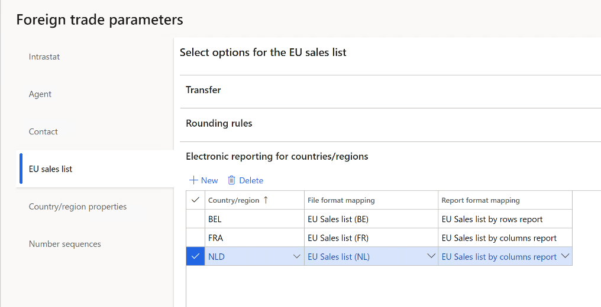
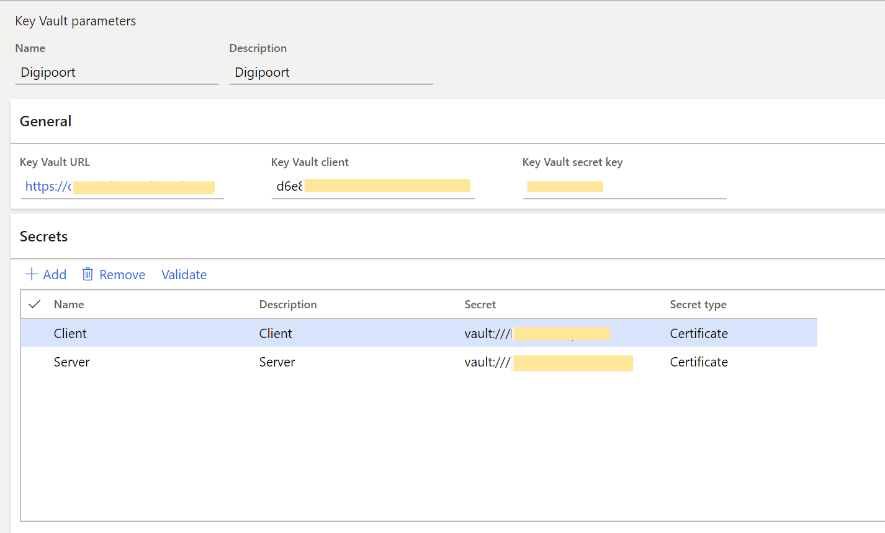
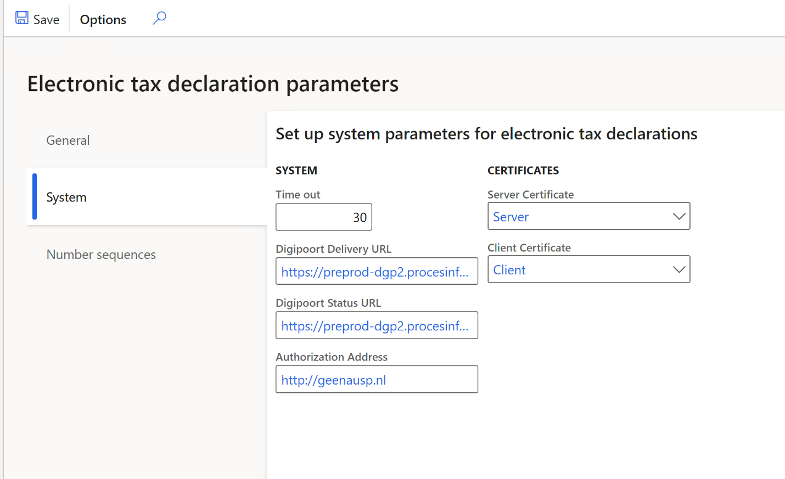
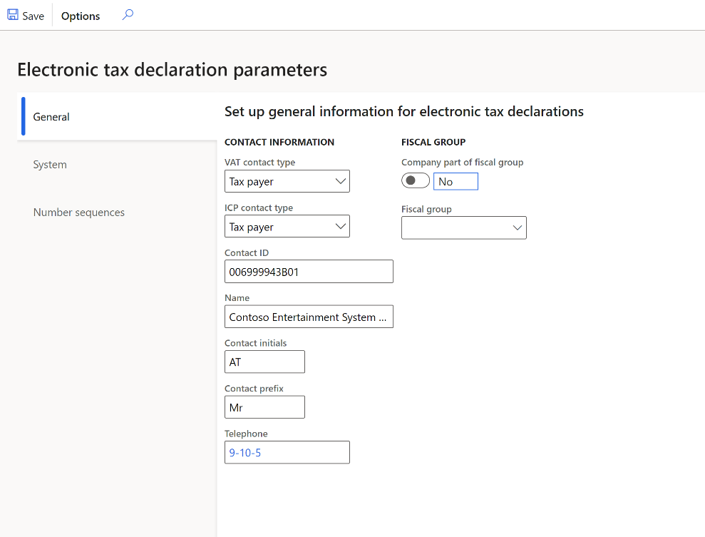
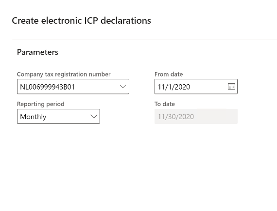
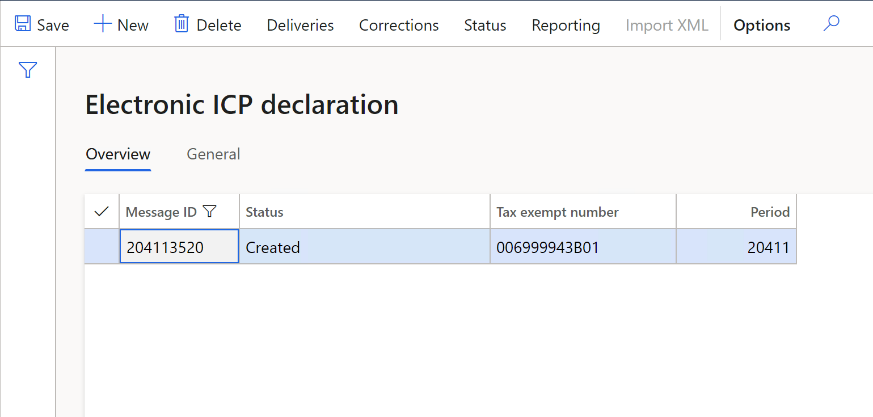
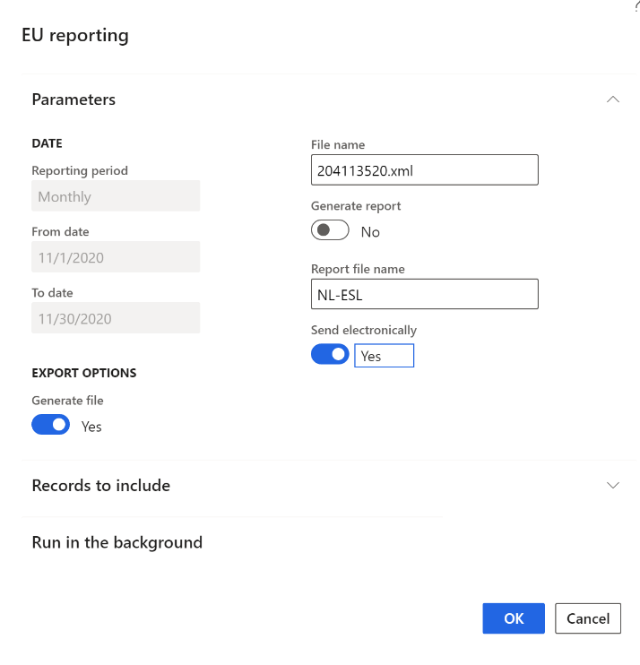

---
# required metadata

title: EU sales list for Netherlands
description: This topic provides information about how to generate the EU sales list for Netherlands.
author: anasyash
ms.date: 09/14/2021
ms.topic: article
ms.prod: 
ms.technology: 

# optional metadata

ms.search.form: 
audience: Application User
# ms.devlang: 
ms.reviewer: kfend
# ms.tgt_pltfrm: 
ms.custom: 261354
ms.search.region: 
# ms.search.industry: 
ms.author: kfend
ms.search.validFrom: 
ms.dyn365.ops.version: 

---

# EU sales list for Netherlands

[!include [banner](../includes/banner.md)]

You can generate a European Union (EU) sales list for the Netherlands in XML format that follows [NL SBR taxonomies](https://www.sbr-nl.nl/werken-met-sbr/taxonomie/documentatie-nederlandse-taxonomie) description. Taxonomies are updated by the authority each year. For example, in 2021 the taxonomy NT15 is applicable.

You can also preview the EU sales list report in Microsoft Excel format. Two formats are available to select: **EU sales list by rows report** or **EU sales list by columns report**.

As a prerequisite, you should learn about EU sales list reporting and create all the necessary settings described in [EU Sales list reporting](emea-eu-sales-list.md).

## Set up EU sales list for Netherlands

### Set up XML namespaces for the EU sales list in XML

To set up XML namespaces for the EU sales list in XML, follow these steps:

1. Go to **Workspaces** \> **Electronic reporting**, and import version 1.10 or higher of the format, **EU Sales list (NL).** For more information, see [Download ER configurations from the Global repository of Configuration service](../../fin-ops-core/dev-itpro/analytics/er-download-configurations-global-repo.md).
2. Select **Configurations** > **Application specific parameters setup**.
3. On the **Lookups** FastTab, select **XMLNamespaces**.
4. On the **Conditions** FastTab, define the path to the XSD schema and the paths to the schema instances, **SchemaInstanceData** and **SchemaInstanceTuples**.

    | **Name**             | **Lookup result**                                                                 |
    |----------------------|-----------------------------------------------------------------------------------|
    | XSDSchema            | http://www.nltaxonomie.nl/nt15/bd/20201209/entrypoints/bd-rpt-icp-opgaaf-2021.xsd |
    | SchemaInstanceData   | http://www.nltaxonomie.nl/nt15/bd/20201209/dictionary/bd-data                     |
    | SchemaInstanceTuples | http://www.nltaxonomie.nl/nt15/bd/20201209/dictionary/bd-tuples                   |

For more information about how to get the values from official documentation, see [How-to get XSD schema and namespaces for the Dutch taxonomy](#get-xsd-schema-and-namespaces-for-the-dutch-taxonomy).

### Set up EU sales list reporting formats

To set up and generate the Dutch EU sales list for [Multiple VAT registrations](emea-reporting-for-multiple-vat-registrations.md), go to the **Feature management** workspace and enable the feature, **Dutch ICP declaration**. 

To set up EU sales list reporting formats, follow these steps:

1. Go to **Tax** > **Setup** > **Foreign trade** > **Foreign trade parameters**.
2. On the **EU sales list** tab, in the **File format mapping** field, select the ER format **EU sales list (NL)** that you imported.
3. In the **Report format mapping** field, select either **EU Sales list by rows report** or **EU sales list by columns report**.
4. For legal entities with [Multiple VAT registrations](emea-reporting-for-multiple-vat-registrations.md), on the **EU sales list** tab, on the **Electronic reporting for countries/regions** FastTab, on the NLD country/region line, select the ER format **EU sales list (NL)** that you imported.

    

## Set up electronic transmission of tax declarations to Digipoort

Digipoort is the service used to transmit declarations to the Dutch government. Digipoort works as an electronic post office in that it receives a message, checks the message, and then confirms receipt of the message.

### Set up Azure Key Vault for certificate storage

To set up Azure Key Vault for certificate storage, follow these steps:

1. Go to **System administration** > **Setup** > **System parameters**.
2. On the **General** tab, set the **Use advanced certificate store** option to **Yes**.
3. Upload the certificate to KeyVault.
4. Go to **System administration** > **Setup** > **Key Vault parameters**.
5. Select **New** and set the **Name** and **Description** fields as **Digipoort**.
6. On the **General** FastTab, set the following fields:

    - **Key Vault URL**: Enter the default Azure Key Vault URL.
    - **Key Vault client**: Enter the interactive client ID of the Azure Active Directory (Azure AD) application that is associated with Key Vault storage for authentication.
    - **Key Vault secret key**: Enter a secret key that is associated with the Azure AD application that's used for authentication to Key Vault storage.

7. On the **Secrets** FastTab, select **Add**, and create lines for Key Vault secrets for the Digipoort server and client certificates.

    

For more information about how to set up Key Vault parameters, see [Set up the Azure Key Vault client](setting-up-azure-key-vault-client.md).

### Set up electronic tax declaration parameters

To set up electronic tax declaration parameters, follow these steps:

1. Go to **Tax** > **Setup** > **Sales tax** > **Electronic tax declaration parameters**.

    For legal entities with [Multiple VAT registrations](emea-reporting-for-multiple-vat-registrations.md), go to **Tax** > **Setup** > **Foreign trade > Dutch electronic tax declaration parameters**.

2. On the **System** tab, set the following fields:

    - **Digipoort Delivery URL**: Enter the destination URL for the Digipoort service. For example, enter *https://preprod-dgp2.procesinfrastructuur.nl/wus/2.0/aanleverservice/1.2"*.
    - **Digipoort Status URL**: Enter the URL for the message statuses. For example, enter *https://preprod-dgp2.procesinfrastructuur.nl/wus/2.0/statusinformatieservice/1.2*.
    - **Authorization Address**: Enter the URL for authorization. For example, enter *http://geenausp.nl*.
    - **Server Certificate**: Select the line that you created for the Key Vault secret for the Digipoort server certificate.
    - **Client Certificate**: Select the line that you created for the Key Vault secret for the Digipoort client certificate.

    

## Set up the Dutch EU sales list transmission to Digipoort

### Set up Dutch electronic tax declaration parameters

To set up Dutch electronic tax declaration parameters, follow these steps:

1. Go to **Tax** > **Setup** > **Sales tax** > **Electronic tax declaration parameters**.

    For legal entities with [Multiple VAT registrations](emea-reporting-for-multiple-vat-registrations.md), go to **Tax** \> **Setup** \> **Foreign trade** \> **Dutch electronic tax declaration parameters**.

2. On the **General** tab, in the **ICP contact type** field, select **Taxpayer** or **Agent**.
3. Select information in the **Contact ID, Name, Contact initials**, **Contact prefix**, and **Telephone** fields.
4. Set the **Company part of fiscal group** option to **Yes** if this setting is appropriate, and then, in the **Fiscal group** field, select the tax exempt number of the fiscal group.

    

5. On the **Number sequences** tab, in the **Number sequence code** field, select a number sequence code for the **Electronic ICP declaration ID** and **Error ID** references.

## Generate the Dutch EU sales list and send to Digipoort

### Transfer transactions and preview files

To transfer transactions and preview files, follow these steps:

1. Go to **Tax** > **Declarations** > **Foreign trade** > **EU sales list**. Transfer the EU sales list transactions for the Netherlands to the EU sales list.
2. Mark any corrected lines as **Corrected**.

    

    For more information about how to work with the EU sales list journal, see [EU Sales list reporting](emea-eu-sales-list.md).

    For more information about reporting of legal entities with multiple VAT registrations, see [Reporting for Multiple VAT registrations](emea-reporting-for-multiple-vat-registrations.md).

3. Select **Reporting** to preview the EU sales list files. In the **EU reporting** dialog box, set the following parameters:

    - In the **Reporting period** field, select **Monthly or Quarterly.**
    - In the **From date** field, select the first date of the reporting period.
    - Set **Generate file** to **Yes** to generate an XML file.
    - Set **Generate report** to **Yes** to generate a Microsoft Excel report.

### Create ICP declaration and send to Digipoort

To create ICP declaration and send to Digipoort, follow these steps:

1. Go to **Tax** > **Declarations** > **Foreign trade** > **Dutch electronic ICP declaration**.
2. Select **New**, and in the **Create electronic ICP declaration** dialog box, select **Company tax registration number**.
3. Enter or select a value in the **From date** field, and then select the **Reporting period**.

    

4. Select **OK**. The electronic message is created.

    

5. Select **Deliveries** to review the lines of the EU sales list that are transferred to the message from the **EU sales list** page.
6. Select **Corrections** to review the correction lines of the EU sales list that are transferred to the message from **EU sales list** page.
7. Select **Reporting** to generate an XML file of the EU sales list and set report generation parameters in the **EU reporting** dialog box.
8. Set **Send electronically** to **Yes** to send the generated XML file to **Digipoort.**

    

9. Select **OK** and refresh the page. The message status is changed to **Sent**.
10. Select **Import XML** to import the response from Digipoort. The message status is changed to **Acknowledgement**.

## Get XSD schema and namespaces for the Dutch taxonomy

Dutch taxonomies change once a year. Check for the availability of a new taxonomy to get the new path to the XSD schema and new namespaces. Update application specific parameters accordingly.

1. Open [Documentatie Nederlandse Taxonomie \| Standard Business Reporting (sbr-nl.nl)](https://www.sbr-nl.nl/werken-met-sbr/taxonomie/documentatie-nederlandse-taxonomie)
2. In the **Organisatie** field, select **Belastingdienst.**
3. In the **Documenten** field, select for example **Omzetbelasting 2021** to get taxonomy for 2021 year.
4. Select **Filter resultaten**.
5. Locate the document with description of changes, for example for changes between NT14 and NT15 taxonomies, and download the [NT15_BD_20201209 Versioning_NT14_20191211_to_NT15_20201209](https://www.sbr-nl.nl/sites/default/files/bestanden/taxonomie/NT15_BD_20201209%20Versioning_NT14_20191211_to_NT15_20201209.zip) zip archive. Unzip the file.

### EU sales list

To view the changes in EU sales list, complete the following steps.

1. Open the file, Versioning_rpt-from_NT14_20191211_to_NT15_20201209-bd-rpt-icp-opgaaf-2021.html to view the changes in EU sales list.
2. In the file, under *Schema referenties*, you can see xsd schema names for taxonomies NT14 and NT15. Take the value for entering to **XSDSchema** lookup result. Find more details about application specific parameters for EU sales list format in the section [Set up XML namespaces for the EU sales list in XML](#set-up-xml-namespaces-for-the-eu-sales-list-in-xml) above
3. In the file, under the **Namespaces** table, you can see the line: bd-i=http://www.nltaxonomie.nl/nt15/bd/20201209/dictionary/bd-data. Take this value for entering to **SchemaInstanceData** lookup result.
4. In the file, under the **Namespaces** table, you can see the line: bd-t= <http://www.nltaxonomie.nl/nt15/bd/20201209/dictionary/bd-tuples>. Take this value for entering to **SchemaInstanceTuples** lookup result.

### VAT declaration

To view the changes in VAT declaration, follow these steps:

1. Open the file, Versioning_rpt-from_NT14_20191211_to_NT15_20201209-bd-rpt-ob-aangifte-2021.html to see the changes in VAT declaration.
2. In the file, under **Schema referenties,** you can see xsd schema names for taxonomies NT14 and NT15. Take the name of xsd schema for entering to **XSDSchema** lookup result. Find more details about application specific parameters for VAT declaration format in [VAT declaration for Netherlands](emea-nl-vat-declaration-netherlands.md) topic in **Set up XSD schema and namespaces** section.
3. In the file, under the **Namespaces** table, you can see the line: bd-i=http://www.nltaxonomie.nl/nt15/bd/20201209/dictionary/bd-data. Take this value for entering to **SchemaInstanceData** lookup result.

[!INCLUDE[footer-include](../../includes/footer-banner.md)]
