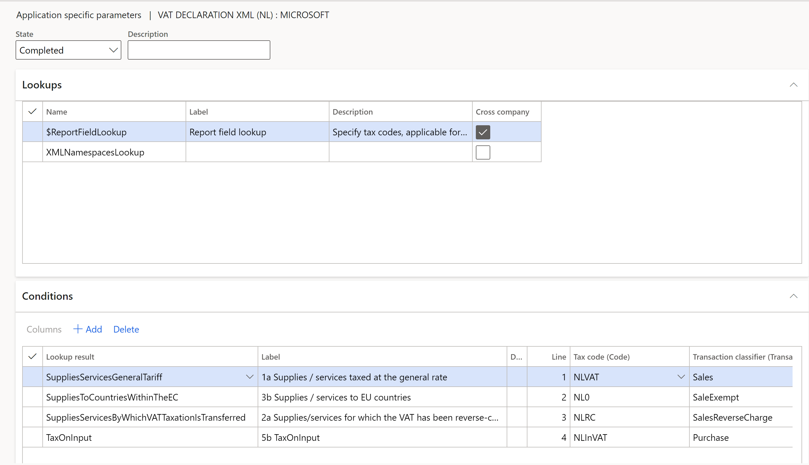
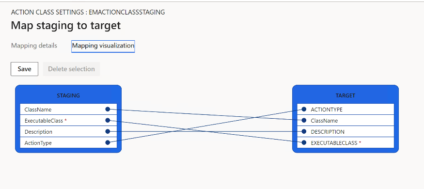
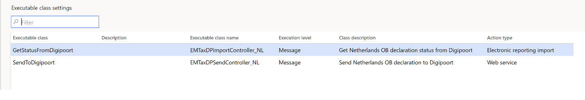

# VAT declaration for Netherlands

[!include [banner](../includes/banner.md)]

To automatically generate the VAT declaration, you must create enough sales tax codes to keep a separate VAT accounting for each box on the VAT declaration. Additionally, in the application-specific parameters of the VAT declaration electronic reporting format, you must associate sales tax codes with the lookup result of the lookup for the VAT declaration boxes. For more information about how to set up application-specific parameters, see *Set up application parameters for declaration fields* later in this article.

In the following table, the **Lookup result** column shows the lookup result that is preconfigured for a specific VAT declaration row in the VAT declaration format. Use this information to correctly associate sales tax codes with the lookup result and then associate that with the row of the VAT declaration. The **Tax base (XML element) / Tax (XML element)** column list the names of the corresponding XML elements in VAT declaration XML (NL) format.

> [!NOTE]
> If you configure sales tax codes to post incoming reverse charge VAT by using use tax, associate your sales tax codes with the lookup result that contains **UseTax** in the name. For example, for **Row 2a Supplies/services for which the VAT has been reverse-charged to you**, configure the **SuppliesServicesByWhichVATTaxationIsTransferredUseTax** lookup result for **Use tax** sales tax codes, or configure the **SuppliesServicesByWhichVATTaxationIsTransferred** lookup result for sales tax codes that have a reverse charge. For more information about how to configure reverse charge VAT, see [Reverse charges](emea-reverse-charge.md).

### <a name="vat-declaration-overview">VAT declaration overview</a>

The VAT declaration format in Netherlands contains the following information.

<table width="520">
<tbody>
<tr>
<td width="47">

<strong>Box</strong>

</td>
<td width="265">

<strong>Description</strong>

</td>
<td width="104">

<strong>Lookup result</strong>

</td>
<td width="104">

<strong>Tax base (XML element) / Tax (XML element)</strong>

</td>
</tr>
<tr>
<td width="47">

<strong>1</strong>

</td>
<td width="265">

<strong>Goods or services in the Netherlands</strong>

</td>
<td width="104">

<strong>&nbsp;</strong>

</td>
<td width="104">

<strong>&nbsp;</strong>

</td>
</tr>
<tr>
<td width="47">

1a

</td>
<td width="265">

Supplies/services taxed at the general rate

</td>
<td width="104">

SuppliesServicesGeneralTariff

</td>
<td width="104">

TaxedTurnoverSuppliesServicesGeneralTariff / ValueAddedTaxSuppliesServicesGeneralTariff

</td>
</tr>
<tr>
<td width="47">

1b

</td>
<td width="265">

Supplies/services taxed at the reduced rate

</td>
<td width="104">

SuppliesServicesReducedTariff

</td>
<td width="104">

TaxedTurnoverSuppliesServicesReducedTariff / ValueAddedTaxSuppliesServicesReducedTariff

</td>
</tr>
<tr>
<td width="47">

1c

</td>
<td width="265">

Supplies/services taxed at other rates, except 0%

</td>
<td width="104">

SuppliesServicesOtherRates

</td>
<td width="104">

TaxedTurnoverSuppliesServicesOtherRates / ValueAddedTaxSuppliesServicesOtherRates

</td>
</tr>
<tr>
<td width="47">

1d

</td>
<td width="265">

Private use

</td>
<td width="104">

PrivateUse

</td>
<td width="104">

TaxedTurnoverPrivateUse / ValueAddedTaxPrivateUse

</td>
</tr>
<tr>
<td width="47">

1e

</td>
<td width="265">

Supplies/services taxed at 0% or not taxed at your level

</td>
<td width="104">

SuppliesServicesNotTaxed

</td>
<td width="104">

SuppliesServicesNotTaxed / x

</td>
</tr>
<tr>
<td width="47">

<strong>2</strong>

</td>
<td width="265">

<strong>Domestic reverse-charge mechanisms</strong>

</td>
<td width="104">

&nbsp;

</td>
<td width="104">

&nbsp;

</td>
</tr>
<tr>
<td width="47">

2a

</td>
<td width="265">

Supplies/services for which the VAT has been reverse-charged to you

</td>
<td width="104">

SuppliesServicesByWhichVATTaxationIsTransferred

&nbsp;

<em>SuppliesServicesByWhichVATTaxationIsTransferredUseTax</em>

</td>
<td width="104">

TurnoverSuppliesServicesByWhichVATTaxationIsTransferred / ValueAddedTaxSuppliesServicesByWhichVATTaxationIsTransferred

</td>
</tr>
<tr>
<td width="47">

<strong>3</strong>

</td>
<td width="265">

<strong>Goods and services to/in foreign countries/regions</strong>

</td>
<td width="104">

&nbsp;

</td>
<td width="104">

&nbsp;

</td>
</tr>
<tr>
<td width="47">

3a

</td>
<td width="265">

Supplies to non-EU countries/regions (export)

</td>
<td width="104">

SuppliesToCountriesOutsideTheEC

</td>
<td width="104">

SuppliesToCountriesOutsideTheEC / x

</td>
</tr>
<tr>
<td width="47">

3b

</td>
<td width="265">

Supplies/services to EU countries/regions

</td>
<td width="104">

SuppliesToCountriesWithinTheEC

</td>
<td width="104">

SuppliesToCountriesWithinTheEC / x

</td>
</tr>
<tr>
<td width="47">

3c

</td>
<td width="265">

Installation/distance sales within the EU

</td>
<td width="104">

InstallationDistanceSalesWithinTheEC

</td>
<td width="104">

InstallationDistanceSalesWithinTheEC / x

</td>
</tr>
<tr>
<td width="47">

<strong>4</strong>

</td>
<td width="265">

<strong>Goods and services supplied to you from abroad</strong>

</td>
<td width="104">

&nbsp;

</td>
<td width="104">

&nbsp;

</td>
</tr>
<tr>
<td width="47">

4a

</td>
<td width="265">

Supplies/services from non-EU countries/regions

</td>
<td width="104">

SuppliesFromCountriesOutsideTheEC

&nbsp;

<em>SuppliesFromCountriesOutsideTheECUseTax</em>

</td>
<td width="104">

TurnoverFromTaxedSuppliesFromCountriesOutsideTheEC / ValueAddedTaxOnSuppliesFromCountriesOutsideTheEC

</td>
</tr>
<tr>
<td width="47">

4b

</td>
<td width="265">

Supplies/services from EU countries/regions

</td>
<td width="104">

SuppliesFromCountriesWithinTheEC

&nbsp;

SuppliesFromCountriesWithinTheECUseTax

</td>
<td width="104">

TurnoverFromTaxedSuppliesFromCountriesWithinTheEC / ValueAddedTaxOnSuppliesFromCountriesWithinTheEC

</td>
</tr>
<tr>
<td width="47">

<strong>5</strong>

</td>
<td width="265">

<strong>Input tax and grand total</strong>

</td>
<td width="104">

&nbsp;

</td>
<td width="104">

&nbsp;

</td>
</tr>
<tr>
<td width="47">

<em>5a</em>

</td>
<td width="265">

<em>Sales tax payable</em>

</td>
<td width="104">

1a + 1b + 1c +1d + 2a + 4a + 4b

</td>
<td width="104">

X / ValueAddedTaxOwed

</td>
</tr>
<tr>
<td width="47">

5b

</td>
<td width="265">

Input tax

</td>
<td width="104">

ValueAddedTaxOnInput

&nbsp;

<em>SuppliesServicesByWhichVATTaxationIsTransferredUseTax</em>

<em>&nbsp;</em>

<em>SuppliesFromCountriesOutsideTheECUseTax</em>

<em>&nbsp;</em>

<em>SuppliesFromCountriesWithinTheECUseTax</em>

&nbsp;

</td>
<td width="104">

x / ValueAddedTaxOnInput

</td>
</tr>
<tr>
<td width="47">

<em>5c</em>

</td>
<td width="265">

<em>Subtotal</em>

</td>
<td width="104">

5a - 5b

</td>
<td width="104">

x

</td>
</tr>
<tr>
<td width="47">

5d

</td>
<td width="265">

Tax relief under the small businesses scheme

</td>
<td width="104">

SmallEntrepreneurProvisionReduction

</td>
<td width="104">

x / SmallEntrepreneurProvisionReduction

</td>
</tr>
<tr>
<td width="47">

<strong>5g</strong>

</td>
<td width="265">

<strong>Net VAT amount that will be paid to the tax authorities or reclaimed</strong>

</td>
<td width="104">

5a - 5b + 5d

</td>
<td width="104">

x / ValueAddedTaxOwedToBePaidBack

</td>
</tr>
</tbody>
</table>

## Set up VAT declaration for Netherlands

### Import electronic reporting configurations

To import Electronic reporting (ER) configurations, go to **Workspaces** \> **Electronic reporting**, and import the following or higher versions of electronic reporting formats:

   - Tax declaration model.version.85
   - Tax declaration model mapping.version.85.138
   - VAT Declaration XML (NL).version.85.14
   - VAT Declaration Excel (NL).version.85.14.17

### Set up application specific parameters for VAT declaration fields

To automatically generate a VAT declaration, associate sales tax codes and report fields in the ER configuration. 

> [!NOTE]
> We recommend that you enable the feature, **Use application specific parameters from previous versions of ER formats** in the **Feature management** workspace. When this feature is enabled, parameters that are configured for the earlier version of an ER format automatically become applicable for the later version of the same format. If this feature is not enabled, you must configure application-specific parameters explicitly for each format version. The **Use application specific parameters from previous versions of ER formats** feature is available in the **Feature management** workspace starting in Finance version 10.0.23. For more information about how to set up the parameters of an ER format for each legal entity, see [Set up the parameters of an ER format per legal entity](../../fin-ops-core/dev-itpro/analytics/er-app-specific-parameters-set-up.md).

To set up report fields, follow these steps:

1. Go to **Workspaces** > **Electronic reporting**, and then select **Reporting configurations**.
2. Select the **VAT declaration XML (NL)** configuration, and then select **Configurations** > **Application specific parameters setup**.
3. On the **Lookups** FastTab, select **\$ReportFieldLookup** .
4. On the **Conditions** FastTab, associate the sales tax codes and report fields.

<table>
<thead>
<tr>
<td width="150">

<strong>Column</strong>

</td>
<td width="700">

<strong>Description</strong>

</td>
</tr>
</thead>
<tbody>
<tr>
<td width="150">

Lookup result

</td>
<td width="700">

Select the report field for setup. For more information about the report fields and their assignment to VAT declaration rows, see the section, [VAT declaration overview](#vat-declaration) in this article.

</td>
</tr>
<tr>
<td width="150">

Tax code

</td>
<td width="700">

Select the sales tax code to associate with the report field. Posted tax transactions that use the selected sales tax code are collected in the appropriate report field.

Separate the sales tax codes so that one sales tax code generates amounts in only one report field.

</td>
</tr>
<tr>
<td width="150">

Transaction classifier

</td>
<td width="700">

If you didn't create enough sales tax codes so that one sales tax code generates amounts in only one report field, set up a transaction classifier. The following transaction classifiers are available:

o&nbsp;&nbsp; <strong>Purchase</strong>

o&nbsp;&nbsp; <strong>PurchaseExempt</strong>&nbsp;(tax-exempt purchase)

o&nbsp;&nbsp; <strong>PurchaseReverseCharge</strong>&nbsp;(tax receivable from a purchase reverse charge)

o&nbsp;&nbsp; <strong>Sales</strong>

o&nbsp;&nbsp; <strong>SalesExempt</strong>&nbsp;(tax-exempt sale)

o&nbsp;&nbsp; <strong>SalesReverseCharge</strong>&nbsp;(tax payable from a purchase reverse charge or a sales reverse charge)

o&nbsp;&nbsp; <strong>Use tax</strong>

For each transaction classifier, a classifier for the credit note is also available. For example, one of these classifiers is&nbsp;<strong>PurchaseCreditNote</strong>&nbsp;(purchase credit note).

</td>
</tr>
</tbody>
</table>

#### Set up XSD schema and namespaces

To set up XSD schema and namespaces, follow these steps:

1. On the **Lookups** FastTab, select **XMLNamespacesLookup**.
2. On the **Conditions** FastTab, define the path to the XSD schema under XSDSchema name and the path to the schema instance data under SchemaInstanceData.

    | **Name**           | **Lookup result**                                                                  |
    |--------------------|------------------------------------------------------------------------------------|
    | XSDSchema          | http://www.nltaxonomie.nl/nt15/bd/20201209/entrypoints/bd-rpt-ob-aangifte-2021.xsd |
    | SchemaInstanceData | http://www.nltaxonomie.nl/nt15/bd/20201209/dictionary/bd-data.xsd                      |

    For information about how to get these values from official documentation, see [How-to get XSD schema and namespaces for the Dutch taxonomy](emea-nl-eu-sales-list.md#get-xsd-schema-and-namespaces-for-the-dutch-taxonomy).

    > [!NOTE]
    > If you don’t set up transmission of VAT declaration to Digipoort, you can configure any value in the lookup result.

3. In the **State** field, select **Completed**.
4. On the Action Pane, select **Export** to export the parameters to an XML file.
5. Select the **VAT declaration Excel (NL**) configuration, and then, on the Action Pane, select **Import** to import the parameters that you configured for **VAT declaration XML (NL)**
6. In the **State** field, select **Completed**.

### Set up VAT reporting format

To set up VAT reporting format, follow these steps:

1. Go to **General ledger** > **Setup** > **General ledger parameters**.
2. If you configure VAT declaration for multiple VAT registrations, on the tab **Sales tax**, on the **Electronic reporting for countries/regions** FastTab, for the **NLD country/region** line, select the ER format, **VAT Declaration Excel (NL)**.
3. In the **Feature management** workspace, enable the **VAT statement format reports** feature.
4.	Go to **General ledger** > **Setup** > **General ledger parameters**.
5.	On the **Sales tax** tab, on the **Tax options** FastTab, in the **VAT statement format mapping** field, select the **VAT declaration Excel (NL)** ER format. This format will be printed when you run the **Report sales tax for settlement period** report. The format will also be printed when you select **Print** on the **Sales tax payments** page.
If you configure VAT declaration for multiple VAT registrations, on the **Sales tax** tab, on the **Electronic reporting for countries/regions** FastTab, for the **NLD country/region** line, select the ER format, **VAT Declaration Excel (NL)**.
4.	If you must report the corrections, on the **Special report** section, set **Include corrections** to **Yes**.
5.	On the **Tax authorities** page, select the tax authority, and in the **Report layout** field, select **Default**.

## Preview VAT declaration in Excel

### Preview VAT declaration in Excel from the periodic task, Report sales tax for settlement period

To preview VAT declaration in Excel, follow these steps:

1. Go to **Tax** > **Periodic tasks** > **Declarations** > **Sales tax** > **Report sales tax for settlement period**.
2. Enter the following information.

<table>
<thead>
<tr>
<td>

<strong>Field</strong>

</td>
<td>

<strong>Description</strong>

</td>
</tr>
</thead>
<tbody>
<tr>
<td>

Settlement period

</td>
<td>

Select the settlement period.

</td>
</tr>
<tr>
<td>

Sales tax payment version

</td>
<td>

Select one of the following values:

o <strong>Original</strong>: Generate a report for sales tax transactions of the original sales tax payment or before the sales tax payment is generated.

o <strong>Corrections</strong>: Generate a report for sales tax transactions of all the subsequent sales tax payments for the period. The&nbsp;<strong>Sales tax payment version</strong>&nbsp;field is set to&nbsp;<strong>Latest corrections</strong>.

o <strong>Total list</strong>: Generate a report for all sales tax transactions for the period, including the original and all corrections.

</td>
</tr>
<tr>
<td>

From date

</td>
<td>

Select the first date of the reporting period.

</td>
</tr>
</tbody>
</table>

3. Select **OK** and review the Excel file that is generated.

### Settle and post sales tax

To settle and post sales tax, follow these steps:

1. Go to **Tax** > **Periodic tasks** > **Declarations** > **Sales tax** > **Settle and post sales tax**.
2. Enter the following information.

<table>
<thead>
<tr>
<td>

<strong>Field</strong>

</td>
<td>

<strong>Description</strong>

</td>
</tr>
</thead>
<tbody>
<tr>
<td>

Settlement period

</td>
<td>

Select the settlement period.

</td>
</tr>
<tr>
<td>

Sales tax payment version

</td>
<td>

Select one of the following values:

o <strong>Original</strong>: Generate the original sales tax payment for the settlement period.

o <strong>Latest corrections</strong>: Generate a correction sales tax payment after the original sales tax payment for the settlement period was created.

</td>
</tr>
<tr>
<td>

From date

</td>
<td>

Select the first date of the reporting period.

</td>
</tr>
</tbody>
</table>

3. Select **OK**.

### Preview VAT declaration in Excel from a sales tax payment

To preview VAT declaration in Excel from a sales tax payment, follow these steps:

1. Go to **Tax** > **Inquiries and reports** > **Sales tax inquiries** > **Sales tax payments** and select a sales tax payment line.
2. Select **Print report** and review the Excel file that’s generated for the selected sales tax payment line.

    > [!NOTE]
    > The report is generated only for the selected line of Sales tax payment. If you need to generate a corrective declaration that contains all corrections for the period, or a replacement declaration that contains the original data and all corrections, use the periodic task, **Report sales tax for settlement period**.

## Configure electronic messages for generating VAT declaration in XML

### Enable the feature

To enable the **Configure electronic messages for generating VAT declaration in XML** feature, go to **Workspaces** \> **Feature management** and enable the feature, **[EM] Executable class action type.**

### Modify target mapping

To modify target mapping, follow these steps:

1. Go to **Workspaces** \> **Data management,** and select **Target entities**.
2. Select the data entity **Action class settings** and then select **Modify target mapping**.
3. Make sure that the staging field **Action type** is mapped to the target.

    

4. You can map to the target manually, or on the **Mapping details** tab, select **Generate mapping \> Yes**.

### Upload the electronic messages data package

To upload the electronic messages data package, follow these steps:

1. In the Lifecycle Services (LCS) shared asset library, on the **Data packages** tab, download the latest version of data package, **NL VAT declaration EM package**.
2. In Dynamics 365 Finance, in the **Data management** workspace, select **Import**.
3. In the **Job details** section, set the following values:

    - **Name**: Enter a name for the job: *NL VAT declaration*.
    - **Data source format**: Select select **Package**.

4. In the **Upload data file** field, select **Upload**, and then select the **NL VAT declaration EM package.zip** file.
5. After the data entities are uploaded, select **Import**.
6. Go to **Tax** > **Inquiries and reports** > **Electronic messages** > **Electronic messages** and validate the electronic message processing that you imported.

    | **Processing**     | **Name**                | **Description**                    |
    |--------------------|-------------------------|------------------------------------|
    | NL VAT declaration | Omzetbelasting aangifte | VAT declaration in the Netherlands |

7. Go to **Tax** > **Setup** > **Electronic messages** > **Executable class settings**. Verify the following :

    - The executable class **NLOBGetStatusFromDidgipoort** has the **Electronic reporting import** action type.
    - The executable class **NLOBSendToDigipoort** has the **Web service** action type.

    

8.  For each line, select **Parameters**, and then select **NLOB Request ID** in the **Request ID** field.

### Configure electronic messages

To configure electronic messages, follow these steps:

1. Go to **Tax** > **Setup** > **Electronic messages** > **Populate records actions**, select the line, and then select **Edit query**.
2. Use the filter to specify the settlement periods to include in the report.
3. If you must report tax transactions from other settlement periods in a different declaration, create a new **Populate records** action, and select the appropriate settlement periods.

## Set up electronic transmission of tax declarations to Digipoort

Digipoort is the service that is used to transmit declarations to the Dutch government. Digipoort works as an electronic post office: it receives a message, checks the message, and then confirms receipt of the message.

For more information, see [Set up electronic transmission of tax declarations to Digipoort](emea-nl-eu-sales-list.md#set-up-electronic-transmission-of-tax-declarations-to-digipoort).

## Generate VAT declaration in XML for Netherlands and send to Digipoort

### Generate a VAT declaration from electronic messages and send to Digipoort

The following steps are applicable to the example electronic message processing that you imported.

1. Go to **Tax** > **Inquiries and reports** > **Electronic messages** > Electronic messages**.
2. In the left pane, select the report format to generate. For example, select **NL VAT declaration**.
3. On the **Messages** FastTab, select **New**, and then, in the **Run processing** dialog box, select **OK**.
4. Select the message line that is created, enter a description, and then specify the start and end dates for the declaration.

    > [!NOTE]
    > Steps 5-7 are optional.

5. On the **Messages** FastTab, select **Collect data**, and then select **OK**. As a result, sales tax payments that were generated earlier are added to the message. For more information, see [Settle and post sales tax](#settle-and-post-sales-tax). If you skip this step, you can still generate a VAT declaration by using the **Tax declaration version** in the **Declaration** dialog box.
6. On the **Message items** FastTab, review the sales tax payments that are transferred for processing. By default, all sales tax payments of the selected period that weren't included in any other message of the same processing are included.
7. Select **Original document** to review the sales tax payments, or select **Delete** to exclude sales tax payments from processing. If you skip this step, you can still generate a VAT declaration by using the **Tax declaration version** field in the **Declaration** dialog box.
8. On the **Messages** FastTab, select **Update status**. In the **Update status** dialog box, select the **Ready to generate** action, and then select **OK**. Validate that the message status is changed to **Ready to generate**.
9. Select **Generate report**. To preview the VAT declaration amounts, in the **Run processing** dialog box, select **Preview report**, and then select **OK**.
10. In the **Electronic reporting parameters** dialog box, enter the parameters of the VAT declaration, and then select **OK**. For information about the parameters that are available, see the following table.
11. Select **Attachments** in the upper-right corner of the page, and then select **Open** to open the file. Review the amounts that are in the Excel document.
12. On the **Messages** FastTab, select **Generate report**. In the **Run processing** dialog box, select **Generate report** to generate an XML file, and then select **OK**.
13. In the **Electronic reporting parameters** dialog box, enter the following information.

<table>
<thead>
<tr>
<td width="250">

<strong>Field</strong>

</td>
<td width="900">

<strong>Description</strong>

</td>
</tr>
</thead>
<tbody>
<tr>
<td width="250">

Settlement period

</td>
<td width="900">

Select the settlement period.

If you selected&nbsp;<strong>Collect data</strong>&nbsp;in step 5, you can disregard this field. The report will be generated for the sales tax transactions that are included in the collected sales tax payments.

</td>
</tr>
<tr>
<td width="250">

Tax declaration version

</td>
<td width="900">

Select one of the following values:

o&nbsp;&nbsp; <strong>Original</strong>: Generate a report for sales tax transactions of the original sales tax payment or before the sales tax payment is generated.

o&nbsp;&nbsp; <strong>Corrections</strong>: Generate a report for sales tax transactions of all the subsequent sales tax payments for the period. The&nbsp;<strong>Sales tax payment version</strong>&nbsp;field is set to&nbsp;<strong>Latest corrections</strong>.

o&nbsp;&nbsp; <strong>Total list</strong>: Generate a report for all sales tax transactions for the period, including the original and all corrections.

&nbsp;

If you selected&nbsp;<strong>Collect data</strong>&nbsp;in step 5, you can disregard this field. The report will be generated for the sales tax transactions that are included in the collected sales tax payments.

</td>
</tr>
<tr>
<td width="250">

Tax jurisdiction

</td>
<td width="900">

Select&nbsp;<strong>Default to use information about the tax representative and the contact person from the fields below.</strong>

<strong>Select Netherlands to use information about the tax representative and the contact person from the Electronic tax declaration parameters page.</strong>

</td>
</tr>
<tr>
<td width="250">

Tax representative

</td>
<td width="900">

If declaration is provided by the tax representative, select <strong>Tax consultant</strong> from the list of parties.

Registration ID, first name, middle name, last name, personal title, and contact information of type <strong>Phone</strong> must be specified for the selected party and will be exported to the XML file.

</td>
</tr>
<tr>
<td width="250">

Contact person

</td>
<td width="900">

Select the employee who created the report. The first name, last name, and telephone number of the employee must be specified and will be exported to the XML file.

</td>
</tr>
</tbody>
</table>
  
   If you selected **Collect data** in step 5, you can disregard this field. The report will be generated for the sales tax transactions that are included in the collected sales tax payments.

14. Select **OK**. When the declaration in XML format has been generated, the status of the message is changed to **Report generated**. 
    
   If an error occurs while the report is being generated, the status of the message is changed to **Report generation error**.

15. Select **Attachments**, and then select **Open** to open the file. Review the file, and if it is correct, select **Send report** to send the report to Digipoort. The report will be sent to Digipoort and status of the message will be changed to **Report sent**.
    
   If an error occurred during sending of the report, the status of the message is changed to:

   - **Report sending error (technical)**: If an error occurs on the Finance side and the file didn’t reach Digipoort.
   - **Report sending error (business)**: If an error occurred on the Digipoortside after reaching Digipoort.

16. Select **Import response** to get a response from the Digipoort on the sent message. The response from Digipoort will be imported and status of the message will be changed to **Report acknowledged**. 
    
   If an error occurred during receiving of the status, the status of the message is changed to:

   - **Report getting status error (business)**: If Digipoort didn’t acknowledge the report. In this case, the Infolog shows a list of errors received from Digipoort. To review list of errors later, on the **Action log** FastTab, select a line with **Get report status**, and select **Attachments**. Review the list of errors in the **Notes** field.
   - **Report getting status error (technical)**: If a technical error occurred when importing the response from Digipoort.

## Run a VAT declaration for several legal entities

To use the formats to report the VAT declaration for a group of several legal entities, first set up the application-specific parameters of the ER formats for sales tax codes from all required legal entities.

### Set up electronic messages to collect data from several legal entities

To set up electronic messages to collect data from several legal entities, follow these steps:

1. Go to **Workspaces** > **Feature management**, find **Cross-company queries for the populate records actions** in the list, and then select **Enable now** to turn on the feature.
2. Go to **Tax** > **Setup** > **Electronic messages** > **Populate records actions**.
3. On the **Populate records action** page, in the **Datasources setup** grid, a new **Company** field is available. For existing records, this field shows the identifier of the current legal entity.
4. In the **Datasources setup** grid, add a line for each additional legal entity that must be included in reporting, and enter the following information.

    | **Field**              | **Description**                                                                                                               |
    |------------------------|-------------------------------------------------------------------------------------------------------------------------------|
    | Name                   | Enter a value that will help you understand where this record comes from. For example, enter **VAT payment of Subsidiary 1**. |
    | Message item type      | Select **VAT return**. This is the only value that is available for all the records.                                          |
    | Account type           | Select **All**.                                                                                                               |
    | Master table name      | Specify **TaxReportVoucher** for all the records.                                                                             |
    | Document number field  | Specify **Voucher** for all the records.                                                                                      |
    | Document date field    | Specify **TransDate** for all the records.                                                                                    |
    | Document account field | Specify **TaxPeriod** for all the records.                                                                                    |
    | Company                | Select the ID of the legal entity.                                                                                            |
    | User query             | The check box is automatically selected when you define criteria by selecting **Edit query**.                                 |

5. For each new line, select **Edit query**, and specify a related settlement period for the legal entity that is specified in the **Company** field on the line.

When setup is complete, the **Collect data** function on the **Electronic messages** page will collect sales tax payments from all legal entities that you define here.

[!INCLUDE[footer-include](../../includes/footer-banner.md)]
