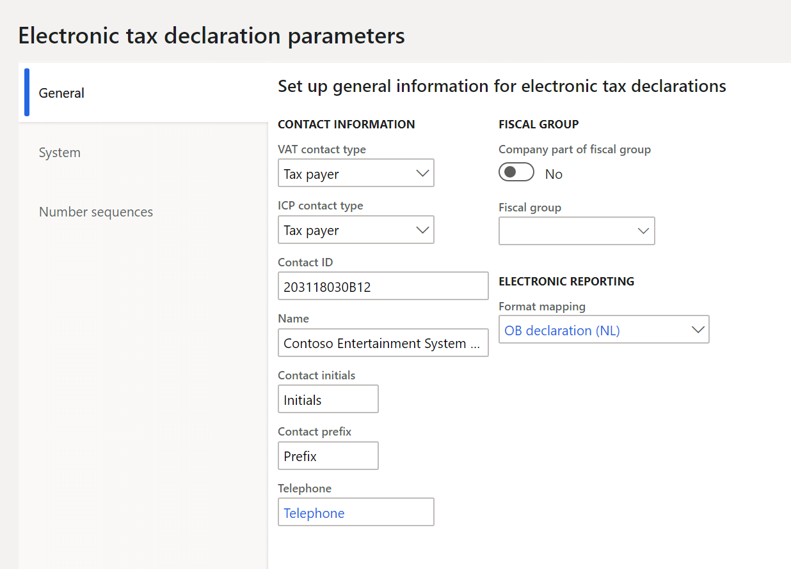
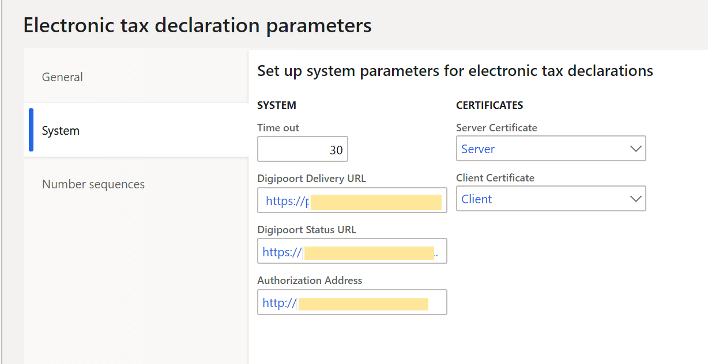
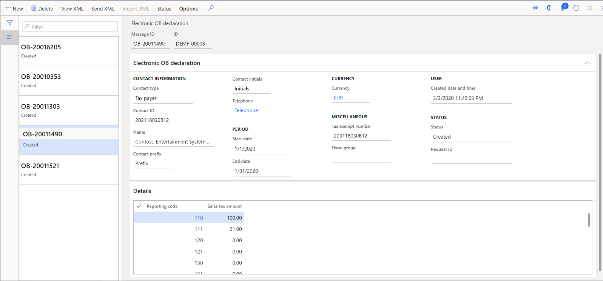
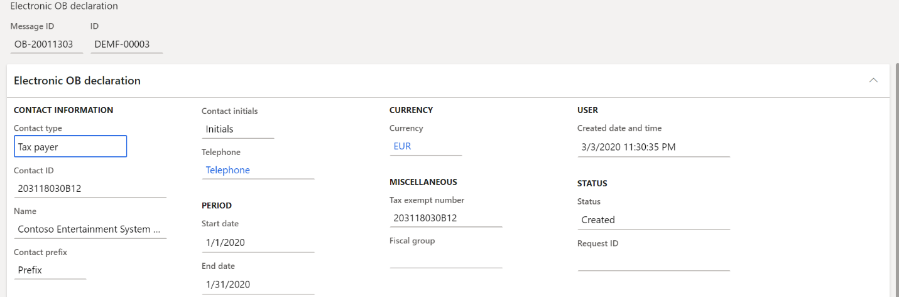
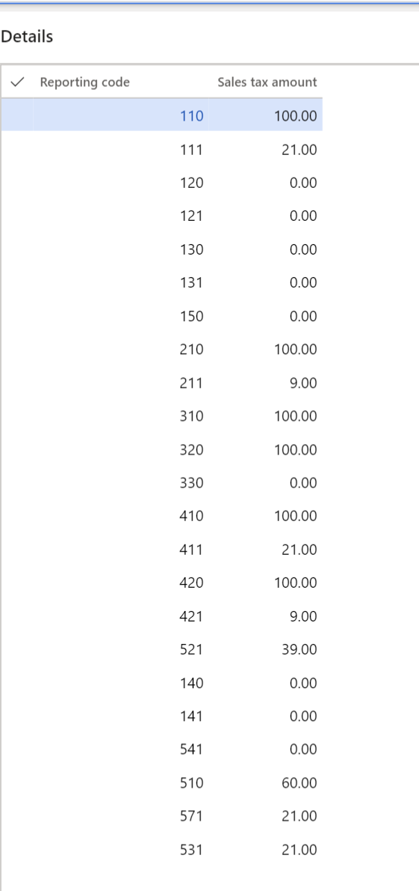
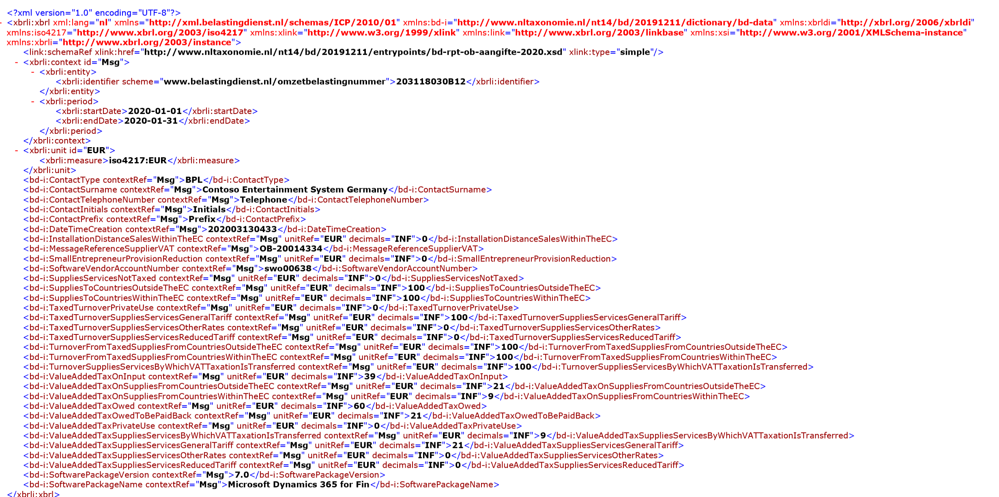
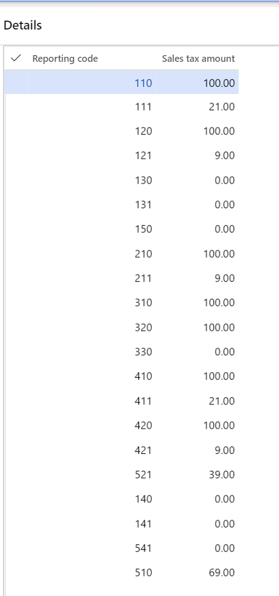
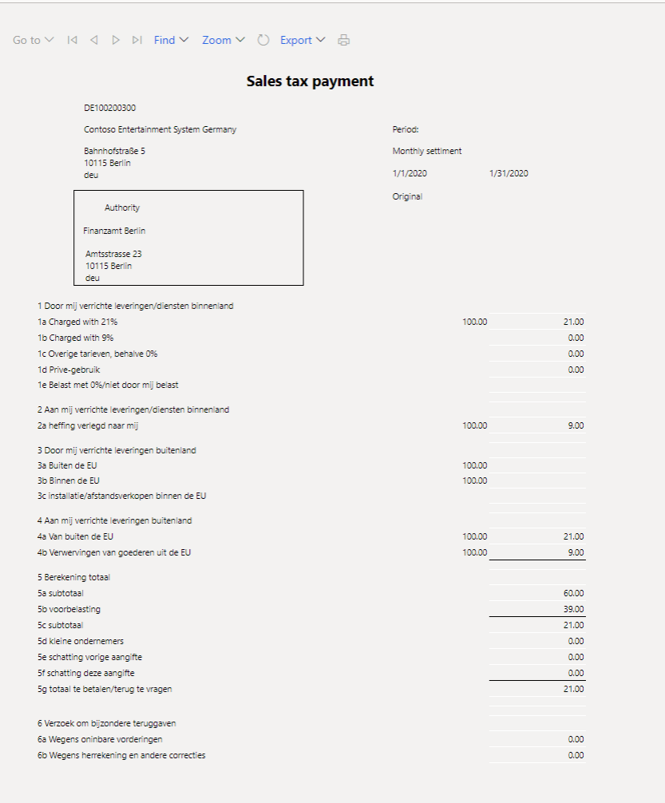
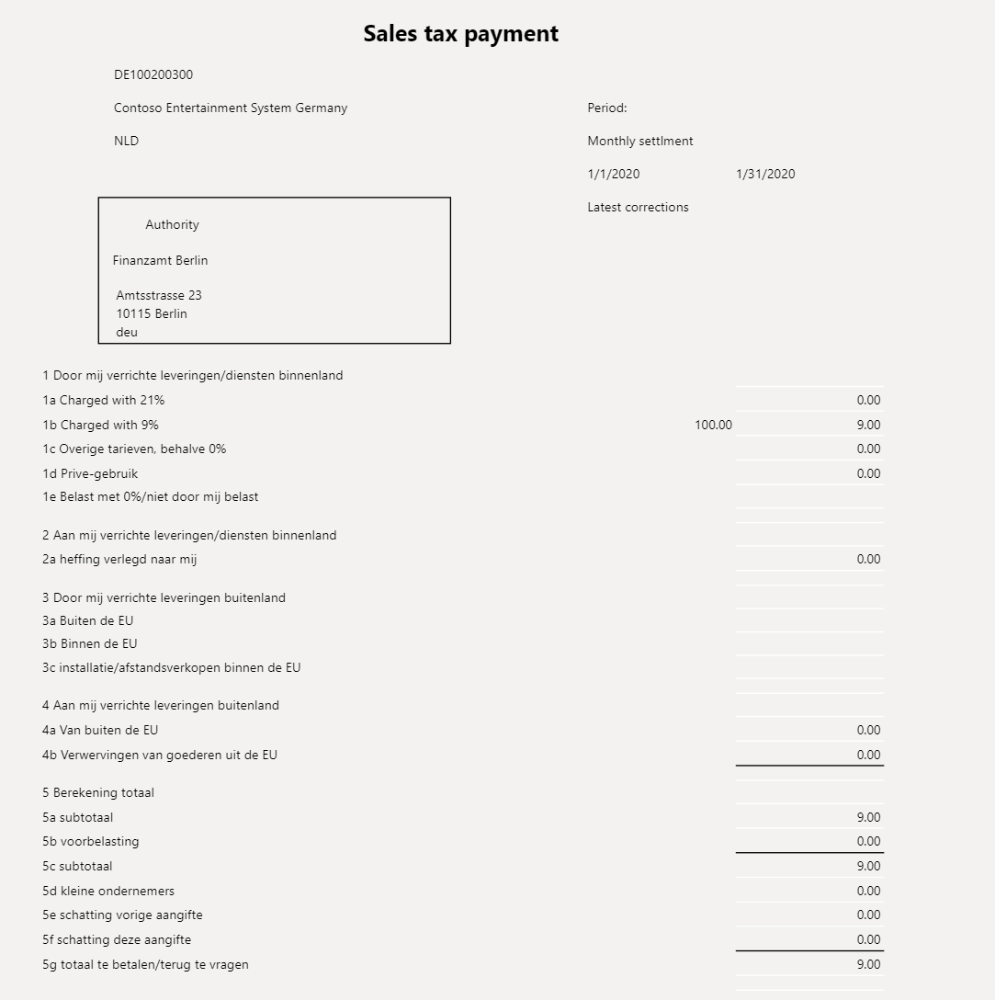
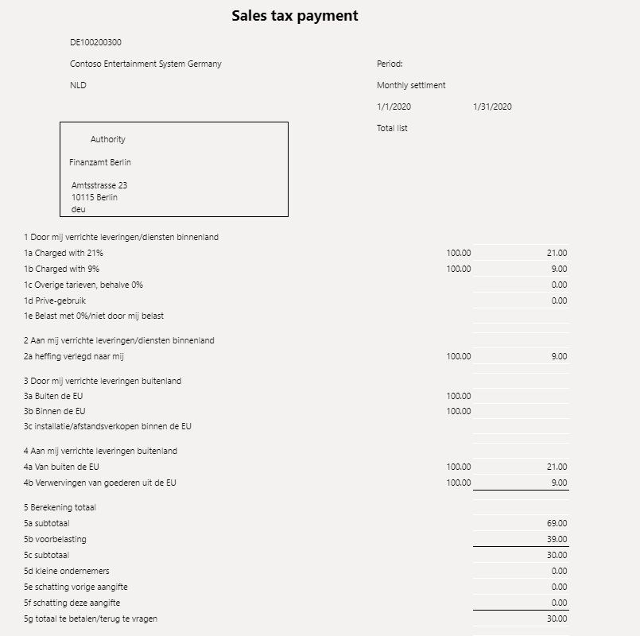

---
# required metadata

title: VAT declaration for the Netherlands
description: This topic explains how to set up and generate the value-added tax (VAT) declaration for legal entities in the Netherlands. 
author: anasyash
ms.date: 05/02/2022
ms.topic: article
ms.prod: 
ms.technology: 

# optional metadata

# ms.search.form: 
audience: Application User
# ms.devlang: 
ms.reviewer: kfend
# ms.tgt_pltfrm: 
# ms.custom: 
ms.search.region: Netherlands
ms.author: anasyash
# ms.search.industry: 
ms.search.validFrom: 
ms.dyn365.ops.version: 

---

# VAT declaration for the Netherlands

[!include [banner](../includes/banner.md)]

> [!IMPORTANT]
  > This feature is deprecated. For more information, see [Removed and deprecated features](../get-started/removed-deprecated-features-finance.md#ob-declaration-for-netherlands-design-based-on-reporting-codes).
  > For more information about VAT declaration, see [VAT declaration (Netherlands)](emea-nl-vat-declaration-netherlands.md)

This topic explains how to set up and generate the value-added tax (VAT) declaration for legal entities in the Netherlands. For general information about how to set up the VAT statement, see [VAT reporting for Europe](emea-vat-reporting.md).

## Set up sales tax reporting codes for VAT reporting

Set up sales tax reporting codes by following the instructions in [Set up sales tax reporting codes](../general-ledger/tasks/set-up-sales-tax-reporting-codes.md). The following table provides an example of sales tax reporting codes for the Netherlands.

| **Sales tax reporting code** | **Description**                                                                                                                                                                                                 | **Corresponding box in the declaration** | **Element in XML**                                           |
|------------------------------|-----------------------------------------------------------------------------------------------------------------------------------------------------------------------------------------------------------------|------------------------------------------|--------------------------------------------------------------|
| 110                          | Tax base for deliveries/services that are charged at 21 percent.                                                                                                                                                | 1a (base)                                | TaxedTurnoverSuppliesServicesGeneralTariff                   |
| 111                          | Tax amount for deliveries/services that are taxed at 21 percent.                                                                                                                                                | 1a (tax)                                 | ValueAddedTaxSuppliesServicesGeneralTariff                   |
| 120                          | Tax base for deliveries/services that are charged at 9 percent.                                                                                                                                                 | 1b (base)                                | TaxedTurnoverSuppliesServicesReducedTariff                   |
| 121                          | Tax amount for deliveries/services that are taxed at 9 percent.                                                                                                                                                 | 1b (tax)                                 | ValueAddedTaxSuppliesServicesReducedTariff                   |
| 130                          | Tax base for deliveries/services that are charged at other rates, except 0 percent.                                                                                                                             | 1c (base)                                | TaxedTurnoverSuppliesServicesOtherRates                      |
| 131                          | Tax amount for deliveries/services that are taxed at other rates, except 0 percent.                                                                                                                             | 1c (tax)                                 | ValueAddedTaxSuppliesServicesOtherRates                      |
| 140                          | Private use (base).                                                                                                                                                                                             | 1d (base)                                | TaxedTurnoverPrivateUse                                      |
| 141                          | Private use (tax amount).                                                                                                                                                                                       | 1d (tax)                                 | ValueAddedTaxPrivateUse                                      |
| 150                          | Tax base for deliveries/services that are either charged at 0 percent or not charged.                                                                                                                           | 1e                                       | SuppliesServicesNotTaxed                                     |
| 210                          | Tax base for deliveries/services where the payment of VAT has been transferred to you (reverse charge).                                                                                                         | 2a (base)                                | TurnoverSuppliesServicesByWhichVATTaxationIsTransferred      |
| 211                          | Tax amount for deliveries/services where the payment of VAT has been transferred to you (reverse charge).                                                                                                       | 2a (tax)                                 | ValueAddedTaxSuppliesServicesByWhichVATTaxationIsTransferred |
| 310                          | Tax base for deliveries to countries or regions outside the European Union (EU).                                                                                                                                | 3a                                       | SuppliesToCountriesOutsideTheEC                              |
| 320                          | Tax base for deliveries to countries in the EU.                                                                                                                                                                 | 3b                                       | SuppliesToCountriesWithinTheEC                               |
| 330                          | Tax base for installation and distance selling in the EU.                                                                                                                                                       | 3c                                       | InstallationDistanceSalesWithinTheEC                         |
| 410                          | Tax base for deliveries from countries or regions outside the EU.                                                                                                                                               | 4a (base)                                | TurnoverFromTaxedSuppliesFromCountriesOutsideTheEC           |
| 411                          | Tax amount for deliveries from countries or regions outside the EU.                                                                                                                                             | 4a (tax)                                 | ValueAddedTaxOnSuppliesFromCountriesOutsideTheEC             |
| 420                          | Tax base for the acquisition of goods from countries in the EU.                                                                                                                                                 | 4b (base)                                | TurnoverFromTaxedSuppliesFromCountriesWithinTheEC            |
| 421                          | Tax amount for the acquisition of goods from countries in the EU.                                                                                                                                               | 4b (tax)                                 | ValueAddedTaxOnSuppliesFromCountriesWithinTheEC              |
| 510                          | Total VAT payables. The value in this box is automatically calculated as the sum of reporting codes 111, 121, 131, 141, 211, 411, and 421.                                                                      | 5a                                       | ValueAddedTaxOwed                                            |
| 521                          | Input VAT to deduct.                                                                                                                                                                                            | 5b                                       | ValueAddedTaxOnInput                                         |
| 541                          | Tax relief under the small businesses scheme.                                                                                                                                                                   | 5d                                       | SmallEnterpreneurProvisionReduction                          |
| 571                          | Net VAT amount that will be paid to the tax authorities or reclaimed. The value in this box is automatically calculated as reporting code 510 minus reporting code 521, plus reporting codes 541, 551, and 561. | 5g                                       | ValueAddedTaxOwedToBePaidBack                                |

## Set up sales tax codes

Set up sales tax codes by following the instructions in [Sales tax codes for VAT reporting](emea-vat-reporting.md#sales-tax-codes-for-vat-reporting) and [Sales tax overview](../general-ledger/indirect-taxes-overview.md).

## Set up the OB declaration

Note that "OB declaration" stands for "Omzetbelasting declaration" where Omzetbelasting is "sales tax" in Dutch language.

1. Go to **Organization administration \> Organizations \> Legal entities**.
2. On the **Legal entities** page, on the **Tax registration** FastTab, in the **Tax registration number** field, enter the tax registration number.
3. Select **Registration IDs**, and enter the same tax registration number. For more information about how to set up registration IDs, see [Registration IDs](emea-registration-ids.md).
4. In [Microsoft Dynamics Lifecycle Services (LCS)](https://lcs.dynamics.com/Logon/Index), in the Shared asset library, download the latest versions of the Electronic reporting (ER) configurations for the following VAT declaration format:

-   OB declaration (NL)

   For more information, see [Download Electronic reporting configurations from Lifecycle Services](../../fin-ops-core/dev-itpro/analytics/download-electronic-reporting-configuration-lcs.md).

5. Go to **Tax** \> **Sales tax** \> **Electronic tax declaration parameters**.
6. On the **General** tab, in the **VAT contact type** field, select either **Tax payer** or **Agent**.
7. Set the **Contact ID**, **Contact initials**, **Contact prefix**, and **Telephone** fields.
8. Set the **Company part of fiscal group** option to **Yes** if this setting is appropriate, and then, in the **Fiscal group** field, select name of the fiscal group. The fiscal groups should already have been created on the **Tax exempt numbers** page.
9. In the **Format mapping** field, select the **OB declaration (NL)** format that you downloaded earlier.

    

10. On the **Number sequences** tab, in the **Number sequence code** field, select a number sequence code for the **Electronic OB declaration ID** reference to set the numbering of OB declarations.

## Set up electronic transmission of the VAT declaration to Digipoort

Digipoort is the service that is used to transmit declarations to the Dutch government. Digipoort works as an electronic post office: it receives a message, checks the message, and then confirms receipt of the message.
 
### Set up Azure Key Vault for certificate storage

1. Go to **System administration \> Setup \> System parameters**.
2. On the **General** tab, set the **Use advanced certificate store** option to **Yes**.
3. Go to **System administration \> Setup \> Key Vault parameters**.
4. Select **New**, and set the **Name** and **Description** fields.
5. On the **General** FastTab, set the following fields:

- **Key Vault URL** – Enter the default Azure Key Vault URL.
- **Key Vault client** – Enter the interactive client ID of the Azure Active Directory (Azure AD) application that is associated with Key Vault storage for authentication.
- **Key Vault secret key** – Enter a secret key that is associated with the Azure AD application that is used for authentication to Key Vault storage.

6. On the **Secrets** FastTab, select **Add**, and create lines for Key Vault secrets for the Digipoort server and client certificates.

For more information about how to set up Key Vault parameters, see [Set up the Azure Key Vault client](setting-up-azure-key-vault-client.md).

### Set up electronic tax declaration parameters

1. Go to **Tax** \> **Setup** \> **Sales tax** \> **Electronic tax declaration parameters**.
2. On the **System** tab, set the following fields:

- **Digipoort Delivery URL** – Enter the destination URL for the Digipoort service. For example, enter `https://preprod-dgp2.procesinfrastructuur.nl/wus/2.0/aanleverservice/1.2`.
- **Digipoort Status URL** – Enter the URL for the message statuses. For example, enter `https://preprod-dgp2.procesinfrastructuur.nl/wus/2.0/statusinformatieservice/1.2`.
- **Authorization Address** – Enter the URL for authorization. For example, enter `http://geenausp.nl`.
- **Server Certificate** – Select the line that you created for the Key Vault secret for the Digipoort server certificate.
- **Client Certificate** – Select the line that you created for the Key Vault secret for the Digipoort client certificate.

## Generate and send the OB declaration

1. Go to **Tax \> Declarations \> Sales tax \> Electronic OB declaration**.
2. Select **New**.
3. In the **Electronic OB declaration** dialog box, set the **Settlement period** and **From date** fields.
4. Select **OK**, and review the calculated results.

5. Select **View XML** to review the OB declaration in XML format.
6. Select **Send XML** to send the file to the tax authority service, Digipoort.

## Example

The following example shows how you can set up sales tax codes and sales tax reporting codes, post transactions, and generate the Dutch sales tax report.

1. Go to **Tax \> Indirect taxes \> Sales tax \> Sales tax codes**, and set up the following sales tax codes.

| **Sales tax code** | **Percentage** | **Description**                                                                          |
|--------------------|----------------|------------------------------------------------------------------------------------------|
| NL21               | 21             | Domestic sales and purchases at a rate of 21 percent.                                    |
| NL9                | 9              | Domestic sales and purchases at a rate of 9 percent.                                     |
| NLEU21             | 21             | EU purchases at a rate of 21 percent, where the **Use tax** option is set to **Yes**.    |
| NLEU9              | 9              | EU purchases at a rate of 9 percent, where the **Use tax** option is set to **Yes**.     |
| NLImp21            | 21             | Imports at a rate of 21 percent, where the **Use tax** option is set to **Yes**.         |
| NLImp9             | 9              | Imports at a rate of 9 percent, where the **Use tax** option is set to **Yes**.          |
| NLRC21             | 21             | Reverse charges at a rate of 21 percent, where the **Use tax** option is set to **Yes**. |
| NLRC9              | 9              | Reverse charges at a rate of 9 percent, where the **Use tax** option is set to **Yes**.  |
| NLEUS              | 0              | EU sales where the **Exempt** option is set to **Yes**.                                  |
| NLThird            | 0              | Export sales where the **Exempt** option is set to **Yes**.                              |

2. On the **Sales tax codes** page, on the **Report setup** FastTab, assign reporting codes to sales tax codes.

   > [!NOTE]
   > The preceding configuration is just an example and depends on the structure of the sales tax codes that are used. If you want values to be calculated and transferred to the sales tax report, for each tax code that is used in the sales tax payment process, you must set a relevant sales tax reporting code in one or more fields on the **Report setup** tab.

| **Sales tax code** | **Taxable sales** | **Tax-free sale** | **Sales tax payable** | **Taxable purchases** | **Sales tax receivable** | **Taxable import** | **Use tax** | **Offset use tax** |
|--------------------|-------------------|-------------------|-----------------------|-----------------------|--------------------------|--------------------|-------------|--------------------|
| NL21               | 110               |                   | 111                   |                       | 521                      |                    |             |                    |
| NL9                | 120               |                   | 121                   |                       | 521                      |                    |             |                    |
| NLEU21             |                   |                   |                       |                       |                          | 420                | 521         | 421                |
| NLEU9              |                   |                   |                       |                       |                          | 420                | 521         | 421                |
| NLImp21            |                   |                   |                       |                       |                          | 410                | 521         | 411                |
| NLImp9             |                   |                   |                       |                       |                          | 410                | 521         | 411                |
| NLRC21             |                   |                   |                       |                       |                          | 210                | 521         | 211                |
| NLRC9              |                   |                   |                       |                       |                          | 210                | 521         | 211                |
| NLEUS              |                   | 320               |                       |                       |                          |                    |             |                    |
| NLThird            |                   | 310               |                       |                       |                          |                    |             |                    |

3. Go to **Organization administration \> Organizations \> Legal entities**.
4. On the **Tax registration** FastTab, in the **Tax registration number** field, enter **203118030B12**.
5. Select **Registration IDs**, and enter the same tax registration number.
6. Go to **Tax \> Sales tax \> Electronic tax declaration parameters**.
7. On the **General** tab, set the following fields to the specified values:

    - **Contact ID:** 203118030B12
    - **Contact initials:** Initials
    - **Contact prefix:** Prefix
    - **Telephone:** Telephone
    - **Format mapping:** OB declaration (NL)

8. On the **Number sequences** tab, select a number sequence for the **Electronic OB declaration ID** reference.
9. Post the following transactions.

| **Date**        | **Transaction type**            | **Amount net** | **VAT amount** | **Sales tax code** | **Expected Tax base – Reporting code** | **Expected tax amount – Reporting code** | **Corresponding box in the declaration** |
|-----------------|---------------------------------|----------------|----------------|--------------------|----------------------------------------|------------------------------------------|------------------------------------------|
| January 1, 2020 | Customer invoice (domestic)     | 100            | 21             | NL21               | 110                                    | 111                                      | 1a                                       |
| January 1, 2020 | Vendor invoice (EU)             | 100            | 9              | NLEU9              | 420                                    | 421 – Tax payable 521 – Tax deduction    | 4b 5b                                    |
| January 1, 2020 | Vendor invoice (import)         | 100            | 21             | NLImp21            | 410                                    | 411 – Tax payable 521 – Tax deduction    | 4a 5b                                    |
| January 1, 2020 | Customer invoice (EU)           | 100            | 0              | NLEUS              | 320                                    | Not applicable                           | 3b                                       |
| January 1, 2020 | Customer invoice (export)       | 100            | 0              | NLThird            | 310                                    | Not applicable                           | 3a                                       |
| January 1, 2020 | Vendor invoice (reverse charge) | 100            | 9              | NLRC9              | 210                                    | 211 – Tax payable 521 – Tax deduction    | 2a 5b                                    |

10. Go to **Tax** \> **Declarations** \> **Sales tax** \> **Electronic OB declaration**.
11. Select **New**, and then, in the dialog box that appears, set the following fields to the specified values:

    - **Settlement period:** Mon
    - **From date:** 1/1/2020

12. Select **OK**. Review the header that is generated for the declaration.

13. Review the data that is generated for the declaration.

14. Select **View XML** to review an example of the XML file.

### Correction transactions

Post a new transaction. For example, to post a customer invoice, go to **Accounts receivable \> Invoices \> All free text invoices**.

| **Date**        | **Transaction type**        | **Amount net** | **VAT amount** | **Sales tax code** | **Expected Tax base – Reporting code** | **Expected tax amount – Reporting code** | **Corresponding box in the declaration** |
|-----------------|-----------------------------|----------------|----------------|--------------------|----------------------------------------|------------------------------------------|------------------------------------------|
| January 1, 2020 | Customer invoice (domestic) | 100            | 9              | NL9                | 120                                    | 121                                      | 1b                                       |

1. Go to **Tax** \> **Declarations** \> **Sales tax** \> **Electronic OB declaration**.
2. Select **New**, and then, in the dialog box that appears, set the following fields to the specified values:

   - **Settlement period:** Mon
   - **From date:** 1/1/2020

3. Select **OK**, and review the declaration data.

 A screenshot of a cell phone Description automatically generated

> [!NOTE]
> A correction transaction is added to the declaration in codes **120** and **121**.

## Review declaration amounts in printed form

### Set up the report layout for sales tax authorities

1. Go to **Tax \> Indirect taxes \> Sales tax \> Sales tax authorities**.
2. On the **Sales tax authorities** page, select the sales tax authority that will be used in the sales tax codes for the sales tax settlement period.
3. In the **Report layout** field, select **Dutch report layout**.

### Generate a sales tax payment and print the Dutch sales tax report

At the end of the VAT reporting period, calculate the sales tax amounts for the settlement period.

1. Go to **Tax** \> **Declarations** \> **Sales tax** \> **Settle and post sales tax**.
2. In the **Settle and post sales tax** dialog box, set the following fields.

| **Field**                 | **Description**                                                                                                                                                                                                                                                                         |
|---------------------------|-----------------------------------------------------------------------------------------------------------------------------------------------------------------------------------------------------------------------------------------------------------------------------------------|
| Settlement period         | Select the applicable reporting period.                                                                                                                                                                                                                                                 |
| From date                 | Enter the first date of the sales tax settlement period that sales tax should be calculated for. This value corresponds to the date in the **From** field on the **Sales tax settlement periods** page.                                                                                 |
| Transaction date          | Enter the date when the sales tax report is calculated. The default value is the current date. The sales tax payment is calculated for all transactions that were posted during the settlement period.                                                                                  |
| Sales tax payment version | Select the type of sales tax settlement. If this sales tax settlement is the first sales tax settlement for the period, select **Original**. If a sales tax settlement has already been generated, select **Latest corrections**. For more information, see Create a sales tax payment. |

3. Select **OK** to generate the sales tax payment.

### Print a sales tax payment report from a sales tax payment

1. Go to **Tax** \> **Inquiries and reports** \> **Sales tax payments**.
2. On the **Sales tax payment** page, select the record, and then select **Print report**.
3. In the dialog box, set the fields as described in the previous section, and then select **OK**.

### Report sales tax for the settlement period

You can also generate the Dutch sales tax report by using the **Report sales tax for settlement period** inquiry.

1. Go to **Tax** \> **Declarations** \> **Sales tax** \> **Report sales tax for settlement period**.
2. In the dialog box, set the **Settlement period** and **From date** fields as described in the Generate a sales tax payment and print the Dutch sales tax report section earlier in this topic.
3. In the **Sales tax payment version** field, select one of the following values:

- **Original** – Generate a report for sales tax transactions of the first posted settlement calculation for the period.
- **Corrections** – Generate a report for sales tax transactions of subsequent settlement calculations for the period.
- **Total list** – Generate a report for all sales transactions for theperiod. These transactions include original and corrected transactions.

4. Select **OK**.
5. Go to **Tax** \> **Declarations** \> **Sales tax** \> **Settle and post sales tax**. In the **Settle and post sales tax** dialog box in the **Sales tax payment version** field, select **Original**.
6. Print the report, and review the data.

  Note the following points:

- Box 5e corresponds to reporting code 551.
- Box 5f corresponds to reporting code 561.
- Boxes 6a and 6b aren't filled in.

   These values aren't present in the XML for the OB declaration.

4. Post the new transaction.

| **Date**   | **Transaction type**        | **Amount net** | **VAT amount** | **Sales tax code** | **Expected tax base – Reporting code** | **Expected tax amount – Reporting code** |
|------------|-----------------------------|----------------|----------------|--------------------|----------------------------------------|------------------------------------------|
| January 1, 2020 | Customer invoice (domestic) | 100            | 9              | NL9                | 120                                    | 121                                      |

5. Go to **Tax** \> **Declarations** \> **Sales tax** \> **Settle and post sales tax**. In the **Settle and post sales tax** dialog box in the **Sales tax payment version** field, select **Last corrections**.
6. Go to **Tax** \> **Declarations** \> **Sales tax** \> **Report sales tax for settlement period**. In the **Sales tax payment version** field, select **Corrections**. You should see the following result.

7. Go to **Tax** \> **Declarations** \> **Sales tax** \> **Report sales tax for settlement period**. In the **Sales tax payment version** field, select **Total list**. You should see the following result.

   > [!NOTE]
   > If you generate the OB declaration after you've created the original and corrected sales tax payments, the OB declaration will show amounts only from the original sales tax payment.

[!INCLUDE[footer-include](../../includes/footer-banner.md)]
