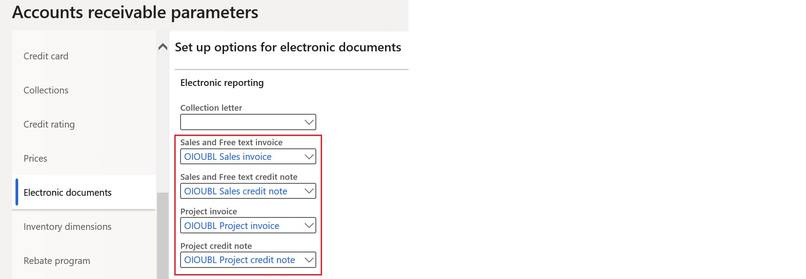
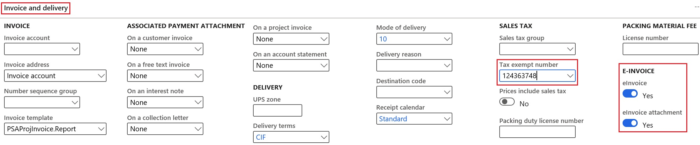
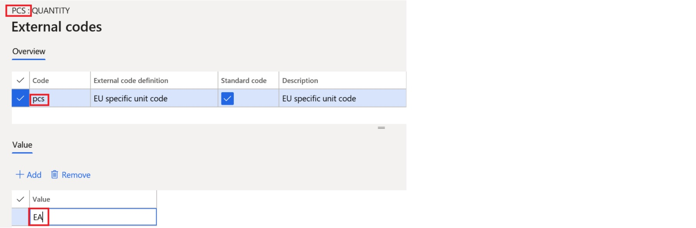
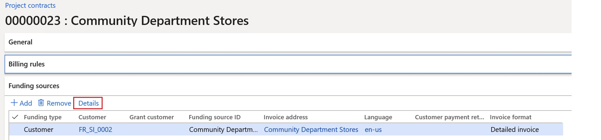
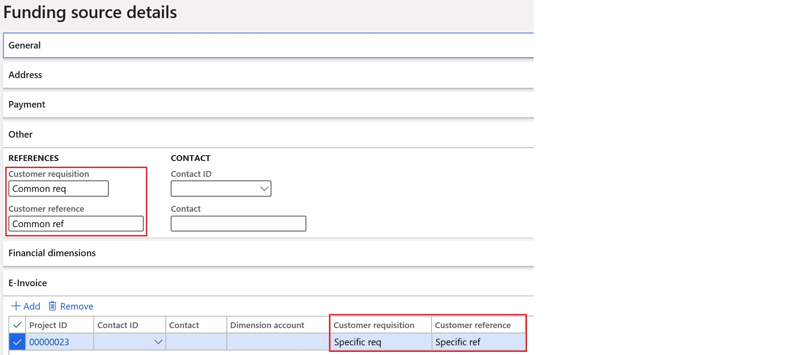
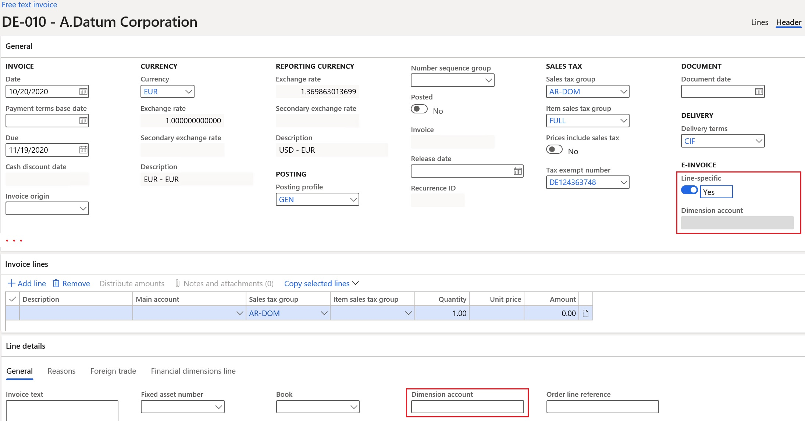
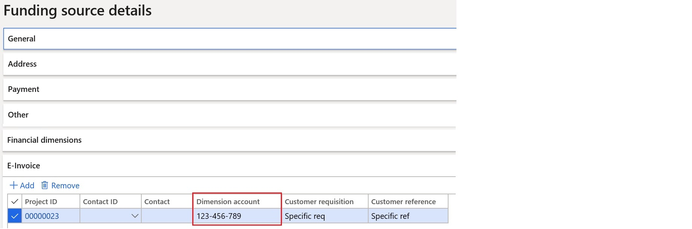
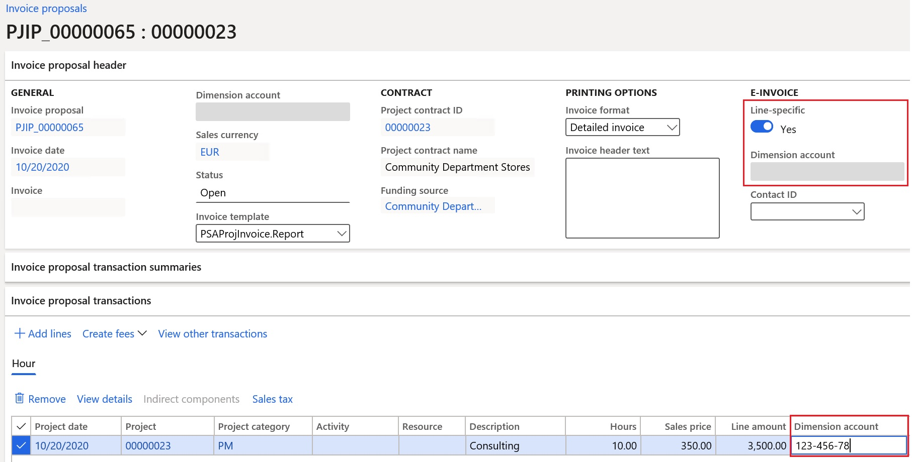

---
# required metadata

title: Customer electronic invoices in Norway
description: This topic explains how to set up and process customers electronic invoices in Norway.
author: ilkond
ms.date: 11/03/2020
ms.topic: article
ms.prod: 
ms.technology: 

# optional metadata

ms.search.form: 
audience: Application User
# ms.devlang: 
ms.reviewer: kfend
# ms.tgt_pltfrm: 
# ms.custom: 
ms.search.region: Norway
# ms.search.industry: 
ms.author: ilyako
ms.search.validFrom: 2019-11-01
ms.dyn365.ops.version: 10.0.08

---

# Customer electronic invoices in Norway

[!include [banner](../includes/banner.md)]

For compliance with European Union Directive 2014/55/EU, the Norway-specific **EHF Billing 3.0** format for electronic invoices has been implemented based on the [PEPPOL Billing 3.0](https://docs.peppol.eu/poacc/billing/3.0/) specification.

This topic provides information about how to configure and issue customer electronic invoices in Norway.

## Prerequisites

The primary address of the legal entity must be in Norway.

## Import Electronic reporting configurations

In the **Electronic reporting** workspace, import the following Electronic reporting (ER) formats from the repository:

- OIOUBL Sales invoice
- OIOUBL Project invoice
- OIOUBL Sales credit note
- OIOUBL Project credit note

> [!NOTE]
> These formats are based on the **Invoice model** configuration and use the **Invoice model mapping** configuration. All required additional configurations are automatically imported.

For more information about how to import ER configurations, see [Download Electronic reporting configurations from Lifecycle Services](../../fin-ops-core/dev-itpro/analytics/download-electronic-reporting-configuration-lcs.md).

### Reference the imported ER format configurations

1. Go to **Accounts receivable** \> **Setup** \> **Accounts receivable parameters**.
2. On the **Electronic documents** tab, on the **Electronic reporting** FastTab, select the imported formats for electronic documents:

    - **Sales and Free text invoice:** OIOUBL Sales invoice
    - **Sales and Free text credit note:** OIOUBL Sales credit note
    - **Project invoice:** OIOUBL Project invoice
    - **Project credit note:** OIOUBL Project credit note

## Configure parameters

### Configure legal entity parameters

1. Go to **Organization administration** \> **Organizations** \> **Legal entities**.
2. On the **Tax registration** FastTab, in the **Tax registration number** field, enter the company's value-added tax (VAT) number.
3. On the **Registration numbers** FastTab, set the **Print Foretaksregisteret on sales documents** option for Norway to **Yes**.
4. On the **Bank account information** FastTab, in the **Routing number** field, enter the company's organization number.
5. In the **Bank account** field, enter the company's bank account number.

    > [!NOTE]
    > The company bank account must already be set up at **Cash and bank management** \> **Bank accounts** \> **Bank accounts**.

### Configure customer parameters

1. Go to **Accounts receivable** \> **Customers** \> **All customers**, and select a customer.
2. On the **Invoice and delivery** FastTab, set the **eInvoice** option to **Yes** to enable electronic invoices to be generated.
3. Set the **eInvoice attachment** option to **Yes** to attach a PDF copy of the printable invoice to the electronic invoice.
4. In the **Tax exempt number** field, enter the customer's VAT exempt number.

### Units of measure configuration

1. Go to **Organization administration** \> **Setup** \> **Units** \> **Units**.
2. Select a unit ID in the list, and then select **External codes**.
3. On the **External codes** page, in the **Overview** section, in the **Code** field, enter a code that corresponds to the selected unit ID.
4. In **Value** section, in **Value** field, enter the external code that should be used as the units of measure code for international trade. This code is recommended by the [United Nations Economic Commission for Europe (UN/ECE)](https://docs.peppol.eu/poacc/billing/3.0/codelist/UNECERec20/).

### Sales tax codes transformation

When you generate electronic invoices, the sales tax code rates are analyzed and transformed into [UNCL5305-compliant categories](https://docs.peppol.eu/pracc/catalogue/1.0/codelist/UNCL5305/). The following logic is used:

- For all non-zero tax rates, the **S** category is used.
- For all zero tax rates, either the **E** category or the **Z** category is used, depending on the reporting code that is configured for tax-free sales.

### Customer requisition

When you register free text invoices, invoices that are based on sales orders, or project invoices, you must enter a customer requisition. You can also add an optional customer reference.

#### Free text invoices

1. Go to **Accounts receivable** \> **Invoices** \> **All free text invoices**.
2. Create a new invoice, or select an existing invoice.
3. In the **Header** view, on the **Customer** FastTab, in the **References** section, enter values in the **Customer requisition** and **Customer reference** fields.

#### Sales orders

1. Go to **Accounts receivable** \> **Orders** \> **All sales orders**.
2. Create a new sales order, or select an existing sales order. 
3. In the **Header** view, on the **General** FastTab, in the **References** section, enter values in the **Customer requisition** and **Customer reference** fields.

#### Project invoices

1. Go to **Project management and accounting** \> **Projects** \> **Project contracts**.
2. Create a new project contract, or select an existing project contract.
3. On **Funding sources** FastTab, select or create a funding source of the **Customer** type, and then select **Details**.

    

4. On the **Funding source details** page, on the **Other** FastTab, in **References** section, in the **Customer requisition** and **Customer reference** fields, enter default values for the contract. Alternatively, you can enter project-specific values in the corresponding fields on the **E-invoice** FastTab.

    

5. To enter customer requisition and reference values directly on the project invoice proposal, follow these steps:

    1. Go to **Project management and accounting** \> **Projects invoices** \> **Project invoice proposals**.
    2. Create a new invoice proposal, or select an existing invoice proposal.
    3. On the **Invoice proposal header** FastTab, in the **e-Invoice** section, enter values in **Customer requisition** and **Customer reference** fields.

    

### Customer accounting code registration

You can enter customer accounting codes when you work with free text invoices, invoices that are based on sales orders, or project invoices.

#### Free text invoices

1. Go to **Accounts receivable** \> **Invoices** \> **All free text invoices**.
2. Create a new invoice, or select an existing invoice. 
3. In the **Header** view, on the **General** FastTab, in the **e-Invoice** section, in the **Dimension account** field, enter the accounting code for the invoice. 
4. To have a separate accounting code for each invoice line, follow these steps:

    1. Set the **Line-specific** option to **Yes**.
    2. Switch to the **Lines** view.
    3. On the **Line details** FastTab, on the **General** tab, in the **Dimension account** field, enter a line-specific accounting code for each invoice line.

    

#### Sales orders

1. Go to **Accounts receivable** \> **Orders** \> **All sales orders**.
2. Create a new sales order, or select an existing sales order.
3. In the **Header** view, on the **General** FastTab, in the **e-Invoice** section, in the **Dimension account** field, enter the accounting code for the order.
4. To have a separate accounting code for each order line, follow these steps:

    1. Set the **Line-specific** option to **Yes**.
    2. Switch to the **Lines** view.
    3. On the **Line details** FastTab, on the **General** tab, in the **Dimension account** field, enter a line-specific accounting code for each order line.

#### Project invoices

1. Go to **Project management and accounting** \> **Projects** \> **Project contracts**.
2. Create a new project contract, or select an existing project contract.
3. On **Funding sources** FastTab, create or select a funding source of the **Customer** type, and then select **Details**.
4. On **Funding source details** page, on the **E-invoice** FastTab, in the **Dimension account** field, enter the project-specific default accounting code.

    

5. To enter customer accounting codes directly in project invoice proposals, follow these steps:

    1. Go to **Project management and accounting** \> **Projects invoices** \> **Project invoice proposals**.
    2. Create a new invoice proposal, or select an existing invoice proposal.
    3. On the **Invoice proposal header** FastTab, in the **e-Invoice** section, in the **Dimension account** field, enter the accounting code.

6. To have a separate accounting code for each transaction line, follow these steps:

    1. Set the **Line-specific** option to **Yes**.
    2. On the **Invoice proposal transactions** FastTab, in the **Dimension account** field, enter a line-specific accounting code for each transaction line.

    

## Export customer electronic invoices

### Send e-invoices

When an invoice is posted, you can generate an electronic invoice by selecting **Send** \> **Original** for the selected invoice.

### View e-invoices

To inquire about the XML files of electronic invoices that have been generated, follow these steps.

1. Go to **Organization administration** \> **Electronic reporting** \> **Electronic reporting jobs**.
2. Select a job, and then select **Show files**.

    

3. Select **Open** to download the file that contains the electronic invoice.

If generation of the electronic invoices fails because of errors, select **Show log** \> **Message details** to view more details about the error message.

### Send e-invoices to ER destinations

You can set up ER destinations for electronic invoice formats. In this case, output XML files that contain electronic invoices will automatically be sent to the defined destinations immediately after the invoices are posted. When you post the invoices, you must turn on the **Print invoice** parameter.

For more information about ER destinations, see [Electronic reporting destinations](../../fin-ops-core/dev-itpro/analytics/electronic-reporting-destinations.md).

[!INCLUDE[footer-include](../../includes/footer-banner.md)]