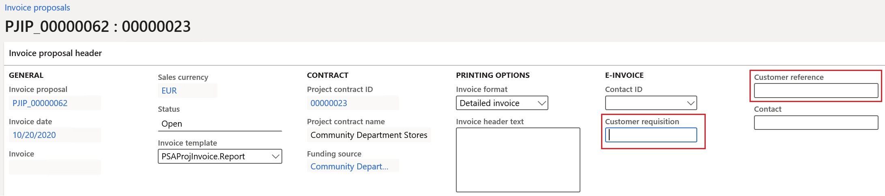

---
# required metadata

title: Customer electronic invoices in Norway
description: This topic explains how to set up and process customers electronic invoices in Norway.
author: ilkond
manager: AnnBe
ms.date: 11/03/2020
ms.topic: article
ms.prod: 
ms.service: dynamics-ax-applications
ms.technology: 

# optional metadata

ms.search.form: 
audience: Application User
# ms.devlang: 
ms.reviewer: kfend
ms.search.scope: Core, Operations
# ms.tgt_pltfrm: 
# ms.custom: 
ms.search.region: Norway
# ms.search.industry: 
ms.author: ilyako
ms.search.validFrom: 2019-11-01
ms.dyn365.ops.version: 10.0.08

---

# Customer electronic invoices in Norway

[!include [banner](../includes/banner.md)]

To comply with European Union's Directive 2014/55/EU, the Norway-specific format of electronic invoices, **EHF Billing 3.0** have been implemented based on the [PEPPOL Billing 3.0](https://docs.peppol.eu/poacc/billing/3.0/) specification.

This topic provides information about how to configure and issue customer electronic invoices in Norway.

## Prerequisites

The primary address of the legal entity must be in Norway.

## Import Electronic reporting configurations
In the **Electronic reporting** workspace, import the following Electronic reporting (ER) formats from the repository:

- OIOUBL Sales invoice
- OIOUBL Project invoice
- OIOUBL Sales credit note
- OIOUBL Project credit note

> [!NOTE]
> These formats are based on the **Invoice model** configuration, and use the **Invoice model mapping** configuration. All required additional configurations are automatically imported.

For more information about how to import ER configurations, see [Download Electronic reporting configurations from Lifecycle Services](https://docs.microsoft.com/en-us/dynamics365/fin-ops-core/dev-itpro/analytics/download-electronic-reporting-configuration-lcs).

### Reference imported ER format configurations

1. Go to **Accounts receivable** \> **Setup** \> **Accounts receivable parameters**.
2. On the **Electronic documents** tab, select the imported format options for electronic documents.

## Configure parameters

### Configure legal entity parameters

1. Go to **Organization administration** \> **Organization** \> **Legal entities**.
2. On the **Tax registration** FastTab, in the **Tax registration number** field, enter the company VAT number.
3. On the **Registration numbers** FastTab, turn on the **Print Foretaksregisteret on sales documents** option for Norway.
4. On the **Bank account information** FastTab, in the **Routing number** field, enter the company organization number. 
5. In the **Bank account** field, enter the company bank acount number. 

    > [!NOTE]
    > The company bank account must already be set up under **Cash and bank management** > **Bank accounts** > **Bank accounts**.

### Configure customer parameters

1. Go to **Accounts receivable** \> **Customers** \> **All customers** and select a required customer.
2. On the **Invoice and delivery** FastTab, set the **eInvoice** option to **Yes**. This enables electronic invoices to be generated.
3. Set the **eInvoice attachment** option to **Yes** to attach a PDF copy of a printable invoice to the electronic invoice.
4. In the **Tax exempt number** field, enter the customer’s VAT exempt number.

### Units of measure configuration

1. Go to **Organization administration** \> **Setup** \> **Units** > **Units**.
2. Select a unit and then select **External codes**.
3. In the **Overview** section, in **Code** field, enter a code which coincides with the select unit ID.
4. In **Value** section, in **Value** field, enter the external code that will be used as international trade units of measure code. This code is recommended by United Nations Economic Commission for Europe ([UN/ECE](https://docs.peppol.eu/poacc/billing/3.0/codelist/UNECERec20/)).

### Sales tax codes transformation
When you generate electronic invoices, the sales tax code rates are analyzed and transformed to [UNCL5305-compliant categories](https://docs.peppol.eu/pracc/catalogue/1.0/codelist/UNCL5305/) according to the following logic:

 - For all non-zero tax rates, the **S** category is used
 - For all zero tax rates, either the **E** or **Z** category is used depending on the configured reporting code for tax-free sales.

### Customer requisition
When you register free text invoices, invoices based on salse orders, or project invoices, you must enter a customer requisition. You can also add a customer reference which is optional.

#### Free text invoices
 
1. Go to **Accounts receivable** \> **Invoices** \> **All free text invoices**.
2. Create a new  invoice or select an existing one. 
3. On the **Header** view, on the **Customer** FastTab, in the **References** section, enter values in the **Customer requisition** and **Customer reference** fields.
 
#### Sales orders
 
1. Go to **Accounts receivable** \> **Orders** \> **All sales orders**.
2. Create a new sales order or select an existing one. 
3. On the **Header** view, on the **General** FastTab, in the **References** section, enter values in **Customer requisition** and **Customer reference** fields.
 
 #### Project invoices
 
1. Go to **Project management and accounting** \> **Projects** \> **Project contracts**.
2. Create a new project contract or select an existing one. 
3. On **Funding sources** FastTab, select or create a new **Customer** type funding source and select **Details**.

 
4. On the **Funding source details** page, on the **Other** FastTab, in **References** section, enter contract defualt values in **Customer requisition** and **Customer reference** fields. Alternatively, you can enter procect-specific values in the similar fields on **E-invoice** FastTab.
 
 
 
5. You can also enter customer requisition and reference values directly on the project invoice proposal by going to **Project management and accounting** \> **Projects invoices** \> **Project invoice proposals**. 
6. Create a new invoice proposal or select an existing one.
7. On the **Invoice proposal header** FastTab, in the **e-Invoice** section, enter values in **Customer requisition** and **Customer reference** fields.
 
 
 
### Customer accounting code registration

You can enter customer accuonting codes when working with free text invoices, invoices based on sales orders, or project invoices.

#### Free text invoices
 
1. Go to **Accounts receivable** \> **Invoices** \> **All free text invoices**.
2. Create a new invoice or select an existing one. 
3. On the **Header** view, on the **General** FastTab, in the **e-Invoice** section, in the **Dimension account** field, enter the accounting code. 
4. To have individual accounting codes for each invoice line, turn on the **Line-specific** option and switch to the **Lines** view.
5. On the **General** tab, on the **Line details** FastTab, in the **Dimension account** field, enter a line-specific accounting code.
 

#### Sales orders
 
1. Go to **Accounts receivable** \> **Orders** \> **All sales orders**.
2. Create a new sales order or select an existing one. 
3. On the **Header** view, on the **General** FastTab, in the **e-Invoice** section, in the **Dimension account** field, enter the order-specific accounting code. 
4. Or, enable the **Line-specific** option, and swith to **Lines** view.
5. On the **Line details** FastTab, on the **General** tab, in the **Dimension account** field, enter line-specific accounting codes for each order line.
 
 #### Project invoices
 
1. Go to **Project management and accounting** \> **Projects** \> **Project contracts**.
2. Create a new project contract or select an one. 
3. On **Funding sources** FastTab, create a new or select an existing **Customer** type funding source and select **Details**. 
4. On **Funding source details** page, on the **E-invoice** FastTab, in the **Dimension account** field, enter a project-specific default accounting code.

5. You can also enter customer acounting codes directly in project invoice proposals by going to **Project management and accounting** \> **Projects invoices** \> **Project invoice proposals**.
6. Create a new invoice proposal or select an existing one. 
7. On the **Invoice proposal header** FastTab, in the **e-Invoice** section, in the **Dimension account** field, enter the accounting code. 
8. Or, enable the **Line-specific** option, and on the **Invoice proposal transactions** FastTab, in the **Dimension account** field, enter line-specific accounting codes for each transaction line.

## Export customer electronic invoices

### Send e-invoices
When an invoice is posted, you can generate an electronic invoice by selecting **Send** > **Original** for the selected invoice.

### View e-invoices

1. To inquire about XML files of generated electronic invoices, go to **Organization administration** \> **Electronic reporting** \> **Electronic reporting jobs**. 
2. Select a required job, and then select **Show files**:

3. Select **Open** to download the file with the electronic invoice.

If generating the electronic invoices fails with errors, select **Show log** > **Message details** to see additional details of the error message.

### Send to Electronic reporting destinations

You can set up **Electronic reporting destinations** for e-invoice formats. In this case, output XML files with electronic invoices will automatically be sent to the defined destinations right after the invoices are posted. When posting, you must enable the **Print invoice** parameter.

For more details about Electronic reporting destinations, see [Electronic reporting destinations](../../fin-ops-core/dev-itpro/analytics/electronic-reporting-destinations.md).
