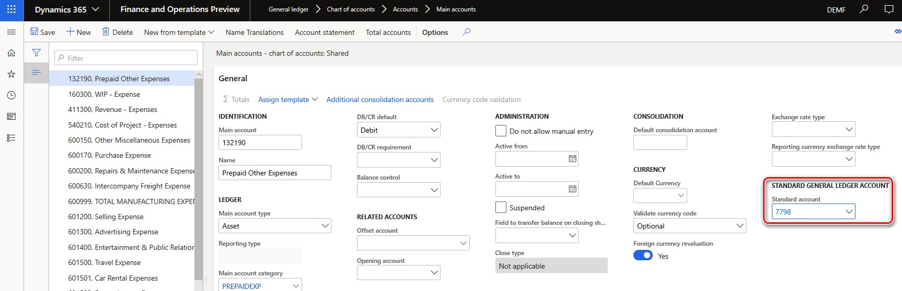
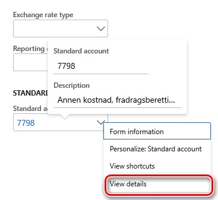

---
# required metadata

title: Standard Audit File for Tax (SAF-T) for Norway
description: This topic explains how to set up and generate the Standard Audit File for Tax (SAF-T) for legal entities that have a primary address in Norway. 
author: v-elgolu
ms.author: LizaGolub
ms.date: 12/09/2019
ms.topic: article
ms.prod: 
ms.service: dynamics-ax-applications
ms.technology: 

# optional metadata

manager: 
# ms.search.form: 
audience: Application User
# ms.devlang: 
ms.reviewer: kfend
ms.search.scope: Core, Operations
# ms.tgt_pltfrm: 
# ms.custom: 
ms.search.region: Norway
# ms.search.industry: 
ms.search.validFrom: 
ms.dyn365.ops.version: 

---

# Standard Audit File for Tax (SAF-T) for Norway

[!include [banner](../includes/banner.md)]

This topic includes country-specific information about how to set up the Standard Audit File for Tax (SAF-T) for legal entities that have a primary address in Norway.

## Introduction

Starting from January 2020 all the companies in Norway are obliged to provide by request of Norwegian Tax Administration Standard Audit File for Taxes Financial data (SAF-T) in accordance with the Documentation v.1.4 published on July 08,2019 and Technical documentation v.1.3 published on March 23, 2018 in the format of XML report coincident with the XSD schema v.1.1 of “Norwegian SAF-T Financial data” developed by “SAF-T Working group”, Skatteetaten ©, based on “OECD Standard Audit File - Taxation 2.00” modified on 02-02-2018.

## Overview

To support “Norwegian SAF-T Financial data” report in Microsoft Dynamics 365 for Finance and Operations, version of the application must be of the following or later version:

| Version of Finance and Operations | Build number                       | 
|-----------------------------------|------------------------------------|
| 10.0.6      | 10.0.234.**20020**            |
| 10.0.7      | 10.0.283.**10012**            |
| 10.0.8      | 10.0.319.**12**               |
| 10.0.9      | 10.0.328.**20020**            |

When version of the Finance and Operations application is suitable, import from the LCS portal the following or later versions of the Electronic reporting (ER) configurations:

|ER configuration name | Configuration type                       | Version |
|----------------------|------------------------------------------|---------|
| Standard Audit File (SAF-T)    | **Model**            | 32 |
| SAF-T Financial data model mapping   | **Model mapping**            | 32.30 |
| SAF-T Format (NO)   | Format (exporting)           | 32.41 |

Import the latest versions of the configurations. The version description usually contains the number of the KB article that explains the change introduced by the configuration version.

**Note**: After all the ER configurations from the preceding table are imported, set the **Default for model mapping** option to **Yes** for the following configuration:	**SAF-T Financial data model mapping**.

For more information about how to download ER configurations from Microsoft Dynamics Lifecycle Services (LCS), see [Download Electronic reporting configurations from Lifecycle Services](../../dev-itpro/analytics/download-electronic-reporting-configuration-lcs.md).

## Setup

To start using “Norwegian SAF-T Financial data” report in Microsoft Dynamics 365 for Finance and Operations the following setup must be done:

<ul><li>General ledger parameters – to setup ER format</li>

<li>Sales tax code – to associate with Standard tax codes (read more in the about this requirement in “Norwegian SAF-T Financial data Documentation”)</li>

<li>Main accounts – to associate with Standard accounts (read more in the about this requirement in “Norwegian SAF-T Financial data Documentation”)</li></ul>

### General ledger parameters

Open in Main menu: **Modules** > **General ledger** > **Ledger setup** > **General ledger parameters** page, **Standard Audit File for Tax (SAF-T)** fast tab and select **“SAF-T Format (NO)”** in **“Standard Audit File for Tax (SAF-T)”** field.

### Sales tax code
As it is explained in “Norwegian SAF-T Financial data Documentation”, **Sales tax codes** that are used in the system must be associated with Norwegian Standard VAT Tax codes  <StandardTaxCode> (available at https://github.com/Skatteetaten/saf-t) for the purpose of SAF-T reporting.

To associate **Sales tax codes** that are used in the Finance and Operations, open **Modules** > **Tax** > **Indirect taxes** > **Sales tax** > **Sales tax codes** page, select **Sales tax code** record and click **External codes** in **Sales tax codes** group of the Action pane:

In the **External codes** page, specify the Norwegian Standard VAT codes to be used for the selected Sales tax code record for reporting purposes in SAF-T report.

### Main accounts

As it is explained in “Norwegian SAF-T Financial data Documentation”, **Main accounts** that are used in the system must be associated with Norwegian Standard Accounts (available at https://github.com/Skatteetaten/saf-t) for the purpose of SAF-T reporting.

To associate **Main accounts** that are used in the Finance and Operations, open **Modules** > **General ledger** > **Chart of accounts** > **Accounts** > **Main accounts** page, select **Main account** record, click **Edit** button on the Action pane and select **Standard account** in **Standard account** field on **General** fast tab:

You need define all the **Standard accounts** on **Standard general ledger accounts** page before you select them for a Main account. Use right click by the field and **View details** option for fast access to the **Standard general ledger accounts** page from **Main accounts** page:

## Generate “Norwegian SAF-T Financial data” report

To generate **“Norwegian SAF-T Financial data”** report in Microsoft Dynamics 365 for Finance and Operations, open **Modules** > **General ledger** > **Inquires and reports** > **Standard Audit File for Tax (SAF-T)** > **Standard Audit File for Tax (SAF-T)** menu item. 

Specify start and end date of the period for which you want to generate SAF-T report in **From date** and **To date** fields of the dialog page of the report respectively. Mark check boxes for **Customers**, **Vendors**, **Financial dimensions** if you want to include to the report all the records from the related tables. When these check boxes are not marked only those Customers and Vendors of your company will be included to the report for which there were transactions in the reporting period or the balance on which is non-zero. When **Financial dimensions** check box is not marked, only those Financial dimensions that are used in the transactions during the reporting period will be reported in <MasterFiles> node of the report. Select the Employee in the **Personnel number** field of the dialog page of the report to specify the Employee to be reported in <UserID> node of the report (ID of the user that generated the audit file.).
  
You may also apply filters on **“Main accounts”** and **“General journal entry”** via Records to include fast tab of the dialog page of the report.

## Report naming and splitting

“Norwegian SAF-T Financial data Documentation” requires using the following naming of the resulting XML reports:
<SAF-T export type>_<organization number of the vendor who the data represents>_<date and time(yyyymmddhh24hmise>_<file number of total files>.xml 
  
For example: SAF-T Financial_999999999_20160401235911_1_12.xml 

Where:  

-	“SAF-T Financial” states the SAF-T type of file 

-	“999999999” represents the organization number belonging to the owner of the data. 

-	“20160401235911” represents the date and time when the file was created using a 24-hour clock. 

-	"1_12" represents file 1 of 12 total files in the export (same selection) 

Volume of single XML file must be less than 2 GB. All single XML files submitted must validate with the schema: All <MasterFiles> are in the first file, and the associated transactions in the subsequent files (flexible number of files).  
  
Example selection of one accounting year with 12 periods. One file per period with transactions:

| File number | Contents of the AuditFile                       | 
|-----------------------------------|------------------------------------|
| 1   | Header and MasterFiles          |
| 2 … 13      | Header and GeneralLedgerEntries             |

Maximum number of XML files in the same zip archive is 10.

In accordance to these requirements, in “SAF-T Format (NO)” ER format for Finance and Operation auto-splitting of the resulting report in XML is implemented with the following assumptions:

-	Maximum volume of resulting XML report is 2000000KB

-	All the XML files are named according to the following rule: <SAF-T export type>_<organization number of the vendor who the data represents>_<date and time(yyyymmddhh24hmise>
  
-	All the XML files are included into one zip archive

-	Each individual XML file validates with the schema (as it is explained above).

After the report generation if there are more than 1 XML file generated, user provides manual numbering of the files in the name of the generated files in archive adding “_<file number of total files>”. User controls manually that there are no more than 10 XML files in the same archive and split the archive to several archives manually so that maximum number of XML files in the same zip archive was 10.
