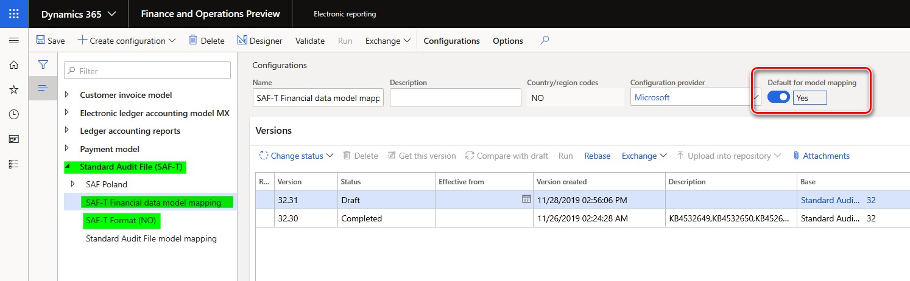

---
# required metadata

title: Standard Audit File for Tax (SAF-T) for Norway
description: This topic explains how to set up and generate the Standard Audit File for Tax (SAF-T) for legal entities that have their primary address in Norway. 
author: liza-golub
ms.author: elgolu
ms.date: 04/27/2020
ms.topic: article
ms.prod: 
ms.service: dynamics-ax-applications
ms.technology: 

# optional metadata

manager: 
# ms.search.form: 
audience: Application User
# ms.devlang: 
ms.reviewer: kfend
ms.search.scope: Core, Operations
# ms.tgt_pltfrm: 
# ms.custom: 
ms.search.region: Norway
# ms.search.industry: 
ms.search.validFrom: 
ms.dyn365.ops.version: 

---

# Standard Audit File for Tax (SAF-T) for Norway

[!include [banner](../includes/banner.md)]

This topic includes country-specific information about how to set up the Standard Audit File for Tax (SAF-T) for legal entities that have their primary address in Norway.

## Introduction

Beginning January 2020, all companies in Norway are required by the Norwegian Tax Administration to provide SAF-T Financial data. This requirement is in accordance with version 1.4 of the documentation, which was published on July 8, 2019, and version 1.3 of the technical documentation, which was published on March 23, 2018, in the form of an XML report. The publication of these pieces of documentation coincided with version 1.1 of the "Norwegian SAF-T Financial data" XML Schema Definition (XSD) schema that was developed by the SAF-T Working group, Skatteetaten, and based on "OECD Standard Audit File - Taxation 2.00," which was modified on February 2, 2018.

## Overview

To support the **Norwegian SAF-T Financial data** report, your Microsoft Dynamics 365 Finance application must be one of the following versions or later.

| Version of Finance | Build number       |
|--------------------|--------------------|
| 10.0.6             | 10.0.234.**20020** |
| 10.0.7             | 10.0.283.**10012** |
| 10.0.8             | 10.0.319.**12**    |
| 10.0.9             | 10.0.328.**20020** |

When your Finance application version is suitable, import the following versions or later of these Electronic reporting (ER) configurations from Microsoft Dynamics Lifecycle Services (LCS).

| ER configuration name              | Configuration type | Version |
|------------------------------------|--------------------|---------|
| Standard Audit File (SAF-T)        | Model              | 32      |
| SAF-T Financial data model mapping | Model mapping      | 32.30   |
| SAF-T Format (NO)                  | Format (exporting) | 32.41   |

Import the latest versions of the configurations. The version description usually includes the number of the Microsoft Knowledge Base (KB) article that explains the changes that the configuration version introduced.

> [!NOTE]
> After you've finished importing all the ER configurations from the preceding table, set the **Default for model mapping** option to **Yes** for the **SAF-T Financial data model mapping** configuration.
>
> 

For more information about how to download ER configurations from Microsoft Dynamics Lifecycle Services (LCS), see [Download Electronic reporting configurations from Lifecycle Services](../../dev-itpro/analytics/download-electronic-reporting-configuration-lcs.md).

## Setup

To start to use the **Norwegian SAF-T Financial data** report in Finance, you must complete the following setup:

- **General ledger parameters:** Set up the ER format on the **General ledgers parameters** page.
- **Sales tax codes:** Associate sales tax codes with Norwegian standard value-added tax (VAT) tax codes.
- **Main accounts:** Associate main accounts with Norwegian standard accounts.

The following sections explain how to do each part of this setup.

### General ledger parameters

1. In Finance, go to **General ledger** \> **Ledger setup** \> **General ledger parameters**.
2. On the **General ledger parameters** page, on the **Standard Audit File for Tax (SAF-T)** tab, in the **Standard Audit File for Tax (SAF-T)** field, select **SAF-T Format (NO)**.

### Sales tax codes

As the documentation explains, in Norwegian SAF-T Financial data, sales tax codes that are used in Finance must be associated with Norwegian standard VAT tax codes (\<StandardTaxCode\>) for the purpose of SAF-T reporting. The Norwegian standard VAT tax codes are available at <https://github.com/Skatteetaten/saf-t>.

To associate sales tax codes that are used in Finance with Norwegian standard VAT tax codes, follow these steps.

1. In Finance, go to **Tax** \> **Indirect taxes** \> **Sales tax** \> **Sales tax codes**.
2. On the **Sales tax code** page, select the **Sales tax code** record, and then, on the Action Pane, on the **Sales tax code** tab, in the **Sales tax code** group, select **External codes**.

    

3. On the **External codes** page, specify the Norwegian standard VAT tax codes that should be used for the selected sales tax code record for the purpose of SAF-T reporting.

### Main accounts

As the documentation explains, in Norwegian SAF-T Financial data, main accounts that are used in Finance must be associated with Norwegian standard accounts for the purpose of SAF-T reporting. The Norwegian standard accounts are available at <https://github.com/Skatteetaten/saf-t>.

Starting from **version 54.61**, the electronic reporting format **“SAF-T Format (NO)”** supports the setup of **Standard accounts** for the **Main accounts** of the company by using **Application specific parameters**.

To associate **Main accounts** that are used in Finance with Norwegian standard accounts via **Application specific parameters** follow the following steps:

1. Open the **Electronic reporting** workspace, in the configuration tree, select the **“SAF-T Format (NO)”** electronic reporting format. 
2. Make sure that company you are working is the company for which you want to set up the **Application specific parameters**.
3. On the Action Pane, on the **Configurations** tab, in the **Application specific parameters** group, select **Setup**.
4. Select the version of the format that you want to use on the left side of the **Application specific parameters** page.
5. On the **Lookup** FastTab, select **StandardMainAccount_Lookup**, and then specify criteria on the **Conditions** FastTab by adding lines for each **Result** value which must be used in the selected company. If several **Main accounts** in the selected company must result the same **Standard account**, add a separate line for each **Main account** and specify the same **Standard account** for each one.
6. Select the value, **NA** as the last condition in the list. It must be set to **\*Not blank\*** in **Main account** column. Verify the value in the **Line** column that **“NA”** is the last condition in the table.
7. When you've finished setting up conditions, change the value of the **State** field to **Completed**, save your changes, and close the page.

You can easily export the setup of application-specific parameters from one version of a report and import it into another version by selecting **Export** or **Import** on the Action Pane. You can also export the setup from one report and import it into the same report in another company if the Main accounts are the same in both companies.

## Generate the Norwegian SAF-T Financial data report

To generate the **Norwegian SAF-T Financial data** report, follow these steps.

1. In Finance, go to **General ledger** \> **Inquiries and reports** \> **Standard Audit File for Tax (SAF-T)** \> **Standard Audit File for Tax (SAF-T)**.
2. In the dialog box for the report, in the **From date** and **To date** fields, specify the start and end dates of the period that you want to generate the report for.
3. Select the check boxes for **Customers**, **Vendors**, and **Financial dimensions** to include all the records from the related tables on the report.

    If the **Customers** and **Vendors** check boxes are cleared, the report will include only those customers and vendors of your company that there were transactions for in the reporting period, and customers and vendors that have a non-zero balance.
    
    If the **Financial dimensions** check box is cleared, only those financial dimensions that were used in transactions during the reporting period will be reported in the **\<MasterFiles\>** node of the report.

4. In the **Personnel number** field, select an employee to add the employee to the **\<AuditFileSender\>** node of the report. This node reports information about the contact person for the audit file (First name and Last name).

5. Select the **Report tax information in sales tax currency** check box if you want to report tax information in tax code currency.

    If the **Report tax information in sales tax currency** check box is selected, the **\<TaxInformation\>** element reports the following amounts in the tax code currency:

    - *GeneralLedgerEntries/Journal/Transaction/Line/TaxInformation/TaxBase*
    - *GeneralLedgerEntries/Journal/Transaction/Line/TaxInformation/TaxAmount/Amount*

    If the **Report tax information in sales tax currency** check box is not selected, the amounts in the **\<TaxInformation\>** element and all of the amounts in the reports are reported in the accounting currency.

    The following amount is always reported in document currency:

    - *GeneralLedgerEntries/Journal/Transaction/Line/TaxInformation/TaxAmount/CurrencyAmount*

    Where *GeneralLedgerEntries/Journal/Transaction/Line/TaxInformation/TaxAmount/Currency* represents the document currency.

You can also apply filters for the **Main accounts** and **General journal entry** fields by using **Records to include** FastTab in the dialog box for the report.

## Report naming and splitting

The documentation for Norwegian SAF-T Financial data requires the following naming structure for the XML reports that are generated:

\<SAF-T export type\>\_\<organization number of the vendor that the data represents\>\_\<date and time(yyyymmddhh24hmise\>\_\<file number of total files\>.xml 

Here is an example:

SAF-T Financial\_999999999\_20160401235911\_1\_12.xml

Here is an explanation of the parts of this file name:

- **SAF-T Financial** states the SAF-T type of file.
- **999999999** represents the organization number that belongs to the owner of the data.
- **20160401235911** represents the date and time when the file was created. (A 24-hour clock is used for the time.)
- **1\_12** represents file 1 out of 12 total files in the export (that is, in the same selection).

The volume of a single XML file must be less than 2 gigabytes (GB). Every individual XML file that is submitted must be validated against the schema. All \<MasterFiles\> nodes must be in the first file, and the associated transactions must be in the subsequent files (the number of these files is flexible).

The following table shows a sample selection of one accounting year that has 12 periods. For each period, there is one file that contains transactions.

| File number | Contents of the audit file                     |
|-------------|------------------------------------------------|
| 1           | \<Header\> and \<MasterFiles\> nodes           |
| 2–13        | \<Header\> and \<GeneralLedgerEntries\> nodes  |

There can be a maximum of 10 XML files in the same zip archive.

In accordance with these requirements, the **SAF-T Format (NO)** ER format is implemented to automatically split the resulting report in XML format, based on the following assumptions:

- The maximum volume of the resulting XML report is 2,000,000 kilobytes (KB) (that is, 2 GB).
- All the XML files use the following naming structure:

    \<SAF-T export type\>\_\<organization number of the vendor that the data represents\>\_\<date and time(yyyymmddhh24hmise\>

- All the XML files are included in one zip archive.
- Each individual XML file is validated against the schema.

After the report is generated, if more than one XML file is generated, the user must manually number the generated files in the zip archive by adding **\_\<file number of total files\>** to the file names. The user must also make sure that there are no more than 10 XML files in the same zip archive. If there are more than 10 XML files in an archive, the user must manually split it into several archives, each of which has a maximum of 10 XML files.
