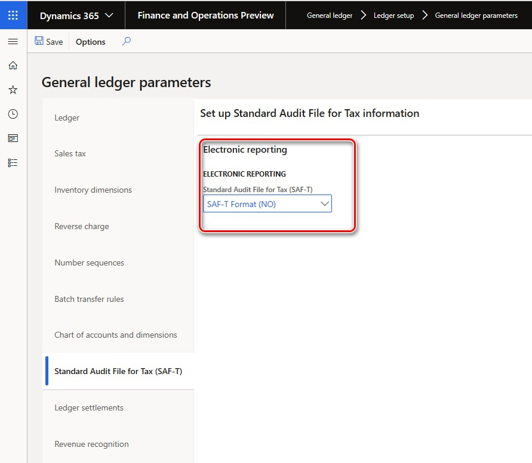
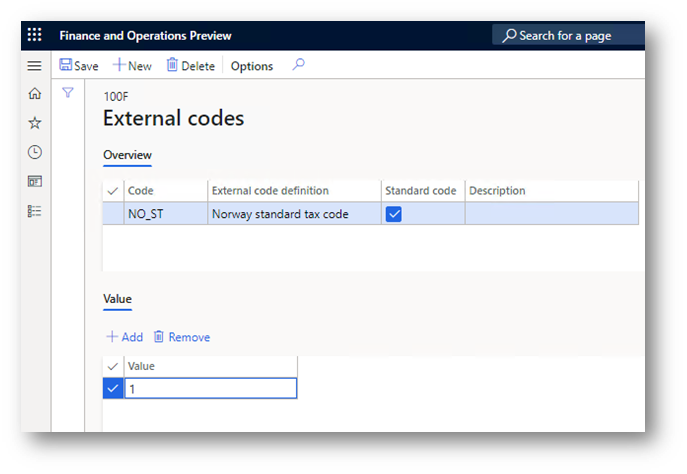
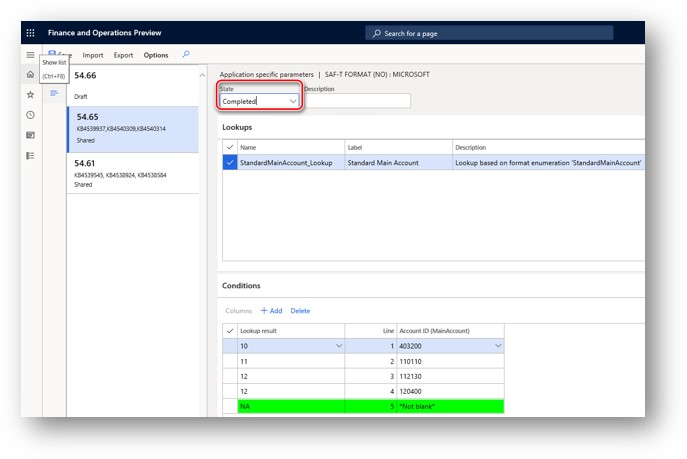

# Standard Audit File for Tax (SAF-T) for Norway

[!include [banner](../includes/banner.md)]

This article includes country/region-specific information about how to set up the Standard Audit File for Tax (SAF-T) for legal entities that have their primary address in Norway.

Beginning January 2020, all companies in Norway are required by the Norwegian Tax Administration to provide SAF-T Financial data. This requirement is in accordance with version 1.4 of the documentation, which was published on July 8, 2019, and version 1.3 of the technical documentation, which was published on March 23, 2018, in the form of an XML report. The publication of these pieces of documentation coincided with version 1.1 of the "Norwegian SAF-T Financial data" XML Schema Definition (XSD) schema that was developed by the SAF-T Working group, Skatteetaten, and based on "OECD Standard Audit File - Taxation 2.00," which was modified on February 2, 2018.

> [!NOTE]
> Use of the [One voucher](../general-ledger/one-voucher.md) functionality introduces a limitation on further SAF-T reporting for some scenarios that are subject to SAF-T. Specifically, a bank statement scenario must be posted by using different vouchers for transactions that have different counteragent accounts. For more information about how to use the One voucher functionality and SAF-T, see the [SAF-T report and One voucher](#one-voucher) section later in this article.

## Setup

To use the **Norwegian SAF-T Financial data** report in Dynamics 365 Finance, complete the following setup tasks:

1. [Import Electronic reporting (ER) configurations](#import).
2. [Set up the tax registration numbers of the company](#registration-number).
3. [Set up the ER format on the **General ledgers parameters** page](#parameters).
4. [Associate sales tax codes with Norwegian standard value-added tax (VAT) tax codes](#sales).
5. [Associate main accounts with Norwegian standard accounts or Income statement (Næringslivskoder)](#main).
6. [Enable features in Feature management](#features).

### Import Electronic reporting (ER) configurations

In Finance, import the following Electronic reporting (ER) configurations from the Global repository.

| ER configuration name              | Configuration type |
|------------------------------------|--------------------|
| Standard Audit File (SAF-T)        | Model              |
| SAF-T Financial data model mapping | Model mapping      |
| SAF-T Format (NO)                  | Format (exporting) |

For more information about how to download ER configurations, see [Download ER configurations from the Global repository](../../fin-ops-core/dev-itpro/analytics/er-download-configurations-global-repo.md).

Import the most recent versions of the configurations. The version description usually includes the number of the Microsoft Knowledge Base (KB) article that explains the changes that were introduced in the configuration version.

> [!NOTE]
> After you import all the ER configurations from the preceding table, set the **Default for model mapping** option to **Yes** for the **SAF-T Financial data model mapping** configuration.

### Set up the tax registration numbers of the company

As of version 175.119 of **SAF-T Format (NO)** ER format, `TaxRegistration` node under `Header > Company` of the report represents VAT registration numbers of the company that are actule in respect to the reporting period of the report from the **Registration IDs** that are defined in the properties of the legal entity that is associated with the VAT ID registration category. `TaxVerificationDate` field of the report represents the expiration date of the tax registration number in case the number expired during the reporting period. To configure the VAT number complete the following steps.

1. Go to **Organization administration** \> **Organizations** \> **Legal entities**.
2. Select the legal entity, and then select **Registration IDs**.
3. Select or create the address in Denmark, and then, on the **Registration ID** FastTab, select **Add**.
4. In the **Registration type** field, select the registration type that's dedicated to Denmark, and that uses the **VAT ID** registration category.
5. In the **Registration number** field, enter the tax number.
6. On the **General** tab, in the **Effective** field, enter the date when the number becomes effective.

For more information about how to set up registration categories and registration types, see [Registration IDs](emea-registration-ids.md).

If the VAT registration number isn't specified in the **Registration IDs** in the properties of the legal entity, the system retrieves value from **Tax registration number** field on the **Tax registration** FastTab of the legal entity properties page.

### Set up the ER format 

1. In Finance, go to **General ledger** \> **Ledger setup** \> **General ledger parameters**.
2. On the **General ledger parameters** page, on the **Standard Audit File for Tax (SAF-T)** tab, in the **Standard Audit File for Tax (SAF-T)** field, select **SAF-T Format (NO)**.

> [!NOTE]
> If you enable the [**Standard Audit File for Tax (SAF-T) electronic report**](../general-ledger/standard-audit-file.md) feature in the **Feature management** workspace, the **Standard Audit File for Tax (SAF-T)** tab of the **General ledger parameters** page will include the **Use common menu item** checkbox in addition to the **Standard Audit File for Tax (SAF-T)** field.
>
> To run the **SAF-T Format (NO)** ER configuration, you must *clear* the **Use common menu item** checkbox. Select the **Use common menu item** checkbox only if you plan to use an ER configuration that can be run directly from the **Electronic reporting** workspace and doesn't require any data preprocessing on the Finance app side.

### Associate sales tax codes with Norwegian standard value-added tax (VAT) tax codes

As the documentation explains, in Norwegian SAF-T Financial data, sales tax codes that are used in Finance must be associated with Norwegian standard VAT tax codes (\<StandardTaxCode\>) for the purpose of SAF-T reporting. The Norwegian standard VAT tax codes are available at <https://github.com/Skatteetaten/saf-t>.

As of version 175.119 of **SAF-T Format (NO)** ER format, two options of how to set up Norwegian standard value-added tax (VAT) tax codes are supported. You can use any one of them depending on your company's setup and preferences:

(1) Associate sales tax codes that are used in Finance with Norwegian standard VAT codes using **Application specific parameters** of the ER format.

(2) Associate sales tax codes that are used in Finance with Norwegian standard VAT codes using **External codes** functionality.

Find detailed description for both of the supported options below. If option (1) is used than option (2) is not considered by the report. If for some of the sales tax codes that are used in Finance there is no value associated in application-specific parameters of the ER format or **External codes** functionality, user will get a warning message with information about missing mapping for it.

#### Option (1): Associate sales tax codes that are used in Finance with Norwegian standard VAT codes using **Application specific parameters** of the ER format, follow these steps.

1. In the **Electronic reporting** workspace, select the **Reporting configurations** tile.
2. On the **Configurations** page, expand **Standard Audit File (SAF-T)**, and select **SAF-T Format (NO)**.
3. On the Action Pane, on the **Configurations** tab, in the **Application specific parameters** group, select **Setup**.
4. On the **Application specific parameters** page, select the latest version of the format that you want to define conditions for.
5. On the **Lookups** FastTab, select **StandardTaxCodes_Lookup** lookup, and define appropriate conditions for it.
6. On the **Conditions** FastTab, define which tax codes must correspond to a specific lookup result.
7. When you've finished setting up conditions, in the **State** field, select **Completed**. Then save the configuration.
   
#### Option (2): Associate sales tax codes that are used in Finance with Norwegian standard VAT codes using **External codes** functionality, follow these steps.

1. In Finance, go to **Tax** \> **Indirect taxes** \> **Sales tax** \> **Sales tax codes**.
2. On the **Sales tax code** page, select the **Sales tax code** record, and then, on the Action Pane, on the **Sales tax code** tab, in the **Sales tax code** group, select **External codes**.

    

3. On the **External codes** page, specify the Norwegian standard VAT tax codes that should be used for the selected sales tax code record for the purpose of SAF-T reporting. On the **External codes** page, in the **Overview** section, in the **Code** field, select the identifier for the external code definition and enter a standard tax code that corresponds to the selected **Sales tax code** in **Value** field in **Value** section.

    

### Associate main accounts used in Finance with Norwegian standard accounts or Income statement (Næringslivskoder)

As the documentation explains, in Norwegian SAF-T Financial data, main accounts that are used in Finance must be associated with Norwegian standard accounts or Income statement (Næringslivskoder) for the purpose of SAF-T reporting. The Norwegian standard accounts are available at <https://github.com/Skatteetaten/saf-t>.

As of version 175.119 of **SAF-T Format (NO)** ER format, two options of how to associate main accounts used in Finance with Norwegian standard accounts are supported. You can use any one of them depending on your company's setup and preferences:

(1) Associate main accounts used in Finance with Norwegian standard accounts or Income statement using **Additional consolidation accounts**. This option allows to associate main accounts used in Finance with Income statement (Grouping Category and Grouping Code) .

(2) Associate main accounts used in Finance with Norwegian standard accounts using **Application specific parameters** of the ER format. This option supports Norwegian standard accounts only.

Find detailed description for both of the supported options below. If option (1) is used than option (2) is not considered by the report. If for some of the main accounts that are used in Finance there is no value associated in application-specific parameters of the ER format or **Additional consolidation accounts**, user will get a warning message with information about missing mapping for it.

#### Option (1): Associate main accounts used in Finance with Norwegian standard accounts using **Additional consolidation accounts**

1. Create a [consolidation account group](../general-ledger/tasks/create-consolidation-groups.md#create-a-consolidation-account-group). Value from **Consolidation account group** field of **Consolidation account groups** page is used in `GroupingCategory` field of the report when **Use grouping category** parameter of the report is switched on.

2. [Add accounts to the consolidation account group](../general-ledger/tasks/create-consolidation-groups.md#add-accounts-to-consolidation-account-group). In the **Consolidation account** field, specify a standard account. This value is reported in the `StandardAccountID` element of SAF-T under the **Master data** \> **GeneralLedgerAccounts** \> **Account** node when **Use grouping category** parameter of the report is switched off.  When **Use grouping category** parameter of the report is switched on, value of **Consolidation account** field is reported in `GroupingCode` field of the report. In the **Consolidation account name** field, optionally specify the standard account name or description. This value isn't used in SAF-T.

For mor information about **Additional consolidation accounts**, see [Consolidation account groups and additional consolidation accounts](../budgeting/consolidation-account-groups-consolidation-accounts.md).

#### Option (2): Associate main accounts used in Finance with Norwegian standard accounts using **Application specific parameters** of the ER format.

> [!NOTE]
> We recommend that you enable the **Accelerate the ER labels storage** feature in the **Feature management** workspace. This feature helps improve network bandwidth utilization and overall system performance because, in most cases, ER labels of a single language are used when you work with a single ER configuration. The **Accelerate the ER labels storage** feature is available in the **Feature management** workspace as of Finance version 10.0.25. For more information about how to set up the parameters of an ER format for each legal entity, see [Performance](../../fin-ops-core/dev-itpro/analytics/er-design-multilingual-reports.md#performance).

To associate **Main accounts** that are used in Finance with Norwegian standard accounts via **Application specific parameters** follow the following steps:

1. Open the **Electronic reporting** workspace, in the configuration tree, select the **SAF-T Format (NO)** electronic reporting format. 
2. Make sure that the company you are working in is the company for which you want to set up the **Application specific parameters**.
3. On the Action Pane, on the **Configurations** tab, in the **Application specific parameters** group, select **Setup**.
4. Select the version of the format that you want to use on the left side of the **Application specific parameters** page.
5. On the **Lookup** FastTab, select **StandardMainAccount_Lookup**, and then specify criteria on the **Conditions** FastTab by adding lines for each **Result** value which must be used in the selected company. If several **Main accounts** in the selected company must result the same **Standard account**, add a separate line for each **Main account** and specify the same **Standard account** for each one.
6. Select the value, **NA** as the last condition in the list. It must be set to **\*Not blank\*** in **Main account** column. Verify the value in the **Line** column that **NA** is the last condition in the table.
7. When you've finished setting up conditions, change the value of the **State** field to **Completed**, save your changes, and close the page.

You can easily export the setup of application-specific parameters from one version of a report and import it into another version by selecting **Export** or **Import** on the Action Pane. You can also export the setup from one report and import it into the same report in another company if the Main accounts are the same in both companies.

> [!NOTE]
> We recommend that you enable the feature, **Use application specific parameters from previous versions of ER formats** in the **Feature management** workspace. When this feature is enabled, parameters that are configured for the earlier version of an ER format automatically become applicable for the later version of the same format. If this feature is not enabled, you must configure application-specific parameters explicitly for each format version. The **Use application specific parameters from previous versions of ER formats** feature is available in the **Feature management** workspace starting in Finance version 10.0.23. For more information about how to set up the parameters of an ER format for each legal entity, see [Set up the parameters of an ER format per legal entity](../../fin-ops-core/dev-itpro/analytics/er-app-specific-parameters-set-up.md).

### Enable features in Feature management

1. Go to **Feature management** > **All**.
2. In the feature list, find and select the following features:

    - **Optimization of query data source creation time during execution of ER reports**
    - **Optimize datasets memory consumption at ER reports runtime**
    - **Dimension attributes values collection optimization in 'MasterFiles' report section of SAF-T for Norway**

3. Select **Enable now**.

## Generate the Norwegian SAF-T Financial data report

To generate the **Norwegian SAF-T Financial data** report, follow these steps.

1. In Finance, go to **General ledger** > **Inquiries and reports** > **Standard Audit File for Tax (SAF-T)** > **Standard Audit File for Tax (SAF-T)**.
2. In the dialog box for the report, in the **From date** and **To date** fields, specify the start and end dates of the period that you want to generate the report for.
3. Select the check boxes for **Customers**, **Vendors**, and **Financial dimensions** to include all the records from the related tables on the report.

    If the **Customers** and **Vendors** check boxes are cleared, the report will include only those customers and vendors of your company that there were transactions for in the reporting period, and customers and vendors that have a non-zero balance.
    
    If the **Financial dimensions** check box is cleared, only those financial dimensions that were used in transactions during the reporting period will be reported in the **\<MasterFiles\>** node of the report.

4. In the **Personnel number** field, select an employee to add the employee to the **\<AuditFileSender\>** node of the report. This node reports information about the contact person for the audit file (First name and Last name).

5. Select the **Report tax information in sales tax currency** check box if you want to report tax information in tax code currency.

    If the **Report tax information in sales tax currency** check box is selected, the **\<TaxInformation\>** element reports the following amounts in the tax code currency:

    - *GeneralLedgerEntries/Journal/Transaction/Line/TaxInformation/TaxBase*
    - *GeneralLedgerEntries/Journal/Transaction/Line/TaxInformation/TaxAmount/Amount*

    If the **Report tax information in sales tax currency** check box is not selected, the amounts in the **\<TaxInformation\>** element and all of the amounts in the reports are reported in the accounting currency.

    The following amount is always reported in document currency:

    - *GeneralLedgerEntries/Journal/Transaction/Line/TaxInformation/TaxAmount/CurrencyAmount*

    Where *GeneralLedgerEntries/Journal/Transaction/Line/TaxInformation/TaxAmount/Currency* represents the document currency.

You can also apply filters for the **Main accounts** and **General journal entry** fields by using **Records to include** FastTab in the dialog box for the report.

## Report naming and splitting

The documentation for Norwegian SAF-T Financial data requires the following naming structure for the XML reports that are generated:

\<SAF-T export type\>\_\<organization number of the vendor that the data represents\>\_\<date and time(yyyymmddhh24hmise\>\_\<file number of total files\>.xml 

Here is an example:

SAF-T Financial\_999999999\_20160401235911\_1\_12.xml

Here is an explanation of the parts of this file name:

- **SAF-T Financial** states the SAF-T type of file.
- **999999999** represents the organization number that belongs to the owner of the data.
        -If the Organization number is missing or the output XML file does not containt <RegistrationNumber>NA</RegistrationNumber>
        -Navigate to Org administration > Organizations > Legal entities- Select your legal entity > Bank account information and assign the Org number to Routing code field
- **20160401235911** represents the date and time when the file was created. (A 24-hour clock is used for the time.)
- **1\_12** represents file 1 out of 12 total files in the export (that is, in the same selection).

The volume of a single XML file must be less than 2 gigabytes (GB). Every individual XML file that is submitted must be validated against the schema. All \<MasterFiles\> nodes must be in the first file, and the associated transactions must be in the subsequent files (the number of these files is flexible).

The following table shows a sample selection of one accounting year that has 12 periods. For each period, there is one file that contains transactions.

| File number | Contents of the audit file                     |
|-------------|------------------------------------------------|
| 1           | \<Header\> and \<MasterFiles\> nodes           |
| 2–13        | \<Header\> and \<GeneralLedgerEntries\> nodes  |

There can be a maximum of 10 XML files in the same zip archive.

In accordance with these requirements, the **SAF-T Format (NO)** ER format is implemented to automatically split the resulting report in XML format, based on the following assumptions:

- The maximum volume of the resulting XML report is 2,000,000 kilobytes (KB) (that is, 2 GB).
- All the XML files use the following naming structure:

    \<SAF-T export type\>\_\<organization number of the vendor that the data represents\>\_\<date and time(yyyymmddhh24hmise\>

- All the XML files are included in one zip archive.
- Each individual XML file is validated against the schema.

After the report is generated, if more than one XML file is generated, the user must manually number the generated files in the zip archive by adding **\_\<file number of total files\>** to the file names. The user must also make sure that there are no more than 10 XML files in the same zip archive. If there are more than 10 XML files in an archive, the user must manually split it into several archives, each of which has a maximum of 10 XML files.

## Implementation details

### \<AnalysisType\> and \<AnalysisTypeDescription\> nodes

The SAF-T report for Norway must include information about the **AnalysisTypeTable** under the **MasterFiles** node of the report. **AnalysisTypeTable** must represent a table with the analysis code identifiers that are used for further specification of transaction data. In Finance, **Financial dimensions** is the data source for the **AnalysisTypeTable** node. When you set up **Financial dimensions** in your legal entity, use the **ReportColumnName** field of the **Financial dimension** data source for the value that will be reported in the \<AnalysisType\> node. Use the **Dimension name** field of the **Financial dimension** data source for the value that will be reported in the \<AnalysisTypeDescription\> node.

### SAF-T report and One voucher

Using the One voucher functionality introduces a limitation of further SAF-T reporting for data if one voucher was applied. We recommend that you set the **Allow multiple transactions within one voucher** parameter on the **General ledger parameters** page to **No** in your legal entity if you post transactions that are part of the SAF-T report. For information about One voucher functionality, see [One voucher](../general-ledger/one-voucher.md).

[!INCLUDE[footer-include](../../includes/footer-banner.md)]
