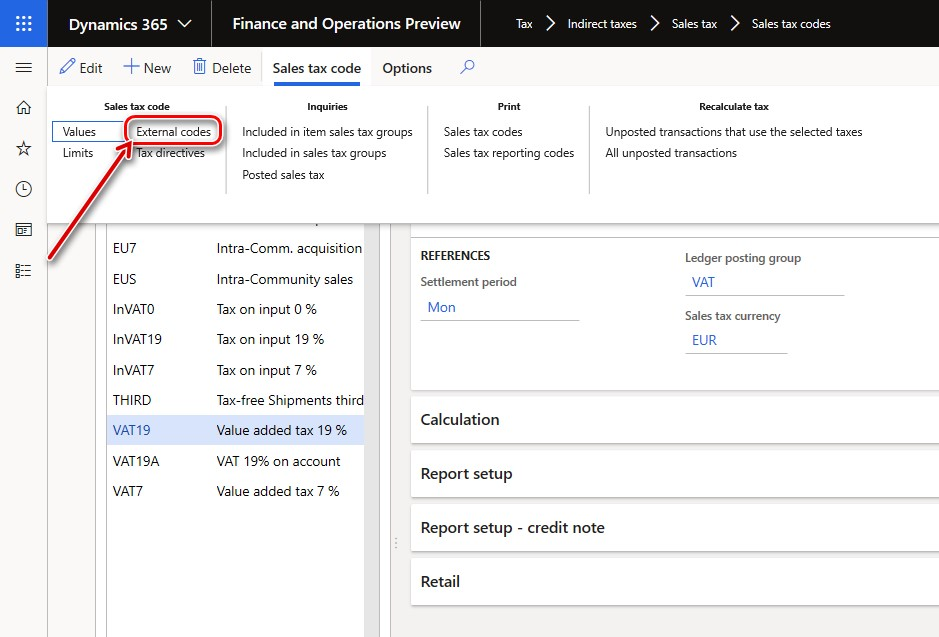

---
# required metadata

title: Standard Audit File for Tax (SAF-T) for Norway
description: This topic explains how to set up and generate the Standard Audit File for Tax (SAF-T) for legal entities that have a primary address in Norway. 
author: v-elgolu
ms.author: v-elgolu
ms.date: 12/18/2019
ms.topic: article
ms.prod: 
ms.service: dynamics-ax-applications
ms.technology: 

# optional metadata

manager: 
# ms.search.form: 
audience: Application User
# ms.devlang: 
ms.reviewer: kfend
ms.search.scope: Core, Operations
# ms.tgt_pltfrm: 
# ms.custom: 
ms.search.region: Norway
# ms.search.industry: 
ms.search.validFrom: 
ms.dyn365.ops.version: 

---

# Standard Audit File for Tax (SAF-T) for Norway

[!include [banner](../includes/banner.md)]

This topic includes country-specific information about how to set up the Standard Audit File for Tax (SAF-T) for legal entities that have a primary address in Norway.

## Introduction

Beginning January 2020, all the companies in Norway are required by the Norwegian Tax Administration to provide the Standard Audit File for Taxes Financial data (SAF-T). This is in accordance with the Documentation v.1.4 which was published on July 08,2019 and the Technical documentation v.1.3 published on March 23, 2018 in the format of XML report. These coincided with the XSD schema v.1.1 of “Norwegian SAF-T Financial data” tat was developed by the “SAF-T Working group”, Skatteetaten ©, and based on “OECD Standard Audit File - Taxation 2.00” modified on 02-02-2018.

## Overview

To support the **Norwegian SAF-T Financial data** report, your Dynamics 365 Finance application version must be one of the following or later:

| Version of Finance | Build number                       | 
|-----------------------------------|------------------------------------|
| 10.0.6      | 10.0.234.**20020**            |
| 10.0.7      | 10.0.283.**10012**            |
| 10.0.8      | 10.0.319.**12**               |
| 10.0.9      | 10.0.328.**20020**            |

When your Finance application is suitable, import the following or later versions of the Electronic reporting (ER) configurations from Lifecycle Services:

|ER configuration name | Configuration type                       | Version |
|----------------------|------------------------------------------|---------|
| Standard Audit File (SAF-T)    | **Model**            | 32 |
| SAF-T Financial data model mapping   | **Model mapping**            | 32.30 |
| SAF-T Format (NO)   | Format (exporting)           | 32.41 |

Import the latest versions of the configurations. The version description usually contains the number of the KB article that explains the change introduced by the configuration version.

> [!NOTE]
> After all of the ER configurations from the preceding table are imported, set the **Default for model mapping** option to **Yes** for the following configuration,	**SAF-T Financial data model mapping**.
>
> 

For more information about how to download ER configurations from Microsoft Dynamics Lifecycle Services (LCS), see [Download Electronic reporting configurations from Lifecycle Services](https://docs.microsoft.com/en-us/dynamics365/unified-operations/dev-itpro/analytics/download-electronic-reporting-configuration-lcs).

## Setup

To start using the **Norwegian SAF-T Financial data** report in Finance, the following must be setup:

- General ledger parameters: ER format must be set up in the **General ledgers parameters** page.
- Sales tax code: Sales tax codes must be associated with standard tax codes.
- Main accounts: Msin accounts must be assoicated with standard accounts.

### General ledger parameters

In Finance, go to **General ledger** > **Ledger setup** > **General ledger parameters**. On the **General ledger parameters** page, on the **Standard Audit File for Tax (SAF-T)** FastTab, in the **“Standard Audit File for Tax (SAF-T)”** field, select **“SAF-T Format (NO)”**.

### Sales tax code
As explained in the documentation, Norwegian SAF-T Financial data, **Sales tax codes** that are used in the system must be associated with Norwegian Standard VAT Tax codes  <StandardTaxCode>, which are available at https://github.com/Skatteetaten/saf-t, for the purpose of SAF-T reporting.

To associate **Sales tax codes** that are used in the Finance, go to **Tax** > **Indirect taxes** > **Sales tax** > **Sales tax codes**. On the **Sales tax code** page, select the **Sales tax code** record, and on the Action Pane, in the **Sales tax codes** group, select **External codes**.

On the **External codes** page, specify the Norwegian Standard VAT codes to be used for the selected sales tax code record for reporting purposes in SAF-T report.

### Main accounts

As it is explained in the documentations, Norwegian SAF-T Financial data, Main accounts that are used in Finance must be associated with Norwegian Standard Accounts which are available at https://github.com/Skatteetaten/saf-t for the purpose of SAF-T reporting.

To associate Main accounts that are used in Finance, go to **General ledger** > **Chart of accounts** > **Accounts** > **Main accounts**. On the **Main accounts** page, select the **Main account** record, and on the Action Pane, select **Edit**. Next, on the **General** FastTab, in the **Standard account** field, select **Standard account**.

You must define all of the **Standard accounts** on the **Standard general ledger accounts** page before you can select them for a Main account. Right-click in the field and select **View details** for quick access to the **Standard general ledger accounts** page from **Main accounts** page.

## Generate “Norwegian SAF-T Financial data” report

1. To generate the **“Norwegian SAF-T Financial data”** report Finance, go to **General ledger** > **Inquires and reports** > **Standard Audit File for Tax (SAF-T)** > **Standard Audit File for Tax (SAF-T)**. 
2. Specify the start and end date of the period for which you want to generate SAF-T report in **From date** and **To date** fields of the dialog page of the report.
3. Select the check boxes for **Customers**, **Vendors**, and **Financial dimensions** if you want to include to the report all the records from the related tables. When these check boxes are not marked, only those customers and vendors of your company will be included to the report for which there were transactions in the reporting period or the balance on which is non-zero. When the **Financial dimensions** check box is not marked, only those financial dimensions that are used in the transactions during the reporting period will be reported in <MasterFiles> node of the report. 
4. In the **Personnel number** field, select an employee to add the employee to the <UserID> node of the report. This is the ID of the user that generated the audit file.
  
You can also apply filters on **“Main accounts”** and **“General journal entry”** by using records to include teh FastTab of the dialog page of the report.

## Report naming and splitting

Norwegian SAF-T Financial data Documentation requires using the following naming structure of the generated XML reports:

<SAF-T export type>_<organization number of the vendor who the data represents>_<date and time(yyyymmddhh24hmise>_<file number of total files>.xml 
  
For example: SAF-T Financial_999999999_20160401235911_1_12.xml 

Where:  

-	“SAF-T Financial” states the SAF-T type of file 
-	“999999999” represents the organization number that belongs to the owner of the data. 
-	“20160401235911” represents the date and time when the file was created using a 24-hour clock. 
-	"1_12" represents file 1 of 12 total files in the export (same selection) 

The volume of single XML file must be less than 2 GB. All single XML files submitted must validate with the schema, All <MasterFiles> are in the first file, and the associated transactions in the subsequent files (flexible number of files).  
  
The following table is a sample selection of one accounting year with 12 periods. One file per period with transactions:

| File number | Contents of the AuditFile                       | 
|-----------------------------------|------------------------------------|
| 1   | Header and MasterFiles          |
| 2 … 13      | Header and GeneralLedgerEntries             |

The maximum number of XML files in the same zip archive is 10.

In accordance with these requirements, the “SAF-T Format (NO)” ER format for auto-splitting of the resulting report in XML is implemented with the following assumptions:

-	Maximum volume of resulting XML report is 2000000KB
-	All of the XML files are named according to the following rule: <SAF-T export type>_<organization number of the vendor who the data represents>_<date and time(yyyymmddhh24hmise>
-	All of the XML files are included into one zip archive
-	Each individual XML file validates with the schema

After the report is generated, if there is more than 1 XML file generated, the user provides a manual numbering of the files in the name of the generated files in archive adding “_<file number of total files>”. The user manually controls that there are no more than 10 XML files in the same archive and splits the archive in to several archives manually so that maximum number of XML files in the same zip archive was 10.
