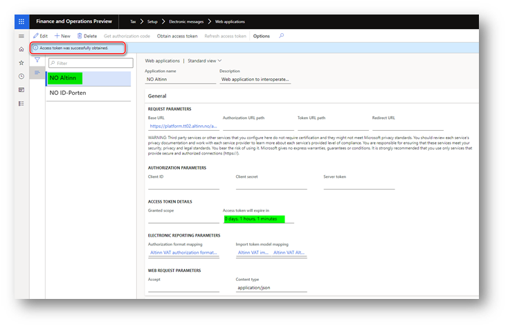

---
# required metadata

title: Authorize your Finance environment to interoperate with ID-Porten and Altinn web services
description: This topic explains how to authorize your Finance environment to interoperate with ID-Porten and Altinn web services. 
author: liza-golub
ms.author: elgolu
ms.date: 11/18/2021
ms.topic: article
ms.prod: 
ms.technology: 

# optional metadata

# ms.search.form: 
audience: Application User
# ms.devlang: 
ms.reviewer: kfend
# ms.tgt_pltfrm: 
# ms.custom: 
ms.search.region: Norway
# ms.search.industry: 
ms.search.validFrom: 2022-11-18

---

# Authorize your Finance environment to interoperate with ID-Porten and Altinn web services

Before you start authorizing your Finance environment to interoperate with ID-Porten and Altinn web services, make sure that you completed [registering an integration point in ID-porten](emea-nor-vat-return-integration-point.md) and specified internet address of the **Tax** > **Setup** > **Electronic messages** > **Web applications** page from the legal entity you are going to interoperate with ID-porten and Altinn in **Gyldig(e) redirect uri-er** field of your integration point.

To get your Finance authorized in ID-Porten and Altinn web services and ready to interoperate with these web services, you must complete the following steps.

1.	Go to **Tax** > **Setup** > **Electronic messages** > **Web applications** page and select **NO ID-Porten** web application.
2.	Make sure that the internet address of this page is populated in the **Redirect URL** field of this web application. It is the same internet address that you populated in **Gyldig(e) redirect uri-er** field of your integration point in ID-porten web portal.
3.	Make sure that the client ID and client secret of your integration point are populated in **Client ID** and  **Client secret** fields of this web application.
4.	Click **Get authorization code** on the Action pane and specify **en** in the **Requested language in the user interface** field of the **Electronic report parameters** dialog. Click **OK** button.
5.	You will be redirected to ID-porten for user’s authorization. User that will be authorized in ID-porten must be granted with necessary rights to fill out, and complete submission of VAT return.
6.	As a result of successful authorization, you will be redirected back to Finance. You should see Success page shown in the new browser tab. Close this tab and go back to your browser’s tab with Web applications page where the authorization process was started.
7.	Click **Obtain access token** on the Action pane. This must be done immediately after the authorization code was successfully obtained. Click **OK** button of the** Electronic report parameters** dialog.
In case when you did not start **Obtain access token** process immediately after authorization code was successfully obtained, you may see the following error: “`Web service returned error code 400 ({"error":"invalid_grant","error_description":"invalid_grant (correlation id: 08ede4e5-4720-5edb-8fd2-a4f6a1902b74)"}).`”. If you see this error, go back to the step 4 and then click **Obtain access token** on the Action pane immediately after the authorization code was successfully obtained.
8.	As a result of successful obtaining of the access token, you see “`Access token was successfully obtained.`” message and values in the **Granted scope** and **Access token will expire in** fields are updated.

9.	Select **NO Altinn** web application on the **Tax** > **Setup** > **Electronic messages** > **Web applications** page.
10.	Click **Obtain access token** on the Action pane and click **OK** button of the **Electronic report parameters** dialog.
11.	As a result of successful obtaining of the access token, you see “`Access token was successfully obtained.`” message and value in the Access token will expire in field is updated.

> [!IMPORTANT]
> Due to parameters of the [integration point](# integration-point) the authorization of your Finance in ID-porten integration point is valid for one calendar year (\“Authorization levetid\” parameter). It is important to re-authorize your Finance in advance before the expiration of the authorization of your Finance.

