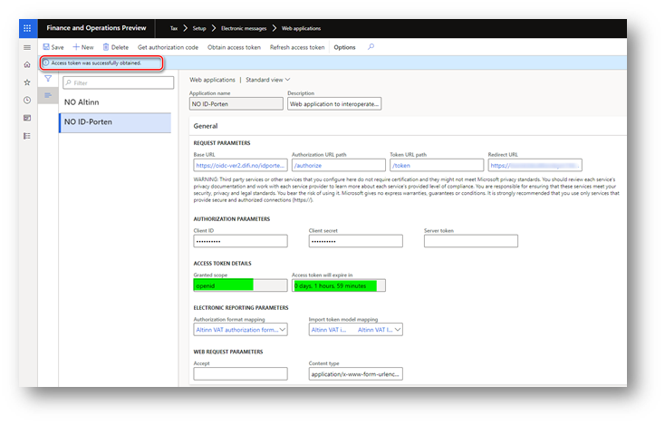

---
# required metadata

title: Authorize interoperation with ID-porten and Altinn web services
description: This topic explains how to authorize your Microsoft Dynamics 365 Finance environment to interoperate with ID-porten and Altinn web services. 
author: liza-golub
ms.author: elgolu
ms.date: 11/28/2021
ms.topic: article
ms.prod: 
ms.technology: 

# optional metadata

# ms.search.form: 
audience: Application User
# ms.devlang: 
ms.reviewer: kfend
# ms.tgt_pltfrm: 
# ms.custom: 
ms.search.region: Norway
# ms.search.industry: 
ms.search.validFrom: 2022-11-18

---

# Authorize interoperation with ID-porten and Altinn web services

[!include [banner](../includes/banner.md)]

Before you start to authorize your Microsoft Dynamics 365 Finance environment to interoperate with ID-porten and Altinn web services, make sure that you've [registered an integration point in ID-porten](emea-nor-vat-return-integration-point.md). Additionally, make sure that the **Gyldig(e) redirect uri-er** field of your integration point is set to the internet address (URL) of the **Web applications** page in the legal entity that you will interoperate with ID-porten and Altinn web services from.

Follow these steps to authorize your Finance environment in ID-porten and Altinn web services and get it ready to interoperate with them.

1. Go to **Tax** \> **Setup** \> **Electronic messages** \> **Web applications**, and select the **NO ID-Porten** web application in the list on the left.
2. Verify that the **Redirect URL** field is set to the URL of the current page (**Web applications**). This URL should match the URL that you specified in the **Gyldig(e) redirect uri-er** field of your integration point in the ID-porten web portal.
3. Verify that the **Client ID** field is set to the client ID of your integration point, and the **Client secret** field is set to the client secret.
4. On the Action Pane, select **Get authorization code**.
5. In the **Electronic report parameters** dialog box, in the **Requested language in the user interface** field, specify **en**, and then select **OK**.

    You're redirected to ID-porten for user authorization. The user who is authorized in ID-porten must have the rights that are required to complete and submit VAT returns.

6. When authorization is successful, you're redirected back to Finance, and a new browser tab shows the **Success** page. Close that browser tab, and return to the browser tab that shows the **Web applications** page where you started the authorization process.
7. On the Action Pane, select **Obtain access token**.

    > [!NOTE]
    > You must complete this step immediately after you obtain the authorization code. Otherwise, you might receive the following error message:
    >
    > > Web service returned error code 400 ({"error":"invalid_grant","error_description":"invalid_grant (correlation id: 08ede4e5-4720-5edb-8fd2-a4f6a1902b74)"}).
    >
    > If you receive this error message, go back to the step 4. This time, select **Obtain access token** immediately after you obtain the authorization code.

8. In the **Electronic reporting parameters** dialog box, select **OK**.

    When you've successfully obtained an access token, you receive the following message: "Access token was successfully obtained." Additionally, the values in the **Granted scope** and **Access token will expire in** fields are updated.

    

9. Select the **NO Altinn** web application in the list on the left.
10. On the Action Pane, select **Obtain access token**.
11. In the **Electronic report parameters** dialog box, select **OK**.

    When you've successfully obtained an access token, you receive the following message: "Access token was successfully obtained." Additionally, the values in the **Granted scope** and **Access token will expire in** fields are updated.

> [!IMPORTANT]
> The authorization of your Finance environment in your integration point in ID-porten is valid for one calendar year. This period is defined by the **Authorization levetid (sekunder)** field of your [integration point](emea-nor-vat-return-integration-point.md). You must reauthorize your Finance environment before the authorization expires.

> [!IMPORTANT]
> The authorization of your Finance environment in your integration point in ID-porten is *user-specific*. Because of this, Finance also stores information about which user obtained the authorization code in ID-porten. The submission of VAT return from Finance is allowed for only this user. If another user must submit a VAT return, they must go through the authorization process prior to submitting the VAT return.

[!INCLUDE[footer-include](../../includes/footer-banner.md)]
