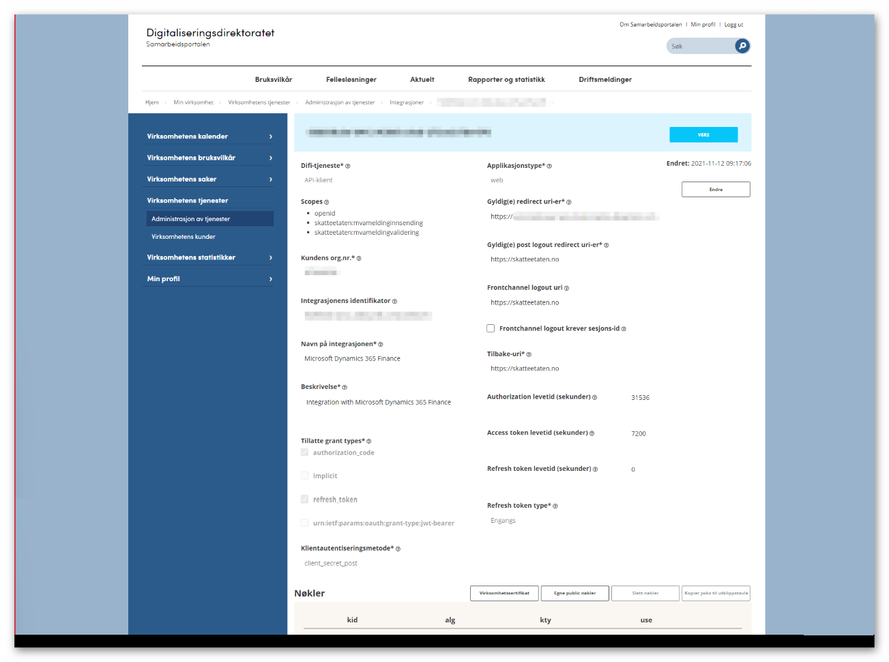

---
# required metadata

title: Register an integration point in the ID-porten web portal
description: This topic explains how to register an integration point in the ID-porten web portal in Norway. 
author: liza-golub
ms.author: elgolu
ms.date: 11/28/2021
ms.topic: article
ms.prod: 
ms.technology: 

# optional metadata

# ms.search.form: 
audience: Application User
# ms.devlang: 
ms.reviewer: kfend
# ms.tgt_pltfrm: 
# ms.custom: 
ms.search.region: Norway
# ms.search.industry: 
ms.search.validFrom: 2022-11-15

---

# Register an integration point in the ID-porten web portal

[!include [banner](../includes/banner.md)]

Companies that are registered for value-added tax (VAT) in the territory of Norway have their accounts in the [ID-porten](https://samarbeid.digdir.no/id-porten/ta-i-bruk-id-porten/94) web portal. To enable the direct submission of VAT returns to Altinn, you must create an [integration point](https://docs.digdir.no/oidc_index.html) in the company's account in ID-porten. For more information, see [ID-Porten & Authentication](https://skatteetaten.github.io/mva-meldingen/english/idportenauthentication/).

We recommend that you set the following parameters for your integration point for direct submission of VAT returns to Altinn from Microsoft Dynamics 365 Finance.

| Parameter name (Norwegian) | Parameter name (English) | Parameter description | Parameter value |
|---|---|---|---|
| Difi-tjeneste | Difi Service | Select the service to be assigned correct scopes. | Select **API-klient**. |
| Scopes | Scopes | The application programming interfaces (APIs)/resources that the integration can access. | 
Select the following scopes:
<ul><li>**openid**</li><li>**skatteetaten:mvameldinginnsending**</li><li>**skatteetaten:mvameldingvalidering**</li></ul> |
| Kundens org.nr. | Customer's organization number | The organization number of the service owner. | You don't have to specify any value in this field. The required value is automatically set when the setup of the integration point is saved. |
| Integrasjonens identifikator | The integration identifier | The unique identifier of the service. The identifier is automatically generated. | You don't have to specify any value in this field. The required value is automatically set when the setup of the integration point is saved. |
| Navn på integrasjonen | Name of the integration | The name of the integration as it appears in the sign-in window. | Specify **Microsoft Dynamics 365 Finance**. |
| Beskrivelse | Description | A brief description of the service (for example, "Meeting portal for NN municipality"). | Specify **Integration with Microsoft Dynamics 365 Finance**. |
| Tillatte grant types | Grant types allowed | A grant represents the user's consent to retrieve an access token. By selecting specific grants, you consent to the corresponding methods of retrieving an access token. | 
Select the following grant types:
<ul><li>**authorization_code**</li><li>**refresh_token**</li></ul> |
| Klientautentiseringsmetode | Client authentication method | The method of authentication of your client. | Specify **client_secret_post**. |
| Applikasjonstype | Application Type | The application (or client) type is the type of runtime environment that the client is running under. OAuth2 chapter 2.1 lists the available options. The choice of client type is a security assessment that the customer will perform. | Select **web**. |
| Gyldig(e) redirect uri-er | Valid redirect URIs | This parameter applies only to personal sign-in integrations. It specifies the URIs that the client is allowed to go to after sign-in. | In Finance, go to **Tax** \> **Setup** \> **Electronic messages** \> **Web applications**, copy the HTTPS internet address (URL) from the brower's Address bar, and paste it into this field. |
| Gyldig(e) post logout redirect uri-er | Valid mail logout redirect URIs | This parameter applies only to personal sign-in integrations. It specifies the URIs that the client is allowed to go to after sign-out. | Specify `https://skatteetaten.no`. |
| Frontchannel logout uri | Frontchannel logout URI | The URI that the provider sends a request to upon sign-out that is triggered by another client in the same session. If you don't set this parameter, there is a risk that the user might still be signed in to your service when they sign out of ID-porten. | Specify `https://skatteetaten.no`. |
| Frontchannel logout krever sesjons-id | Frontchannel logout requires session ID | This parameter applies only to personal sign-in integrations. It's a flag that determines whether the issuer and session ID parameters are passed together with **frontchannel_logout_uri**. | Leave this checkbox cleared. |
| Tilbake-uri | Back URI | This parameter applies only to personal sign-in integrations. It specifies the URI that a user is sent back to when they cancel sign-in. | Specify `https://skatteetaten.no`. |
| Authorization levetid (sekunder) | Authorization lifetime (seconds) | The lifetime of the registered authorization. In an OpenID Connect context, this authorization will be access to the "userinfo" endpoint. The value must be specified in seconds. | Specify **31536000** (= one year). |
| Access token levetid (sekunder) | Access token lifetime (seconds) | The lifetime of the issued **access_token** in seconds. | Specify **7200** (= two hours). |
| Refresh token levetid (sekunder) | Refresh token lifetime (seconds) | The lifetime of the issued **refresh_token** in seconds. | Specify **0** (zero). |
| Refresh token type | Refresh token type | <ul><li>**One-time** – You get a new **refresh_token** at each refresh of **access_token**.</li><li>**Reusable** – A refresh of **access_token** doesn't change **refresh_token**.</li></ul> | Specify **Engangs**. |

> [!IMPORTANT]
> Make sure that you safely store the client ID and client secret of the integration point that you create for interoperation with ID-porten. You will need these credentials in the [Set up the client ID and client secret of your ID-porten integration point in Finance](emea-nor-vat-return-setup.md#client-credentials) step of your preparation for direct submission of VAT returns to Altinn in Finance.

[!INCLUDE[footer-include](../../includes/footer-banner.md)]
